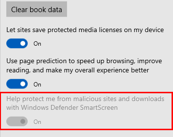

<!-- ## Configure Windows Defender SmartScreen -->
>*Supported versions: Microsoft Edge on Windows 10* 
>*Default setting:  Enabled (Turned on)*

[!INCLUDE [configure-windows-defender-smartscreen-shortdesc](../shortdesc/configure-windows-defender-smartscreen-shortdesc.md)]

### Allowed values

|Group Policy  |MDM |Registry |Description |Most restricted |
|---|:---:|:---:|---|:---:|
|Not configured |Blank |Blank |Users can choose to use Windows Defender SmartScreen or not. | |
|Disabled |0 |0 |Turned off. Do not protect users from potential threats and prevent users from turning it on. | |
|Enabled |1 |1 |Turned on. Protect users from potential threats and prevent users from turning it off. | |
---

To verify Windows Defender SmartScreen is turned off (disabled):
1. In the upper-right corner of Microsoft Edge or Microsoft Edge for Windows 10 Mobile, click or tap the ellipses (**...**).
2. Click **Settings** and select **View Advanced Settings**.
3. At the bottom, verify that **Help protect me from malicious sites and download with SmartScreen Filter** is greyed out.

### ADMX info and settings
#### ADMX info
- **GP English name:** Configure Windows Defender SmartScreen
- **GP name:** AllowSmartScreen
- **GP path:** Windows Components/Microsoft Edge
- **GP ADMX file name:** MicrosoftEdge.admx

#### MDM settings
- **MDM name:** Browser/[AllowSmartScreen](https://docs.microsoft.com/en-us/windows/client-management/mdm/policy-csp-browser#browser-allowsmartscreen)
- **Supported devices:** Desktop and Mobile
- **URI full path:** ./Vendor/MSFT/Policy/Config/Browser/AllowSmartScreen  
- **Data type:** Integer

#### Registry settings
- **Path:** HKLM\SOFTWARE\Policies\Microsoft\MicrosoftEdge\PhishingFilter
- **Value name:** EnabledV9
- **Value type:** REG_DWORD

