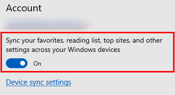

<!-- ## Do not sync browser settings
>*Supported versions: Microsoft Edge on Windows 10, next major version*  -->
>*Default setting:  Disabled or not configured (Allowed/turned on)*

[!INCLUDE [do-not-sync-browser-settings-shortdesc](../shortdesc/do-not-sync-browser-settings-shortdesc.md)]

### Allowed values

|Group Policy  |MDM |Registry |Description |
|---|:---:|:---:|---|
|Disabled or not configured **(default)** |0 |0 |Allowed/turned on. The “browser” group syncs automatically between user’s devices and lets users to make changes. |
|Enabled |2 |2 |Prevented/turned off.  The “browser” group does not use the Sync your Settings option. |
---

### Configuration options

#### Sync the browser settings automatically:
**Disable** both the Do not sync browser settings Prevent users from turning on browser syncing policies.

#### Prevent syncing of browser settings and prevent users from turning it on:
1. **Enable** the Do not sync browser settings policy.
2. **Enable** or don’t configure this policy (Prevented/turned off).

#### Prevent syncing of browser settings and give users a choice to turn on syncing:
1. **Enable** the Do not sync browser settings policy.
2. **Disable** this policy (Allowed/turned on).

#### Syncing turned off by default but not disabled:
1. **Enable** the Do not sync browser setting policy.
2. Select the _Allow users to turn “browser” syncing_ option.

#### Verify configuration
To verify if syncing is turned on or off:
1. In the upper-right corner of Microsoft Edge, click the ellipses \(**...**\).
2. Click **Settings**.
3. Under Account, see if the setting is toggled on or off.

### ADMX info and settings
#### ADMX info
- **GP English name:** Do not sync browser settings
- **GP name:** DoNotSyncBrowserSetting
- **GP path:** Windows Components/Sync your settings
- **GP ADMX file name:** SettingSync.admx

#### MDM settings
- **MDM name:** [Experience/DoNotSyncBrowserSetting](../available-policies.md#do-not-sync-browser-settings)
- **Supported devices:** Desktop
- **URI full path:** ./Vendor/MSFT/Policy/Config/Experience/DoNotSyncBrowserSetting
- **Data type:** Integer

#### Registry settings
- **Path:** HLKM\\Software\Policies\Microsoft\Windows\SettingSync
- **Value name:** DisableWebBrowserSettingSyncUserOverride
- **Value type:** REG_DWORD

### Related policies

[Prevent users from turning on browser syncing](../new-policies.md#prevent-users-from-turning-on-browser-syncing): [!INCLUDE [prevent-users-to-turn-on-browser-syncing-shortdesc](../shortdesc/prevent-users-to-turn-on-browser-syncing-shortdesc.md)]

### Related topics

[About sync setting on Microsoft Edge on Windows 10 devices](http://windows.microsoft.com/windows-10/about-sync-settings-on-windows-10-devices)

