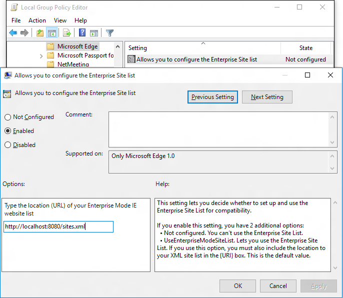

Before you can use a site list with Enterprise Mode, you must turn the functionality on and set up the system for centralized control. By allowing
centralized control, you can create one global list of websites that render using Enterprise Mode. Approximately 65 seconds after Internet Explorer 11 starts, it looks for a properly formatted site list. If a new site list if found, with a different version number than the active list, IE11 loads and uses the newer version. After the initial check, IE11 won’t look for an updated list again until you restart the browser.

>[!NOTE] 
>We recommend that you store and download your website list from a secure web server (https://), to help protect against data tampering. After the list is downloaded, it's stored locally on your employees' computers so if the centralized file location is unavailable, they can still use Enterprise Mode.

**Group Policy**

1.  Open your Group Policy editor and go to the **Administrative Templates\\Windows Components\\Microsoft Edge\\Configure the Enterprise Mode     Site List** setting.
Turning this setting on also requires you to create and store a site list.

    

1.  Click **Enabled**, and then in the **Options** area, type the location to your site list.

2.  Refresh your policy and then view the affected sites in Microsoft Edge.

-   The site shows a message in Microsoft Edge, saying that the page needs IE. At the same time, the page opens in IE11; in a new frame if it's not yet running, or in a new tab if it is.

**Registry**

All of your managed devices must have access to this location if you want them to be able to access and use Enterprise Mode and your site list.

1.  **To turn on Enterprise Mode for all users on the PC:** Open the registry editor and go to     `HKEY_LOCAL_MACHINE\Software\Policies\Microsoft\MicrosoftEdge\Main\EnterpriseMode`.

2.  Edit the `SiteList` registry key to point to where you want to keep your Enterprise Mode site list file.
For example:
    
    

    -   **HTTPS location:** `"SiteList"="https://localhost:8080/sites.xml"`

    -   **Local network:** `"SiteList"="\\network\shares\sites.xml"`

    -   **Local file:**   `"SiteList"="file:///c:\\Users\\<user>\\Documents\\testList.xml"`

    >   **Example:**  
    >   Web URL http://localhost:8080/EnterpriseMode.xml

    >   Network Share \\NetworkShare.xml (Place this inside the group policy
    >   folder on Sysvol)

    >   Drive Letter C:.xml

    All of your managed devices must have access to this location if you want
    them to use Enterprise Mode and your site list.

3.  Refresh the policy in your organization and then view the affected sites in
    Microsoft Edge.
The site shows a message in Microsoft Edge, saying that the page needs IE.
    At the same time, the page opens in IE11; in a new frame if it is not yet
    running, or in a new tab if it is.
