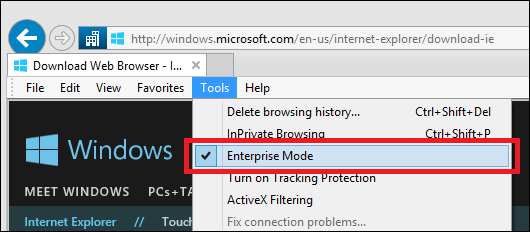
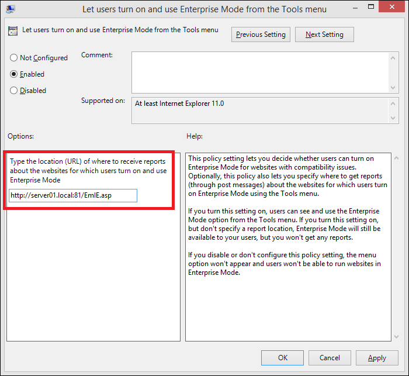
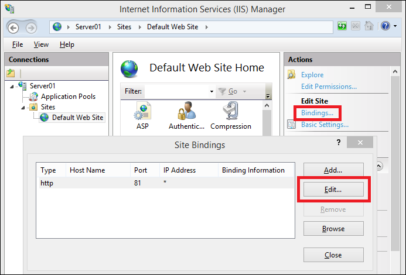
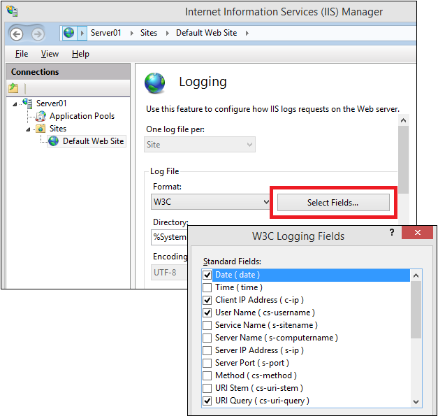
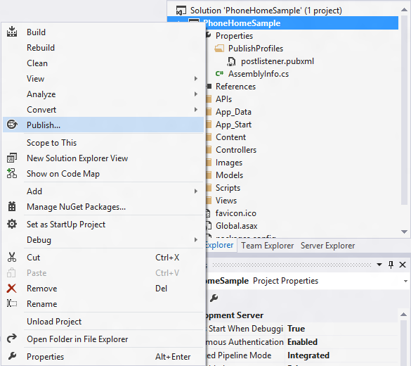
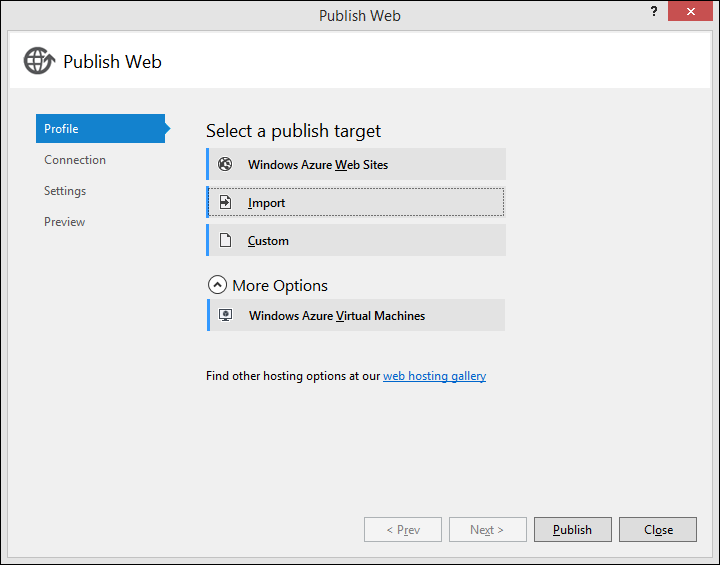
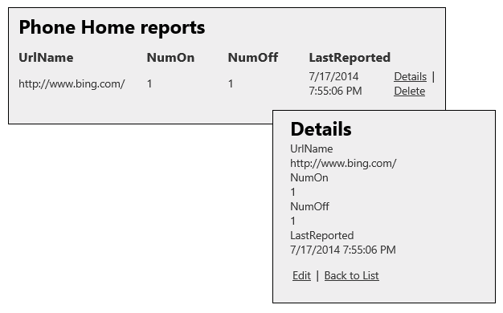

# Set up Enterprise Mode logging and data collection

**Applies to:**

-   Windows 10
-   Windows 8.1
-   Windows 7
-   Windows Server 2012 R2
-   Windows Server 2008 R2 with Service Pack 1 (SP1)

Using Group Policy, you can turn on Enterprise Mode for Internet Explorer and then you can turn on local user control using the **Let users turn on and use Enterprise Mode from the Tools menu** setting, located in the `Administrative Templates\Windows Components\Internet Explorer` category path. After you turn this setting on, your users can turn on Enterprise Mode locally, from the IE **Tools** menu.



The **Let users turn on and use Enterprise Mode from the Tools menu** setting also lets you decide where to send the user reports (as a URL). We recommend creating a custom HTTP port 81 to let your incoming user information go to a dedicated site. A dedicated site is important so you can quickly pick out the Enterprise Mode traffic from your other website traffic.



Getting these reports lets you find out about sites that aren’t working right, so you can add them to your Enterprise Mode site list, without having to locate them all yourself. For more information about creating and using a site list, see the [Add multiple sites to the Enterprise Mode site list using a file and the Windows 10 Enterprise Mode Site List Manager tool](add-multiple-sites-to-the-enterprise-mode-site-list-using-a-file-and-enterprise-mode-site-list-manager.md) or the [Add multiple sites to the Enterprise Mode site list using a file and the Windows 7 and Windows 8.1 Enterprise Mode Site List Manager tool](add-multiple-sites-to-enterprise-mode-site-list-using-a-file-and-the-enterprise-mode-manager.md) topic, based on your operating system.

## Using ASP to collect your data
When you turn logging on, you need a valid URL that points to a server that can be listened to for updates to a user’s registry key. This means you need to set up an endpoint server for the incoming POST messages, which are sent every time the user turns Enterprise Mode on or off from the **Tools** menu.

  **To set up an endpoint server**

1.  Configure an IIS server to work with your Enterprise Mode data collection process. If you’re unsure how to set up IIS, see the [IIS installation webpage](http://go.microsoft.com/fwlink/p/?LinkId=507609).

2.  Open Internet Information Services (IIS) and turn on the ASP components from the **Add Roles and Features Wizard**, **Server Roles** page.<p>
This lets you create an ASP form that accepts the incoming POST messages.

3.  Open the Internet Information Services (IIS) Manager, click **Bindings**, highlight **Port 81**, click **Edit**, and then change the website information to point to Port 81 so it matches your custom-created port.

    

4.  Open the **Logging** feature, pick **W3C** for the format, and click **Select Fields** to open the **W3C Logging Fields** box.

    

5.  Change the WC3 logging fields to include only the **Date**, **Client IP**, **User Name**, and **URI Query** standard fields, and then click **OK**.<p>
Using only these fields keeps the log file simple, giving you the date, client IP address, and the website URI information for any site changed by your users.

6.  Apply these changes to your default website and close the IIS Manager.

7.  Put your EmIE.asp file into the root of the web server, using this command:

   ``` 
    <% @ LANGUAGE=javascript %>
    <%
    Response.AppendToLog(" ;" + Request.Form("URL") + " ;" + Request.Form("EnterpriseMode"));
    %>
    ```
This code logs your POST fields to your IIS log file, where you can review all of the collected data.


### IIS log file information
This is what your log files will look like after you set everything up and at least one of your users has turned on Enterprise Mode locally from the **Tools** menu. You can see the URL of the problematic website and client IP address of the user that turned on Enterprise Mode.


## Using the GitHub sample to collect your data
Microsoft has created the [EMIE-Data-Collection_Sample](http://go.microsoft.com/fwlink/p/?LinkId=507401) that shows how to collect your Enterprise Mode reports. This sample only shows how to collect data, it doesn’t show how to aggregate the data into your Enterprise Mode site list.<p>
This sample starts with you turning on Enterprise Mode and logging (either through Group Policy, or by manually setting the EnterpriseMode registry key) so that your users can use Enterprise Mode locally. For the steps to do this, go to [Turn on local control and logging for Enterprise Mode](turn-on-local-control-and-logging-for-enterprise-mode.md).

**Note**<br>If you decide to manually change the registry key, you can change the **Enable** setting to `[deployment url]/api/records/`, which automatically sends your reports to this page.

### Setting up, collecting, and viewing reports
For logging, you’re going to need a valid URL that points to a server that can be listened to for updates to a user’s registry key. This means you need to set up an endpoint server for the incoming POST messages, which are sent every time the user turns Enterprise Mode on or off from the **Tools** menu. These POST messages go into your database, aggregating the report data by URL, giving you the total number of reports where users turned on Enterprise Mode, the total number of reports where users turned off Enterprise Mode, and the date of the last report.

  **To set up the sample**

1.  Set up a server to collect your Enterprise Mode information from your users.

2.  Go to the Internet Explorer/[EMIE-Data_Collection_Sample](http://go.microsoft.com/fwlink/p/?LinkId=507401) page on GitHub and tap or click the **Download ZIP** button to download the complete project.

3.  Open Microsoft Visual Studio 2013 with Update 2, and then open the PhoneHomeSample.sln file.

4.  On the **Build** menu, tap or click **Build Solution**.<p>
The required packages are automatically downloaded and included in the solution.

  **To set up your endpoint server**

1.  Right-click on the name, PhoneHomeSample, and click **Publish**.

    

2.  In the **Publish Web** wizard, pick the publishing target and options that work for your organization.

   **Important**<br>
   Make sure you have a database associated with your publishing target. Otherwise, your reports won’t be collected and you’ll have problems deploying the website. 

    

   After you finish the publishing process, you need to test to make sure the app deployed successfully.

  **To test, deploy, and use the app**

1.  Open a registry editor on the computer where you deployed the app, go to the `HKEY_LOCAL_MACHINE\SOFTWARE\Policies\Microsoft\Internet Explorer\Main\EnterpriseMode` key, and change the **Enable** string to:

    ``` 
    "Enable"="http://<deploy_URL>/api/records/"
    ```
 Where `<deploy_URL>` points to your deployment URL.

2.  After you’re sure your deployment works, you can deploy it to your users using one of the following:

    -   Turn on the **Let users turn on and use Enterprise Mode from the Tools menu** Group Policy setting, putting your `<deploy_URL>` information into the **Options** box.

    -   Deploy the registry key in Step 3 using System Center or other management software.

3.  Get your users to visit websites, turning Enterprise Mode on or off locally, as necessary.

  **To view the report results**

-   Go to `http://<deploy_URL>/List` to see the report results.<p>
If you’re already on the webpage, you’ll need to refresh the page to see the results.

    


### Troubleshooting publishing errors
If you have errors while you’re publishing your project, you should try to update your packages.

  **To update your packages**

1.  From the **Tools** menu of Microsoft Visual Studio, click **NuGet Package Manager**, and click **Manage NuGet Packages for Solution**.

    

2.  Click **Updates** on the left side of the tool, and click the **Update All** button.<p>
You may need to do some additional package cleanup to remove older package versions.

## Related topics
- [Download the Enterprise Mode Site List Manager for Windows 10 tool](http://go.microsoft.com/fwlink/p/?LinkId=716853)
- [Download the Enterprise Mode Site List Manager for Windows 7 and Windows 8.1 tool](http://go.microsoft.com/fwlink/p/?LinkID=394378)
- [What is Enterprise Mode?](what-is-enterprise-mode.md)
- [Use the Enterprise Mode Site List Manager tool](use-the-enterprise-mode-site-list-manager-tool.md)
- [Turn on Enterprise Mode and use a site list](turn-on-enterprise-mode-and-use-a-site-list.md)
 

 


