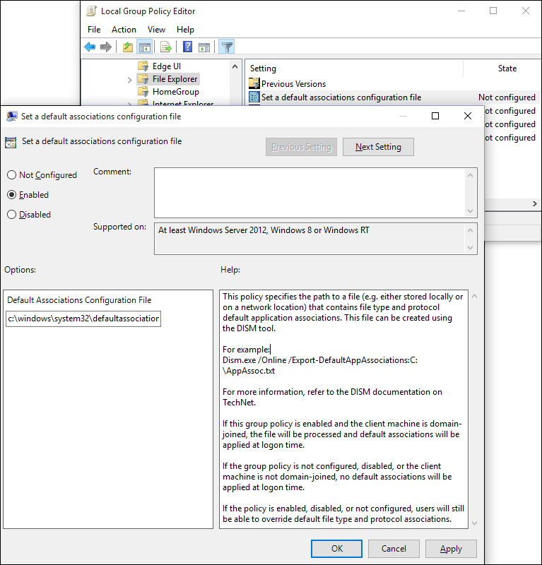

# Set the default browser using Group Policy
You can use the Group Policy setting, **Set a default associations configuration file**, to set the default browser for your company devices running Windows 10.

  **To set the default browser as Internet Explorer 11**

1.  Open your Group Policy editor and go to the **Administrative Templates\\Windows Components\\File Explorer\\Set a default associations configuration file** setting.

Turning this setting on also requires you to create and store a default associations configuration file, locally or on a network share. For more information about creating this file, see [Export or Import Default Application Associations]( https://go.microsoft.com/fwlink/p/?LinkId=618268).

    

2.  Click **Enabled**, and then in the **Options** area, type the location to your default associations configuration file.

If this setting is turned on and your employee's device is domain-joined, this file is processed and default associations are applied at logon. If this setting isn't configured or is turned off, or if your employee's device isn't domain-joined, no default associations are applied at logon.

Your employees can change this setting by changing the Internet Explorer default value from the **Set Default Programs** area of the Control Panel.

 

 

