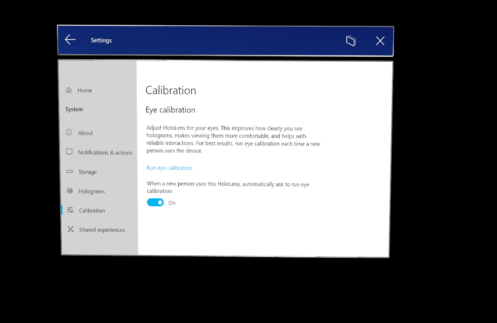
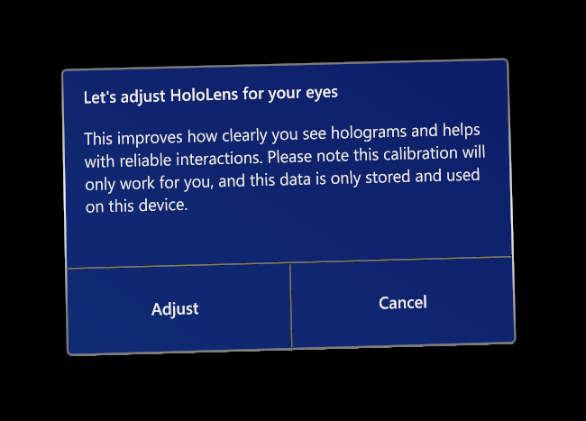
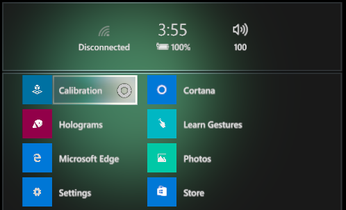
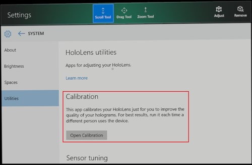

# Improve visual quality and comfort

HoloLens, HoloLens 2 and Windows Mixed Reality immersive headsets offer different ways to improve quality of visual experience.  

## Hololens 2 calibration

HoloLens 2 is designed to provide the highest quality visual imagery and comfort for our customers. Eye-tracking technology is used to improve the user experience of seeing and interacting with the virtual environment.  

On HoloLens 2, you'll be prompted to calibrate your visuals during device setup. Users are asked to look at the set of fixation targets. This allows the device to adjust hologram rendering for the user to ensure accurately positioned holograms, comfortable 3D viewing experience and improved display quality. All adjustments happen on the fly without a need for manual tuning. By using the eyes as landmarks, the device is adjusted for every user and visuals are tuned as the headset shifts slightly throughout use. Eye position tracking is used internally by the system and developers don’t need to do anything to leverage this capability. This information is not available to developers.  

On HoloLens 2, performing calibration also ensures accurate eye gaze tracking for every user. Eye tracking enables applications to track where the user is looking in real time. This is the main capability developers can leverage to enable a whole new level of context, human understanding and interactions within the Holographic experience.  

Calibration information is stored locally on the device and is not associated with any account information. There is no record of who has used the device without calibration. This mean new users will get prompted to calibrate visuals when they use the device for the first time, as well as users who opted out of calibration previously or if calibration was unsuccessful. Calibration can always be deleted from the device in **Settings** > **Privacy** > **Eye tracker**.  

### Calibration failures

Calibration should work for most users, but there are cases in which the user might be unable to calibrate successfully.  
Some examples of calibration failures are due to:

- User getting distracted and not following the calibration targets during calibration experience
- Dirty or scratched device visor or device visor not positioned properly
- Dirty or scratched glasses
- Certain types of contact lenses and glasses (colored contact lenses, some toric contact lenses, IR blocking glasses, some high prescription glasses, sunglasses, and so forth)
- More-pronounced makeup, some eyelash extensions
- Occlusions of eye and/or device visor (hair, some thick eyeglass frames)
- Eye physiology, certain eye conditions and/or eye surgery (some narrow eyes, long eyelashes, amblyopia, nystagmus, some cases of LASIK or other eye surgeries, and so forth)

If calibration is unsuccessful try one of these fixes:

- Clean your device visor
- Clean your glasses
- Push your device visor all the way in
- Make sure nothing is obstructing the sensors or your eyes (such as hair)
- Make sure there is enough light in your room and that you are not under direct sunlight
- Make sure you are carefully following the targets during calibration

If you followed all guidelines and calibration is still failing, you can disable calibration prompt in **Settings** > **System** > **Calibration**. **When a new person uses this HoloLens, automatically ask to run eye calibration** should be turned off. Please understand that this might result in worse hologram rendering quality and discomfort.

### Launching the Calibration app from Settings

1. Use Start gesture to get to the [**Start** menu](holographic-mixed-reality-modern-workplace.md#navigate-the-windows-mixed-reality-home).
1. Select **All Apps** to view all apps if the Settings app isn't pinned to **Start**.
1. Launch Settings.
1. Navigate to **System** > **Calibration** > **Eye Calibration** and select **Run eye calibration**.

   

### Calibration when sharing a device or session

HoloLens 2 can be shared between people, without a need for each person to go through device setup. HoloLens 2 will prompt the user to calibrate visuals when the device is put on the head if the user is new to the device. If the user has previously calibrated visuals on the device, the display will be seamlessly adjusted for quality and a comfortable viewing experience when the user puts the device on the head.  

## HoloLens (Gen 1) calibration

Calibrating your IPD (interpupillary distance) can improve the quality of your visuals.

### During setup

*IPD finger-alignment screen at second step*

On HoloLens, you'll be prompted to calibrate your visuals during setup. This allows the device to adjust hologram display according to the user's [interpupillary distance](https://en.wikipedia.org/wiki/Interpupillary_distance) (IPD). With an incorrect IPD, holograms may appear unstable or at an incorrect distance.

After Cortana introduces herself, the first setup step is calibration. It's recommended that you complete the calibration step during this setup phase, but it can be skipped by waiting until Cortana prompts you to say "Skip" to move on.

Users are asked to align their finger with a series of six targets per eye. Through this process, HoloLens sets the correct IPD for the user. If the calibration needs to be updated or adjusted for a new user, it can be run outside of setup using the Calibration app.

### Calibration app

Calibration can be performed any time through the Calibration app. The Calibration app is installed by default and may be accessed from the **Start** menu, or through the Settings app. Calibration is recommended if you'd like to improve the quality of your visuals or calibrate visuals for a new user.

**Launching the app from Start**

1. Use [bloom](hololens-use-gestures.md#the-bloom-gesture) to get to the [**Start** menu](holographic-mixed-reality-modern-workplace.md#navigate-the-windows-mixed-reality-home).
1. Select **+** to view all apps.
1. Launch **Calibration**.

**Launching the app from Settings**

1. Use [bloom](hololens-use-gestures.md#the-bloom-gesture) to get to the [**Start** menu](holographic-mixed-reality-modern-workplace.md#navigate-the-windows-mixed-reality-home).
1. If **Settings** isn't pinned to **Start**, select **+** to view all apps.
1. Launch **Settings**.
1. Navigate to **System** > **Utilities** and select **Open Calibration**.

## Immersive headsets

To change IPD within your headset, open the Settings app and navigate to **Mixed reality** > **Headset display** and move the slider control. You’ll see the changes in real time in your headset. If you know your IPD, maybe from a visit to the optometrist, you can enter it directly as well.

You can also adjust this setting by going to **Settings** > **Mixed reality** > **Headset display** on your PC.

If your headset does not support IPD customization, this setting will be disabled.
