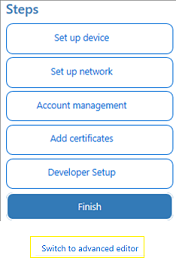
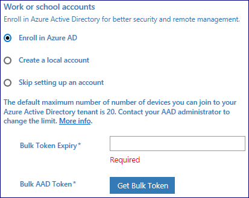

# Configure HoloLens using a provisioning package

[Windows provisioning](https://docs.microsoft.com/windows/configuration/provisioning-packages/provisioning-packages) makes it easy for IT administrators to configure end-user devices without imaging. Windows Configuration Designer is a tool for configuring images and runtime settings which are then built into provisioning packages. 

Some of the HoloLens configurations that you can apply in a provisioning package: 
- Upgrade to Windows Holographic for Business
- Set up a local account
- Set up a Wi-Fi connection
- Apply certificates to the device

To create provisioning packages, you must install Windows Configuration Designer [from Microsoft Store]((https://www.microsoft.com/store/apps/9nblggh4tx22)) or [from the Windows Assessment and Deployment Kit (ADK) for Windows 10](https://developer.microsoft.com/windows/hardware/windows-assessment-deployment-kit). If you install Windows Configurations Designer from the Windows ADK, select **Configuration Designer** from the **Select the features you want to install** dialog box.

## Create a provisioning package for HoloLens using the HoloLens wizard

The HoloLens wizard helps you configure the following settings in a provisioning package:

- Upgrade to the enterprise edition

    >[!NOTE]
    >Settings in a provisioning package will only be applied if the provisioning package includes an edition upgrade license to Windows Holographic for Business or if [the device has already been upgraded to Windows Holographic for Business](hololens-upgrade-enterprise.md).

- Configure the HoloLens first experience (OOBE)
- Configure Wi-Fi network 
- Enroll device in Azure Active Directory or create a local account
- Add certificates
- Enable Developer Mode

>[!WARNING]
>You must run Windows Configuration Designer on Windows 10 to configure Azure Active Directory enrollment using any of the wizards.

Provisioning packages can include management instructions and policies, customization of network connections and policies, and more. 

> [!TIP]
> Use the desktop wizard to create a package with the common settings, then switch to the advanced editor to add other settings, apps, policies, etc.
>
>

### Create the provisioning package

Use the Windows Configuration Designer tool to create a provisioning package.

1. Open Windows Configuration Designer (by default, %windir%\Program Files (x86)\Windows Kits\10\Assessment and Deployment Kit\Imaging and Configuration Designer\x86\ICD.exe).

2. Click **Provision HoloLens devices**.

     

3. Name your project and click **Finish**. 

4. Read the instructions on the **Getting started** page and select **Next**. The pages for desktop provisioning will walk you through the following steps.
  
> [!IMPORTANT]
> When you build a provisioning package, you may include sensitive information in the project files and in the provisioning package (.ppkg) file. Although you have the option to encrypt the .ppkg file, project files are not encrypted. You should store the project files in a secure location and delete the project files when they are no longer needed.

### Configure settings

<table>
<tr><td style="width:45%" valign="top">  Browse to and select the enterprise license file to upgrade the HoloLens edition.  You can also toggle **Yes** or **No** to hide parts of the first experience.  Select a region and timezone in which the device will be used. </td><td></td></tr>
<tr><td style="width:45%" valign="top">    Toggle **On** or **Off** for wireless network connectivity. If you select **On**, enter the SSID, the network type (**Open** or **WPA2-Personal**), and (if **WPA2-Personal**) the password for the wireless network.</td><td></td></tr>
<tr><td style="width:45%" valign="top">    You can enroll the device in Azure Active Directory, or create a local account on the device  Before you use a Windows Configuration Designer wizard to configure bulk Azure AD enrollment, [set up Azure AD join in your organization](https://docs.microsoft.com/azure/active-directory/active-directory-azureadjoin-setup). The **maximum number of devices per user** setting in your Azure AD tenant determines how many times the bulk token that you get in the wizard can be used. To enroll the device in Azure AD, select that option and enter a friendly name for the bulk token you will get using the wizard. Set an expiration date for the token (maximum is 30 days from the date you get the token). Click **Get bulk token**. In the **Let's get you signed in** window, enter an account that has permissions to join a device to Azure AD, and then the password. Click **Accept** to give Windows Configuration Designer the necessary permissions.   To create a local account, select that option and enter a user name and password.   **Important:** (For Windows 10, version 1607 only) If you create a local account in the provisioning package, you must change the password using the **Settings** app every 42 days. If the password is not changed during that period, the account might be locked out and unable to sign in.  </td><td></td></tr>
<tr><td style="width:45%" valign="top">   To provision the device with a certificate, click **Add a certificate**. Enter a name for the certificate, and then browse to and select the certificate to be used.</td><td></td></tr> 
<tr><td style="width:45%" valign="top">  Toggle **Yes** or **No** to enable Developer Mode on the HoloLens. [Learn more about Developer Mode.](https://docs.microsoft.com/windows/uwp/get-started/enable-your-device-for-development#developer-mode)</td><td></td></tr>
<tr><td style="width:45%" valign="top">  Do not set a password to protect your provisioning package. If the provisioning package is protected by a password, provisioning the HoloLens device will fail.</td><td></td></tr>
</table>

After you're done, click **Create**. It only takes a few seconds. When the package is built, the location where the package is stored is displayed as a hyperlink at the bottom of the page.

 **Next step**: [How to apply a provisioning package](#apply)   

## Create a provisioning package for HoloLens using advanced provisioning

>[!NOTE]
>Settings in a provisioning package will only be applied if the provisioning package includes an edition upgrade license to Windows Holographic for Business or if [the device has already been upgraded to Windows Holographic for Business](hololens-upgrade-enterprise.md).

1. On the Windows Configuration Designer start page, select **Advanced provisioning**.
2. In the **Enter project details** window, specify a name for your project and the location for your project. Optionally, enter a brief description to describe your project.

3. Click **Next**.

4. In the **Choose which settings to view and configure** window, select **Windows 10 Holographic**, and then click **Next**.

6. Click **Finish**.

7. Expand **Runtime settings** and customize the package with any of the settings [described below](#what-you-can-configure).

    >[!IMPORTANT]
    >(For Windows 10, version 1607 only) If you create a local account in the provisioning package, you must change the password using the **Settings** app every 42 days. If the password is not changed during that period, the account might be locked out and unable to sign in. If the user account is locked out, you must [perform a full device recovery](https://developer.microsoft.com/windows/mixed-reality/reset_or_recover_your_hololens#perform_a_full_device_recovery).

8. On the **File** menu, click **Save**. 

4. Read the warning that project files may contain sensitive information, and click **OK**.

    >[!IMPORTANT]
    >When you build a provisioning package, you may include sensitive information in the project files and in the provisioning package (.ppkg) file. Although you have the option to encrypt the .ppkg file, project files are not encrypted. You should store the project files in a secure location and delete the project files when they are no longer needed.
    
3. On the **Export** menu, click **Provisioning package**.

4. Change **Owner** to **IT Admin**, which will set the precedence of this provisioning package higher than provisioning packages applied to this device from other sources, and then select **Next**.

5. Set a value for **Package Version**.

    >[!TIP]
    >You can make changes to existing packages and change the version number to update previously applied packages.

6. On the **Select security details for the provisioning package**, click **Next**.

    >[!WARNING]
    >If you encrypt the provisioning package, provisioning the HoloLens device will fail.  

7. Click **Next** to specify the output location where you want the provisioning package to go once it's built. By default, Windows Configuration Designer uses the project folder as the output location.

    Optionally, you can click **Browse** to change the default output location.

8. Click **Next**.

9. Click **Build** to start building the package. The project information is displayed in the build page and the progress bar indicates the build status.

10. When the build completes, click **Finish**. 

## Apply a provisioning package to HoloLens

1. Connect the device via USB to a PC and start the device, but do not continue past the **Fit** page of OOBE (the first page with the blue box).

2. Briefly press and release the **Volume Down** and **Power** buttons simultaneously. (This step isn't needed in Windows 10, version 1803.)

3. HoloLens will show up as a device in File Explorer on the PC.

4. In File Explorer, drag and drop the provisioning package (.ppkg) onto the device storage.

5. Briefly press and release the **Volume Down** and **Power** buttons simultaneously again while on the **fit** page.

6. The device will ask you if you trust the package and would like to apply it. Confirm that you trust the package.

7. You will see whether the package was applied successfully or not. If it failed, you can fix your package and try again. If it succeeded, proceed with OOBE.

>[!NOTE]
>If the device was purchased before August 2016, you will need to sign into the device with a Microsoft account, get the latest OS update, and then reset the OS in order to apply the provisioning package.

## What you can configure

Provisioning packages make use of configuration service providers (CSPs). If you're not familiar with CSPs, see [Introduction to configuration service providers (CSPs) for IT pros](https://technet.microsoft.com/itpro/windows/manage/how-it-pros-can-use-configuration-service-providers).

In Windows Configuration Designer, when you create a provisioning package for Windows Holographic, the settings in **Available customizations** are based on [CSPs that are supported in Windows Holographic](https://msdn.microsoft.com/windows/hardware/commercialize/customize/mdm/configuration-service-provider-reference#hololens). The following table describes settings that you might want to configure for HoloLens.

| Setting | Description |
| --- | --- |
| **Certificates** | Deploy a certificate to HoloLens.  |
| **ConnectivityProfiles** | Deploy a Wi-Fi profile to HoloLens.   |
| **EditionUpgrade** | [Upgrade to Windows Holographic for Business.](hololens-upgrade-enterprise.md)  |
| **Policies** | Allow or prevent developer mode on HoloLens. [Policies supported by Windows Holographic for Business](https://msdn.microsoft.com/windows/hardware/commercialize/customize/mdm/policy-configuration-service-provider#hololenspolicies) |

>[!NOTE]
>App installation (**UniversalAppInstall**) using a provisioning package is not currently supported for HoloLens.

