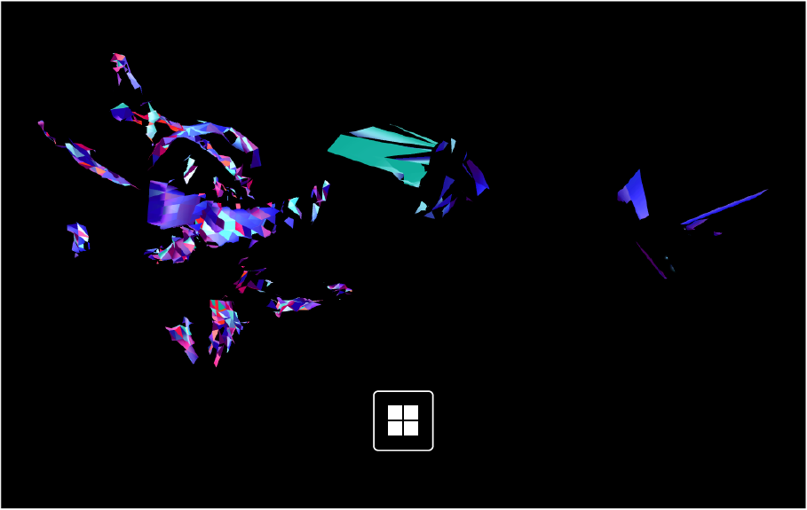
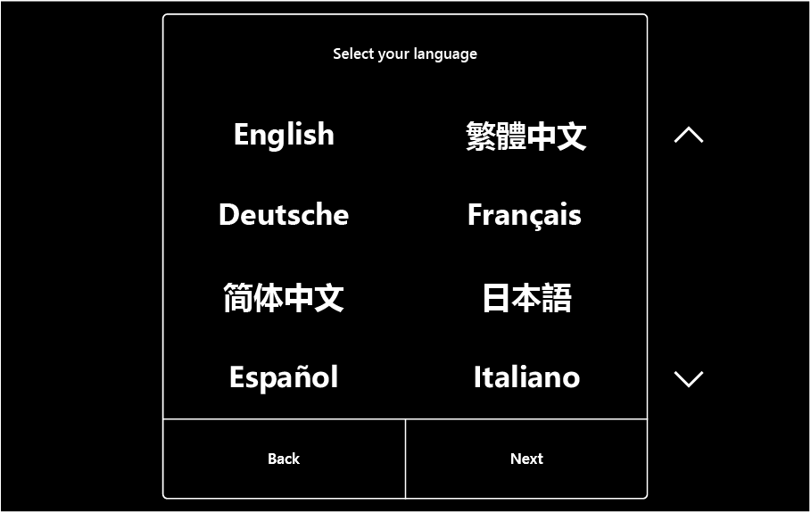
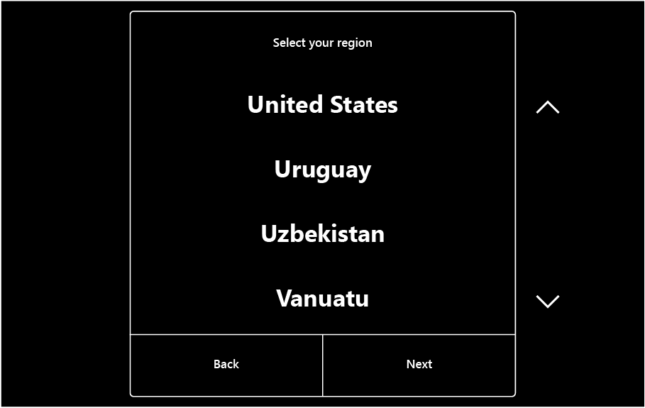
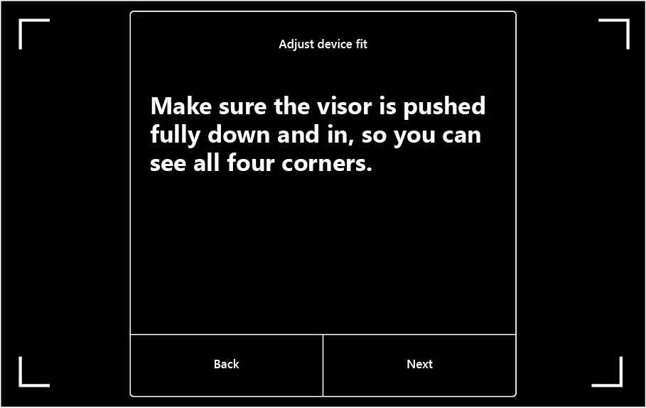
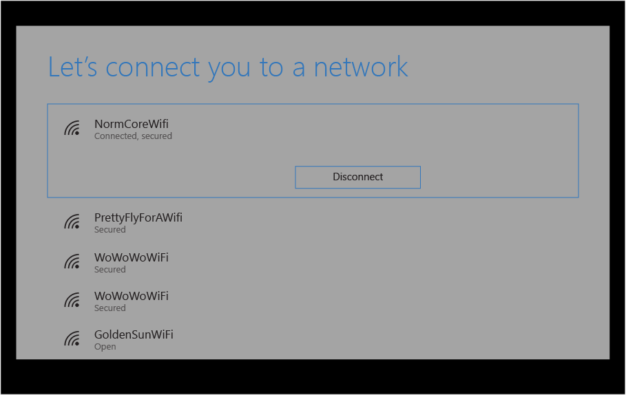
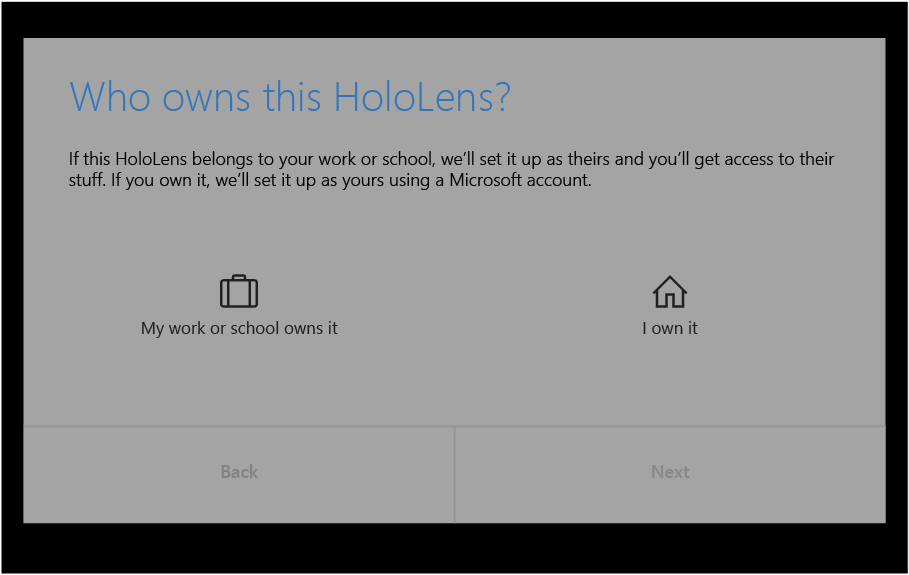
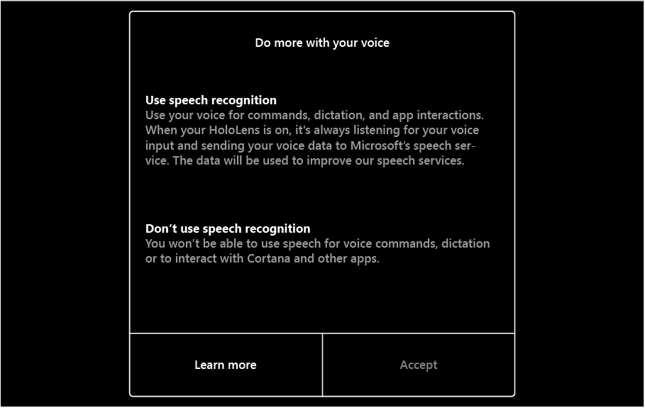
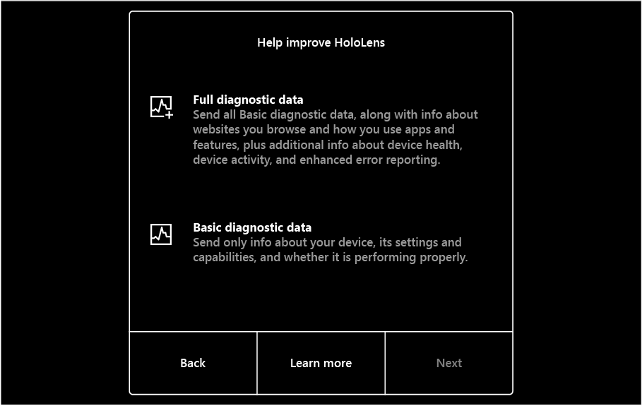
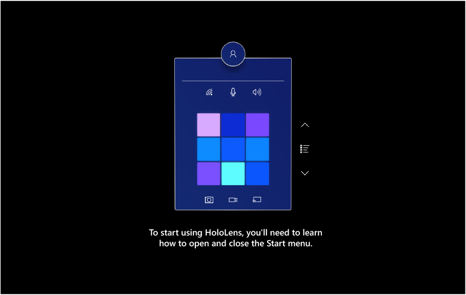
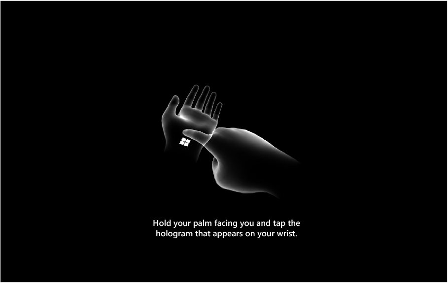

# Set up your HoloLens 2

The first time you turn on your HoloLens, you'll be guided through setting up your device, signing in with a user account, and calibrating the HoloLens to your eyes.  This section walks through the HoloLens 2 initial setup experience.

In the next section, you'll learn how to work with HoloLens and interact with holograms. To skip ahead to that article, see [Get started with HoloLens 2](hololens2-basic-usage.md).

## Before you start

Before you get started, make sure you have the following available:

**A network connection**. You'll need to connect your HoloLens to a network to set it up. With HoloLens 2, you can connect with Wi-Fi or by using ethernet (you'll need a USB-C-to-Ethernet adapter). The first time you connect, you'll need an open or password-protected network that doesn't require navigating to a website or using certificates to connect. [Learn more about the websites that HoloLens uses](hololens-offline.md).

**A Microsoft account**. You'll also need to sign in to HoloLens with a Microsoft account (or with your work account, if your organization owns the device). If you don't have a Microsoft account, go to [account.microsoft.com](http://account.microsoft.com) and set one up for free.

**A safe, well-lit space with no tripping hazards**. [Health and safety info](http://go.microsoft.com/fwlink/p/?LinkId=746661).

**The optional comfort accessories** that came with your HoloLens, to help you get the most comfortable fit. [More on fit and comfort](hololens2-setup.md#adjust-fit).

## Set up Windows

The first time you start your HoloLens 2, your first task is to set up Windows Holographic.  When you start your HoloLens, you will hear music and see a Windows logo.

HoloLens 2 will walk you through the following steps:

1. Select your language.
    

1. Select your region.
    

1. Calibrate HoloLens to your eyes.  If you choose to skip calibration, you'll be prompted the next time you log in.

    To calibrate, you'll look at a set of targets (referred to as gems). It's fine if you blink or close your eyes during calibration, but try not to stare at other objects in the room or physical space. HoloLens uses this process to learn about your eye position so that it can better render your holographic world. After calibration, holograms will appear correctly even as the visor shifts on your head.

    Calibration information is stored locally on the device and is not associated with any account information. For more information, see [Calibration data and security](hololens-calibration.md#calibration-data-and-security).

    

1. Connect to the internet (select Wi-Fi or your ethernet connection).
     HoloLens sets your time zone automatically based on information obtained from the Wi-Fi network. After setup finishes, you can change the time zone by using the Settings app.

    
> [!NOTE] 
> If you progress past the Wi-Fi step and later need to switch to a different network while still in setup, you can press the **Volume Down** and **Power** buttons simultaneously to return to this step if you are running an OS version from October 2019 or later. For earlier versions, you may need to [reset the device](hololens-recovery.md) or restart it in a location where the Wi-Fi network is not available to prevent it from automatically connecting.
> 
> Also note that during HoloLens Setup, there is a credential timeout of two minutes. The username/password needs to be entered within two minutes otherwise the username field will be automatically cleared.

1. Sign in to your user account. You'll choose between **My work or school owns it** and **I own it**.
    - When you choose **My work or school owns it**, you sign in with an Azure AD account. If your organization uses Azure AD Premium and has configured automatic MDM enrollment, HoloLens automatically enrolls in MDM. If your organization does not use Azure AD Premium, automatic MDM enrollment isn't available. In that case, you need to [manually enroll HoloLens in device management](hololens-enroll-mdm.md#enroll-through-settings-app).
        1. Enter your organizational account information.
        1. Accept the privacy statement and the end user license agreement.
        1. Sign in by using your Azure AD credentials. This may redirect to your organization's sign-in page.
        1. Continue setting up the device.
    - When you choose **I own it**, you sign in with a Microsoft account. After setup is complete, you can [manually enroll HoloLens in device management](hololens-enroll-mdm.md#enroll-through-settings-app).
        1. Enter your Microsoft account information.
        2. Enter your password. If your Microsoft account requires [two-step verification (2FA)](https://blogs.technet.microsoft.com/microsoft_blog/2013/04/17/microsoft-account-gets-more-secure/), complete the verification process.

    

1. Select whether to enable speech on HoloLens 2, and whether to send diagnostic telemetry.
    

1. Select your telemetry level. If you can, please enable Full telemetry. This information really helps the HoloLens engineering team.
     

1. Learn how to use the start gesture on HoloLens 2.
     
     

Congratulations!  Setup is complete and you're ready to use HoloLens!

## Next steps

> [!div class="nextstepaction"]
> [Get started with HoloLens 2](hololens2-basic-usage.md)
