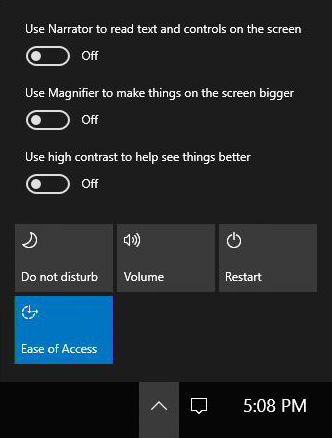

# Accessibility (Surface Hub)

Accessibility settings for the Microsoft Surface Hub can be changed by using **Quick actions** from the status bar. Your Surface Hub has the same accessibility options as Windows 10.

The default accessibility settings for Surface Hub include:

| Accessibility feature | Default setting |
| --------------------- | --------------- |
| Narrator | Off |
| Magnifier | Off |
| High contrast | No theme selected |
| Closed caption | Defaults selected for Font and Background and window |
| Keyboard | **On-screen Keyboard**, **Sticky Keys**, **Toggle Keys**, and **Filter Keys** are all off. |
| Mouse | Defaults selected for **Pointer size**, **Pointer color** and **Mouse keys**. | 

You'll find these and other settings under **Ease of Access** in **Quick Actions**.

## Related topics

[Manage Microsoft Surface Hub](manage-surface-hub.md)

[Microsoft Surface Hub administrator's guide](surface-hub-administrators-guide.md)
