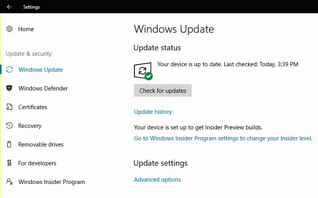
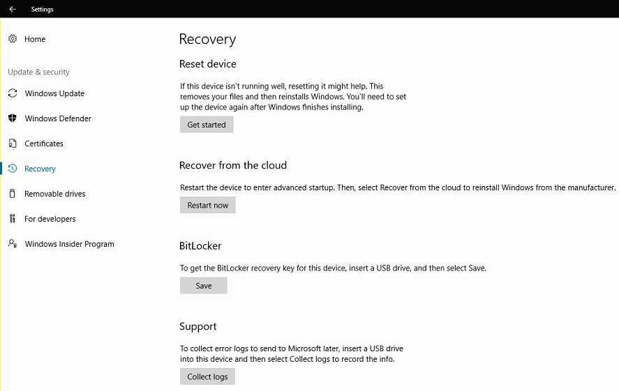

# Device reset (Surface Hub)

You may wish to reset your Microsoft Surface Hub.

Typical reasons for a reset include:

-   The device isn’t running well after installing an update.
-   You’re repurposing the device for a new meeting space and want to reconfigure it.
-   You want to change how you locally manage the device.

Initiating a reset will return the device to the last cumulative Windows update, and remove all local user files and configuration, including:

-   The device account
-   MDM enrollment
-   Domain join or Azure AD join information
-   Local admins on the device
-   Configurations from MDM or the Settings app

## Reset a Surface Hub from Settings

**To reset a Surface Hub**
1.	On your Surface Hub, open **Settings**. 

    
 
2.	Click **Update & Security**.

    
 
3.	Click **Recovery**, and then click **Get started**.

     

## Reset a Surface Hub from Windows Recovery Environment
 
On rare occasions, a Surface Hub may encounter an error while cleaning up user and app data at the end of a session. When this happens, the device will automatically reboot and try again. But if this operation fails repeatedly, the device will be automatically locked to protect user data. To unlock it, you must reset the device from [Windows Recovery Environment](https://technet.microsoft.com/library/cc765966.aspx) (Windows RE). 

**To reset a Surface Hub from Windows Recovery Environment**

1.  From the welcome screen, toggle the Surface Hub's power switch 3 times. Wait a few seconds between each toggle. See the [Surface Hub Site Readiness Guide](https://www.microsoft.com/surface/support/surface-hub/surface-hub-site-readiness-guide) for help with locating the power switch. 
2. The device should automatically boot into Windows RE. Select **Advanced Repair**.
3. Select **Reset**.
4. If prompted, enter your device's BitLocker key. 

> [!IMPORTANT]
> Performing a device reset may take up to 2 hours. Do not interrupt the reset process. Interrupting the process will render the device inoperable, requiring warranty service to return to normal functionality.

After the reset, Surface Hub restarts the [first run program](first-run-program-surface-hub.md) again. 

## Related topics

[Manage Microsoft Surface Hub](manage-surface-hub.md)

[Microsoft Surface Hub administrator's guide](surface-hub-administrators-guide.md)