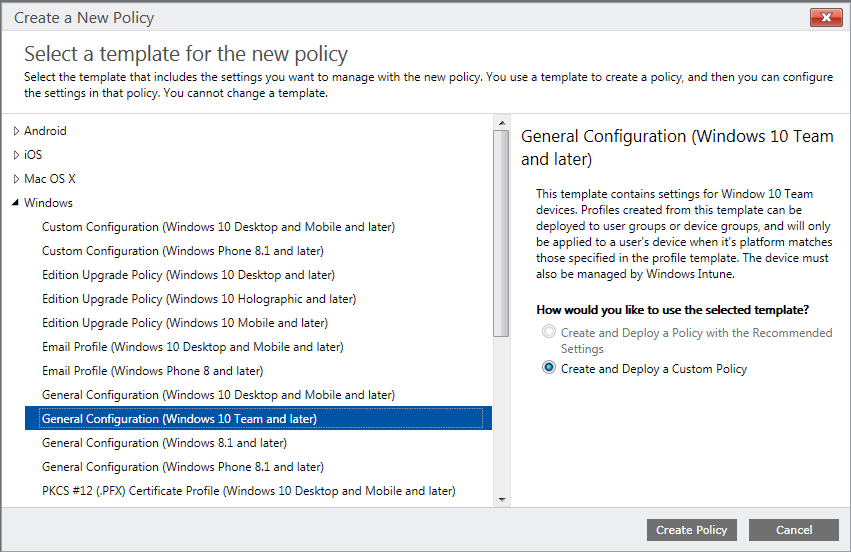
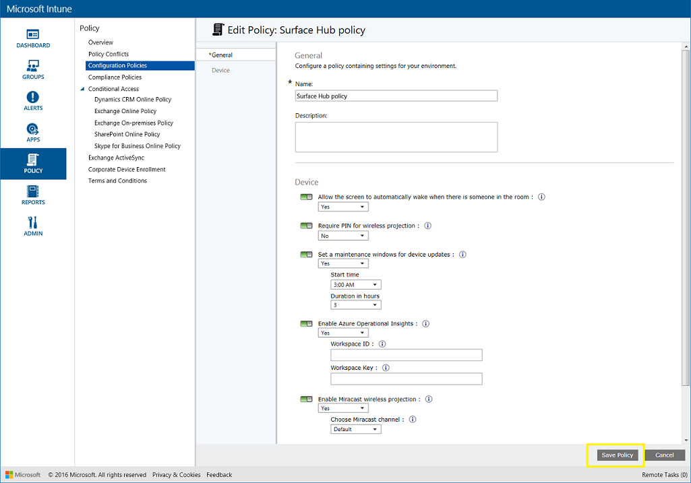
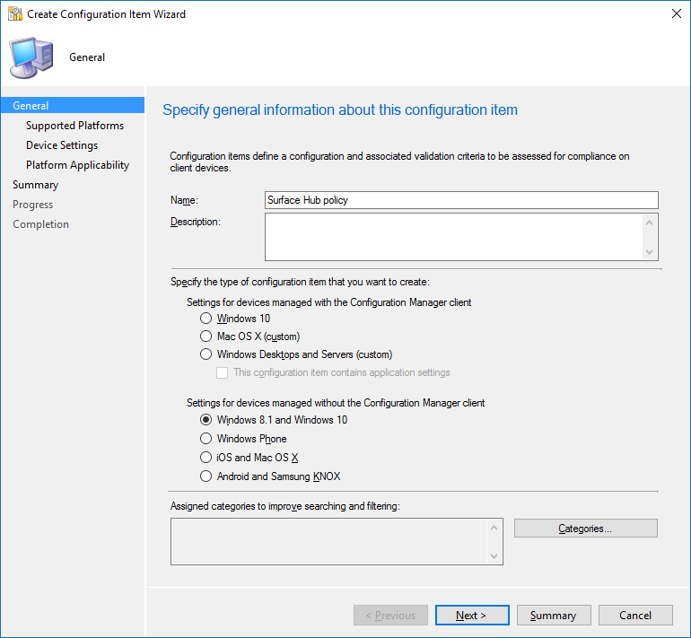
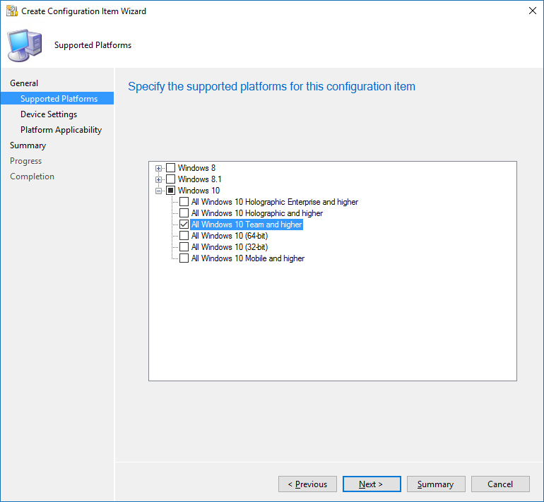
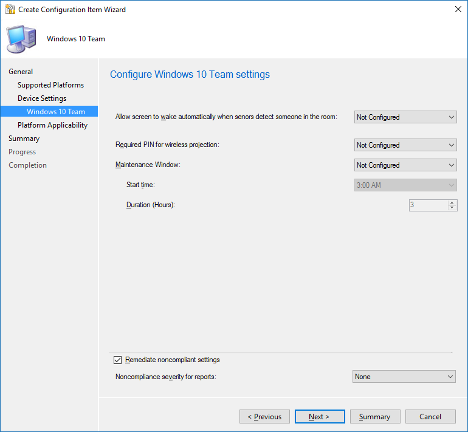
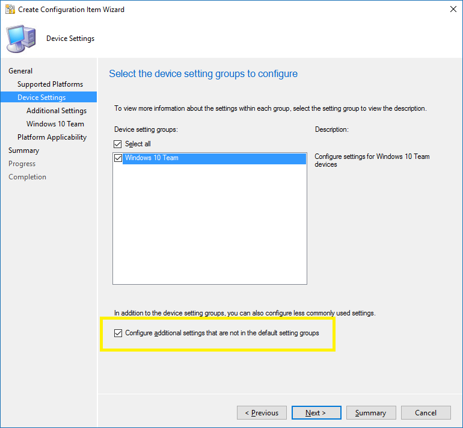
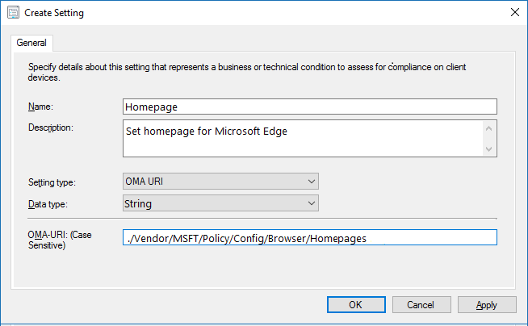

# Manage settings with an MDM provider (Surface Hub)

Surface Hub and other Windows 10 devices allow IT administrators to manage settings and policies using a mobile device management (MDM) provider. A built-in management component communicates with the management server, so there is no need to install additional clients on the device. For more information, see [Windows 10 mobile device management](https://msdn.microsoft.com/library/windows/hardware/dn914769.aspx).

Surface Hub has been validated with Microsoft’s first-party MDM providers:
- On-premises MDM with System Center Configuration Manager (beginning in version 1602)
- Hybrid MDM with System Center Configuration Manager and Microsoft Intune
- Microsoft Intune standalone

You can also manage Surface Hubs using any third-party MDM provider that can communicate with Windows 10 using the MDM protocol.

## Enroll a Surface Hub into MDM
You can enroll your Surface Hubs using bulk or manual enrollment.

> [!NOTE]
> You can join your Surface Hub to Azure Active Directory (Azure AD) to manage admin groups on the device. However, Surface Hub does not currently support automatic enrollment to Microsoft Intune through Azure AD join. If your organization automatically enrolls Azure AD-joined devices into Intune, you must disable this policy for Surface Hub before joining the device to Azure AD.
>
> **To enable automatic enrollment for Microsoft Intune**
> 1. In the [Azure classic portal](https://manage.windowsazure.com/), navigate to the **Active Directory** node and select your directory. 
> 2. Click the **Applications** tab, then click **Microsoft Intune**.
> 3. Under **Manage devices for these users**, click **Groups**. 
> 4. Click **Select Groups**, then select the groups of users you want to automatically enroll into Intune. **Do not include accounts that are used to enroll Surface Hubs into Intune.**
> 5. Click the checkmark button, then click **Save**.

### Bulk enrollment
**To configure bulk enrollment**
- Surface Hub supports the [Provisioning CSP](https://msdn.microsoft.com/library/windows/hardware/mt203665.aspx) for bulk enrollment into MDM. For more information, see [Windows 10 bulk enrollment](https://msdn.microsoft.com/library/windows/hardware/mt613115.aspx). 
--OR--
- If you have an on-premises System Center Configuration Manager infrastructure, see [How to bulk enroll devices with On-premises Mobile Device Management in System Center Configuration Manager](https://technet.microsoft.com/library/mt627898.aspx).

### Manual enrollment
**To configure manual enrollment**
1. On your Surface Hub, open **Settings**.
2. Type the device admin credentials when prompted.
3. Select **This device**, and navigate to **Device management**.
4. Under **Device management**, select **+ Device management**.
5. Follow the instructions in the dialog to connect to your MDM provider.

## Manage Surface Hub settings with MDM

You can use MDM to manage some [Surface Hub CSP settings](#supported-surface-hub-csp-settings), and some [Windows 10 settings](#supported-windows-10-settings). Depending on the MDM provider that you use, you may set these settings using a built-in user interface, or by deploying custom SyncML. Microsoft Intune and System Center Configuration Manager provide built-in experiences to help create policy templates for Surface Hub. Refer to documentation from your MDM provider to learn how to create and deploy SyncML.

### Supported Surface Hub CSP settings

You can configure the Surface Hub settings in the following table using MDM. The table identifies if the setting is supported with Microsoft Intune, System Center Configuration Manager, or SyncML.

For more information, see [SurfaceHub configuration service provider](https://msdn.microsoft.com/library/windows/hardware/mt608323). 

| Setting              | Node in the SurfaceHub CSP         | Supported with Intune? | Supported with Configuration Manager? | Supported with SyncML\*? |
| -------------------- | ---------------------------------- | ------------------------- | ---------------------------------------- | ------------------------- |
| Maintenance hours | MaintenanceHoursSimple/Hours/StartTime   MaintenanceHoursSimple/Hours/Duration | Yes | Yes | Yes |
| Automatically turn on the screen using motion sensors | InBoxApps/Welcome/AutoWakeScreen | Yes | Yes | Yes |
| Require a pin for wireless projection | InBoxApps/WirelessProjection/PINRequired | Yes | Yes | Yes |
| Enable wireless projection | InBoxApps/WirelessProjection/Enabled | Yes | Yes.  [Use a custom setting.](#example-sccm) | Yes |
| Miracast channel to use for wireless projection | InBoxApps/WirelessProjection/Channel | Yes | Yes.  [Use a custom setting.](#example-sccm) | Yes |
| Connect to your Operations Management Suite workspace | MOMAgent/WorkspaceID   MOMAgent/WorkspaceKey | Yes | Yes.  [Use a custom setting.](#example-sccm) | Yes |
| Welcome screen background image | InBoxApps/Welcome/CurrentBackgroundPath | Yes | Yes.  [Use a custom setting.](#example-sccm) | Yes |
| Meeting information displayed on the welcome screen | InBoxApps/Welcome/MeetingInfoOption | Yes | Yes.  [Use a custom setting.](#example-sccm) | Yes |
| Friendly name for wireless projection | Properties/FriendlyName | Yes   [Use a custom policy.](#example-intune) | Yes.  [Use a custom setting.](#example-sccm) | Yes |
| Device account, including password rotation | DeviceAccount/*`<name_of_policy>`*   See [SurfaceHub CSP](https://msdn.microsoft.com/library/windows/hardware/mt608323.aspx). | No | No | Yes |
| Specify Skype domain | InBoxApps/SkypeForBusiness/DomainName | Yes    | Yes.  [Use a custom setting.](#example-sccm) | Yes |
| Auto launch Connect App when projection is initiated | InBoxApps/Connect/AutoLaunch | Yes    | Yes.  [Use a custom setting.](#example-sccm) | Yes |
| Set default volume | Properties/DefaultVolume | Yes    | Yes.  [Use a custom setting.](#example-sccm) | Yes |
| Set screen timeout | Properties/ScreenTimeout | Yes    | Yes.  [Use a custom setting.](#example-sccm) | Yes |
| Set session timeout | Properties/SessionTimeout | Yes    | Yes.  [Use a custom setting.](#example-sccm) | Yes |
| Set sleep timeout | Properties/SleepTimeout | Yes    | Yes.  [Use a custom setting.](#example-sccm) | Yes |
| Allow session to resume after screen is idle | Properties/AllowSessionResume | Yes    | Yes.  [Use a custom setting.](#example-sccm) | Yes |
| Allow device account to be used for proxy authentication | Properties/AllowAutoProxyAuth | Yes    | Yes.  [Use a custom setting.](#example-sccm) | Yes |
| Disable auto-populating the sign-in dialog with invitees from scheduled meetings | Properties/DisableSignInSuggestions | Yes    | Yes.  [Use a custom setting.](#example-sccm) | Yes |
| Disable "My meetings and files" feature in Start menu | Properties/DoNotShowMyMeetingsAndFiles | Yes    | Yes.  [Use a custom setting.](#example-sccm) | Yes |
\*Settings supported with SyncML can also be configured in a Windows Configuration Designer provisioning package. 

### Supported Windows 10 settings

In addition to Surface Hub-specific settings, there are numerous settings common to all Windows 10 devices. These settings are defined in the [Configuration service provider reference](https://msdn.microsoft.com/library/windows/hardware/dn920025.aspx). 

The following tables include info on Windows 10 settings that have been validated with Surface Hub. There is a table with settings for these areas: security, browser, Windows Updates, Windows Defender, remote reboot, certificates, and logs. Each table identifies if the setting is supported with Microsoft Intune, System Center Configuration Manager, or SyncML.

#### Security settings
| Setting  | Details  | CSP reference | Supported with Intune? | Supported with Configuration Manager? | Supported with SyncML\*? |
| -------- | -------- | ------------- |-------------------------- | ---------------------------------------- | ------------------------- |
| Allow Bluetooth | Keep this enabled to support Bluetooth peripherals. | [Connectivity/AllowBluetooth](https://msdn.microsoft.com/library/windows/hardware/dn904962.aspx#Connectivity_AllowBluetooth) | Yes.    |  Yes.  [Use a custom setting.](#example-sccm) | Yes |
| Bluetooth policies | Use to set the Bluetooth device name, and block advertising, discovery, and automatic pairing. | Bluetooth/*`<name of policy>`*   See [Policy CSP](https://msdn.microsoft.com/library/windows/hardware/dn904962.aspx) | Yes.    |  Yes.  [Use a custom setting.](#example-sccm) | Yes |
| Allow camera | Keep this enabled for Skype for Business. | [Camera/AllowCamera](https://msdn.microsoft.com/library/windows/hardware/dn904962.aspx#Camera_AllowCamera) | Yes.    |  Yes.  [Use a custom setting.](#example-sccm) | Yes |
| Allow location | Keep this enabled to support apps such as Maps. | [System/AllowLocation](https://msdn.microsoft.com/library/windows/hardware/dn904962.aspx#System_AllowLocation) | Yes.   . |  Yes.  [Use a custom setting.](#example-sccm) | Yes |
| Allow telemetry | Keep this enabled to help Microsoft improve Surface Hub. | [System/AllowTelemetry](https://msdn.microsoft.com/library/windows/hardware/dn904962.aspx#System_AllowTelemetry) | Yes.    |  Yes.  [Use a custom setting.](#example-sccm) | Yes |
| Allow USB Drives | Keep this enabled to support USB drives on Surface Hub | [System/AllowStorageCard](https://msdn.microsoft.com/windows/hardware/commercialize/customize/mdm/policy-configuration-service-provider#system-allowstoragecard) | Yes   [Use a custom policy.](#example-intune)  |  Yes.  [Use a custom setting.](#example-sccm) | Yes |
\*Settings supported with SyncML can also be configured in a Windows Configuration Designer provisioning package.

#### Browser settings

| Setting  | Details          | CSP reference | Supported with Intune? | Supported with Configuration Manager? | Supported with SyncML\*? |
| -------- | ---------------- | ------------- |-------------------------- | ---------------------------------------- | ------------------------- |
| Homepages | Use to configure the default homepages in Microsoft Edge. | [Browser/Homepages](https://msdn.microsoft.com/library/windows/hardware/dn904962.aspx#Browser_Homepages)  |  Yes   [Use a custom policy.](#example-intune)  |  Yes.  [Use a custom setting.](#example-sccm) | Yes |
| Allow cookies | Surface Hub automatically deletes cookies at the end of a session. Use this to block cookies within a session. | [Browser/AllowCookies](https://msdn.microsoft.com/library/windows/hardware/dn904962.aspx#Browser_AllowCookies) |  Yes   [Use a custom policy.](#example-intune)  |  Yes.  [Use a custom setting.](#example-sccm) | Yes |
| Allow developer tools  | Use to stop users from using F12 Developer Tools. | [Browser/AllowDeveloperTools](https://msdn.microsoft.com/library/windows/hardware/dn904962.aspx#Browser_AllowDeveloperTools) | Yes   [Use a custom policy.](#example-intune) |  Yes.  [Use a custom setting.](#example-sccm) | Yes |
| Allow Do Not Track | Use to enable Do Not Track headers. | [Browser/AllowDoNotTrack](https://msdn.microsoft.com/library/windows/hardware/dn904962.aspx#Browser_AllowDoNotTrack) |  Yes   [Use a custom policy.](#example-intune)  |  Yes.  [Use a custom setting.](#example-sccm) | Yes |
| Allow pop-ups | Use to block pop-up browser windows. | [Browser/AllowPopups](https://msdn.microsoft.com/library/windows/hardware/dn904962.aspx#Browser_AllowPopups) |  Yes   [Use a custom policy.](#example-intune)  |  Yes.  [Use a custom setting.](#example-sccm) | Yes |
| Allow search suggestions | Use to block search suggestions in the address bar. | [Browser/AllowSearchSuggestionsinAddressBar](https://msdn.microsoft.com/library/windows/hardware/dn904962.aspx#Browser_AllowSearchSuggestionsinAddressBar) |  Yes   [Use a custom policy.](#example-intune)  |  Yes.  [Use a custom setting.](#example-sccm) | Yes |
| Allow SmartScreen | Keep this enabled to turn on SmartScreen. | [Browser/AllowSmartScreen](https://msdn.microsoft.com/library/windows/hardware/dn904962.aspx#Browser_AllowSmartScreen) |  Yes   [Use a custom policy.](#example-intune)  |  Yes.  [Use a custom setting.](#example-sccm) | Yes |
| Prevent ignoring SmartScreen Filter warnings for websites | For extra security, use to stop users from ignoring SmartScreen Filter warnings and block them from accessing potentially malicious websites. | [Browser/PreventSmartScreenPromptOverride](https://msdn.microsoft.com/library/windows/hardware/dn904962.aspx#Browser_PreventSmartScreenPromptOverride) |  Yes   [Use a custom policy.](#example-intune)  |  Yes.  [Use a custom setting.](#example-sccm) | Yes |
| Prevent ignoring SmartScreen Filter warnings for files | For extra security, use to stop users from ignoring SmartScreen Filter warnings and block them from downloading unverified files from Microsoft Edge. | [Browser/PreventSmartScreenPromptOverrideForFiles](https://msdn.microsoft.com/library/windows/hardware/dn904962.aspx#Browser_PreventSmartScreenPromptOverrideForFiles) |  Yes   [Use a custom policy.](#example-intune)  |  Yes.  [Use a custom setting.](#example-sccm) | Yes |
\*Settings supported with SyncML can also be configured in a Windows Configuration Designer provisioning package.

#### Windows Update settings

| Setting     | Details          | CSP reference | Supported with Intune? | Supported with Configuration Manager? | Supported with SyncML*? |
| ----------- | ---------------- | ------------- |-------------------------- | ---------------------------------------- | ------------------------- |
| Use Current Branch or Current Branch for Business | Use to configure Windows Update for Business – see [Windows updates](manage-windows-updates-for-surface-hub.md). | [Update/BranchReadinessLevel](https://msdn.microsoft.com/library/windows/hardware/dn904962.aspx#Update_BranchReadinessLevel) | Yes   [Use a custom policy.](#example-intune)  |  Yes.  [Use a custom setting.](#example-sccm) | Yes |
| Defer feature updates| See above. | [Update/ DeferFeatureUpdatesPeriodInDays](https://msdn.microsoft.com/library/windows/hardware/dn904962.aspx#Update_DeferFeatureUpdatesPeriodInDays) |  Yes   [Use a custom policy.](#example-intune)  |  Yes.  [Use a custom setting.](#example-sccm) | Yes |
| Defer quality updates | See above. | [Update/DeferQualityUpdatesPeriodInDays](https://msdn.microsoft.com/library/windows/hardware/dn904962.aspx#Update_DeferQualityUpdatesPeriodInDays) |  Yes   [Use a custom policy.](#example-intune)  |  Yes.  [Use a custom setting.](#example-sccm) | Yes |
| Pause feature updates | See above. | [Update/PauseFeatureUpdates](https://msdn.microsoft.com/library/windows/hardware/dn904962.aspx#Update_PauseFeatureUpdates) |  Yes   [Use a custom policy.](#example-intune)  |  Yes.  [Use a custom setting.](#example-sccm) | Yes |
| Pause quality updates | See above. | [Update/PauseQualityUpdates](https://msdn.microsoft.com/library/windows/hardware/dn904962.aspx#Update_PauseQualityUpdates) |  Yes   [Use a custom policy.](#example-intune)  | Yes.  [Use a custom setting.](#example-sccm) | Yes|
| Configure device to use WSUS| Use to connect your Surface Hub to WSUS instead of Windows Update – see [Windows updates](manage-windows-updates-for-surface-hub.md). | [Update/UpdateServiceUrl](https://msdn.microsoft.com/library/windows/hardware/dn904962.aspx#Update_UpdateServiceUrl) |  Yes   [Use a custom policy.](#example-intune)  |  Yes.  [Use a custom setting.](#example-sccm) | Yes |
| Delivery optimization | Use peer-to-peer content sharing to reduce bandwidth issues during updates. See [Configure Delivery Optimization for Windows 10](https://technet.microsoft.com/itpro/windows/manage/waas-delivery-optimization) for details. | DeliveryOptimization/*`<name of policy>`*   See [Policy CSP](https://msdn.microsoft.com/library/windows/hardware/dn904962.aspx) |  Yes   [Use a custom policy.](#example-intune)  |  Yes.  [Use a custom setting.](#example-sccm) | Yes |
\*Settings supported with SyncML can also be configured in a Windows Configuration Designer provisioning package.

#### Windows Defender settings

| Setting     | Details          | CSP reference | Supported with Intune? | Supported with Configuration Manager? | Supported with SyncML\*? |
| ----------- | ---------------- | ------------- |-------------------------- | ---------------------------------------- | ------------------------- |
| Defender policies | Use to configure various Defender settings, including a scheduled scan time. | Defender/*`<name of policy>`*   See [Policy CSP](https://msdn.microsoft.com/library/windows/hardware/dn904962.aspx) | Yes   [Use a custom policy.](#example-intune)  |  Yes.  [Use a custom setting.](#example-sccm) | Yes |
| Defender status | Use to initiate a Defender scan, force a signature update, query any threats detected. | [Defender CSP](https://msdn.microsoft.com/library/windows/hardware/mt187856.aspx) | No. | No. | Yes |
\*Settings supported with SyncML can also be configured in a Windows Configuration Designer provisioning package.

#### Remote reboot

| Setting     | Details          | CSP reference | Supported with Intune? | Supported with Configuration Manager? | Supported with SyncML\*? |
| ----------- | ---------------- | ------------- |-------------------------- | ---------------------------------------- | ------------------------- |
| Reboot the device immediately | Use in conjunction with OMS to minimize support costs – see [Monitor your Microsoft Surface Hub](monitor-surface-hub.md). | ./Vendor/MSFT/Reboot/RebootNow   See [Reboot CSP](https://msdn.microsoft.com/library/windows/hardware/mt720802.aspx) | No | No | Yes |
| Reboot the device at a scheduled date and time | See above. | ./Vendor/MSFT/Reboot/Schedule/Single   See [Reboot CSP](https://msdn.microsoft.com/library/windows/hardware/mt720802.aspx) |  Yes   [Use a custom policy.](#example-intune)  |  Yes.  [Use a custom setting.](#example-sccm) | Yes |
| Reboot the device daily at a scheduled date and time | See above. | ./Vendor/MSFT/Reboot/Schedule/DailyRecurrent   See [Reboot CSP](https://msdn.microsoft.com/library/windows/hardware/mt720802.aspx) |  Yes   [Use a custom policy.](#example-intune)  |  Yes.  [Use a custom setting.](#example-sccm) | Yes |
\*Settings supported with SyncML can also be configured in a Windows Configuration Designer provisioning package.

#### Install certificates

| Setting     | Details          | CSP reference | Supported with Intune? | Supported with Configuration Manager? | Supported with SyncML\*? |
| ----------- | ---------------- | ------------- |-------------------------- | ---------------------------------------- | ------------------------- |
| Install trusted CA certificates | Use to deploy trusted root and intermediate CA certificates. |  [RootCATrustedCertificates CSP](https://msdn.microsoft.com/library/windows/hardware/dn904970.aspx) | Yes.   See [Configure Intune certificate profiles](https://docs.microsoft.com/en-us/intune/deploy-use/configure-intune-certificate-profiles). | Yes.   See [How to create certificate profiles in System Center Configuration Manager](https://docs.microsoft.com/en-us/sccm/protect/deploy-use/create-certificate-profiles). | Yes |
<!--
| Install client certificates  | Use to deploy Personal Information Exchange (.pfx, .p12) certificates. | [ClientCertificateInstall CSP](https://msdn.microsoft.com/library/windows/hardware/dn920023.aspx) | Yes.   See [How to Create and Deploy PFX Certificate Profiles in Intune Standalone](https://blogs.technet.microsoft.com/karanrustagi/2016/03/16/want-to-push-a-certificate-to-device-but-cant-use-ndes-continue-reading/). | Yes.   See [How to create PFX certificate profiles in System Center Configuration Manager](https://docs.microsoft.com/en-us/sccm/protect/deploy-use/create-pfx-certificate-profiles). | Yes |
-->
\*Settings supported with SyncML can also be configured in a Windows Configuration Designer provisioning package.

#### Collect logs

| Setting     | Details          | CSP reference | Supported with Intune? | Supported with Configuration Manager? | Supported with SyncML*? |
| ----------- | ---------------- | ------------- |-------------------------- | ---------------------------------------- | ------------------------- |
| Collect ETW logs | Use to remotely collect ETW logs from Surface Hub. | [DiagnosticLog CSP](https://msdn.microsoft.com/library/windows/hardware/mt219118.aspx) | No | No | Yes |
<!--
| Collect security auditing logs | Use to remotely collect security auditing logs from Surface Hub. | SecurityAuditing node in [Reporting CSP](https://msdn.microsoft.com/en-us/library/windows/hardware/mt608321.aspx) | No | No | Yes |-->
\*Settings supported with SyncML can also be configured in a Windows Configuration Designer provisioning package.

### Generate OMA URIs for settings 
You need to use a setting’s OMA URI to create a custom policy in Intune, or a custom setting in System Center Configuration Manager.

**To generate the OMA URI for any setting in the CSP documentation**
1. In the CSP documentation, identify the root node of the CSP. Generally, this looks like `./Vendor/MSFT/<name of CSP>`  
*For example, the root node of the [SurfaceHub CSP](https://msdn.microsoft.com/library/windows/hardware/mt608323.aspx) is `./Vendor/MSFT/SurfaceHub`.*
2. Identify the node path for the setting you want to use.  
*For example, the node path for the setting to enable wireless projection is `InBoxApps/WirelessProjection/Enabled`.*
3. Append the node path to the root node to generate the OMA URI.  
*For example, the OMA URI for the setting to enable wireless projection is `./Vendor/MSFT/SurfaceHub/InBoxApps/WirelessProjection/Enabled`.*

The data type is also stated in the CSP documentation. The most common data types are:
- char (String)
- int (Integer)
- bool (Boolean)

## Example: Manage Surface Hub settings with Microsoft Intune

You can use Microsoft Intune to manage Surface Hub settings. 

**To create a configuration policy from a template**

You'll use the **Windows 10 Team general configuration policy** as the template.

1. On the [Intune management portal](https://manage.microsoft.com), sign in with your Intune administrator account.
2. On the left-hand navigation menu, click **Policy**.
3. In the Overview page, click **Add Policy**.
4. On **Select a template for the new policy**, expand **Windows**, select **General Configuration (Windows 10 Team and later)**, and then click **Create Policy**.

    
5. Configure your policy, then click **Save Policy**
   
    
6. When prompted, click **Yes** to deploy your new policy to a user or device group. For more information, see [Use groups to manage users and devices in Microsoft Intune](https://docs.microsoft.com/intune/deploy-use/use-groups-to-manage-users-and-devices-with-microsoft-intune).

**To create a custom configuration policy**

You’ll need to create a custom policy using the **Custom Configuration (Windows 10 Desktop and Mobile and later)** template to manage settings that are not available in the **Windows 10 Team general configuration policy** template. 

1. On the [Intune management portal](https://manage.microsoft.com), sign in with your Intune administrator account.
2. On the left-hand navigation menu, click **Policy**.
3. On the Overview page, click **Add Policy**.
4. On **Select a template for the new policy**, expand **Windows**, select **Custom Configuration (Windows 10 Desktop and Mobile and later)**, and then click **Create Policy**.
5. Type a name and optional description for the policy.
6. Under OMA-URI Settings, click **Add**.
7. Complete the form to create a new setting, and then click **OK**.

    
8. Repeat Steps 6 and 7 for each setting you want to configure with this policy.
9. After you're done, click **Save Policy** and deploy it to a user or device group. 

## Example: Manage Surface Hub settings with System Center Configuration Manager
System Center Configuration Manager supports managing modern devices that do not require the Configuration Manager client to manage them, including Surface Hub. If you already use System Center Configuration Manager to manage other devices in your organization, you can continue to use the Configuration Manager console as your single location for managing Surface Hubs.

> [!NOTE]
> These instructions are based on the current branch of System Center Configuration Manager.

**To create a configuration item for Surface Hub settings**

1. On the **Assets and Compliance** workspace of the Configuration Manager console, click **Overview** > **Compliance Settings** > **Configuration Items**.
2. On the **Home** tab, in the **Create** group, click **Create Configuration Item**.
3. On the **General** page of the Create Configuration Item Wizard, specify a name and optional description for the configuration item.
4. Under **Settings for devices managed without the Configuration Manager client**, select **Windows 8.1 and Windows 10**, and then click **Next**.

    
5. On the **Supported Platforms** page, expand **Windows 10** and select **All Windows 10 Team and higher**. Unselect the other Windows platforms, and then click **Next**.

    
7. On the **Device Settings** page, under **Device settings groups**, select **Windows 10 Team**.

8. On the **Windows 10 Team** page, configure the settings you require.

    
9. You'll need to create custom settings to manage settings that are not available in the Windows 10 Team page. On the **Device Settings** page, select the check box **Configure additional settings that are not in the default setting groups**.

    
10. On the **Additional Settings** page, click **Add**.
11. In the **Browse Settings** dialog, click **Create Setting**.
12. In the **Create Setting** dialog, under the **General** tab, specify a name and optional description for the custom setting.
13. Under **Setting type**, select **OMA URI**.
14. Complete the form to create a new setting, and then click **OK**.

    
15. On the **Browse Settings** dialog, under **Available settings**, select the new setting you created, and then click **Select**.
16. On the **Create Rule** dialog, complete the form to specify a rule for the setting, and then click **OK**.
17. Repeat steps 9 to 15 for each custom setting you want to add to the configuration item.
18. When you're done, on the **Browse Settings** dialog, click **Close**.
19. Complete the wizard.   You can view the new configuration item in the **Configuration Items** node of the **Assets and Compliance** workspace.

For more information, see [Create configuration items for Windows 8.1 and Windows 10 devices managed without the System Center Configuration Manager client](https://docs.microsoft.com/sccm/compliance/deploy-use/create-configuration-items-for-windows-8.1-and-windows-10-devices-managed-without-the-client).

## Related topics

[Manage Microsoft Surface Hub](manage-surface-hub.md)

 

 

