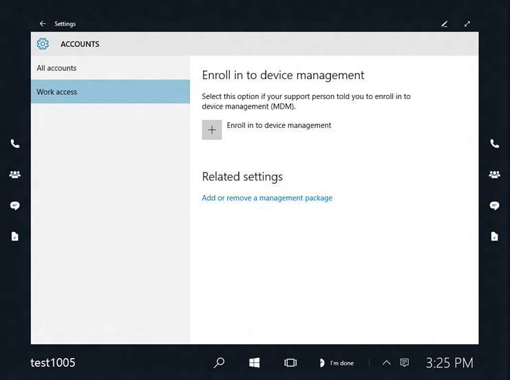

# Manage settings with an MDM provider - Microsoft Surface Hub

Microsoft Surface Hub provides an enterprise management solution to help IT administrators manage policies and business applications on these devices using a mobile device management (MDM) solution.

The Surface Hub operating system has a built-in management component that's used to communicate with the device management server. There are two parts to the Surface Hub management component: the enrollment client, which enrolls and configures the device to communicate with the enterprise management server; and the management client, which periodically synchronizes with the management server to check for and apply updates. Third-party MDM servers can manage Surface Hub devices by using the Mobile Device Management protocol.

### Supported services

Surface Hub management has been validated for the following MDM providers:

-   Microsoft Intune
-   System Center Configuration Manager

### Enroll a Surface Hub into MDM

If you joined your Surface Hub to an Azure Active Directory (Azure AD) subscription, the device can automatically enroll into MDM and will be ready for remote management.

Alternatively, the device can be enrolled like any other Windows device by going to **Settings** &gt; **Accounts** &gt; **Work access**.

### Manage a device through MDM

The following table lists the device settings that can be managed remotely using MDM, including the OMA URI paths that 3rd party MDM providers need to create policies. Intune and SCCM have special templates to help create policies to manage these settings.

<table>
<colgroup>
<col width="25%" />
<col width="25%" />
<col width="25%" />
<col width="25%" />
</colgroup>
<thead>
<tr class="header">
<th align="left"></th>
<th align="left">Setting</th>
<th align="left">OMA URI</th>
<th align="left">Type</th>
</tr>
</thead>
<tbody>
<tr class="odd">
<td align="left">
1
</td>
<td align="left">
Auto Awake when someone is in the room
</td>
<td align="left">
./Vendor/MSFT/SurfaceHub/InBoxApps/Welcome/AutoWakeScreen
</td>
<td align="left">
Boolean
</td>
</tr>
<tr class="even">
<td align="left">
2
</td>
<td align="left">
Require that people must enter a PIN when pairing to the Surface Hub
</td>
<td align="left">
./Vendor/MSFT/SurfaceHub/InBoxApps/WirelessProjection/PINRequired
</td>
<td align="left">
Boolean
</td>
</tr>
<tr class="odd">
<td align="left">
3
</td>
<td align="left">
Set the maintenance window duration. This time is in minutes. As an example, to set a 3 hour duration, you set the value to 180.
</td>
<td align="left">
./Vendor/MSFT/SurfaceHub/MaintenanceHoursSimple/Hours/Duration
</td>
<td align="left">
Int
</td>
</tr>
<tr class="even">
<td align="left">
4
</td>
<td align="left">
Set the maintenance window start time. This time is in minutes past midnight. To set a 2:00 am start time, set a value of 120, meaning 120 minutes past midnight.
</td>
<td align="left">
./Vendor/MSFT/SurfaceHub/MaintenanceHoursSimple/Hours/StartTime
</td>
<td align="left">
Int
</td>
</tr>
<tr class="odd">
<td align="left">
5
</td>
<td align="left">
The Microsoft Operations Management Suite (OMS) Workspace ID that this device will connect to.
</td>
<td align="left">
./Vendor/MSFT/SurfaceHub/MOMAgent/WorkspaceID
</td>
<td align="left">
String
</td>
</tr>
<tr class="even">
<td align="left">
6
</td>
<td align="left">
The key that must be used when connecting to the specified OMS workspace.
</td>
<td align="left">
./Vendor/MSFT/SurfaceHub/MOMAgent/WorkspaceKey
</td>
<td align="left">
String
</td>
</tr>
<tr class="odd">
<td align="left">
7
</td>
<td align="left">
Choose the meeting information displayed on the welcome screen.

Value : 0 - Show organizer and time only

Value : 1 - Show organizer, time, and subject (subject is hidden for private meetings)
</td>
<td align="left">
./Vendor/MSFT/SurfaceHub/InBoxApps/Welcome/MeetingInfoOption
</td>
<td align="left">
Int
</td>
</tr>
<tr class="even">
<td align="left">
8
</td>
<td align="left">
Enable/Disable all Wireless Projection to the Surface Hub
</td>
<td align="left">
./Vendor/MSFT/SurfaceHub/InBoxApps/WirelessProjection/Enabled
</td>
<td align="left">
Boolean
</td>
</tr>
<tr class="odd">
<td align="left">
9
</td>
<td align="left">
Select a specific wireless channel on which Miracast Receive will operate
</td>
<td align="left">
./Vendor/MSFT/SurfaceHub/InBoxApps/WirelessProjection/Channel
</td>
<td align="left">
Int
</td>
</tr>
<tr class="even">
<td align="left">
10
</td>
<td align="left">
Change the background image for the welcome screen using a PNG image URL.
</td>
<td align="left">
./Vendor/MSFT/SurfaceHub/InBoxApps/Welcome/CurrentBackgroundPath (Note: must be accessed using https.)
</td>
<td align="left">
String
</td>
</tr>
</tbody>
</table>

 

## Related topics

[Manage Microsoft Surface Hub](manage-surface-hub.md)

[Microsoft Surface Hub administrator's guide](surface-hub-administrators-guide.md)

 

 

