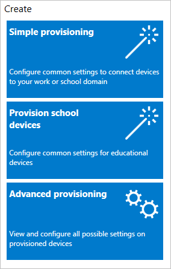
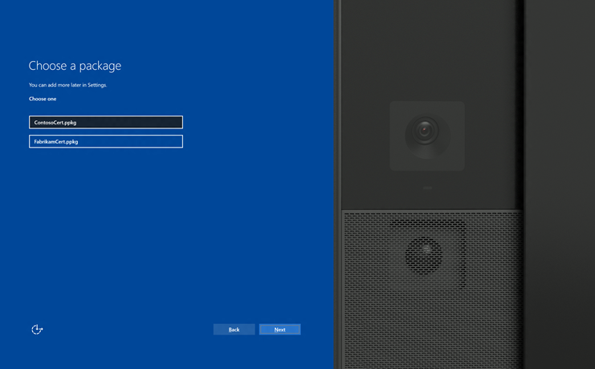

# Create provisioning packages (Surface Hub)

This topic explains how to create a provisioning package using the Windows Imaging and Configuration Designer (ICD), and apply it to Surface Hub devices. For Surface Hub, you can use provisioning packages to add certificates, install Universal Windows Platform (UWP) apps, and customize policies and settings.

You can apply a provisioning package using a USB during first run, or through the **Settings** app. 

## Advantages
-   Quickly configure devices without using a MDM provider.

-   No network connectivity required.

-   Simple to apply.

[Learn more about the benefits and uses of provisioning packages.](https://technet.microsoft.com/itpro/windows/whats-new/new-provisioning-packages)

## Requirements 

To create and apply a provisioning package to a Surface Hub, you'll need the following:

-   Windows Imaging and Configuration Designer (ICD), which is installed as a part of the [Windows 10 Assessment and Deployment Kit (ADK)](http://go.microsoft.com/fwlink/p/?LinkId=526740).
-   A PC running Windows 10.
-   A USB flash drive.
-   If you apply the package using the **Settings** app, you'll need device admin credentials.

You'll create the provisioning package on a PC running Windows 10, save the package to a USB drive, and then deploy it to your Surface Hub.

## Supported items for Surface Hub provisioning packages

Currently, you can add these items to provisioning packages for Surface Hub:
- **Certificates** - You can add certificates, if needed, to authenticate to Microsoft Exchange.
- **Universal Windows Platform (UWP) apps** - You can install UWP apps. This can be an offline-licensed app from the Microsoft Store for Business, or an app created by an in-house dev.
- **Policies** - Surface Hub supports a subset of the policies in the [Policy configuration service provider](https://msdn.microsoft.com/library/windows/hardware/dn904962.aspx). Some of those policies can be configured with ICD.
- **Settings** - You can configure any setting in the [SurfaceHub configuration service provider](https://msdn.microsoft.com/library/windows/hardware/mt608323.aspx).

## Create the provisioning package

Use the Windows Imaging and Configuration Designer (ICD) tool included in the Windows Assessment and Deployment Kit (ADK) for Windows 10 to create a provisioning package. When you install the ADK, you can choose to install only the Imaging and Configuration Designer (ICD).  [Install the ADK.](http://go.microsoft.com/fwlink/p/?LinkId=526740)

1. Open Windows ICD (by default, `%windir%\Program Files (x86)\Windows Kits\10\Assessment and Deployment Kit\Imaging and Configuration Designer\x86\ICD.exe`).

2. Click **Advanced provisioning**.

      
  
3. Name your project and click **Next**.

4. Select **Common to Windows 10 Team edition**, click **Next**, and then click **Finish**.

    

5. In the project, under **Available customizations**, select **Common Team edition settings**.

    

### Add a certificate to your package
You can use provisioning packages to install certificates that will allow the device to authenticate to Microsoft Exchange.

> [!NOTE]
> Provisioning packages can only install certificates to the device (local machine) store, and not to the user store. If your organization requires that certificates must be installed to the user store, use Mobile Device Management (MDM) to deploy these certificates. See your MDM solution documentation for details.

1. In the **Available customizations** pane, go to **Runtime settings** > **Certificates** > **ClientCertificates**. 

2. Enter a **CertificateName** and then click **Add**. 

2. Enter the **CertificatePassword**. 

3. For **CertificatePath**, browse and select the certificate. 

4. Set **ExportCertificate** to **False**.

5. For **KeyLocation**, select **Software only**.

### Add a Universal Windows Platform (UWP) app to your package
Before adding a UWP app to a provisioning package, you need the app package (either an .appx, or .appxbundle) and any dependency files. If you acquired the app from the Microsoft Store for Business, you will also need the *unencoded* app license. See [Distribute offline apps](https://technet.microsoft.com/itpro/windows/manage/distribute-offline-apps#download-an-offline-licensed-app) to learn how to download these items from the Microsoft Store for Business.

1. In the **Available customizations** pane, go to **Runtime settings** > **UniversalAppInstall** > **DeviceContextApp**.

2. Enter a **PackageFamilyName** for the app and then click **Add**. For consistency, use the app's package family name. If you acquired the app from the Microsoft Store for Business, you can find the package family name in the app license. Open the license file using a text editor, and use the value between the \<PFM\>...\</PFM\> tags.

3. For **ApplicationFile**, click **Browse** to find and select the target app (either an \*.appx or \*.appxbundle).

4. For **DependencyAppxFiles**, click **Browse** to find and add any dependencies for the app. For Surface Hub, you will only need the x64 versions of these dependencies.

If you acquired the app from the Microsoft Store for Business, you will also need to add the app license to your provisioning package.

1. Make a copy of the app license, and rename it to use a **.ms-windows-store-license** extension. For example, "example.xml" becomes "example.ms-windows-store-license".

2. In ICD, in the **Available customizations** pane, go to **Runtime settings** > **UniversalAppInstall** > **DeviceContextAppLicense**.

3. Enter a **LicenseProductId** and then click **Add**. For consistency, use the app's license ID from the app license. Open the license file using a text editor. Then, in the \<License\> tag, use the value in the **LicenseID** attribute.

4. Select the new **LicenseProductId** node. For **LicenseInstall**, click **Browse** to find and select the license file that you renamed in Step 1.

### Add a policy to your package
Surface Hub supports a subset of the policies in the [Policy configuration service provider](https://msdn.microsoft.com/library/windows/hardware/dn904962.aspx). Some of those policies can be configured with ICD.

1. In the **Available customizations** pane, go to **Runtime settings** > **Policies**.

2. Select one of the available policy areas.

3. Select and set the policy you want to add to your provisioning package.

### Add Surface Hub settings to your package 

You can add settings from the [SurfaceHub configuration service provider](https://msdn.microsoft.com/library/windows/hardware/mt608323.aspx) to your provisioning package. 

1. In the **Available customizations** pane, go to **Runtime settings** > **WindowsTeamSettings**.

2. Select one of the available setting areas.

3. Select and set the setting you want to add to your provisioning package. 

## Build your package

1. When you are done configuring the provisioning package, on the **File** menu, click **Save**.

2. Read the warning that project files may contain sensitive information, and click **OK**.

    > [!IMPORTANT]
    > When you build a provisioning package, you may include sensitive information in the project files and in the provisioning package (.ppkg) file. Although you have the option to encrypt the .ppkg file, project files are not encrypted. You should store the project files in a secure location and delete the project files when they are no longer needed.

3. On the **Export** menu, click **Provisioning package**.

4. Change **Owner** to **IT Admin**, which will set the precedence of this provisioning package higher than provisioning packages applied to this device from other sources.

5. Set a value for **Package Version**, and then select **Next.**

    > [!TIP]
    > You can make changes to existing packages and change the version number to update previously applied packages.

6. Optional: You can choose to encrypt the package and enable package signing.

    -   **Enable package encryption** - If you select this option, an auto-generated password will be shown on the screen.

    -   **Enable package signing** - If you select this option, you must select a valid certificate to use for signing the package. You can specify the certificate by clicking **Browse...** and choosing the certificate you want to use to sign the package.

        > [!IMPORTANT]
        > We recommend that you include a trusted provisioning certificate in your provisioning package. When the package is applied to a device, the certificate is added to the system store and any package signed with that certificate thereafter can be applied silently. 

7. Click **Next** to specify the output location where you want the provisioning package to go once it's built. By default, Windows ICD uses the project folder as the output location.

Optionally, you can click **Browse** to change the default output location.

8. Click **Next**.

9. Click **Build** to start building the package. The project information is displayed in the build page and the progress bar indicates the build status.

If you need to cancel the build, click **Cancel**. This cancels the current build process, closes the wizard, and takes you back to the **Customizations Page**.

10. If your build fails, an error message will show up that includes a link to the project folder. You can scan the logs to determine what caused the error. Once you fix the issue, try building the package again.

If your build is successful, the name of the provisioning package, output directory, and project directory will be shown.

    -   If you choose, you can build the provisioning package again and pick a different path for the output package. To do this, click **Back** to change the output package name and path, and then click **Next** to start another build.
    
    -   If you are done, click **Finish** to close the wizard and go back to the **Customizations Page**.

11. Select the **output location** link to go to the location of the package. Copy the .ppkg to an empty USB flash drive.

## Apply a provisioning package to Surface Hub

There are two options for deploying provisioning packages to a Surface Hub. You can apply a provisioning packing [during the first run wizard](#apply-a-provisioning-package-during-first-run), or using [Settings](#apply-a-package-using-settings). 

### Apply a provisioning package during first run

> [!IMPORTANT]
> Only use provisioning packages to install certificates during first run. Use the **Settings** app to install apps and apply other settings.

1. When you turn on the Surface Hub for the first time, the first-run program will display the [**Hi there page**](first-run-program-surface-hub.md#first-page). Make sure that the settings are properly configured before proceeding.

2. Insert the USB flash drive containing the .ppkg file into the Surface Hub. If the package is in the root directory of the drive, the first-run program will recognize it and ask if you want to set up the device. Select **Set up**.

    

3. The next screen asks you to select a provisioning source. Select **Removable Media** and tap **Next**.

    
    
4. Select the provisioning package (\*.ppkg) that you want to apply, and tap **Next**. Note that you can only install one package during first run.

    

5. The first-run program will show you a summary of the changes that the provisioning package will apply. Select **Yes, add it**. The package will be applied, and you'll be taken to the next page in the first-run program.

    

### Apply a package using Settings

1. Insert the USB flash drive containing the .ppkg file into the Surface Hub.

2. From the Surface Hub, start **Settings** and enter the admin credentials when prompted.

3. Navigate to **This device** > **Device management**. Under **Provisioning packages**, select **Add or remove a provisioning package**.

4. Select **Add a package**.

5. Choose your provisioning package and select **Add**. You may have to re-enter the admin credentials if prompted.

6. You'll see a summary of the changes that the provisioning package will apply. Select **Yes, add it**.
