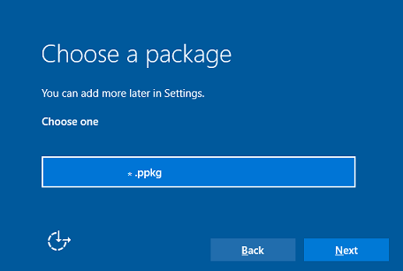
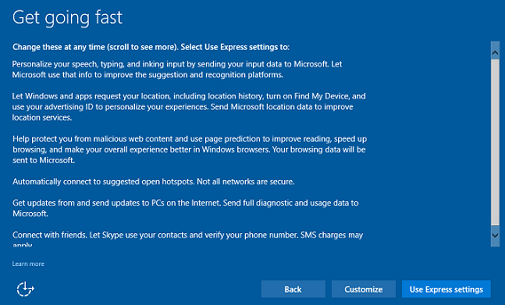
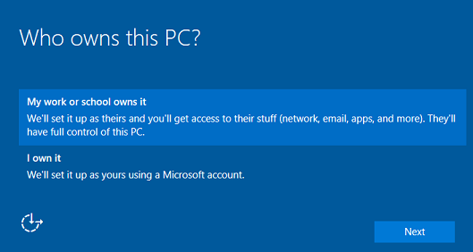

# Create provisioning packages (Surface Hub)

This topic explains how to create a provisioning package using Windows Imaging and Configuration Designer, and apply it to Surface Hub devices. For Surface Hub, you can use provisioning packages to add certificates, customize policies, install Windows apps, or customize Windows Team settings. There are additional options for PCs and mobile devices running Windows 10. 

You can apply a provisioning package using a USB during setup, or through the **Settings** app. 

## Advantages
-   You can configure new devices as part of the setup process. 

-   No network connectivity required.

-   Simple to apply.

[Learn more about the benefits and uses of provisioning packages.](https://technet.microsoft.com/en-us/itpro/windows/whats-new/new-provisioning-packages)

## Requirements 

To create and apply a provisioning package to a Surface Hub, you'll need the following:

-   Access to the **Settings** app on Surface Hub (using admin credentials which were configured at initial setup of the Surface Hub) (is this accurate?).
-   Windows Imaging and Configuration Designer (ICD), which is installed as a part of the Windows 10 Assessment and Deployment Kit (ADK).
-   A PC running Windows 10.
-   USB flash drive.

You'll create the provisioning package on a PC runing Windows 10, save the package to a USB drive, and then deploy it to your Surface Hub. 

## Supported items for Surface Hub provisioning packages

Currently, you can add these items to provisioning packages for Surface Hub:
- **Certificates** - (why, need info here)
- **Policies** - Surface Hub supports a subset of the policies in [Policy configuration service provider](https://msdn.microsoft.com/en-us/library/windows/hardware/dn904962(v=vs.85).aspx). Some of those policies can be configured with ICD.
- **Universal apps** - You can add a universal app to your provisioning package. This can be an offline-licensed app from Windows Store for Business, or an app created by an in-house dev. (Are offline-licensed apps available outside of WSFB?)
- **Settings** - Surface Hub supports settings in the [WindowsTeam configuration service provider](https://msdn.microsoft.com/en-us/library/windows/hardware/mt733245(v=vs.85).aspx). Some of these settings can be configured with ICD. 

## Create the provisioning package

Use the Windows Imaging and Configuration Designer (ICD) tool included in the Windows Assessment and Deployment Kit (ADK) for Windows 10 to create a provisioning package. When you install the ADK, you can select just Windows Imaging and Configuration Designer (ICD).  [Install the ADK.](http://go.microsoft.com/fwlink/p/?LinkId=526740)

1. Open Windows ICD (by default, %windir%\Program Files (x86)\Windows Kits\10\Assessment and Deployment Kit\Imaging and Configuration Designer\x86\ICD.exe).

2. Click **Advanced provisioning**.

    
  
3. Name your project and click **Next**.

4. Select **Common to Windows 10 team edition**, click **Next**, and then click **Finish**.

5. In the project, under **Available customizations**, select **Common Team edition settings**. 

Currently, you can add these items certificate, a policy, a universal app, or a setting to your provisioning package for Surface Hub. 

### Add a certificate to your package
You may use provisioning packages to install certificates that will allow the device to authenticate to Microsoft Exchange or Skype for Business, or to sideload apps that don't come from the Windows Store (for example, your own in-house apps).

>**Note**  Provisioning packages can only install certificates to the device (local machine) store, and not to the user store. If your organization requires that certificates must be installed to the user store, use Mobile Device Management (MDM) to deploy these certificates. See your MDM solution documentation for details.

1. In the **Available customizations** pane, go to **Runtime settings** > **Certificates** > **ClientCertificates**. 

2. Enter a **CertificateName** and then click **Add**. 

2. Enter the **CertificatePassword**. 

3. For **CertificatePath**, browse and select the certificate. 

4. Set **ExportCertificate** to **False**.

5. For **KeyLocation**, select **Software only**.

### Add a policy to your package
Surface Hub supports a subset of the policies in [Policy configuration service provider](https://msdn.microsoft.com/en-us/library/windows/hardware/dn904962(v=vs.85).aspx). Some of those policies can be configured with ICD. You'll find them under **Available customizations > Runtime settings > Policies**.

1. In the **Available customizations** pane, go to **Runtime settings** > **Policies**.

2. Click one of the available policy areas: **Bluetooth**, **Camera**, **System**, or **Update**. 

3. Select and set the policy you want to add to your provisioning package.

### Add a universal app to your package
Before adding a universal app to a provisioning package, you need app package name, the app package (either an .appx, or .appxbundle), dependency files, and the app license. If you acquire your universal app from the Windows Store for Business, you can download these items when you acquire the app. For more information, see [Distribute offline apps](https://technet.microsoft.com/en-us/itpro/windows/manage/distribute-offline-apps).

1. In the **Available customizations** pane, go to **Runtime settings** > **UniversalAppInstall**. 

2. For **UserContextApp**, specify the **PackageFamilyName** for the app. (how to find package family name)

3. For **ApplicationFile**, click **Browse** to find and select the target app (either an \*.appx or \*.appxbundle).

4. For **DependencyAppxFiles**, click **Browse** to find and add any dependencies for the app. This will include app metadata and app frameworks. 

5. For **UserContextAppLicense**, enter the **LicenseProductID**.

### Add other settings to your package 

You can add some [WindowsTeam CSP settings](https://msdn.microsoft.com/en-us/library/windows/hardware/mt733245(v=vs.85).aspx) to your provisioning package. 

1. In the **Available customizations** pane, go to **Runtime settings** > **WindowsTeamSettings**.

2. Click one of the available policy areas: **Connect**, **DeviceAccount**, **FriendlyName**,  **MaitenanceHours**, **OMSAgent**, or **Welcome**. 

3. Select and set the setting you want to add to your provisioning package. 

### Build your package

1. When you are done configuring the provisioning package, on the **File** menu, click **Save**.

2. Read the warning that project files may contain sensitive information, and click **OK**.
> **Important**  When you build a provisioning package, you may include sensitive information in the project files and in the provisioning package (.ppkg) file. Although you have the option to encrypt the .ppkg file, project files are not encrypted. You should store the project files in a secure location and delete the project files when they are no longer needed.

3. On the **Export** menu, click **Provisioning package**.

4. Change **Owner** to **IT Admin**, which will set the precedence of this provisioning package higher than provisioning packages applied to this device from other sources, and then select **Next.**

5. Set a value for **Package Version**.

    **Tip**  
    You can make changes to existing packages and change the version number to update previously applied packages.

6. Optional. In the **Provisioning package security** window, you can choose to encrypt the package and enable package signing.

    -   **Enable package encryption** - If you select this option, an auto-generated password will be shown on the screen.

    -   **Enable package signing** - If you select this option, you must select a valid certificate to use for signing the package. You can specify the certificate by clicking **Select...** and choosing the certificate you want to use to sign the package.

        **Important**  
        We recommend that you include a trusted provisioning certificate in your provisioning package. When the package is applied to a device, the certificate is added to the system store and any package signed with that certificate thereafter can be applied silently. 

7. Click **Next** to specify the output location where you want the provisioning package to go once it's built. By default, Windows ICD uses the project folder as the output location.

Optionally, you can click **Browse** to change the default output location.

8. Click **Next**.

9. Click **Build** to start building the package. The project information is displayed in the build page and the progress bar indicates the build status.

If you need to cancel the build, click **Cancel**. This cancels the current build process, closes the wizard, and takes you back to the **Customizations Page**.

10. If your build fails, an error message will show up that includes a link to the project folder. You can scan the logs to determine what caused the error. Once you fix the issue, try building the package again.

If your build is successful, the name of the provisioning package, output directory, and project directory will be shown.

    -   If you choose, you can build the provisioning package again and pick a different path for the output package. To do this, click **Back** to change the output package name and path, and then click **Next** to start another build.
    
    -   If you are done, click **Finish** to close the wizard and go back to the **Customizations Page**.

11. Select the **output location** link to go to the location of the package. You can provide that .ppkg to others through any of the following methods:

    -   Shared network folder

    -   SharePoint site

    -   Removable media (USB/SD)

## Apply package

1. Start with a computer on the first-run setup screen. If the PC has gone past this screen, reset the PC to start over. To reset the PC, go to **Settings** > **Update & security** > **Recovery** > **Reset this PC**.

    

2. Insert the USB drive and press the Windows key five times. Windows Setup will recognize the drive and ask if you want to set up the device. Select **Set up**.

    

3. The next screen asks you to select a provisioning source. Select **Removable Media** and tap **Next**.

    
    
4. Select the provisioning package (\*.ppkg) that you want to apply, and tap **Next**.

    

5. Select **Yes, add it**.

    
    
6. Read and accept the Microsoft Software License Terms.  

    
    
7. Select **Use Express settings**.

    

8. If the PC doesn't use a volume license, you'll see the **Who owns this PC?** screen. Select **My work or school owns it** and tap **Next**.

    

9. On the **Choose how you'll connect** screen, select **Join Azure AD** or **Join a domain** and tap **Next**.

    

10. Sign in with  your domain, Azure AD,  or Office 365 account and password. When you see the progress ring, you can remove the USB drive.

    

## Learn more
-   [Build and apply a provisioning package]( http://go.microsoft.com/fwlink/p/?LinkId=629651)

-   Watch the video: [Provisioning Windows 10 Devices with New Tools](http://go.microsoft.com/fwlink/p/?LinkId=615921)

-   Watch the video: [Windows 10 for Mobile Devices: Provisioning Is Not Imaging](http://go.microsoft.com/fwlink/p/?LinkId=615922)

 

 

