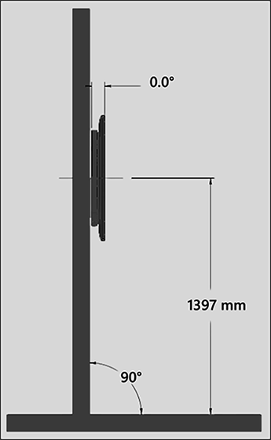
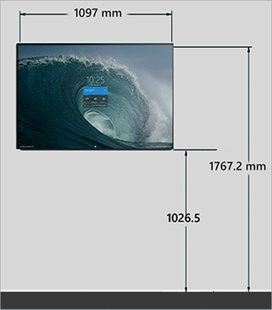
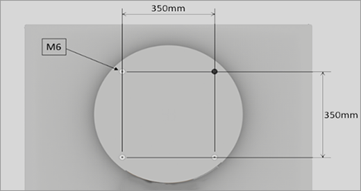
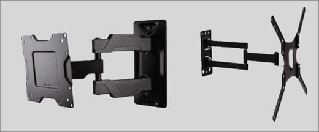

# Install and mount Surface Hub 2S

## Certified Steelcase solution

You can mount Surface Hub 2S with the certified wall mount or the certified mobile stand, both developed in partnership with Steelcase. Both fully integrate with the design of Surface Hub 2S, enabling unimpeded access to the compute cartridge along with all I/O ports and power. For more information, see [Steelcase Roam specifications](https://www.steelcase.com/content/uploads/2019/05/Steelcase-Roam-Spec-Guide.pdf). 

## Customized solution

As an alternative, you can customize your own mounting solution. This section includes information to help you install and mount Surface Hub 2S and is for customers not using third party mounting features.

The recommended wall mount configuration is shown in the following table and figures.

| Item | Measurement |
| ---- | ----------- |
| **Device dimensions** | 741 mm x 1097 mm x 76 mm (29.2" x 43.2" x 3.0”) |
| **Recommended height from top of device** | 1767.2 mm (69.57”) |
| **Recommended height from center of mount** | 1397 mm (55”) |
| **Recommended height from bottom  of device** | 1026.5 mm (40.41”) |

   

   

## Mounting hardware

To optimize the rotational capabilities, Surface Hub 2S uses a 350 mm x 350 mm mounting framework that meets most of the criteria listed in the VESA Flat Display Mounting Interface Standard. Still, Surface Hub 2S is readily mounted with any of various off-the-shelf display brackets, designed with the flexibility to accommodate displays that diverge from exact VESA specifications, as shown below.

On Hub 2S, a square pattern of four M6 x 1.0 threaded holes is centered on the circular bump that measures 565 mm in diameter, as shown in the figure below. The pattern is 350 mm between centers. The hardware specified for mounting consists of a set of four M6 x 1.0–12 mm long metric bolts. Longer bolts may be used up to 20 mm max.

  

### Mounting methods compatible with Surface Hub 2S

Rail type mounts consisting of a rail attached to the wall and two mounts attached to the display are recommended. As shown in the figure below, the mounts hook over the rail and affix the display to the wall securely. The mounts typically have multiple holes and a set of slots, allowing the mounts to be compatible with a wide variety of displays. Most of these mounts are compatible with Surface Hub 2.

 

Plate-type wall mounts, as shown in the figure below, may work if they have holes that match the 350 x 350-mm pattern. Note that plate-type wall mounts may lack the stiffness required to provide the desired touch experience quality for Hub 2S.

 

## Important considerations for mounting Surface Hub 2S

Ensure that your mounting solution meets the following criteria:

- **Strength:** Only choose mounts that can safely support devices of at least 28 kg (62 lbs).
- **Stiffness:** Avoid flexible display mounts that can diminish the interactive pen and touch use experience. Most TV mounts are not designed to support touch displays.
- **Depth:** Keep the device mounted tightly to the wall especially in corridors and along circulation paths within rooms,
- **Access:** Ensure unimpeded access to input/output ports, the compute cartridge. 
- **Air flow:** Avoid blocking inlet and outlet air vents. 
- **Audio:** Avoid poorly designed mounts that may cause a buzz or a rattle sound when using the speakers at high volume.
- **Upgrade compatible:** Surface Hub 2S ships in a standard landscape mode and is capable of rotating to portrait mode if upgraded to Surface Hub 2X (by replacing the modular cartridge). Ensure that any mounting solution can accommodate the device in both landscape and portrait mode (no wider than 741 mm.)