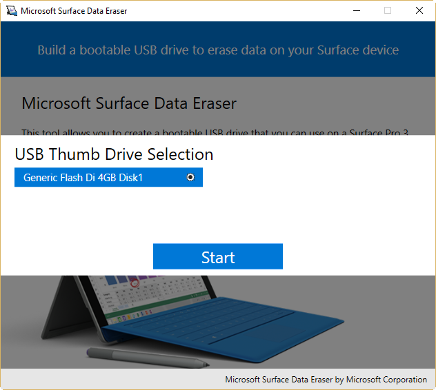
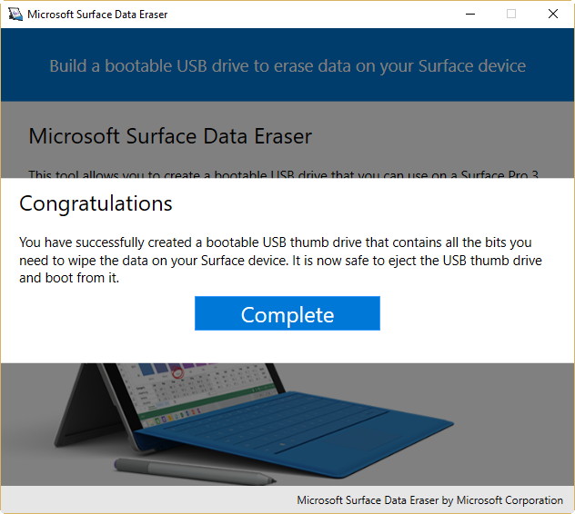
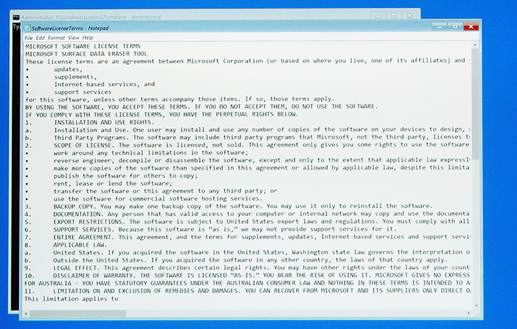
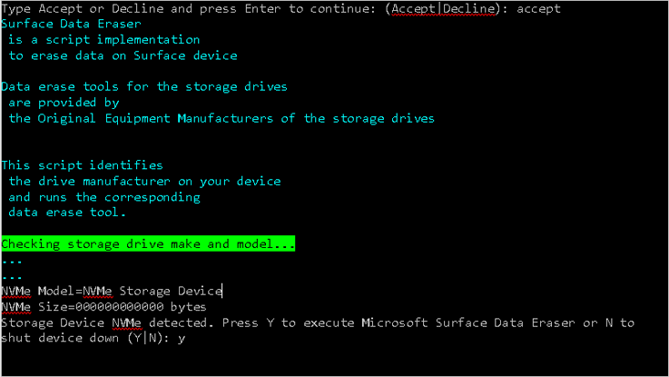

# Microsoft Surface Data Eraser

Find out how the Microsoft Surface Data Eraser tool can help you securely wipe data from your Surface devices.

[Microsoft Surface Data Eraser](https://www.microsoft.com/download/details.aspx?id=46703) is a tool that boots from a USB stick and allows you to perform a secure wipe of all data from a compatible Surface device. A Microsoft Surface Data Eraser USB stick requires only the ability to boot from USB. The USB tool is easy to create by using the provided wizard, the Microsoft Surface Data Eraser Wrapper, and is easy to use with a simple graphic interface, no command line needed. To learn more about the data wiping capabilities and practices Microsoft uses during the service process for Surface, see [Protecting your data if you send your Surface in for service](https://www.microsoft.com/surface/support/security-sign-in-and-accounts/data-wiping-policy).

Compatible Surface devices include:

-   Surface Book

-   Surface Pro 4

-   Surface Pro3

-   Surface 3

-   Surface 3 LTE

-   Surface Pro 2

Some scenarios where Microsoft Surface Data Eraser can be helpful include:

-   Prepare a Surface device to be sent for repair

-   Decommission a Surface device to be removed from corporate or organizational use

-   Repurpose a Surface device for use in a new department or for use by a new user

-   Standard practice when performing reimaging for devices used with sensitive data

>**Note:**&nbsp;&nbsp;Third-party devices, Surface devices running Windows RT (including Surface and Surface 2), and Surface Pro are not compatible with Microsoft Surface Data Eraser.

>**Note:**&nbsp;&nbsp;Because the ability to boot to USB is required to run Microsoft Surface Data Eraser, if the device is not configured to boot from USB or if the device is unable to boot or POST successfully, the Microsoft Surface Data Eraser tool will not function.

## How to create a Microsoft Surface Data Eraser USB stick

To create a Microsoft Surface Data Eraser USB stick, first install the Microsoft Surface Data Eraser setup tool from the Microsoft Download Center using the link provided at the beginning of this article. You do not need a Surface device to *create* the USB stick. After you have downloaded the installation file to your computer, follow these steps to install the Microsoft Surface Data Eraser creation tool:

1.  Run the DataEraserSetup.msi installation file that you downloaded from the Microsoft Download Center.

2.  Select the check box to accept the terms of the license agreement, and then click **Install**.

3.  Click **Finish** to close the Microsoft Surface Data Eraser setup window.

After the creation tool is installed, follow these steps to create a Microsoft Surface Data Eraser USB stick. Before you begin these steps, ensure that you have a USB 3.0 stick that is 4 GB or larger connected to the computer.

1.  Start Microsoft Surface Data Eraser from the Start menu or Start screen.

2.  Click **Build** to begin the Microsoft Surface Data Eraser USB creation process.

3.  Click **Start** to acknowledge that you have a USB stick of at least 4 GB connected, as shown in Figure 1.

    

    *Figure 1. Start the Microsoft Surface Data Eraser tool*

4.  Select the USB drive of your choice from the **USB Thumb Drive Selection** page as shown in Figure 2, and then click **Start** to begin the USB creation process. The drive you select will be formatted and any existing data on this drive will be lost.
  >**Note:**&nbsp;&nbsp;If the Start button is disabled, check that your removable drive has a total capacity of at least 4 GB.
  
    

    *Figure 2. USB thumb drive selection*

5.  After the creation process is finished, the USB drive has been formatted and all binaries are copied to the USB drive. Click **Success**.

6.  When the **Congratulations** screen is displayed, you can eject and remove the thumb drive. This thumb drive is now ready to be inserted into a Surface device, booted from, and wipe any data on the device. Click **Complete** to finish the USB creation process, as shown in Figure 3.

    

    *Figure 3. Complete the Microsoft Surface Data Eraser USB creation process*

7.  Click **X** to close Microsoft Surface Data Eraser.

## How to use a Microsoft Surface Data Eraser USB stick

After you create a Microsoft Surface Data Eraser USB stick, you can boot a supported Surface device from the USB stick by following this procedure:

1.  Insert the bootable Microsoft Surface Data Eraser USB stick into the supported Surface device.

2.  Ensure your system firmware is set to boot to USB. To enter the firmware settings:

    1.  Turn off your Surface device.

    2.  Press and hold the **Volume Up** button.

    3.  Press and release the **Power** button.

    4.  Release the **Volume Up** button.

3.  When the Surface device boots, a **SoftwareLicenseTerms** text file is displayed.

    

    *Figure 4. Booting the Microsoft Surface Data Eraser USB stick*

4.  Read the software license terms, and then close the notepad file.

5.  Accept or Decline the Software License Terms by typing **Accept** or **Decline**.

6.  Select one of the following three options:

    -   **Enter S to start Data Erase** – Select this option to begin the data erase process. You will have a chance to confirm in the next step.

    -   **Enter D to perform Diskpart** – Select this option to use diskpart.exe to manage partitions on your disk.

    -   **Enter X to shut device down** – Select this option to perform no action and shut down the device.

7.  If you typed **S** to begin the data erase process, the partition that will be erased is displayed, as shown in Figure 5. If this is correct, press **Y** to continue, or **N** to shut down the device.

    

    *Figure 5. Partition to be erased is displayed in Microsoft Surface Data Eraser*

8.  If you pressed **Y** in step 7, due to the destructive nature of the data erasure process, an additional dialog box is displayed to confirm your choice.

9.  Click the **Yes** button to continue erasing data on the Surface device.

 

 

