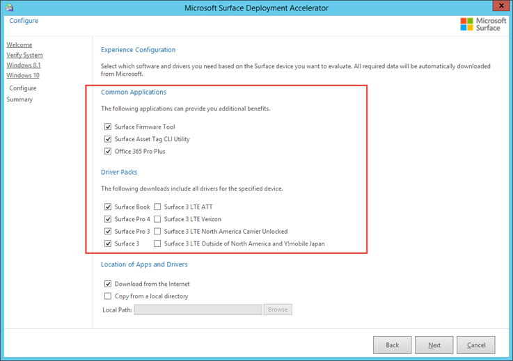
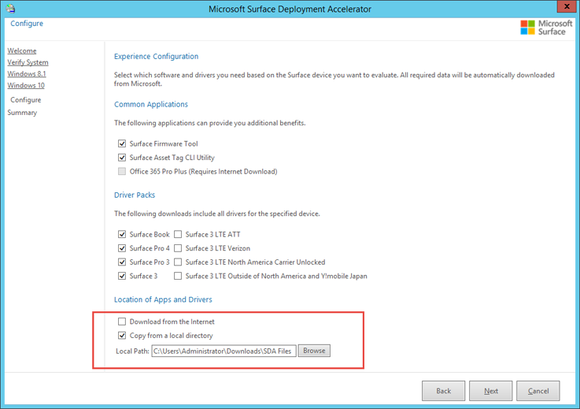

# Microsoft Surface Deployment Accelerator

Microsoft Surface Deployment Accelerator (SDA) provides a quick and simple deployment mechanism for organizations to reimage Surface devices.

SDA includes a wizard that automates the creation and configuration of a Microsoft recommended deployment experience by using free Microsoft deployment tools. The resulting deployment solution is complete with everything you need to immediately begin the deployment of Windows to a Surface device. You can also use SDA to create and capture a Windows reference image and then deploy it with the latest Windows updates.

SDA is built on the powerful suite of deployment tools available from Microsoft including the Windows Assessment and Deployment Kit (ADK), the Microsoft Deployment Toolkit (MDT), and Windows Deployment Services (WDS). The resulting deployment share encompasses the recommended best practices for managing drivers during deployment and automating image creation and can serve as a starting point upon which you build your own customized deployment solution.

You can find more information about how to deploy to Surface devices, including step-by-step walkthroughs of customized deployment solution implementation, on the Deploy page of the [Surface TechCenter](https://technet.microsoft.com/windows/dn913725).

**Download Microsoft Surface Deployment Accelerator**

You can download the installation files for SDA from the Microsoft Download Center. To download the installation files:

1.  Go to the [Surface Tools for IT](https://www.microsoft.com/download/details.aspx?id=46703) page on the Microsoft Download Center.

2.  Click the **Download** button, select the **Surface\_Deployment\_Accelerator\_xxxx.msi** file, and then click **Next**.

## Microsoft Surface Deployment Accelerator prerequisites

Before you install SDA, your environment must meet the following prerequisites:

-   SDA must be installed on Windows Server 2012 R2 or later

-   PowerShell Script Execution Policy must be set to **Unrestricted**

-   DHCP and DNS must be enabled on the network where the Windows Server 2012 R2 environment is connected

-   To download Surface drivers and apps automatically the Windows Server 2012 R2 environment must have Internet access and Internet Explorer Enhanced Security Configuration must be disabled

-   To support network boot, the Windows Server 2012 R2 environment must have Windows Deployment Services installed and configured to respond to PXE requests

-   Access to Windows source files or installation media is required when you prepare a deployment with SDA

-   At least 6 GB of free space for each version of Windows you intend to deploy

## How Microsoft Surface Deployment Accelerator works

As you progress through the SDA wizard, you will be asked some basic questions about how your deployment solution should be configured. As you select the desired Surface models to be supported and apps to be installed (see Figure 1), the wizard will prepare scripts that download, install, and configure everything needed to perform a complete deployment and capture of a reference image. By using the network boot (PXE) capabilities of Windows Deployment Services (WDS), the resulting solution enables you to boot a Surface device from the network and perform a clean deployment of Windows.

*Figure 1. Select desired apps and drivers*

When the SDA completes, you can use the deployment share to deploy over the network immediately. Simply boot your Surface device from the network using a Surface Ethernet Adapter and select the Surface deployment share you created with the SDA wizard. Select the **1- Deploy Microsoft Surface** task sequence and the wizard will walk you through an automated deployment of Windows to your Surface device.

You can modify the task sequence in the MDT Deployment Workbench to [include your own apps](https://technet.microsoft.com/itpro/windows/deploy/deploy-a-windows-10-image-using-mdt#sec04), or to [pause the automated installation routine](https://blogs.technet.microsoft.com/mniehaus/2009/06/26/mdt-2010-new-feature-3-suspend-and-resume-a-lite-touch-task-sequence/). While the installation is paused, you can make changes to customize your reference image. After the image is captured, you can configure a deployment task sequence and distribute this custom configuration by using the same network boot capabilities as before.

>[!NOTE]
>With SDA v1.9.0258, Surface Pro 3, Surface Pro 4, and Surface Book are supported for Windows 10 deployment, and Surface Pro 3 is supported for Windows 8.1 deployment.

 

## Use Microsoft Surface Deployment Accelerator without an Internet connection

For environments where the SDA server will not be able to connect to the Internet, the required Surface files can be downloaded separately. To specify a local source for Surface driver and app files, select the **Copy from a local directory** option and specify the location of your downloaded files (see Figure 2). All of the driver and app files for your selected choices must be placed in the specified folder.

*Figure 2. Specify a local source for Surface driver and app files*

You can find a full list of available driver downloads at [Download the latest firmware and drivers for Surface devices](deploy-the-latest-firmware-and-drivers-for-surface-devices.md)

>[!NOTE]
>Downloaded files do not need to be extracted. The downloaded files can be left as .zip files as long as they are stored in one folder.

>[!NOTE]
>Using files from a local directory is not supported when including Office 365 in your deployment share. To include Office 365 in your deployment share, select the **Download from the Internet** check box. 

## Changes and updates

SDA is periodically updated by Microsoft. For instructions on how these features are used, see [Step-by-Step: Microsoft Surface Deployment Accelerator](https://technet.microsoft.com/itpro/surface/step-by-step-surface-deployment-accelerator).

>[!NOTE]
>To install a newer version of SDA on a server with a previous version of SDA installed, you only need to run the installation file for the new version of SDA. The installer will handle the upgrade process automatically. If you used SDA to create a deployment share prior to the upgrade and want to use new features of the new version of SDA, you will need to create a new deployment share. SDA does not support upgrades of an existing deployment share.

### Version 2.0.8.0
This version of SDA supports deployment of the following:
* Surface Pro

>[!NOTE]
>SDA version 2.0.8.0 includes support only for Surface Pro, and does not support other Surface devices such as Surface Pro 4 or Surface Book. To deploy these devices, please continue to use SDA version 1.96.0405.
 
### Version 1.96.0405
This version of SDA adds support for the following:
* Microsoft Deployment Toolkit (MDT) 2013 Update 2
* Office 365 Click-to-Run
* Surface 3 and Surface 3 LTE
* Reduced Windows Assessment and Deployment Kit (Windows ADK) footprint, only the following Windows ADK components are installed:
  * Deployment tools
  * Windows Preinstallation Environment (WinPE)
  * User State Migration Tool (USMT)

### Version 1.90.0258
This version of SDA adds support for the following:
* Surface Book
* Surface Pro 4
* Windows 10

### Version 1.90.0000
This version of SDA adds support for the following:
* Local driver and app files can be used to create a deployment share without access to the Internet

### Version 1.70.0000
This version is the original release of SDA. This version of SDA includes support for:
* MDT 2013 Update 1
* Windows ADK
* Surface Pro 3
* Windows 8.1

## Related topics

[Step by step: Surface Deployment Accelerator](step-by-step-surface-deployment-accelerator.md)

[Using the Surface Deployment Accelerator deployment share](using-the-sda-deployment-share.md)

