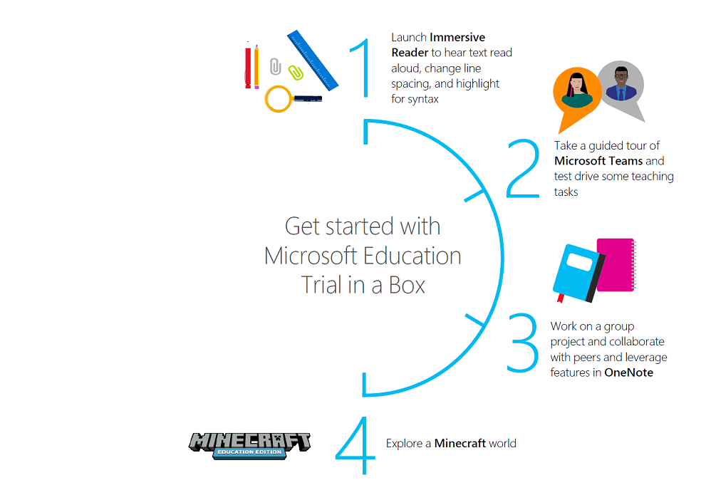

# Get started for Educators
Hello, Teachers! In this guide we'll show you how you can quickly and easily try out a few transformational tools in Microsoft Education.

## Explore these four tools in Microsoft Education

1. [Microsoft Learning Tools](#1-microsoft-learning-tools)
2. [Microsoft Teams](#2-microsoft-teams)
3. [OneNote](#3-onenote)
4. [Minecraft: Education Edition](#4-minecraft-education-edition)

## 1. Microsoft Learning Tools
Learning Tools is a set of features available in Word, OneNote, and the Edge browser that helps:
* Increase fluency for English language learners
* Build confidence for emerging readers
* Provides text decoding solutions for students with learning differences such as dyslexia 

See how Microsoft Learning Tools change lives.
 
<iframe width="420" height="236" src="https://www.youtube-nocookie.com/embed/nt3hz2vVf8c?rel=0" frameborder="0" allowfullscreen></iframe>

**Try this!** Launch Immersive Reader directly from "Learning design thinking from the ancient Egyptians" in Word Online. Hear text read aloud, change the spacing of lines, and highlight for syntax.

1. Select "Learning design thinking from the ancient Egyptians" to open it in Word Online.  
2. Select the **View** tab, then **Immersive Reader**. Immersive Reader will launch into a full-screen experience.

  

3. Select these different settings to see what they do:

  | Text to Speech | Text Preferences | Grammar Options | Line Focus |
  | :------------: | :--------------: | :-------------: | :--------: |
  |  |  |  |  |

## 2. Microsoft Teams
Microsoft Teams is a digital hub that brings conversations, content, and apps together in one place. Throughhis guided tour walks you through the essential teaching features of the app. Then, through interactive prompts, experience how you can use this tool in your own classroom to spark classroom digital discussions, respond to student questions, organize content, and more!  

See how Microsoft Teams for Education works in the classroom.
 
<iframe width="420" height="236" src="https://www.youtube-nocookie.com/embed/N7uiMs4dPcg?rel=0" frameborder="0" allowfullscreen></iframe>

**Try this!** Take a guided tour of Microsoft Teams and test drive some teaching tasks. 

1. Open your browser and visit <a href="https://aka.ms/EduTeamsWalkthrough" target="_blank">https://aka.ms/EduTeamsWalkthrough</a>.
2. Sign in using these credentials:
  - User: MSFT
  - Password: onStage!
3. Follow along with the guide.

## 3. OneNote
Watch how OneNote allows teachers to differentiate instruction to allow for collaboration.
 
<iframe width="420" height="236" src="https://www.youtube-nocookie.com/embed/hMmRud4B54o?rel=0" frameborder="0" allowfullscreen></iframe>

OneNote acts as an unlimited digital canvas for the whole class to store text, images, handwritten drawings, attachments, links, voice, video, and more. See how a group project comes together with opportunities to interact with other students, multimedia, and sophisticated drawing tools. This one works best with your digital pen! 

**Try this!** See how a group project, “Reimagine the Great Pyramids of Giza,” comes together with opportunities to interact with other studentscollaborate with peers and leverage multiple features.  

1. Open the Windows **Start** menu  and select the OneNote for Windows 10 app. 
2. OneNote will automatically open to the **Reimagine the Great Pyramid of Giza** lesson page inside the 21st Century Learning notebook. 
3. Follow the instructions for the project.  Look for the **Try this!** call-outs to experiment with these engaging features: 
  - Discover the power of digital ink by selecting the Draw tab. Choose your pen and get scribbling.

    

  - Type anywhere on the page! Just click your cursor where you want to place text. 
  - Use the checkmark to keep track of completed tasks. 

    

  - The Researcher tool from the Insert tab can help find answers. 

    

## 4. Minecraft: Education Edition
Learn about Code Builder for Minecraft: Education Edition.
 
<iframe width="420" height="236" src="https://www.youtube-nocookie.com/embed/3rKuSlgqePo?rel=0" frameborder="0" allowfullscreen></iframe>

Minecraft: Education Edition is an open-world game that promotes creativity, collaboration, and problem-solving in an immersive environment where the only limit is your imagination.   

**Try this!** Explore a Minecraft world

1. First, connect the included mouse to your computer. Minecraft: Education Edition operates best with a mouse.
2. Open your browser and visit <a href="https://aka.ms/lessonhub" target="_blank">https://aka.ms/lessonhub</a>.
3. Scroll down to the **Details** section and select **Download World**.

  

4. When prompted, save the world.
5. Double click on the world to launch it in Minecraft: Education Edition.
6. Once inside the world, use the guide to walk around and click on the different subject area examples to learn more about teaching and learning with Minecraft: Education Edition. 

  To visit a specific subject area section, right click on the button under the name of that subject area. Remember that the mouse works as your “eyes” in the game. Simply move your mouse around to look around the world. Use the Minecraft Controls key included below to walk forwards, backwards, left, and right in the game. Explore and have fun!

  

Stay in touch with us through our site at <a href="https://education.minecraft.net" target="_blank">https://education.minecraft.net</a> and follow @playcraftlearn on Twitter to keep up with our community news!

## Get more info
[Education help center](https://support.office.com/en-us/education) 
[Microsoft Education Trial in a Box](index.md)