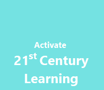
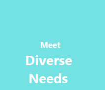
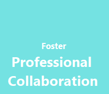

# Get started for Educators
Whether you’re  
- Ready to activate **21st century learning** and prepare your students for the future   
- Galvanized to **meet the diverse needs of your learners**
- Fostering effective **professional collaboration** with your staff or 
- Hoping to inspire **innovation** in STEM and beyond  
our tools will help you navigate the amazing journey that is education. 
 
Using Microsoft 365 Education hardware, software, and apps, jump right in with **Try this!** activities.  
 
Follow along here for step-by-step directions and visit [https://aka.ms/m365edutrial](https://aka.ms/m365edutrial) for more demonstrations and support.

Sample the ways Microsoft 365 Education and your Windows 10 S device meet your instructional goals.

| Set your priority | Choose your point of entry |
|-------------------|----------------------------|
|  | **With Microsoft Teams**, students collaborate and contribute to real-time discussion. [Try this!](#microsoft-teams)&nbsp;&nbsp;&nbsp;&nbsp;[Watch this!](https://youtu.be/N7uiMs4dPcg) **With OneNote**, students experience the power of inking and media-rich projects. [Try this!](#onenote)  **With Microsoft Teams**, students practice digital citizenship in a safe environment. |
|  | **With Microsoft Learning Tools**, students are supported in their literacy development. [Try this!](#learning-tools)&nbsp;&nbsp;&nbsp;&nbsp;[Watch this!](https://www.youtube.com/watch?v=3Ztr44aKmQ8&feature=youtu.be) **With Microsoft Translator**, teachers offer real-time translation for students and parents. [Watch this!](https://youtu.be/16yAGeP2FuM) **With Ink to Math in OneNote**, students bring mathematical solutions to life. |
|  | **With Microsoft Forms**, teachers collect, share, and visualize data easily. [Try this!](#microsoft-forms)  **With Microsoft Teams**, teachers optimize collaboration across departments and schools. [Watch this!](https://youtu.be/N7uiMs4dPcg)  **With OneNote Staff Notebook**, school leaders and teachers coordinate observations and communicate school-wide initiatives |
|  | **With Minecraft: Education Edition**, students code, create, and visualize new worlds. [Try this!](#minecraft--education-edition)&nbsp;&nbsp;&nbsp;&nbsp;[Watch this!](https://youtu.be/3rKuSlgqePo) **With 3D Modeling**, students create engaging visual prototypes. [Try this!](#3d-modeling)&nbsp;&nbsp;&nbsp;&nbsp;[Watch this!](https://support.microsoft.com/en-us/help/4014938)  **With Hacking STEM**, teachers build affordable inquiry-based activities to visualize data. [Watch this!](https://youtu.be/xpbrdb2NYsI) |

## Microsoft Teams
**With Microsoft Teams**, students collaborate in real-time.

**Try this!** Take a guided tour of Microsoft Teams and test drive some teaching tasks. 
 
Microsoft Teams is a digital hub that brings conversations, content, and apps together in one place. This guided tour walks you through the essential teaching features of the app. Then, through interactive prompts, experience how you can use this tool in your own classroom to spark classroom discussion, respond to student questions, organize content, and more!  
 
**Directions:** 

1. Open your browser and visit <a href="http://teams-edustart.stagingk.1000heads.net/" target="_blank">http://teams-edustart.stagingk.1000heads.net/</a>.
2. Sign in using these credentials:
  - User: MSFT
  - Password: onStage!
3. Follow along with the guide.

## Learning tools
**With Microsoft Learning Tools**, students are supported in their literacy development. 

**Try this!** Use Immersive Reader to read “Learning design thinking from the ancient Egyptians” in Word Online. 
 
Learning Tools is a set of features available in Word, OneNote, and the Edge browser that helps increase fluency for English language learners, build confidence for emerging readers, and offer text decoding solutions for students with learning differences such as dyslexia. In this activity, launch Immersive Reader directly from a document to enter a full-screen reading mode and explore options to hear text read aloud, change the spacing on lines, and highlight for syntax. 
 
**Directions:**

1. Select Learning design thinking from the ancient Egyptians to open it in Word Online.  
2. Select the **View** tab, then **Immersive Reader**. Immersive Reader will launch into a full-screen experience.

3. Select these different settings to see what they do:
  - Text to Speech
  - Text Preferences
  - Grammar options
  - Line Focus

## OneNote
**With OneNote**, students experience the power of inking and media-rich projects.  
 
**Try this!** Reimagine the Great Pyramids of Giza 
 
OneNote acts as an unlimited digital canvas for the whole class to store text, images, handwritten drawings, attachments, links, voice, video, and more. See how a group project comes together with opportunities to interact with other students, multimedia, and sophisticated drawing tools. This one works best with your digital pen! 

**Directions:**

1. Open the Windows **Start** menu  and select the OneNote for Windows 10 app. 
2. OneNote will automatically open to the **Reimagine the Great Pyramid of Giza** lesson page inside the 21st Century Learning notebook. 
3. Follow the instructions for the project.  Look for the Try this! call-outs to experiment with these engaging features: 
  - Discover the power of digital ink by selecting the Draw tab. Choose your pen and get scribbling.
  - Type anywhere on the page! Just click your cursor where you want to place text. 
  - Use the checkmark to keep track of completed tasks. 
  - The Researcher tool from the Insert tab can help find answers. 

## Microsoft Forms
**With Forms**, teachers collect, share, and visualize data easily.  
 
**Try this!** Create a Response to Intervention Observation Tool to share with colleagues.  
 
Many educators have already experienced the power of using Microsoft Forms to create quizzes to assess student progress and get real-time feedback.  
Forms isn't just about quizzes, though — it's also a powerful tool for collecting and disseminating relevant information across a school community, from teachers and school staff to students and their families.  This kind of measurable support can lead to greater student success, especially when it's in a nimble solution that helps them quickly and securely track student data.   
See below for an example of a Response to Intervention a school might use to identify an area of support for a student, supports provided to that student, and what might be the next steps for a team supporting this student.  
 
[INSERT HIGH RES IMAGE of example RTI FORM] Schools can easily collect and share Response to Intervention Observation Forms across teachers and share relevant outcomes to a student’s family during important meetings.  
 
**Directions:**

1. From your Office 365 App Launcher, select **Forms**. Or in your web browser, navigate to <a href="https://forms.microsoft.com" target="_blank">https://forms.microsoft.com</a>.
2. Under **My Forms**, click **New Form** to begin creating your data collection tool.
3. Once your new form appears, replace *Untitled form* with a title that relates to your topic, such as *Response to Intervention Observation Tool*. You can also enter an optional description to offer important reminders to key stakeholders.  
4. Select the **Add question** button.  When prompted to make the question choice, select **Date**. In the text field, add a prompt such as: *Enter date of observation*
5. To ensure this prompt is completed by the observer, move the toggle in the question field to **Required**.
6. Select **Add question** button and select **Text**.  In the text field, add the prompt: *Enter the student’s first and last name*.  Because this answer to this question is essential data, ensure that you have selected **Required**.
7. Continue to add essential questions that may address time of day, period, teacher names, and more. 
8. Other important data points that some schools choose to observe: 
  - Peer-to-peer interactions 
  - Intellectual persistence 
  - Task completion 
  - Participation in school day activities 
  - Unstructured play  
  - Retention of concepts or skills 
9. To create a question which requires multiple answers, select **Add question**. Then select the multiple-choice option. Within the question field, move the toggle for multiple answers. 
10. When you have completed all questions, click **Preview** at the top of the design window to see how your form looks on a computer or mobile device. To test your form, enter answers for the questions in preview mode and then click **Submit**. 
11. Once complete, share the form with staff members responsible for observing and collecting data.   
12. There are four options for sending and collecting responses: 
  - Copy a link 
  - Send a QR code 
  - Embed the form to a web page 
  - Send the form link in an email 

## Minecraft: Education Edition
**With Minecraft: Education Edition**, students code, create, and visualize new worlds. 
  
**Try this!** Explore a Minecraft world 
 
Minecraft: Education Edition is an open-world game that promotes creativity, collaboration, and problem-solving in an immersive environment where the only limit is your imagination. This brief introduction to a Minecraft: Education Edition world reveals the myriad ways you can use Minecraft to teach core subject area concepts ranging from fractions to elements of storytelling.  

**Directions:**

1. Open your browser and visit <a href="https://aka.ms/lessonhub" target="_blank">https://aka.ms/lessonhub</a>.
2. Scroll down to the **Details** section and select **Download World**.

  

3. When prompted, save the world.
4. Double click on the world to launch it in Minecraft: Education Edition.
5. Once inside the world, use the guide to walk around and click on the different subject area examples to learn more about teaching and learning with Minecraft: Education Edition. 

  To visit a specific subject area section, right click on the button under the name of that subject area. Remember that the mouse works as your “eyes” in the game. Simply move your mouse around to take a look around the world. Use the Minecraft Controls key included below to walk forwards, backwards, left, and right in the game. Explore and have fun!

  

Stay in touch with us through our site at <a href="https://education.minecraft.net" target="_blank">https://education.minecraft.net</a> and follow @playcraftlearn on Twitter to keep up with our community news!

## 3D Modeling
**With 3D Modeling**, students create visual prototypes. 
 
**Try this!** Enhance existing PowerPoint presentations with 3D images from Remix 3D 
 
Remix 3D is not only an online catalog with a large collection of free 3D models to choose from, it's also a community where you can upload, collect, and share if you like, your own 3D images.  
 
**Directions:**

1. From [SPECIFY EXACT LOCATION], open the PowerPoint presentation, *Resourceful Creation: Learning Design Thinking from the Egyptians*. 
2. Navigate to slide 4, where you can practice adding a 3D Model. 
3. From the **Insert** tab, select the 3D Models dropdown and select **From Online Sources**.
4. In the dialog box that appears you can search for 3D images from the catalog at Remix 3D. 
5. Select one, or more, images and click **Insert**. 
6. The 3D object will appear on your slide. Selecting the model will make an icon appear in the middle of the object. Selecting and holding on this icon will allow you to drag and change the angle of the object.

**EXTRA CREDIT!  Create your own 3D image**

**Task:** Construct your own simple 3D prototype of a pyramid in Microsoft Paint 3D 
 
**Background:** Bring classrooms diagrams and illustrations to life with 3D images that you can draw on, move, and manipulate to view from different angles. After creating your 3D prototype, you and your students can enter virtual reality yourselves and interact with your object in the Mixed Reality Viewer app—try it out! 

**Directions:**

1. Navigate to the Start menu and open **Paint 3D**. 
2. Select the **New** tile, then the **3D shapes** tab. 
3. Select the Pyramid shape in the menu on your right. 
4. Click and drag your mouse on the blank canvas to create a pyramid shape in the size you want. 
5. Selecting the shape after you’ve created it and use the circle controls to rotate and push or pull the object. Select a corner of the square surrounding your object to resize it. 
6. While your object is selected, you can also select the **Edit color** button to change the object’s color or the **Brushes** tab in the toolbar to add drawing and texture. To draw on all sides of the 3D object, use the rotation buttons. 
7. View your object in mixed reality by selecting **Menu**, then **View in mixed reality**.  
8. Export and save your file in order to drop it into other apps such as a PowerPoint slide. 

## Get more info
[Microsoft 365 Education Trial in a Box](index.md)