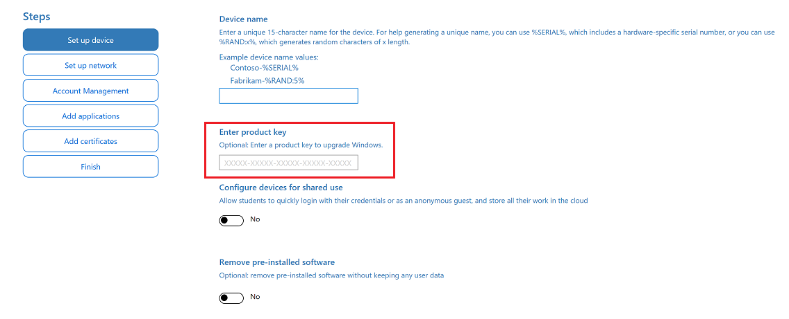
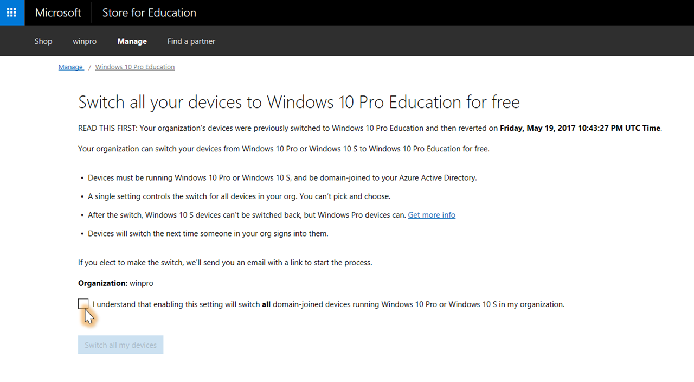
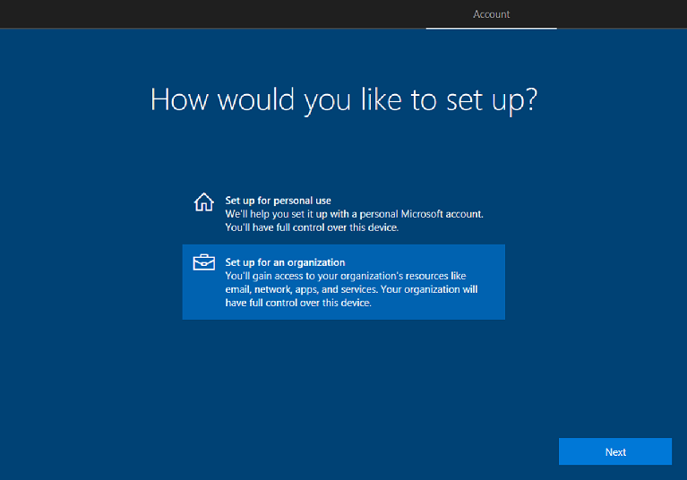
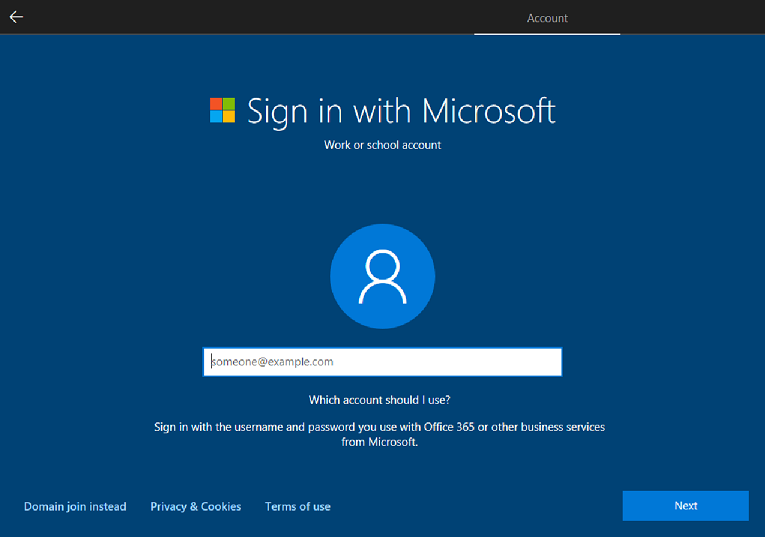
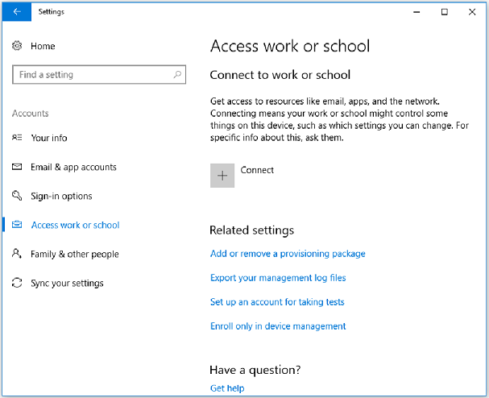
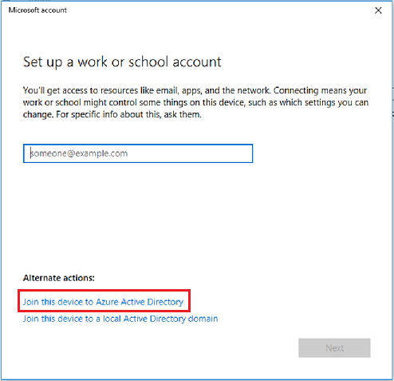
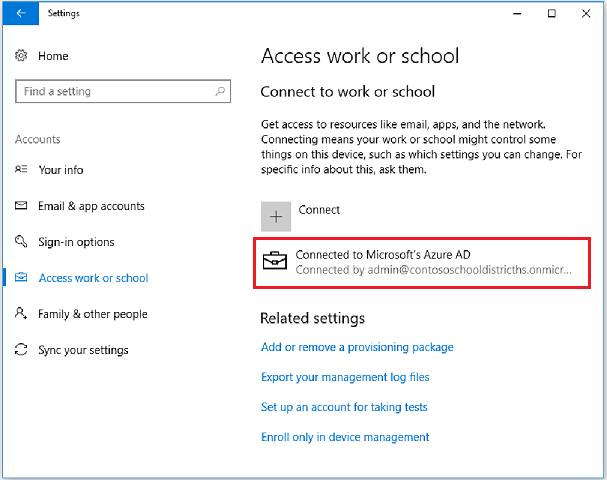
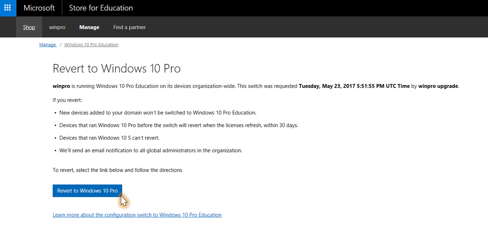
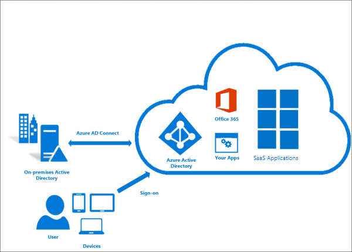

# Change to Windows 10 Pro Education from Windows 10 Pro
Windows 10 Pro Education is a new offering in Windows 10, version 1607. This edition builds on the commercial version of Windows 10 Pro and provides important management controls needed in schools by providing education-specific default settings.

If you have an education tenant and use devices with Windows 10 Pro, global administrators can opt-in to a free change to Windows 10 Pro Education depending on your scenario.
- [Switch to Windows 10 Pro Education in S mode from Windows 10 Pro in S mode](https://docs.microsoft.com/education/windows/s-mode-switch-to-edu)

To take advantage of this offering, make sure you meet the [requirements for changing](#requirements-for-changing). For academic customers who are eligible to change to Windows 10 Pro Education, but are unable to use the above methods, contact Microsoft Support for assistance.

>[!IMPORTANT]
>If you change a Windows 10 Pro device to Windows 10 Pro Education using Microsoft Store for Education, [subscription activation](https://docs.microsoft.com/windows/deployment/windows-10-subscription-activation) won't work.

## Requirements for changing
Before you change to Windows 10 Pro Education, make sure you meet these requirements:
- Devices must be running Windows 10 Pro, version 1607 or higher.
- Devices must be Azure Active Directory joined, or domain joined with Azure AD Connect. Customers who are federated with Azure AD are also eligible. For more information, see [Review requirements on devices](#review-requirements-on-devices).

    If you haven't domain joined your devices already, [prepare for deployment of Windows 10 Pro Education licenses](#preparing-for-deployment-of-windows-10-pro-education-licenses).

- The Azure AD tenant must be recognized as an education approved tenant.
- You must have a Microsoft Store for Education account.
- The user making the changes must be a member of the Azure AD global administrator group.

## Compare Windows 10 Pro and Pro Education editions
You can [compare Windows 10 Editions](https://www.microsoft.com/en-us/WindowsForBusiness/Compare) to find out more about the features we support in other editions of Windows 10.

For more info about Windows 10 default settings and recommendations for education customers, see [Windows 10 configuration recommendations for education customers](configure-windows-for-education.md).

## Change from Windows 10 Pro to Windows 10 Pro Education

For schools that want to standardize all their Windows 10 Pro devices to Windows 10 Pro Education, a global admin for the school can opt-in to a free change through the Microsoft Store for Education.

In this scenario:

- The IT admin of the tenant chooses to turn on the change for all Azure AD joined devices.
- Any device that joins the Azure AD will change automatically to Windows 10 Pro Education.
- The IT admin has the option to automatically roll back to Windows 10 Pro, if desired. See [Roll back Windows 10 Pro Education to Windows 10 Pro](#roll-back-windows-10-pro-education-to-windows-10-pro).

See [change using Microsoft Store for Education](#change-using-microsoft-store-for-education) for details on how to do this.

### Change using Intune for Education

1. In Intune for Education, select **Groups** and then choose the group that you want to apply the MAK license key to. 

    For example, to apply the change for all teachers, select **All Teachers** and then select **Settings**.
    
2. In the settings page, find **Edition upgrade** and then:
    1. Select the edition in the **Edition to upgrade to** field
    2. Enter the MAK license key in the **Product key** field 
   
        **Figure 1** - Enter the details for the Windows edition change

        

3. The change will automatically be applied to the group you selected.


### Change using Windows Configuration Designer
You can use Windows Configuration Designer to create a provisioning package that you can use to change the Windows edition for your device(s). [Install Windows Configuration Designer from the Microsoft Store](https://www.microsoft.com/store/apps/9nblggh4tx22) to create a provisioning package.

1. In Windows Configuration Designer, select **Provision desktop devices** to open the simple editor and create a provisioning package for Windows desktop editions.
2. In the **Set up device** page, enter the MAK license key in the **Enter product key** field to change to Windows 10 Pro Education.

    **Figure 2** - Enter the license key 

    

3. Complete the rest of the process for creating a provisioning package and then apply the package to the devices you want to change to Windows 10 Pro Education.

    For more information about using Windows Configuration Designer, see [Set up student PCs to join domain](https://technet.microsoft.com/edu/windows/set-up-students-pcs-to-join-domain). 


### Change using the Activation page

1. On the Windows device that you want to change, open the **Settings** app.
2. Select **Update & security** > **Activation**, and then click **Change product key**.
3. In the **Enter a product key** window, enter the MAK key for Windows 10 Pro Education and click **Next**.


## Education customers with Azure AD joined devices

Academic institutions can easily move from Windows 10 Pro to Windows 10 Pro Education without using activation keys or reboots. When one of your users enters their Azure AD credentials associated with a Windows 10 Pro Education license, the operating system changes to Windows 10 Pro Education and all the appropriate Windows 10 Pro Education features are unlocked. Previously, only schools or organizations purchasing devices as part of the Shape the Future K-12 program or with a Microsoft Volume Licensing Agreement could deploy Windows 10 Pro Education to their users. Now, if you have an Azure AD for your organization, you can take advantage of the Windows 10 Pro Education features.

When you change to Windows 10 Pro Education, you get the following benefits:

- **Windows 10 Pro Education edition**. Devices currently running Windows 10 Pro, version 1607 or higher, or Windows 10 S mode, version 1703, can get Windows 10 Pro Education Current Branch (CB). This benefit does not include Long Term Service Branch (LTSB).
- **Support from one to hundreds of users**. The Windows 10 Pro Education program does not have a limitation on the number of licenses an organization can have.
- **Roll back options to Windows 10 Pro**
    - When a user leaves the domain or you turn off the setting to automatically change to Windows 10 Pro Education, the device reverts seamlessly to Windows 10 Pro edition (after a grace period of up to 30 days). 
    - For devices that originally had Windows 10 Pro edition installed, when a license expires or is transferred to another user, the Windows 10 Pro Education device seamlessly steps back down to Windows 10 Pro. 

    See [Roll back Windows 10 Pro Education to Windows 10 Pro](#roll-back-windows-10-pro-education-to-windows-10-pro) for more info.


### Change using Microsoft Store for Education
Once you enable the setting to change to Windows 10 Pro Education, the change will begin only after a user signs in to their device. The setting applies to the entire organization or tenant, so you cannot select which users will receive the change. The change will only apply to Windows 10 Pro devices.

**To turn on the automatic change to Windows 10 Pro Education**

1. Sign in to [Microsoft Store for Education](https://educationstore.microsoft.com/) with your work or school account.

  If this is the first time you're signing into the Microsoft Store for Education, you'll be prompted to accept the Microsoft Store for Education Terms of Use.

2. Click **Manage** from the top menu and then select the **Benefits tile**.
3. In the **Benefits** tile, look for the **Change to Windows 10 Pro Education for free** link and then click it.

4. In the **Change all your devices to Windows 10 Pro Education for free** page, check box next to **I understand enabling this setting will change all domain-joined devices running Windows 10 Pro in my organization**.

    **Figure 3** - Check the box to confirm

    

5. Click **Change all my devices**. 

    A confirmation window pops up to let you know that an email has been sent to you to enable the change. 

6. Close the confirmation window and check the email to proceed to the next step.
7. In the email, click the link to **Change to Windows 10 Pro Education**. Once you click the link, this will take you back to the Microsoft Store for Education portal.

8. Click **Change now** in the **changing your device to Windows 10 Pro Education for free** page in the Microsoft Store. 

    You will see a window that confirms you've successfully changed all the devices in your organization to Windows 10 Pro Education, and each Azure AD joined device running Windows 10 Pro will automatically change the next time someone in your organization signs in to the device.

9. Click **Close** in the **Success** window.

Enabling the automatic change also triggers an email message notifying all global administrators in your organization about the change. It also contains a link that enables any global administrators to cancel the change if they choose. For more info about rolling back or canceling the change, see [Roll back Windows 10 Pro Education to Windows 10 Pro](#roll-back-windows-10-pro-education-to-windows-10-pro).


## Explore the change experience

So what will users experience? How will they change their devices?

### For existing Azure AD joined devices
Existing Azure AD domain joined devices will be changed to Windows 10 Pro Education the next time the user logs in. That's it! No additional steps are needed.

### For new devices that are not Azure AD joined
Now that you've turned on the setting to automatically change to Windows 10 Pro Education, the users are ready to change their devices running Windows 10 Pro, version 1607 or higher, version 1703 to Windows 10 Pro Education edition.

#### Step 1: Join users’ devices to Azure AD

Users can join a device to Azure AD the first time they start the device (during setup), or they can join a device that they already use running Windows 10 Pro, version 1607 or higher, version 1703.

**To join a device to Azure AD the first time the device is started**

There are different methods you can use to join a device to Azure AD:
- For multiple devices, we recommend using the [Set up School PCs app](use-set-up-school-pcs-app.md) to create a provisioning package to quickly provision and set up Windows 10 devices for education.
- For individual devices, you can use the Set up School PCs app or go through the Windows 10 device setup experience. If you choose this option, see the following steps.

**To join a device to Azure AD using Windows device setup**

If the Windows device is running Windows 10, version 1703, follow these steps.

1. During initial device setup, on the **How would you like to set up?** page, select **Set up for an organization**, and then click **Next**.

    **Figure 4** - Select how you'd like to set up the device

    

2. On the **Sign in with Microsoft** page, enter the username and password to use with Office 365 or other services from Microsoft, and then click **Next**.

    **Figure 5** - Enter the account details

    

3. Go through the rest of Windows device setup. Once you're done, the device will be Azure AD joined to your school's subscription.


**To join a device to Azure AD when the device already has Windows 10 Pro, version 1703 installed and set up**

If the Windows device is running Windows 10, version 1703, follow these steps.

1.  Go to **Settings > Accounts > Access work or school**.

    **Figure 6** - Go to **Access work or school** in Settings

    

2. In **Access work or school**, click **Connect**.
3. In the **Set up a work or school account** window, click the **Join this device to Azure Active Directory** option at the bottom.

    **Figure 7** - Select the option to join the device to Azure Active Directory

    

4. On the **Let's get you signed in** window, enter the Azure AD credentials (username and password) and sign in. This will join the device to the school's Azure AD.
5. To verify that the device was successfully joined to Azure AD, go back to **Settings > Accounts > Access work or school**. You should now see a connection under the **Connect to work or school** section that indicates the device is connected to Azure AD.

    **Figure 8** - Verify the device connected to Azure AD

    


#### Step 2: Sign in using Azure AD account

Once the device is joined to your Azure AD subscription, the user will sign in by using his or her Azure AD account. The Windows 10 Pro Education license associated with the user will enable Windows 10 Pro Education edition capabilities on the device.


#### Step 3: Verify that Pro Education edition is enabled

You can verify the Windows 10 Pro Education in **Settings &gt; Update & Security &gt; Activation**.

**Figure 9** - Windows 10 Pro Education in Settings


If there are any problems with the Windows 10 Pro Education license or the activation of the license, the **Activation** panel will display the appropriate error message or status. You can use this information to help you diagnose the licensing and activation process.

### Troubleshoot the user experience

In some instances, users may experience problems with the Windows 10 Pro Education change. The most common problems that users may experience are as follows:

-   The existing operating system (Windows 10 Pro, version 1607 or higher, or version 1703) is not activated.
-   The Windows 10 Pro Education change has lapsed or has been removed.

Use the following figures to help you troubleshoot when users experience these common problems:

**Figure 10** - Illustrates a device in a healthy state, where the existing operating system is activated, and the Windows 10 Pro Education change is active.

</br></br>


**Figure 11** - Illustrates a device on which the existing operating system is not activated, but the Windows 10 Pro Education change is active.

</br></br>


### Review requirements on devices

Devices must be running Windows 10 Pro, version 1607 or higher, or domain joined with Azure AD Connect. Customers who are federated with Azure AD are also eligible. You can use the following procedures to review whether a particular device meets requirements.

**To determine if a device is Azure AD joined**

1.  Open a command prompt and type the following:

    ```
    dsregcmd /status
    ```

2.  Review the output under Device State. If the **AzureAdJoined** status is YES, the device is Azure Active Directory joined.

**To determine the version of Windows 10**

-   At a command prompt, type:

    ```
    winver
    ```

    A popup window will display the Windows 10 version number and detailed OS build information.

    > [!NOTE]
    > If a device is running a previous version of Windows 10 Pro (for example, version 1511), it will not be changed to Windows 10 Pro Education when a user signs in, even if the user has been assigned a license.

### Roll back Windows 10 Pro Education to Windows 10 Pro

If your organization has the Windows 10 Pro to Windows 10 Pro Education change enabled, and you decide to roll back to Windows 10 Pro or to cancel the change, you can do this by:

- Logging into Microsoft Store for Education page and turning off the automatic change.
- Selecting the link to turn off the automatic change from the notification email sent to all global administrators.

Once the automatic change to Windows 10 Pro Education is turned off, the change is effective immediately. Devices that were changed will revert to Windows 10 Pro only after the license has been refreshed (every 30 days) and the next time the user signs in. This means that a user whose device was changed may not immediately see Windows 10 Pro Education rolled back to Windows 10 Pro for up to 30 days. However, users who haven't signed in during the time that a change was enabled and then turned off will never see their device change from Windows 10 Pro.

> [!NOTE]  
> Devices that were changed from  mode to Windows 10 Pro Education cannot roll back to Windows 10 Pro Education S mode.

**To roll back Windows 10 Pro Education to Windows 10 Pro**

1. Log in to [Microsoft Store for Education](https://educationstore.microsoft.com/) with your school or work account, or follow the link from the notification email to turn off the automatic change.
2. Select **Manage > Benefits** and locate the section **Windows 10 Pro Education** and follow the link.
3. In the **Revert to Windows 10 Pro** page, click **Revert to Windows 10 Pro**.

    **Figure 12** - Revert to Windows 10 Pro

    

4. You will be asked if you're sure that you want to turn off automatic changes to Windows 10 Pro Education. Click **Yes**.
5. Click **Close** in the **Success** page.

    All global admins get a confirmation email that a request was made to roll back your organization to Windows 10 Pro. If you, or another global admin, decide later that you want to turn on automatic changes again, you can do this by selecting **change to Windows 10 Pro Education for free** from the **Manage > Benefits** in the Microsoft Store for Education.


## Preparing for deployment of Windows 10 Pro Education licenses

If you have on-premises Active Directory Domain Services (AD DS) domains, users will use their domain-based credentials to sign in to the AD DS domain. Before you start deploying Windows 10 Pro Education to users, you need to synchronize the identities in the on-premises AD DS domain with Azure AD.

You need to synchronize these identities so that users will have a *single identity* that they can use to access their on-premises apps and cloud services that use Azure AD (such as Windows 10 Pro Education). This means that users can use their existing credentials to sign in to Azure AD and access the cloud services that you provide and manage for them.

(Azure AD Connect) is responsible for synchronization of identities between the on-premises AD DS domain and Azure AD. Azure AD Connect is a service that you can install on-premises or in a virtual machine in Azure.

**Figure 13** - On-premises AD DS integrated with Azure AD



For more information about integrating on-premises AD DS domains with Azure AD, see these resources:
-   [Integrating your on-premises identities with Azure Active Directory](https://azure.microsoft.com/documentation/articles/active-directory-aadconnect/)
-   [Azure AD + Domain Join + Windows 10](https://blogs.technet.microsoft.com/enterprisemobility/2016/02/17/azure-ad-domain-join-windows-10/)

## Related topics

[Deploy Windows 10 in a school](deploy-windows-10-in-a-school.md)  
[Deploy Windows 10 in a school district](deploy-windows-10-in-a-school-district.md)  
[Compare Windows 10 editions](https://www.microsoft.com/en-us/WindowsForBusiness/Compare)  
[Windows 10 subscription activation](https://docs.microsoft.com/windows/deployment/windows-10-subscription-activation)

