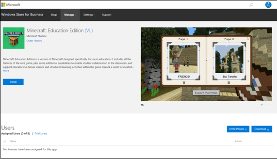
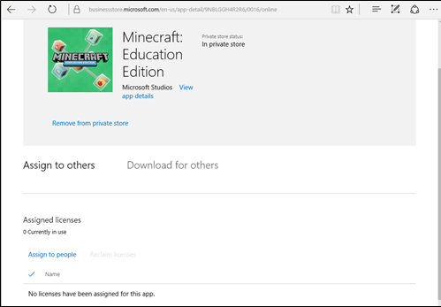
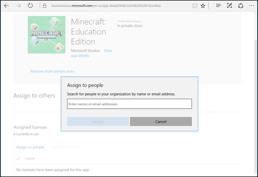
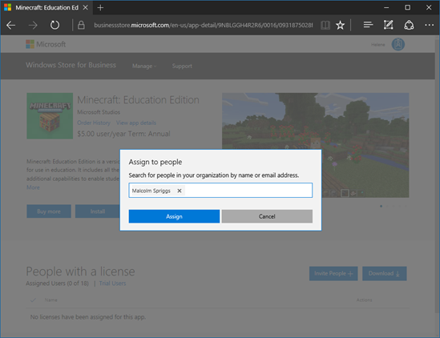
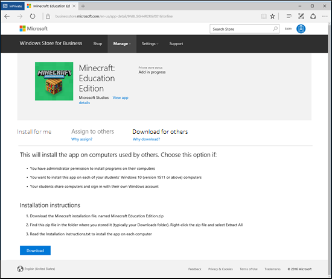

# For IT administrators: get Minecraft: Education Edition

**Applies to:**

-   Windows 10  

When you sign up for early access to [Minecraft: Education Edition](http://education.minecraft.net), Minecraft will be added to the inventory in your Windows Store for Business, a private version of Windows Store associated with your Azure Active Directory (Azure AD) tenant. Your Store for Business is only displayed to members of your organization.

> **Note**: If you don't have an Azure AD or Office 365 tenant, you can set up a free Office 365 Education subscription when you request Minecraft: Education Edition. For more information see [Office 365 Education plans and pricing](https://products.office.com/academic/compare-office-365-education-plans). 

## Add Minecraft to your Windows Store for Business 

You can start with the Minecraft: Education Edition trial to get individual copies of the app. For more information, see [Minecraft: Education Edition - direct purchase](#individual-copies). 

If you’ve been approved and are part of the Enrollment for Education Solutions volume license program, you can purchase a volume licenses for Minecraft: Education Edition. For more information, see [Minecraft: Education Edition - volume license](#volume-license). 

### Minecraft: Education Edition - direct purchase

1. Go to [http://education.minecraft.net/](http://education.minecraft.net/) and select **GET STARTED**.

    <!--  --> 

2. Enter your email address, and select Educator, Administrator, or Student.   If your email address isn't associated to an Azure AD or Office 365 Education tenant, you'll be asked to create one.

    <!--  -->
    
3. Select **Get the app**. This will take you to the Windows Store for Business to download the app. You will also receive an email with instructions and a link to the Store.

    <!--  -->

4. Sign in to Windows Store for Business with your email address.

5. Read and accept the Windows Store for Business Service Agreement, and then select **Next**.

6. **Minecraft: Education Edition** opens in the Windows Store for Business. Select **Get the app**. This places **Minecraft: Education Edition** in your Store inventory.

    <!--  -->

Now that the app is in your Store for Business inventory, you can choose how to distribute Minecraft. For more information on distribution options, see [Distribute Minecraft](#distribute-minecraft).

### Minecraft: Education Edition - volume licensing

Qualified education institutions can purchase Minecraft: Education Edition licenses through their Microsoft channel partner. Schools need to be part of the Enrollment for Education Solutions (EES) volume licensing program. Educational institutions should work with their channel partner to determine which Minecraft: Education Edition licensing offer is best for their institution. The process looks like this: 

- Your channel partner will submit and process your volume license order, your licenses will be shown on [Volume Licensing Service Center](https://www.microsoft.com/Licensing/servicecenter/default.aspx), and the licenses will be available in your [Windows Store for Business](https://www.microsoft.com/business-store) inventory. 
- You’ll receive an email with a link to Windows Store for Business. 
- Sign in to [Windows Store for Business](https://www.microsoft.com/business-store) to distribute and manage the Minecraft: Education Edition licenses. For more information on distribution options, see [Distribute Minecraft](#distribute-minecraft)

## Distribute Minecraft

After Minecraft: Education Edition is added to your Windows Store for Business inventory, you have three options:

- You can install the app on your PC.
- You can assign the app to others. 
- You can download the app to distribute.

Admins can also add Minecraft: Education Edition to the private store. This allows people in your organization to install the app from the private store. For more information, see [Distribute apps using your private store](https://technet.microsoft.com/itpro/windows/manage/distribute-apps-from-your-private-store). 

Here's the page you'll see for Minecraft: Education Edition licenses purchased directly through the Windows Store for Business. 

Here's the page you'll see for Minecraft: Education Edition licenses purchased through volume licensing.

### Install for me
You can install the app on your PC. This gives you a chance to test the app and know how you might help others in your organization use the app.   

1. Sign in to Windows Store for Business. 
2. Click **Manage**, and then click **Install for me**.

    

3. Click **Install**.  

### Assign to others
Enter email addresses for your students, and each student will get an email with a link to install the app. This option is best for older, more tech-savvy students who will always use the same PC at school. You can assign the app to individuals, groups, or add it to your private store, where students and teachers in your organization can download the app. 

**To assign to others**
1. Sign in to Windows Store for Business. 
2. Click **Manage**.

    
3. Click **Assign to people**.
 
    
4. Type the name, or email address of the student you want to assign the app to, and then click **Assign**.

    You can only assign the app to students with work or school accounts. If you don't find the student, you might need to add a work or school account for the student.
    
    

**To finish Minecraft install (for students)**

1. Students will receive an email with a link that will install the app on their PC. 

    

2. Click **Get the app** to start the app install in Windows Store app. 
3. In Windows Store app, click **Install**. 

    

    After installing the app, students can find Minecraft: Education Edition in Windows Store app under **My Library**. Windows Store app is preinstalled with Windows 10.

     

    When students click **My Library** they'll find apps assigned to them.

     

### Download for others
Download for others allows teachers or IT admins to download an app that they can install on PCs. This will install Minecraft: Education Edition on the PC, and allows anyone with a Windows account to use the app on that PC. This option is best for students, and for shared computers. Choose this option when:
- You have administrative permissions to install apps on the PC. 
- You want to install this app on each of your student's Windows 10 (at least version 1511) PCs. 
- Your students share Windows 10 computers, but sign in with their own Windows account. 

**Requirements**
- Administrative permissions are required on the PC. If you don't have the correct permissions, you won't be able to install the app. 
- Windows 10 (at least version 1511) is required for PCs running Minecraft: Education Edition.

**Check for updates** 
Minecraft: Education Edition will not install if there are updates pending for other apps on the PC. Before installing Minecraft, check to see if there are pending updates for Windows Store apps. 

**To check for app updates**
1. Start Windows Store app on the PC (click **Start**, and type **Store**).
2. Click the account button, and then click **Downloads and updates**.

      
      
3. Click **Check for updates**, and install all available updates. 

      
      
4. Restart the computer before installing Minecraft: Education Edition.  

**To download for others** 
You'll download a .zip file, extract the files, and then use one of the files to install Minecraft: Education Edition on each PC. 

1. **Download Minecraft Education Edition.zip**. From the **Minecraft: Education Edition** page, click **Download for others** tab, and then click **Download**.

    
 
2. **Extract files**. Find the .zip file that you downloaded and extract the files. This is usually your **Downloads** folder, unless you chose to save the .zip file to a different location. Right-click the file and choose **Extract all**.
3. **Save to USB drive**. After you've extracted the files, save the Minecraft: Education Edition folder to a USB drive, or to a network location that you can access from each PC.  
4. **Install app**. Use the USB drive to copy the Minecraft folder to each Windows 10 PC where you want to install Minecraft: Education Edition. Open Minecraft: Education Edition folder, right-click **InstallMinecraftEducationEdition.bat** and click **Run as administrator**. 
5. **Quick check**. The install program checks the PC to make sure it can run Minecraft: Education Edition. If your PC passes this test, the app will automatically install.
6. **Restart**. Once installation is complete, restart each PC. Minecraft: Education Edition app is now ready for any student to use.

<!--- ## Manage Minecraft: Education Edition -->

<!--- ### Access to Windows Store for Business
By default, when a teacher with a work or school account acquires Minecraft: Education Edition, they are automatically signed up for Window Store for Business, and the **Basic Purchaser** role is assigned to them. **Basic Purchaser** role allows teachers to acquire Minecraft: Education Edition and to distribute it to students. 

However, tenant admins can control whether or not teachers automatically sign up for Windows Store for Business, and get the **Basic Purchaser** role. You can configure this with the **Allow educators in my organization to sign up for the Windows Store for Business.** You'll find this on the **Permissions** page. 

To prevent educators from automatically signing up for Windows Store for Business
1.  In Windows Store for Business, click **Settings**, and then click **Permissions**. 

    

2. Click **Allow educators in my organization to sign up for the Windows Store for Business.**

-->

<!--- ### Roles and permissions
Minecraft: Education Edition adds a new role for teachers: **Basic Purchaser**. When a teacher has been granted this role, they can:
- View the Minecraft product description page 
- Acquire and manage the app
- Info on Support page (including links to documentation and access to support through customer service)

    

**To assign Basic Purchaser role**

1. Sign in to Store for Business

    **Note** 
    You need to be a Global Administrator, or have the Store for Business Admin role to access the Permissions page.

2. Click **Settings**, and then choose **Permissions**.

    

3. Click **Add people**, type a name, select the correct person, choose the role you want to assign, and click **Save**.

    
    
    Windows Store for Business updates the list of people and permissions. 
    
    

-->

<!--- ## Private store

When you create you Windows Store for Business account, you'll have a set of apps included for free in your private store. Apps in your private store are available for all people in your organization to install and use. 

These apps will automatically be in your private store:
- Word mobile
- Excel mobile
- PowerPoint mobile
- OneNote
- Sway
- Fresh Paint
- Minecraft: Education Edition

As an admin, you can remove any of these apps from the private store if you'd prefer to control how apps are distributed. --> 

<!--- ## Need more copies of Minecraft: Education Edition?
You can purchase more licenses by working with your channel partner. Licenses are available at a lower rate than the price for individual copies that are available through Windows Store for Business. Individual copies are also available through Windows Store for Business. 

If you’ve purchased a volume license, be sure to let other basic purchasers in your organization know about the volume license. That should help prevent unnecessary purchases of individual copies. -->

## Learn more

[Roles and permissions in Windows Store for Business](https://technet.microsoft.com/itpro/windows/manage/roles-and-permissions-windows-store-for-business)

[Troubleshoot Windows Store for Business](https://technet.microsoft.com/itpro/windows/manage/troubleshoot-windows-store-for-business)

## Related topics

[Get Minecraft: Education Edition](get-minecraft-for-education.md)

[For teachers get Minecraft: Education Edition](teacher-get-minecraft.md)
