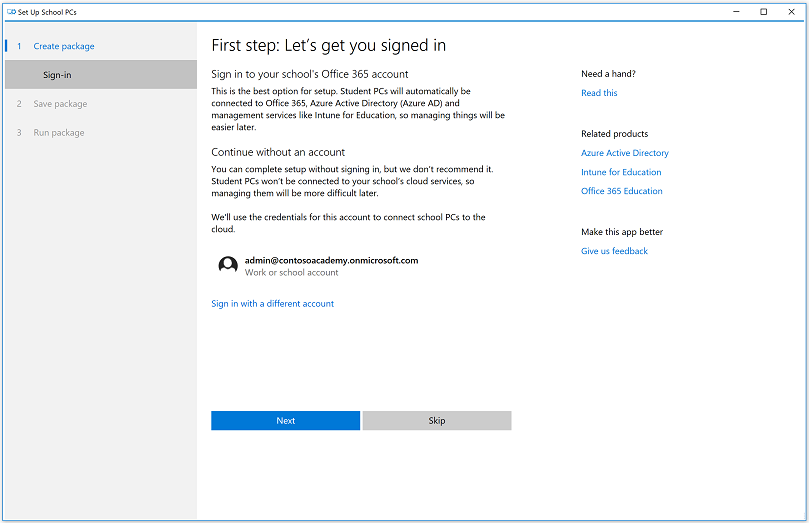
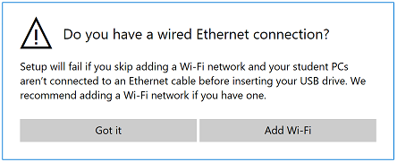
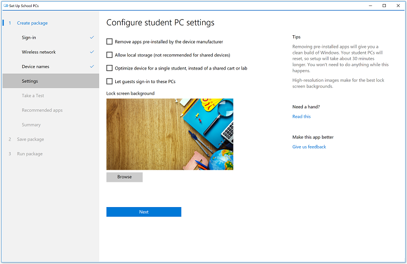
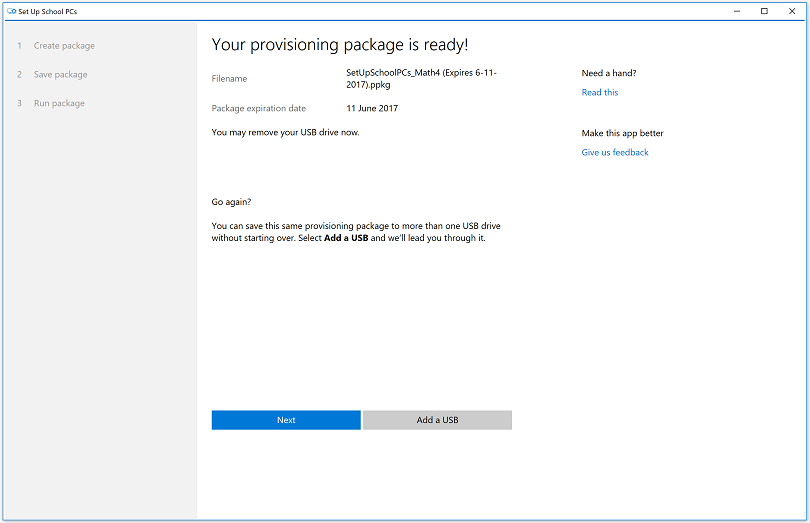
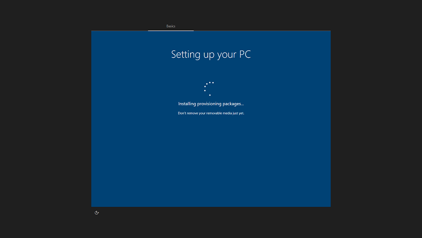
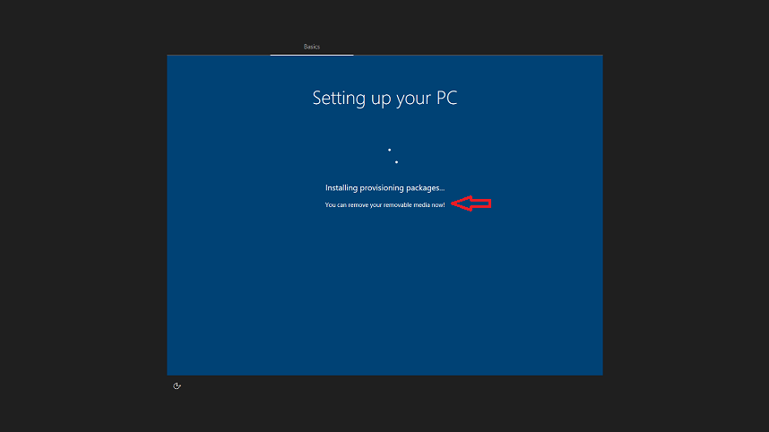

# Use the Set up School PCs app 
**Applies to:**

-   Windows 10   

IT administrators and technical teachers can use the **Set up School PCs** app to quickly set up PCs for students. A student PC set up using the app is tailored to provide students with the tools they need for learning while removing apps and features that they don't need.

## What does this app do?

Set up School PCs makes it easy to set up Windows 10 PCs with Microsoft's recommended education settings, using a quick USB setup. This app guides you through the creation of a student PC provisioning package and helps you save it to a USB drive. From there, just plug the USB drive into student PCs running Windows 10 Creators Update (version 1703). It automatically:
- Joins each student PC to your organization's Office 365 and Azure Active Directory tenant
- Enrolls each student PC into a mobile device management (MDM) provider, like Intune for Education, if licensed in your tenant. You can manage all the settings Set up School PCs sets later through MDM.
- Removes OEM preinstalled software from each student PC
- Auto-configures and saves a wireless network profile on each student PC
- Gives a friendly and unique name to each student device for future management
- Sets Microsoft-recommended school PC settings, including shared PC mode which provides faster sign-in and automatic account cleanup
- Enables optional guest account for younger students, lost passwords, or visitors
- Enables optional secure testing account
- Locks down the student PC to prevent mischievous activity:
    * Prevents students from removing the PC from the school's device management system
    * Prevents students from removing the Set up School PCs settings
- Keeps student PCs up-to-date without interfering with class time using Windows Update and maintenance hours
- Customizes the Start layout with Office
- Installs OneDrive for storing cloud-based documents and Sway for creating interactive reports, presentations, and more
- Uninstalls apps not specific to education, such as Solitaire
- Prevents students from adding personal Microsoft accounts to the PC

You can watch the video to see how to use the Set up School PCs app, or follow the step-by-step guide.  

<iframe src="https://www.youtube.com/embed/2ZLup_-PhkA" width="960" height="540" allowFullScreen frameBorder="0"></iframe>

<!--

<iframe src="https://www.youtube.com/embed/2ZLup_-PhkA?ecver=2" width="640" height="360" frameborder="0" style="position:absolute;width:100%;height:100%;left:0" allowfullscreen></iframe>

-->
You can watch the descriptive audio version here: [Microsoft Education: Use the Set up School PCs app (DA)](https://www.youtube.com/watch?v=qqe_T2LkGsI)

## Tips for success

* **Run the same Windows 10 build on the admin device and the student PCs**

  It's critical that the IT administrator's or technical teacher's device is running the same Windows 10 build (Windows 10, version 1607 or Windows 10, version 1703) as the student PCs that you're provisioning. 

  > [!NOTE]
  > If you're using the Windows 10, version 1607 build of the Set up School PCs app, do not use it to provision student PCs with Windows 10, version 1703 images. Conversely, if you're using the Windows 10, version 1703 build of Set up School PCs, do not use it to provision student PCs with Windows 10, version 1607 images. We recommend using the latest Set up School PCs app (for Windows 10, version 1703) along with Windows 10, version 1703 images on the student PCs that you're provisioning. 

* **Run the app at work**

  For the best results, run the Set up School PCs app on your work device connected to your school's network. That way the app can gather accurate information about your wireless networks and cloud subscriptions.

  > [!NOTE]  
  > Don't use the **Set up Schools PCs** app for PCs that must connect to enterprise networks or to open Wi-Fi networks that require the user to accept Terms of Use.

* **Network tips**
  * You cannot use Set up School PCs over a certification-based network, or one where you have to enter credentials in a browser. You can only connect to an open network, or one with a basic password. 
  * If you need to set up a lot of devices over Wi-Fi, make sure that your network configuration can support it.
    - We recommend configuring your DHCP so at least 200 IP addresses are available for the devices you are setting up. Configure your IP addresses to expire after a short time (about 30 minutes). This ensures that you can set up many devices simultaneously, and IP addresses will free up quickly so you can continue to set up devices without hitting network issues.

* **Apply to new student PCs**
  * The provisioning package that the Set up School PCs app creates should be used on new PCs that haven't been set up for accounts yet. If you apply the provisioning package to a student PC that has already been set up, existing accounts and data might be lost.
  
  > [!WARNING]  
  > Only use the provisioning package on PCs that you want to configure and lock down for students. After you apply the provisioning package to a student PC, the PC must be reset to remove the settings.

  * The student PCs must be in range of the Wi-Fi network that you configured in Set up School PCs or have a wired Ethernet connection when you set them up. Otherwise, setup will fail.
  * If the PC has already been set up and you want to return to the first-run experience to apply a new package, you can reset the PC to get to a clean state and get it back to the first-run experience and ready to provision again.

  To do this:
  - Go to **Settings > Update & security > Recovery**. In the **Reset this PC** section of the **Recovery** page, click **Get started**.
  - Or, hit **Shift** + click **Restart** in the **Power** menu to load the Windows boot user experience. From there, follow these steps:
    1. Click **Troubleshoot** and then choose **Reset this PC**.    
    2. Select **Remove everything**.
    3. Select **No - remove provisioning packages**.
    4. Select **Only the drive where Windows is installed** (this may not always show up).      
    5. Click **Just remove my files**.
    6. Click **Reset**.

* **Use more than one USB key**

    If you are setting up multiple PCs, you can set them up at the same time.  Just save the provisioning package to another USB drive. Create two keys and you can run it on two PCs at once, and so on.

* **Keep it clean**

    We strongly recommend that IT avoid changes to policies unless absolutely necessary, as any changes can impair performance and sign-in time. Get more information at [Set up School PCs app technical reference](set-up-school-pcs-technical.md).

* **Get more info**

    Learn more about what Set up School PCs does, including provisioning details, in [Technical reference for the Set up School PCs app](set-up-school-pcs-technical.md).

## Prerequisites

- [Download the latest Set up School PCs app from the Microsoft Store](https://www.microsoft.com/store/apps/9nblggh4ls40).
- Install the app on your work PC and make sure you're connected to your school's network. 
- You must be an administrator on Office 365 and Azure Active Directory, and have Microsoft Store for Education configured. It's best if you sign up for and configure Intune for Education before using the Set up School PCs app.
- Have a USB drive, 1 GB or larger, to save the provisioning package. We recommend an 8 GB or larger USB drive if you're installing Office.

## Set up School PCs step-by-step

### Create the provisioning package

The **Set up School PCs** app guides you through the configuration choices for the student PCs.

1. Launch the Set up School PCs app.

  **Figure 1** - Launch the Set up School PCs app

  

2. Click **Get started**.
3. To sign in to your school's Office 365 account, in the **First step: Let's get you signed in** page:

  To get the best option for setup and enable student PCs to automatically be connected to Office 365, Azure AD, and management services like Intune for Education, click **Sign-in**.

  To complete setup without signing in, click **Skip**. Student PCs won't be connected to your school's cloud services and managing them will be more difficult later.

  If you opt to sign in, follow these steps:

    1. Choose the account from the list. If you don't see the account, select **Work or school account**, click **Continue**, and enter the account details.
    2. Click **Next** once you've specified the account.
    3. If you added an account, you may be asked to provide the user account and password. You will get a notification to allow the app to access your account. This will give Set up School PCs permission to access Store for Business, read memberships, sign you in and read your profile, and more.
    4. Click **Accept**.

      The account will show up as the account that Set up School PCs will use to connect the school PCs to the cloud.

      **Figure 2** - Verify that the account you selected shows up

      

    5. Click **Next**.
  
4. To allow the student PCs to automatically connect to your school's wireless network, in the **Select the school's wireless network** page:
  1. Select the school's Wi-Fi network from the list of available wireless networks or manually add a wireless network. 
  2. Click **Next** if you added or selected a wireless network, or **Skip** to skip configuring a wireless network.

    If you click **Skip**, you will see the following dialog. 
    * If you select **Got it**, you will go to the next page without Wi-Fi set up. 
    * If you select **Add Wi-Fi**, you will go back to the Wi-Fi page to add a wireless network.

    **Figure 3** - Only skip Wi-Fi if you have a wired Ethernet connection

    

5. To assign a name to the student PCs, in the **Name these devices** page:
  1. Add a short name that Set up School PCs will use as a prefix to identify and easily manage the group of devices, apps, and other settings through your device management client. 
  
    > [!NOTE]  
    > The name must be five (5) characters or less. Set up School PCs automatically appends `_%SERIAL%` to the prefix that you specify. `_%SERIAL%` ensures that all device names are unique.

    For example, if you add *Math4* as the prefix, the device names will be *Math4* followed by a random string of letters and numbers. 

  2. Click **Next**.

6. To specify other settings for the student PC, in the **Configure student PC settings** page:
  - Select **Remove apps pre-installed by the device manufacturer** to install only the base Windows image.

      > [!NOTE]  
      > If you select this option, the provisioning process will take longer (about 30 minutes).

  - Select **Allow local storage (not recommended for shared devices)** to let students save files to the **Desktop** and **Documents** folder on the student PC. We don't recommend this option if the device will be part of a shared cart or lab.
  - Select **Optimize device for a single student, instead of a shared cart or lab** to optimize the device for use by a single student (1:1). 
    - Check this option if the device will not be part of a shared cart or lab.
    - Set up School PCs will change some account management logic so that it sets the expiration time for an account to 180 days (without requiring sign-in). 
    - This setting also increases the maximum storage to 100% of the available disk space. This prevents the student's account from being erased if the student stores a lot of files or data, or if the student doesn't use the PC over a prolonged period.

  - Select **Let guests sign-in to these PCs** to allow guests to use student PCs without a school account. For example, if the device will be in a library and you want other users (like visiting students or teachers) to be able to use the device, you can select this option.

    If you select this option, this adds a **Guest** account button in the PC's sign-in screen to allow anyone to use the PC.

  - To change the default lock screen background or to use your school's custom lock screen background, click **Browse** to select a new lock screen background.

    **Figure 4** - Configure student PC settings

    

 When you're doing configuring the student PC settings, click **Next**.

7. If you want to set up the Take a Test app and use it for taking quizzes and high-stakes assessments by some providers like Smarter Balanced, configure the settings in the **Set up the Take a Test app** page. Windows will also lock down the student PC so that students can't access anything else while taking the test.
  1. Specify if you want to create a Take a Test button on the sign-in screens of students' PCs.
  2. Check the options whether to allow keyboard text suggestions to appear and to allow teachers to monitor online tests. 
  3. Enter the assessment URL.

    You can leave the URL blank so that students can enter one later. This enables teachers to use the the Take a Test account for daily quizzes or tests by having students manually enter a URL.

    **Figure 5** - Configure the Take a Test app

    

  3. Click **Next** or **Skip** depending on whether you want to set up Take a Test.

8. In the **Add recommended apps** page, you can choose from a set of recommended Microsoft Store apps to provision. The recommended apps include the following:
  * **Office 365 for Windows 10 S (Education Preview)** 
    * Office 365 for Windows 10 S will only work on student PCs running Windows 10 S. If you try to install this app on other editions of Windows, setup will fail.
    * When adding the Office 365 for Windows 10 S to a package, the device you use to run Set up School PCs does not have to be running Windows 10 S.
  * **Minecraft: Education Edition** - Free trial 
  * Popular **STEM and Makerspace apps**

  1. Select the apps that you would like to provision and then click **Next** when you're done. Apps that you provision on student PCs will be pinned to the Start menu.
  2. Click **Skip** if you don't want to provision any apps.

  **Figure 6** - Select from a set of recommended apps

  
    
  The set of recommended Microsoft Store for Education apps may vary from what we show here.

9. In the **Review package summary** page, make sure that all the settings you configured appear correctly.
  1. If you need to change any of the settings, you can on the sections to go back to that page and make your changes.

      **Figure 7** - Review your settings and change them as needed

      

  2. Click **Accept**.

10. In the **Insert a USB drive now** page:
  1. Insert a USB drive to save your settings and create a provisioning package on the USB drive.
  2. Set up School PCs will automatically detect the USB drive after it's inserted. Choose the USB drive from the list.
  3. Click **Save** to save the provisioning package to the USB drive.

      **Figure 8** - Select the USB drive and save the provisioning package

      

11. When the provisioning package is ready, you will see the name of the file and you can remove the USB drive. Click **Next** if you're done, or click **Add a USB** to save the same provisioning package to another USB drive.

  **Figure 9** - Provisioning package is ready

  

12. Follow the instructions in the **Get the student PCs ready** page to start setting up the student PCs. 

  **Figure 10** - Line up the student PCs and get them ready for setup

  

13. Click **Next**.
14. In the **Install the package** page, follow the instructions in [Apply the provisioning package to the student PCs](#apply-the-provisioning-package-to-the-student-pcs) to set up the student PCs. 

  Select **Create new package** if you need to create a new provisioning package. Otherwise, you can remove the USB drive if you're completely done creating the package.

  **Figure 11** - Install the provisioning package on the student PCs

  

### Apply the provisioning package to the student PCs

The provisioning package on your USB drive is named `Set up School PCs.ppkg`. A provisioning package is a method for applying settings to Windows 10 without needing to reimage the device. When Windows 10 refers to *package*, it means your provisioning package, and when it refers to *provisioning*, it means applying the provisioning package to the student PC.

> [!NOTE]  
> The student PC must contain a new or reset image and the PC must not already have been through first-run setup (OOBE).

**To set up the student PC using the Set up School PCs provisioning package**

1. Start with the student PC turned off or with the PC on the first-run setup screen. In Windows 10 Creators Update (version 1703), this first-run setup screen says **Let's start with region. Is this right?**. 

    If the PC has gone past the account setup screen, reset the PC to start over. To reset the PC, go to **Settings** > **Update & security** > **Recovery** > **Reset this PC**.

    **Figure 12** - The first screen during first-run setup in Windows 10 Creators Update (version 1703)

    

2. Insert the USB drive. Windows will recognize the drive and automatically install the provisioning package. 

    **Figure 13** - Windows automatically detects the provisioning package and installs it

    

3. You can remove the USB drive when you see the message that you can remove the removable media. You can then use the USB drive to start provisioning another student PC.

    **Figure 14** - Remove the USB drive when you see the message that the media can be removed

    
   
4. If you set up the package to do Azure AD Join, that's it! You're done, and the PC is now ready for students to use.

  If you did not set up the package to do Azure AD Join, go through the rest of the Windows device setup experience.

## Related topics

[Set up Windows devices for education](set-up-windows-10.md)

