# Use the Set up School PCs app  

IT administrators and technical teachers can use the **Set up School PCs** app to quickly set up Windows 10 PCs for students. The app configures PCs with the apps and features students need, and it removes the ones they don't need. During setup, if licensed in your tenant, the app enrolls each student PC into a mobile device management (MDM) provider, such as Intune for Education. You can then manage all the settings Set up School PCs configures through the MDM.   

Set up School PCs also:  
* Joins each student PC to your organization's Office 365 and Azure Active Directory tenant.  
* Enables the optional Autopilot Reset feature, to return devices to a fully configured or known IT-approved state.  
* Keeps student PCs up-to-date without interfering with class time using Windows Update and maintenance hours.  
* Locks down the student PC to prevent activity that isn't beneficial to their education.  

This article describes how to get started and provide information about your school in the Set up School PCs app. To learn more about the app's functionality, start with the [Technical reference for the Set up School PCs app](set-up-school-pcs-technical.md).  

## Requirements    
Before you begin, make sure that you, your computer, and your school's network are configured with the following requirements.

* Office 365 and Azure Active Directory
* [Latest Set up School PCs app](https://www.microsoft.com/store/apps/9nblggh4ls40)  
* Permission to buy apps in Microsoft Store for Education
* Set up School PCs app has permission to access the Microsoft Store for Education
* A NTFS-formatted USB drive that is at least 1 GB, if not installing Office; and at least 8 GB, if installing Office
* Student PCs must either: 
    * Be within range of the Wi-Fi network that you configured in the app.
    * Have a wired Ethernet connection when you set them up.  

### Configure USB drive for additional space  
USB drives are, by default, FAT32-formatted, and are unable to save more than 4 GB of data. If you plan to install several apps, or large apps like Microsoft Office, you'll need more space. To create more space on the USB drive, reformat it to NTFS.  
1. Insert the USB drive into your computer.
2. Go to the **Start** > **This PC**.
3. In the **Devices and drives** section, find your USB drive. Right-click to see its options.
4. Select **Format** from the list to bring up the **Format drive name** window.
5. Set **File system** to **NTFS**.
6. Click **Start** to format the drive.

### Prepare existing PC account for new setup
Apply new packages to factory reset or new PCs. If you apply it to a PC that's already set up, you may lose the accounts and data.

If a PC has already been set up, and you want to apply a new package, reset the PC to a clean state.

To begin, go to the **Settings** app on the appropriate PC.
1. Click **Update & Security** > **Recovery**. 
2. In the **Reset this PC** section, click **Get started**. 
3. Click **Remove everything**.

You can also go to **Start** > **Power** icon. Hold down the Shift key and click **Restart** to load the Windows boot user experience. From there, follow these steps: 
1. Click **Troubleshoot** and then choose **Reset this PC**.
2. Select **Remove everything**.
3. If the option appears, select **Only the drive where Windows is installed**.  
4. Click **Just remove my files**.
5. Click **Reset**.

## Recommendations  
This section offers recommendations to prepare you for the best possible setup experience.  
### Run the same Windows 10 build on the admin device and the student PCs  
We recommend you run the IT administrator or technical teacher's device on the same Windows 10 build as the student PCs.

### Student PCs should meet OS requirements for the app
Check the minimum OS requirements in the Set up School PCs app. We recommend using the latest Set up School PCs app along with the latest Windows 10 images on the student PCs.  

To check the app's OS requirements, go to the Microsoft Store and locate the Set up School PCs app. In the app's description, go to **System Requirements > OS**.

### Use app on a PC that is connected to your school's network
We recommend that you run the Set up School PCs app on a computer that's connected to your school's network. That way the app can gather accurate information about your school's wireless networks and cloud subscriptions. If it's not connected, you'll need to enter the information manually.

 > [!NOTE]  
  > Don't use the **Set up Schools PCs** app for PCs that must connect to:
 >* Enterprise networks that require the user to accept Terms of Use.
 >* Open Wi-Fi networks that require the user to accept Terms of Use.

### Run app on an open network or network that requires a basic password  
Don't use Set up School PCs over a certification-based network, or one where you have to enter credentials in a browser. If you need to set up numerous devices over Wi-Fi, make sure that your network configuration can support it.

We recommend that you:  
* Configure your DHCP so at least 200 IP addresses are available for your devices. Having available IP addresses will allow you to set up many devices simultaneously.  
* Configure your IP addresses to expire after a short time--about 30 minutes. IP addresses will free up quickly so you can continue to set up devices without network issues.    

>> [!WARNING]
> Only use the provisioning package on PCs that you want to configure and lock down for students. After you apply the provisioning package to a student PC, the PC must be reset to remove the settings.  

### Use an additional USB drive  
You can set up PCs at the same time. Just save the provisioning package to an additional USB drive. Then plug them in at the same time during deployment.  

### Limit changes to school-optimized settings

We strongly recommend that you avoid changing preset policies. Changes can slow down setup, performance, and sign-in time.  
## Create the provisioning package

The **Set up School PCs** app guides you through the configuration choices for the student PCs.  

### Sign-in
1. Open the Set up School PCs app on your PC and click **Get started**.  
    
        
2. Select how you want to sign in.  
    a. (Recommended) To enable student PCs to automatically be connect to Office 365, Azure AD, and management services like Intune for Education, click **Sign-in**. Then go to step 3.  
    b. To complete setup without signing in, click **Skip**. Student PCs won't be connected to your school's cloud services and managing them will be more difficult later. Continue to [Wireless network](use-set-up-school-pcs-app.md#Wireless-network).  
3. In the new window, select the account you want to use throughout setup. 

    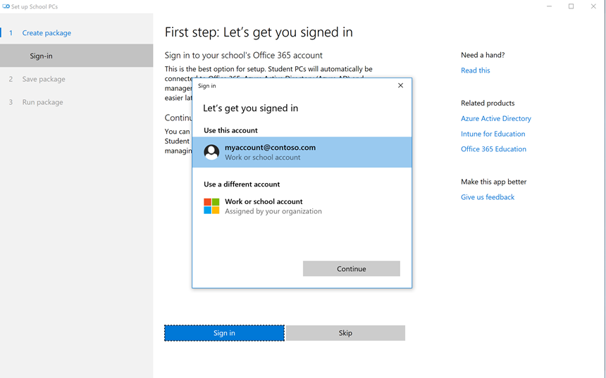 

    To add an account not listed:  
a. Click **Work or school account** > **Continue**.  
        b. Type in the account username and click **Next**.  
        c. You may be asked to verify the user account and password.   

1. Click **Accept** to allow Set up School PCs to access your account throughout setup.
2. When your account name appears on the page, as shown in the image below, click **Next.**

      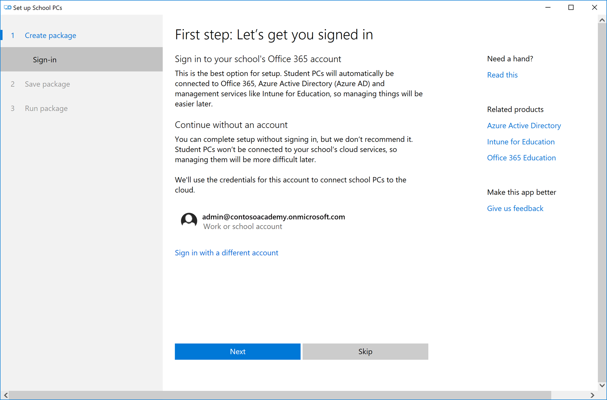

### Wireless network
Add and save a wireless network profile to provision on each student PC. Only skip Wi-Fi setup if you have an Ethernet connection.  

Select your school's Wi-Fi network from the list of available wireless networks, or click **Add a wireless network** to manually configure it. Then click **Next.** 

 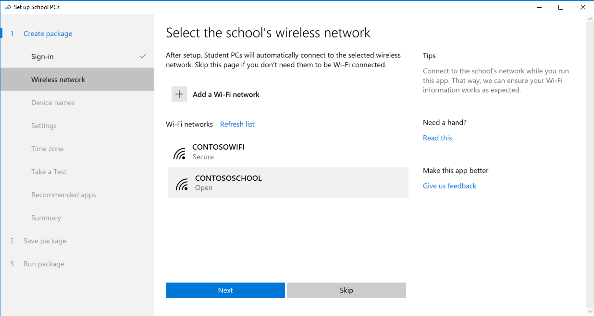  

### Device names
Create a short name to add as a prefix to each of the PCs you set up. The name will help you recognize and manage this group of devices in your mobile device manager. The name must be five (5) characters or less.  

To make sure all device names are unique, Set up School PCs automatically appends `_%SERIAL%` to the name.  For example, if you add *Math4* as the prefix, the device names will appear as *Math4* followed by a random string of letters and numbers.   

  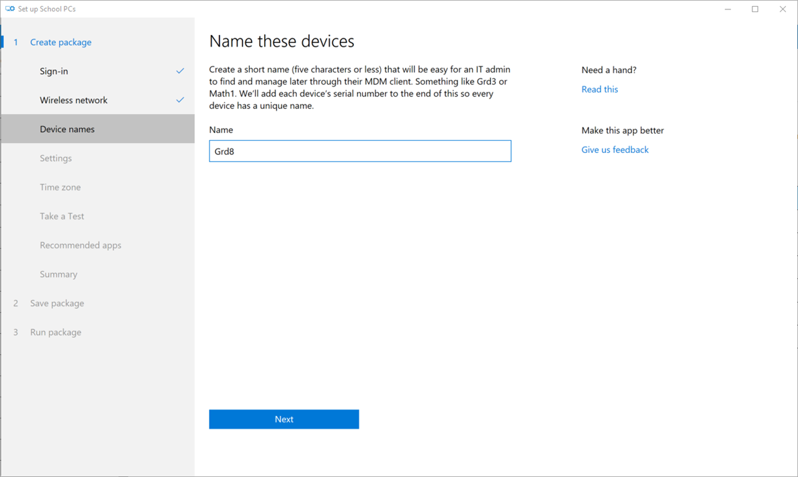  

### Settings
Select additional settings to include in the provisioning package. To begin, select the operating system on your student PCs. 

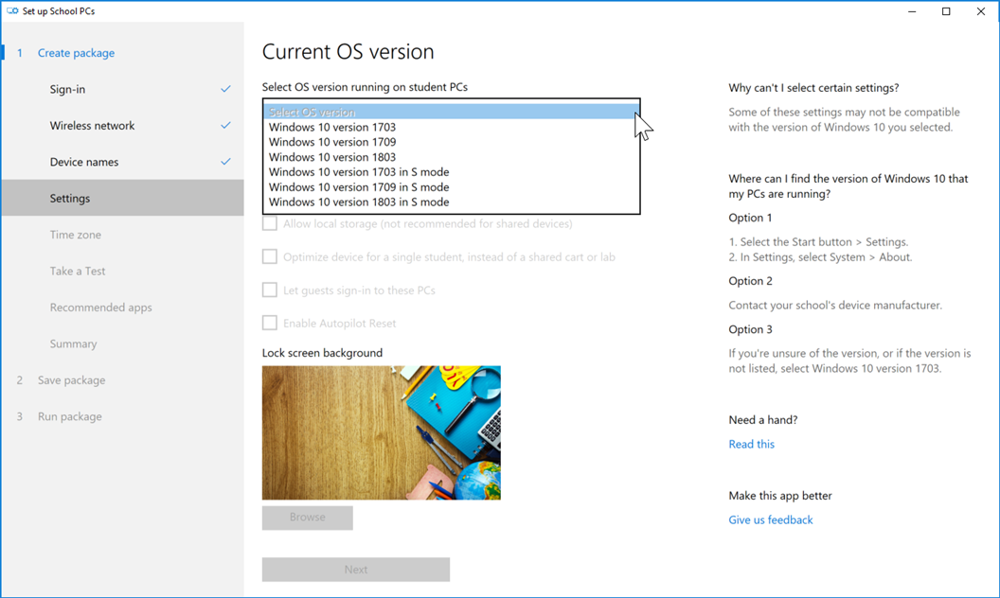  

Setting selections vary based on the OS version you select. The example screenshot below shows the settings that become available when you select **Windows 10 version 1703**. The option to **Enable Autopilot Reset** is not available for this version of Windows 10.  

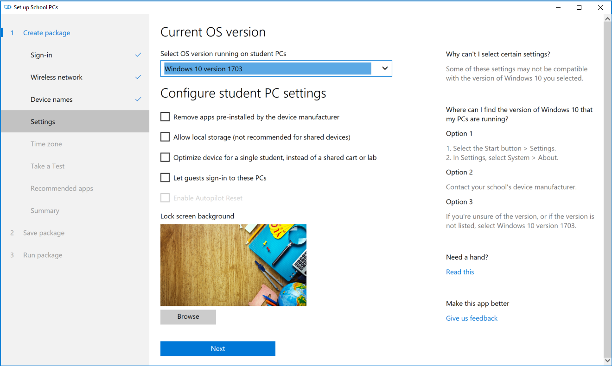  

> [!NOTE]
> The [**Time zone** setting](use-set-up-school-pcs-app.md#time-zone), shown in the sidebar of the screenshot below, is not made available to versions of Windows 10 in S mode. If you select a version in S mode, you will not be asked to configure the time zone.  

The following table describes each setting and lists the applicable Windows 10 versions. To find out if a setting is available in your version of Windows 10, look for an *X* in the setting row and in the version column.   

|Setting  |1703|1709|1803|What happens if I select it? |Note|
|---------|---------|---------|---------|---------|---------|
|Remove apps pre-installed by the device manufacturer |X|X|X| Uninstalls apps that came loaded on the computer by the device's manufacturer. |Adds about 30 minutes to the provisioning process.|
|Allow local storage (not recommended for shared devices)    |X|X|X| Lets students save files to the Desktop and Documents folder on the Student PC.         |Not recommended if the device will be part of a shared cart or lab.|
|Optimize device for a single student, instead of a shared cart or lab    |X|X|X|Optimizes the device for use by a single student, rather than many students.       |Recommended option only if the device is not shared with other students in the school. Single-optimized accounts are set to expire, and require a signin, 180 days after setup. This setting increases the maximum PC storage to 100% of the available disk space. In this case, student accounts aren't deleted unless the account has been inactive for 180 days. |
|Let guests sign in to these PCs     |X|X|X|Allows guests to use student PCs without a school account. |Common to use within a public, shared space, such as a library. Also used when a student loses their password. Adds a **Guest** account to the PC sign-in screen that anyone can sign in to.|
|Enable Autopilot Reset  |Not available|X|X| Lets you remotely reset a student’s PC from the lock screen, apply the device’s original settings, and enroll it in device management (Azure AD and MDM).  |Requires Windows 10, version 1709 and WinRE must be enabled on the PC. Setup will fail if both requirements aren't met.|
|Lock screen background|X|X|X|Change the default screen lock background to a custom image.|Click **Browse** to search for an image file on your computer. Accepted image formats are jpg, jpeg, and png.|   

After you've made your selections, click **Next**.   

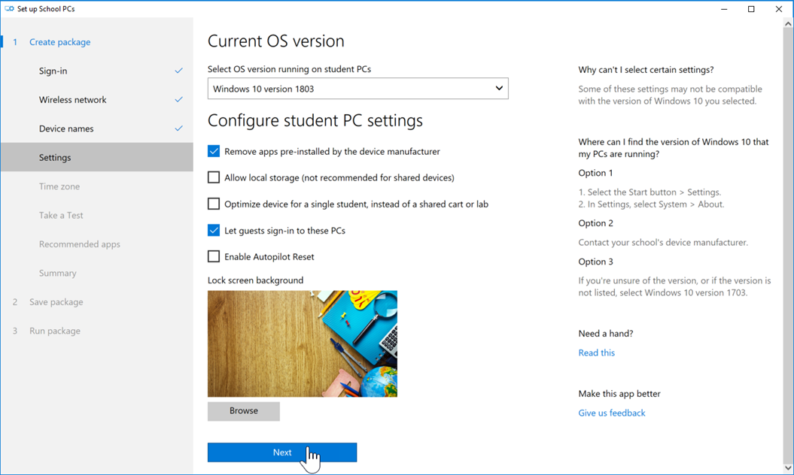  

### Time zone 
Choose the time zone where your school's PCs are used. This setting ensures that all PCs are provisioned in the same time zone. When you're done, click **Next**.  

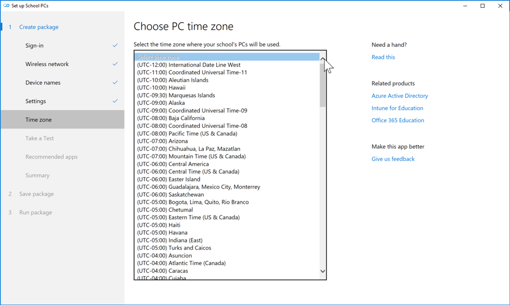  

### Take a Test  
Set up the Take a Test app to give online quizzes and high-stakes assessments. During assessments, Windows locks down the student PC so that students can't access anything else on the device.  
1. Select **Yes** to create a Take a Test button on the sign-in screens of your students' PCs.    

    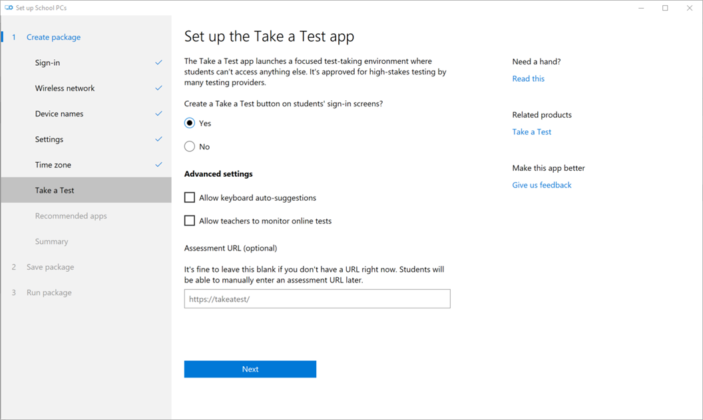   

2. Select from the advanced settings. Available settings inclue:  
    * Allow keyboard auto-suggestions: Allows app to suggest words as the student types on the PC's keyboard.  
    * Allow teachers to monitor online tests: Enables screen capture in the Take a Test app.  
3. Enter the URL where the test is hosted. When students log in to the Take a Test account, they'll be able to click or enter the link to view the assessment.  
4. Click **Next**. 

### Recommended apps  
Choose from a list of recommended Microsoft Store apps to install on student PCs. Then click **Next**. After they're assigned, apps are pinned to the student's Start menu.  

  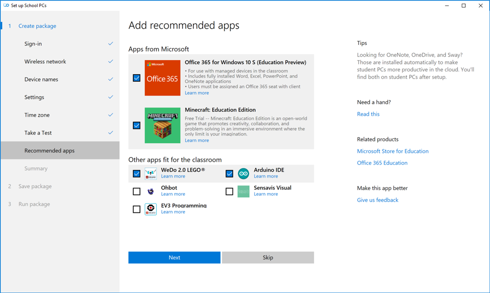  

The following table lists the recommended apps you'll see.  

|App |Note |
|---------|---------|
|Office 365 for Windows 10 in S mode (Education Preview) | Setup is only successful on student PCs that run Windows 10 in S mode. The PC you running the Set up School PCs app is not required to have Windows 10 in S mode.        |
|Minecraft: Education Edition | Free trial|
|Other apps fit for the classroom |Select from WeDo 2.0 LEGO®, Arduino IDE, Ohbot, Sesavis Visual, and EV3 Programming|   

If you receive an error and are unable to add the selected apps, click **Skip**. Contact your IT admin to get these apps later.

### Summary
1. Review all of the settings for accuracy and completeness. Check carefully. To make changes to a saved package, you have to start over.  
2. To make changes now, click any page along the left side of the window.  
3. When finished, click **Accept**.  

      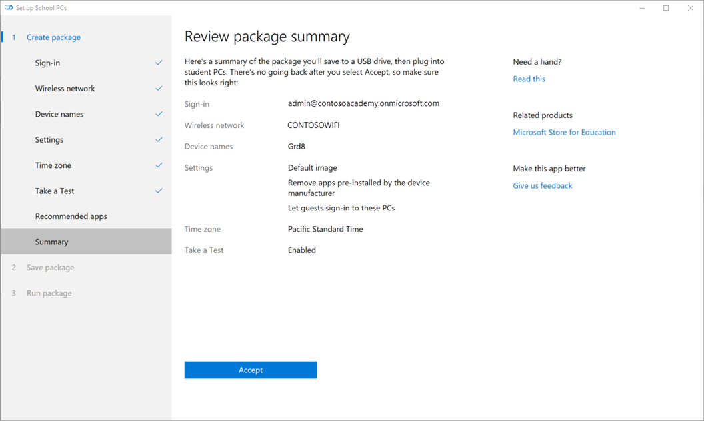

### Insert USB
1. Insert a USB drive. The **Save** button will light up when your computer detects the USB.  
2. Choose your USB drive from the list and click **Save**.

      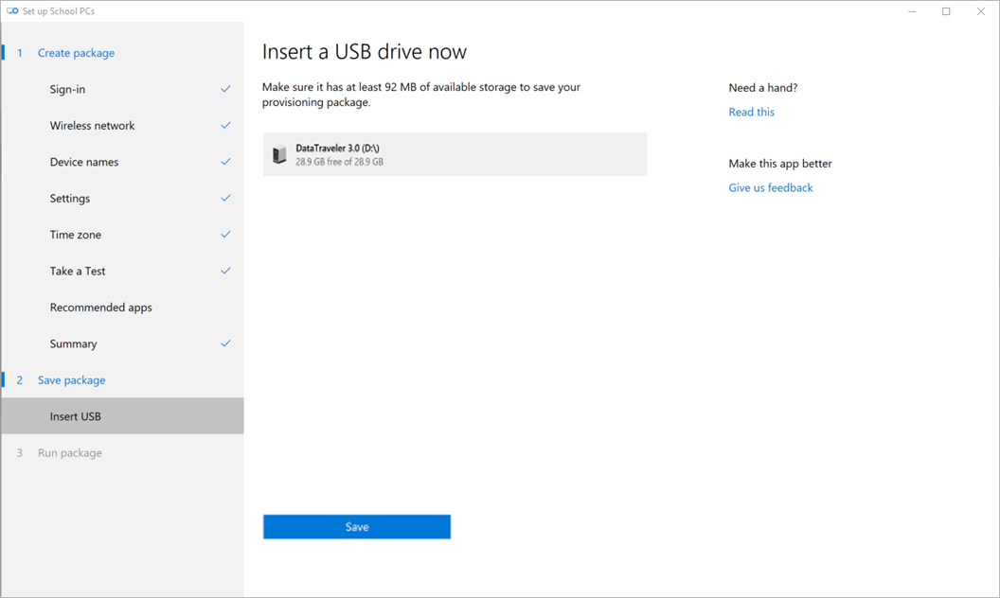

3. When the package is ready, you'll see the filename and package expiration date. You can also click **Add a USB** to save the same provisioning package to another USB drive. When you're done, remove the USB drive and click **Next**. 

      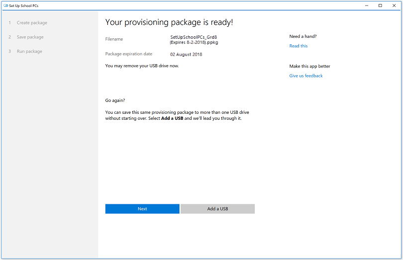  

## Run package - Get PCs ready  
Complete each step on the **Get PCs ready** page to prepare student PCs for set-up. Then click **Next**.  
   
    

## Run package - Install package on PC

The provisioning package on your USB drive is named SetupSchoolPCs_<*devicename*>(Expires <*expiration date*>.ppkg. A provisioning package applies settings to Windows 10 without reimaging the device. 

When used in context of the Set up School PCs app, the word *package* refers to your provisioning package. The word *provisioning* refers to the act of installing the package on the student PC. This section describes how to apply the settings to a PC in your school.  

> [!IMPORTANT]
> The PC must have a new or reset Windows 10 image and must not already have been through first-run setup (also referred to as OOBE). For instructions about how to reset a computer's image, see [Prepare existing PC account for new setup](use-set-up-school-pcs-app.md#prepare-existing-pc-account-for-new-setup).  

1.  Start with the student PC turned off or with the PC on the first-run setup screen. In Windows 10 version 1803, the first-run setup screen reads, **Let's start with region. Is this right?** 

    If the PC has gone past the account setup screen, reset the PC to start over. To reset the PC, go to **Settings** > **Update & security** > **Recovery** > **Reset this PC**.  

       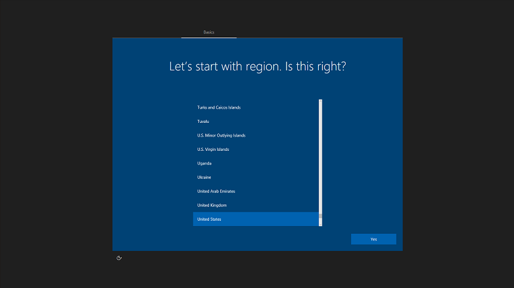  
  
2. Insert the USB drive. Windows automatically recognizes and installs the package.  
   
       
3. When you receive the message that it's okay to remove the USB drive, remove it from the PC. If there are more PCs to set up, insert the USB drive into the next PC.  

       

4. If you did not set up the package to do Azure AD Join, go through the rest of the Windows device setup experience.  If you did configure the package for Azure AD Join, the computer is ready for use and no further configurations are required.  

      If successful, you'll see a setup complete message. The PCs start up on the lock screen with your school's custom background. Upon first use, students and teachers will be able to connect to your school's network and resources.

