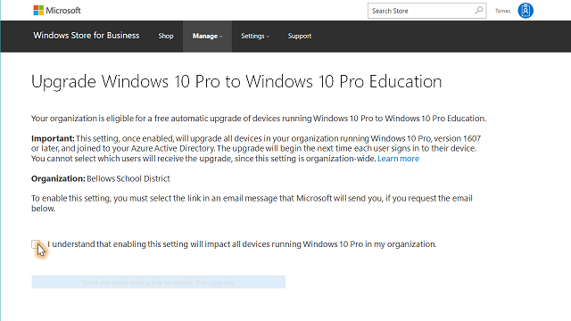
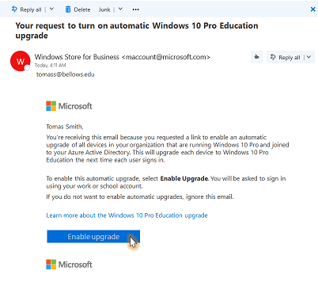
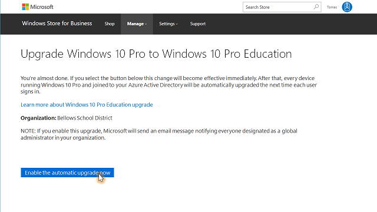
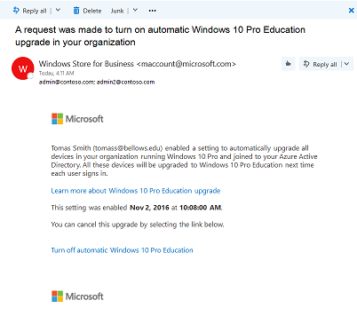
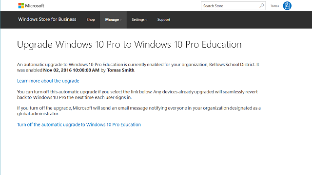
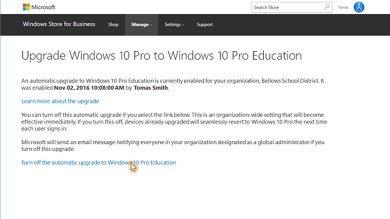

# Upgrade Windows 10 Pro to Pro Education from Windows Store for Business

Windows 10 Pro Education is a new offering in Windows 10 Anniversary Update (Windows 10, version 1607). This edition builds on the commercial version of Windows 10 Pro and provides important management controls needed in schools by providing education-specific default settings.

If you have an education tenant and use Windows 10 Pro in your schools now, global administrators can opt-in to a free upgrade to Windows 10 Pro Education through the Windows Store for Business. To take advantage of this offering, make sure you meet the [Requirements for upgrade](#requirements-for-upgrade).

Starting with Windows 10, version 1607, academic institutions can easily move from Windows 10 Pro to Windows 10 Pro Education—no keys and no reboots. After one of your users enters the Azure AD credentials associated with a Windows 10 Pro Education license, the operating system turns from Windows 10 Pro to Windows 10 Pro Education and all the appropriate Windows 10 Pro Education features are unlocked. When a license expires or is transferred to another user, the Windows 10 Pro Education device seamlessly steps back down to Windows 10 Pro.

Previously, only schools or organizations purchasing devices as part of the Shape the Future K-12 program or with a Microsoft Volume Licensing Agreement could deploy Windows 10 Pro Education to their users. Now, if you have an education tenant, you can take advantage of the Windows 10 Pro Education features.

When you upgrade to Windows 10 Pro Education, you get the following benefits:

-   **Windows 10 Pro Education edition**. Devices currently running Windows 10 Pro, version 1607 can get Windows 10 Pro Education Current Branch (CB). This benefit does not include Long Term Service Branch (LTSB).
-   **Support from one to hundreds of users**. The Windows 10 Pro Education program does not have a limitation on the number of licenses an organization can have.
-   **Roll back to Windows 10 Pro at any time**. When a user leaves the domain or the license is revoked, the Windows 10 Pro Education device reverts seamlessly to Windows 10 Pro edition (after a grace period of up to 90 days).

In summary, the Windows 10 Pro Education free upgrade through the Windows Store for Business is an upgrade offering that provides organizations easier, more flexible access to the benefits of Windows 10 Pro Education edition.

## Compare Windows 10 Pro and Pro Education editions

In Windows 10, version 1607, the Windows 10 Pro Education edition contains the same features as the Windows 10 Pro edition except for the following differences:

- Cortana is removed from Windows 10 Pro Education
- Options to manage Windows 10 tips and tricks and Windows Store suggestions

See [Windows 10 editions for education customers](windows-editions-for-education-customers.md) for more info about Windows 10 Pro Education and you can also [Compare Windows 10 Editions](https://www.microsoft.com/en-us/WindowsForBusiness/Compare) to find out more about the features we support in other editions of Windows 10.

## Requirements for upgrade

Before you upgrade from Windows 10 Pro to Windows 10 Pro Education, make sure you meet these requirements:
- Devices must be:
  - Running Windows 10 Pro, version 1607
  - Must be Azure Active Directory joined, or domain joined with Azure AD Connect. Customers who are federated with Azure Active Directory are also eligible. For more information, see [Review requirements on devices](#review-requirements-on-devices).

    If you haven't domain joined your devices already, [prepare for deployment of Windows 10 Pro Education licenses](#preparing-for-deployment-of-windows-10-pro-education-licenses).
- The user making the changes must be a member of the Azure AD global administrator group.
- The Azure AD tenant must be recognized as an education approved tenant.
- You must have a Windows Store for Business account.

## Upgrade from Windows 10 Pro to Windows 10 Pro Education
Once you enable the setting to upgrade Windows 10 Pro to Windows 10 Pro Education, the upgrade will begin only after a user signs in to their device. The setting applies to the entire organization so you cannot select which users will receive the upgrade.

**To turn on the automatic upgrade from Windows 10 Pro to Windows 10 Pro Education**
1. Sign in to Windows Store for Business with your work or school account.

  If this is the first time you're signing into the Store, you'll be prompted to accept the Windows Store for Business Terms of Use.
2. Go to **Manage > Account information**.
3. In the **Account information** page, look for the **Upgrade Windows 10 Pro to Windows 10 Pro Education** section and follow the link.

  You will see the following page informing you that your school is eligible for a free automatic upgrade from Windows 10 Pro to Windows 10 Pro Education.

  

  **Figure 1** - Upgrade Windows 10 Pro to Windows 10 Pro Education

4. Select **I understand enabling this setting will impact all devices running Windows 10 Pro in my organization**.
5. **Optional.** To receive an email with a link to the upgrade, click **Send me email with a link to enable this upgrade** to receive an email.

  

  **Figure 2** - Email notification with a link to enable the upgrade

6. Click **Enable the automatic upgrade now** to turn on automatic upgrades.

    .

    **Figure 3** - Enable the automatic upgrade

    Enabling the automatic upgrade also triggers an email message notifying all global administrators in your organization about the upgrade. It also contains a link that enables any global administrators to cancel the upgrade, if they choose. For more info about rolling back or canceling the upgrade, see [Roll back Windows 10 Pro Education to Windows 10 Pro](#roll-back-windows-10-pro-education-to-windows-10-pro).

    .

    **Figure 4** - Notification email sent to all global administrators

7. Click **Close** in the **Confirmation** page.

  In the **Upgrade Windows 10 Pro to Windows 10 Pro Education** page, you will see a message informing you when the upgrade was enabled and the name of the admin who enabled the upgrade.

  

  **Figure 5** - Details about the automatic upgrade

## Explore the upgrade experience

So what will the users experience? How will they upgrade their devices?

### For existing Azure AD domain joined devices
Existing Azure AD domain joined devices will be upgraded from Windows 10 Pro to Windows 10 Pro Education the next time the user logs in. That's it! No additional steps are needed.

### For new devices that are not Azure AD domain joined
Now that you've upgraded from Pro to Pro Education, and Windows 10 Pro Education licenses have been assigned to users, the users are ready to upgrade their devices running Windows 10 Pro, version 1607 edition to Windows 10 Pro Education edition.

#### Step 1: Join users’ devices to Azure AD

Users can join a device to Azure AD the first time they start the device (during setup), or they can join a device that they already use running Windows 10 Pro, version 1607.

**To join a device to Azure AD the first time the device is started**

1.  During the initial setup, on the **Who owns this PC?** page, select **My organization**, and then click **Next**, as illustrated in **Figure 6**.

    

    **Figure 6** - The “Who owns this PC?” page in initial Windows 10 setup

2.  On the **Choose how you’ll connect** page, select **Join Azure AD**, and then click **Next**, as illustrated in **Figure 7**.

    

    **Figure 7** - The “Choose how you’ll connect” page in initial Windows 10 setup

3.  On the **Let’s get you signed in** page, enter the Azure AD credentials, and then click **Sign in**, as illustrated in **Figure 8**.

    

    **Figure 8** - The “Let’s get you signed in” page in initial Windows 10 setup

Now the device is Azure AD joined to the company’s subscription.

**To join a device to Azure AD when the device already has Windows 10 Pro, version 1607 installed and set up**

1.  Go to **Settings &gt; Accounts &gt; Access work or school**, as illustrated in **Figure 9**.

    

    **Figure 9** - Connect to work or school configuration in Settings

2.  In **Set up a work or school account**, click **Join this device to Azure Active Directory**, as illustrated in **Figure 10**.

    

    **Figure 10** - Set up a work or school account

3.  On the **Let’s get you signed in** page, enter the Azure AD credentials, and then click **Sign in**, as illustrated in **Figure 11**.

    

    **Figure 11** - The “Let’s get you signed in” dialog box

Now the device is Azure AD joined to the company’s subscription.

#### Step 2: Sign in using Azure AD account

Once the device is joined to your Azure AD subscription, the user will sign in by using his or her Azure AD account, as illustrated in **Figure 12**. The Windows 10 Pro Education license associated with the user will enable Windows 10 Pro Education edition capabilities on the device.

**Figure 12** - Sign in by using Azure AD account

#### Step 3: Verify that Pro Education edition is enabled

> [!IMPORTANT]  
> **TBD - Reviewers:** The screenshots in this section need to be updated for Pro Education and not Enterprise E3 (original source)

You can verify the Windows 10 Pro Education in **Settings &gt; Update & Security &gt; Activation**, as illustrated in **Figure 13**.

**Figure 13** - Windows 10 Pro Education in Settings

If there are any problems with the Windows 10 Pro Education license or the activation of the license, the **Activation** panel will display the appropriate error message or status. You can use this information to help you diagnose the licensing and activation process.

## Troubleshoot the user experience

In some instances, users may experience problems with the Windows 10 Pro Education upgrade. The most common problems that users may experience are as follows:

-   The existing Windows 10 Pro, version 1607 operating system is not activated.

-   The Windows 10 Pro Education upgrade has lapsed or has been removed.

Use the following figures to help you troubleshoot when users experience these common problems:

**Figure 13** - Illustrates a device in a healthy state, where Windows 10 Pro, version 1607 is activated and the Windows 10 Pro Education upgrade is active.

**Figure 14** - Illustrates a device on which Windows 10 Pro, version 1607 is not activated, but the Windows 10 Pro Education upgrade is active.

  

**Figure 15** - Illustrates a device on which Windows 10 Pro, version 1607 is activated, but the Windows 10 Pro Education upgrade is lapsed or removed.

  

**Figure 16** - Illustrates a device on which Windows 10 Pro, version 1607 license is not activated and the Windows 10 Pro Education upgrade is lapsed or removed.

  

### Review requirements on devices

Devices must be running Windows 10 Pro, version 1607, and be Azure Active Directory joined, or domain joined with Azure AD Connect. Customers who are federated with Azure Active Directory are also eligible. You can use the following procedures to review whether a particular device meets requirements.

**To determine if a device is Azure Active Directory joined**

1.  Open a command prompt and type **dsregcmd /status**.

2.  Review the output under Device State. If the **AzureAdJoined** status is YES, the device is Azure Active Directory joined.

**To determine the version of Windows 10**

-   At a command prompt, type:
    **winver**

    A popup window will display the Windows 10 version number and detailed OS build information.

    If a device is running a previous version of Windows 10 Pro (for example, version 1511), it will not be upgraded to Windows 10 Pro Education when a user signs in, even if the user has been assigned a license.

## Roll back Windows 10 Pro Education to Windows 10 Pro

If your organization has the Windows 10 Pro to Windows 10 Pro Education upgrade enabled, and you decide to roll back to Windows 10 Pro or to cancel the upgrade, you can do this by:
- Logging into Windows Store for Business page and turning off the automatic upgrade.
- Selecting the link to turn off the automatic upgrade from the notification email sent to all global administrators.

Once the automatic upgrade to Windows 10 Pro Education is turned off, the change is effective immediately. Devices that were upgraded will revert to Windows 10 Pro only after the license has been refreshed (every 30 days) and the next time the user signs in. This means that a user whose device was upgraded may not immediately see Windows 10 Pro Education rolled back to Windows 10 Pro for up to 30 days. However, users who haven't signed in during the time that an upgrade was enabled and then turned off will never see their device change from Windows 10 Pro.

**To roll back Windows 10 Pro Education to Windows 10 Pro**
1. Log in to Windows Store for Business with your school or work account, or follow the link from the notification email to turn off the automatic upgrade.
2. In the **Upgrade Windows 10 Pro to Windows 10 Pro Education** page, select **Turn off the automatic upgrade to Windows 10 Pro Education**.

  

  **Figure 17** - Link to turn off the automatic upgrade

3. You will be asked if you're sure that you want to turn off automatic upgrades to Windows 10 Pro Education. Click **Yes**.
4. Click **Close** in the **Confirmation** page.
5. In the **Upgrade Windows 10 Pro to Windows 10 Pro Education** page, you will see information on when the upgrade was disabled and who disabled the upgrade.

  If you decide later that you want to turn on automatic upgrades again, you can do this from the **Upgrade Windows 10 Pro to Windows 10 Pro Education**.

## Preparing for deployment of Windows 10 Pro Education licenses

If you have on-premises Active Directory Domain Services (AD DS) domains, users will use their domain-based credentials to sign in to the AD DS domain. Before you start deploying Windows 10 Pro Education to users, you need to synchronize the identities in the on-premises AD DS domain with Azure AD.

You need to synchronize these identities so that users will have a *single identity* that they can use to access their on-premises apps and cloud services that use Azure AD (such as Windows 10 Pro Education). This means that users can use their existing credentials to sign in to Azure AD and access the cloud services that you provide and manage for them.

**Figure 18** illustrates the integration between the on-premises AD DS domain with Azure AD. [Microsoft Azure Active Directory Connect](http://www.microsoft.com/en-us/download/details.aspx?id=47594) (Azure AD Connect) is responsible for synchronization of identities between the on-premises AD DS domain and Azure AD. Azure AD Connect is a service that you can install on-premises or in a virtual machine in Azure.

**Figure 18** - On-premises AD DS integrated with Azure AD

For more information about integrating on-premises AD DS domains with Azure AD, see these resources:
-   [Integrating your on-premises identities with Azure Active Directory](http://azure.microsoft.com/en-us/documentation/articles/active-directory-aadconnect/)
-   [Azure AD + Domain Join + Windows 10](https://blogs.technet.microsoft.com/enterprisemobility/2016/02/17/azure-ad-domain-join-windows-10/)

## Related topics

[Deploy Windows 10 in a school](deploy-windows-10-in-a-school.md)

[Deploy Windows 10 in a school district](deploy-windows-10-in-a-school-district.md)

[Compare Windows 10 editions](https://www.microsoft.com/en-us/WindowsForBusiness/Compare)
