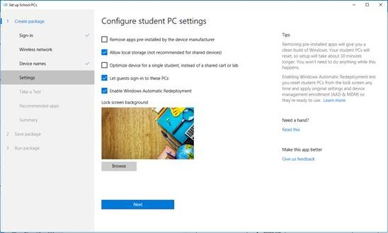

# Reset devices with Windows Automatic Redeployment 
**Applies to:**

-   Windows 10, version 1709 

IT admins or technical teachers can use Windows Automatic Redeployment to quickly remove personal files, apps, and settings, and reset Windows 10 devices from the lock screen any time and apply original settings and management enrollment (Azure Active Directory and device management) so the devices are ready to use. With Windows Automatic Redeployment, devices are returned to a fully configured or known IT-approved state.

To enable Windows Automatic Redeployment in Windows 10, version 1709 (Fall Creators Update), you must:

1. [Enable the policy for the feature](#enable-windows-automatic-redeployment)
2. [Trigger a reset for each device](#trigger-windows-automatic-redeployment)

## Enable Windows Automatic Redeployment
**DisableAutomaticReDeploymentCredentials** is a policy that enables or disables the visibility of the credentials for Windows Automatic Redeployment. It is a policy node in the [Policy CSP](https://docs.microsoft.com/windows/client-management/mdm/policy-csp-credentialproviders), **CredentialProviders/DisableAutomaticReDeploymentCredentials**. By default, this policy is set to 1 (Disable). This ensures that Windows Automatic Redeployment isn't triggered by accident.

You can set the policy using one of these methods:

- MDM provider

    - Windows Automatic Redeployment in Intune for Education is coming soon. In a future update of Intune for Education, new tenants will automatically have the Windows Automatic Redeployment setting enabled by default on the **All devices** group as part of initial tenant configuration. You will also be able to manage this setting to target different groups in the admin console.
    - If you're using an MDM provider other than Intune for Education, check your MDM provider documentation on how to set this policy. If your MDM provider doesn't explicitly support this policy, you can manually set this policy if your MDM provider allows specific OMA-URIs to be manually set.

        For example, in Intune, create a new configuration policy and add an OMA-URI. 
        - OMA-URI:  ./Vendor/MSFT/Policy/Config/CredentialProviders/DisableAutomaticReDeploymentCredentials
        - Data type:  Integer
        - Value:  0

- Windows Configuration Designer
    
    You can [use Windows Configuration Designer](https://docs.microsoft.com/windows/configuration/provisioning-packages/provisioning-create-package) to set the **Runtime settings > Policies > CredentialProviders > DisableAutomaticReDeploymentCredentials** setting and create a provisioning package.

- Set up School PCs app

    Windows Automatic Redeployment in the Set up School PCs app is available in the latest release of the app. Make sure you are running Windows 10, version 1709 on the student PCs if you want to use Windows Automatic Redeployment through the Set up School PCs app. You can check the version several ways:
    - Reach out to your device manufacturer.
    - If you manage your PCs using Intune or Intune for Education, you can check the OS version by checking the **OS version** info for the device. If  you are using another MDM provider, check the documentation for the MDM provider to confirm the OS version.
    - Log into the PCs, go to the **Settings > System > About** page, look in the **Windows specifications** section and confirm **Version** is set to 1709.

    To use the Windows Automatic Redeployment setting in the Set up School PCs app:
    * When using [Set up School PCs](use-set-up-school-pcs-app.md), in the **Configure student PC settings** screen, select **Enable Windows 10 Automatic Redeployment** among the list of settings for the student PC as shown in the following example:

    
    
## Trigger Windows Automatic Redeployment
Windows Automatic Redeployment is a two-step process: trigger it and then authenticate. Once you've done these two steps, you can let the process execute and once it's done, the device is again ready for use. 

**To trigger Windows Automatic Redeployment**

1. From the Windows device lock screen, enter the keystroke: **CTRL +  + R**. 

    

    This will open up a custom login screen for Windows Automatic Redeployment. The screen serves two purposes:
    1. Confirm/verify that the end user has the right to trigger Windows Automatic Redeployment
    2. Notify the user in case a provisioning package, created using Windows Configuration Designer or Set up School PCs, will be used as part of the process.

    

2. Sign in with the admin account credentials. If you created a provisioning package, plug in the USB drive and trigger Windows Automatic Redeployment.

    Once Windows Automatic Redeployment is triggered, the reset process starts. 
    
    After reset, the device:
    - Sets the region, language, and keyboard.
    - Connects to Wi-Fi.
    - If you provided a provisioning package when Windows Automatic Redeployment is triggered, the system will apply this new provisioning package. Otherwise, the system will re-apply the original provisioning package on the device. 
    - Is returned to a known good managed state, connected to Azure AD and MDM.

     

    Once provisioning is complete, the device is again ready for use.

## Related topics

[Set up Windows devices for education](set-up-windows-10.md)

