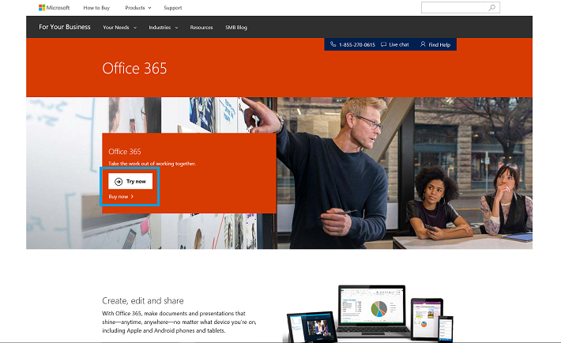
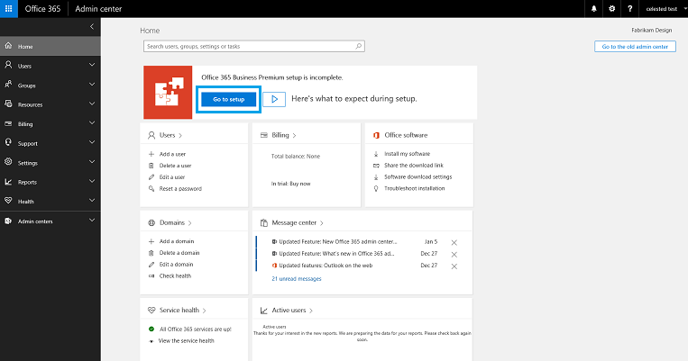
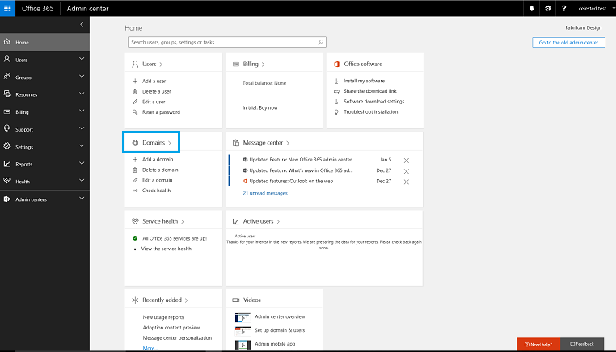
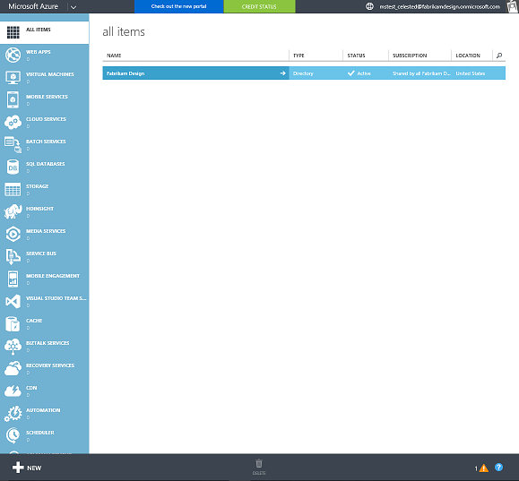
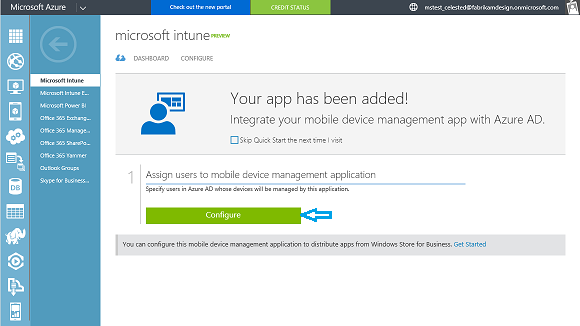

# Get started: Deploy and manage a full cloud IT solution for your business
**Applies to:**

-   Windows 10

> [!IMPORTANT]  
> This is placeholder content only. Everything is TBD.

In this walkthrough, we'll show you how to deploy and manage a full cloud IT solution for your small to medium business using Microsoft Azure AD, Intune, Office 365, and Windows. We'll show you the basics on how to:
- Acquire an Office 365 business domain
- Add Microsoft Intune and Azure Active Directory (AD) Premium licenses to your business tenant
- Set up Windows Store for Business and manage app deployment and sync with Intune
- Add users and groups in Azure AD and Intune
- Create policies and app deployment rules
- Log in as a user and start using the device

Go to the <a href="http://business.microsoft.com" target="_blank">Microsoft Business site</a> and select **Products** to learn more about pricing and purchasing options for businesses.

## 1. Get ready
Here's a few things to keep in mind before you get started:
- You'll need a registered domain to successfully go through the walkthrough.
  - If you already own a domain, you can add this during the Office 365 setup.
  - If you don't already own a domain, you'll have the option to purchase a domain from the Office 365 admin center. We'll show how to do this as part of the walkthrough.
- You'll need an email address to create your Office 365 tenant.

## 2. Set up your cloud infrastructure
To set up a cloud infrastructure for your organization, follow the steps in this section.

### 2.1 Set up Office 365 for business
See <a href="https://support.office.com/en-us/article/Set-up-Office-365-for-business-6a3a29a0-e616-4713-99d1-15eda62d04fa" target="_blank">Set up Office 365 for business</a> to learn more about the setup steps for businesses and nonprofits who have Office 365. You can watch video and learn how to:
- Plan your setup
- Create Office 365 accounts and how to add your domain.
- Install Office

To set up your Office 365 business tenant, see <a href="https://support.office.com/en-us/article/Get-started-with-Office-365-for-Business-d6466f0d-5d13-464a-adcb-00906ae87029" target="_blank">Get Started with Office 365 for business</a>.

If this is the first time you're setting this up, and you'd like to see how it's done, you can follow these steps to get started:
1. Go to the <a href="https://business.microsoft.com/en-us/products/office-365" target="_blank">Office 365</a> page in the <a href="http://business.microsoft.com" target="_blank">Microsoft Business site</a>. Select **Try now** to use the Office 365 Business Premium Trial or select **Buy now** to sign up for Office 365 Business Premium. In this walkthrough, we'll select **Try now**.

  **Figure 1** - Try or buy Office 365

  

2. Fill out the sign up form and provide information about you and your company.
3. Create a user ID and password to use to sign into your account.
  This step creates an onmicrosoft.com email address. You can use this email address to sign in to the various admin centers. Save your sign-in info so you can use it to sign into <a href="https://portal.office.com" target="_blank">https://portal.office.com</a> (the admin portal).
4. Select **Create my account** and then enter the phone number you used in step 2 to verify your identity. You'll be asked to enter your verification code.
5. Select **You're ready to go...** which will take you to the Office 365 portal.

  > [!NOTE]  
  > In the Office 365 portal, icons that are greyed out are still installing.

  **Figure 2** - Office 365 portal

  

6. Select the **Admin** tile to go to the Office 365 admin center.
7. In the admin center, click **Next** to see the highlights and welcome info for the admin center. When you're done, click **Go to setup** to complete the Office 365 setup.

  This may take up to a half hour to complete.

  **Figure 3** - Office 365 admin center

  

8. Go back to the <a href="https://portal.office.com/adminportal/home#/homepage" target="_blank">Office 365 admin center</a> to add or buy a domain.
  1. Select the **Domains** option.

    **Figure 4** - Option to add or buy a domain

    

  2.  In the **Home > Domains** page, you will see the Microsoft-provided domain, such as *fabrikamdesign.onmicrosoft.com*.

    **Figure 5** - Microsoft-provided domain

    

    - If you already have a domain, select **+ Add domain** to add your existing domain. If you select this option, you'll be required to verify that you own the domain. Follow the steps in the wizard to verify your domain.
    - If you don't already own a domain, select **+ Buy domain**. If you're using a trial plan, you'll be required to upgrade your trial plan in order to buy a domain. Choose the subscription plan to use for your business and provide the details to complete your order.

    Once you've added your domain, you'll see it listed in addition to the Microsoft-provided onmicrosoft.com domain.

    **Figure 6** - Domains

    

### 2.2 Add users and assign product licenses
Once you've set up Office and added your domain, it's time to add users so they have access to Office 365. People in your organization need an account before they can sign in and access Office 365. The easiest way to add users is to add them one at a time in the Office 365 admin center.

When adding users, you can also assign admin privileges to certain users in your team. You'll also want to assign **Product licenses** to each user so that subscriptions can be assigned to the person.

**To add users and assign product licenses**

1. In the <a href="https://portal.office.com/adminportal/home#/homepage" target="_blank">Office 365 admin center</a>, select **Users > Active users**.

  **Figure 7** - Add users

  

2. In the **Home > Active users** page, add users individually or in bulk.
  - To add users one at a time, select **+ Add a user**.

    If you select this option, you'll see the **New user** screen and you can add details about the new user including their name, user name, role, and so on. You also have the opportunity to assign **Product licenses**. For detailed step-by-step info on adding a user account, see *Add a user account in the Office 365 admin center* in <a href="https://support.office.com/en-us/article/Add-users-individually-or-in-bulk-to-Office-365-Admin-Help-1970f7d6-03b5-442f-b385-5880b9c256ec" target="_blank">Add users individually or in bulk to Office 365 - Admin Help</a>.

    **Figure 8** - Add an individual user

    

  - To add multiple users at once, select **More** and then choose **+ Import multiple users**. If you select this option, you'll need to create and upload a CSV file containing the list of users.

    The **Import multiple users** screen includes a link where you can learn more about importing multiple users and also links for downloading a sample CSV file (one with headers only and another with headers and sample user information). For detailed step-by-step info on adding multiple users to Office 365, see <a href="https://support.office.com/en-us/article/Add-several-users-at-the-same-time-to-Office-365-Admin-Help-1f5767ed-e717-4f24-969c-6ea9d412ca88" target="_blank">Add several users at the same time to Office 365 - Admin Help</a>. Once you've added all the users, don't forget to assign **Product licenses** to the new users.

    **Figure 9** - Import multiple users

    

3. Verify that all the users you added appear in the list of **Active users**. The **Status** should indicate the product licenses that were assigned to them.

  **Figure 10** - List of active users

  

### 2.3 Add Microsoft Intune
Intune...

**To add Microsoft Intune**

1. In the <a href="https://portal.office.com/adminportal/home#/homepage" target="_blank">Office 365 admin center</a>, select **Billing > Purchase services**.
2. In the **Home > Purchase services** screen, search for **Microsoft Intune**. Hover over **Microsoft Intune** to see the options to start a free 30-day trial or to buy now.
3. Confirm your order to enable access to Microsoft Intune.
4. In the admin center, the Intune licenses will show as available and ready to be assigned to users. Select **Users > Active users** and then edit the product licenses assigned to the users to turn on **Intune A Direct**.

  **Figure 11** - Assign Intune licenses

  

5. In the admin center, confirm that **Intune** shows up in the list under **Admin centers**. If it doesn't, sign out and then sign back in and then check again.
6. Select **Intune**. This will take you to the Intune management portal.

  **Figure 12** - Microsoft Intune management portal

  

7. TBD - To be continued

### 2.3 Add Azure AD to your domain
Microsoft Azure is an open and flexible cloud platform that enables you to quickly build, deploy, and manage apps across a global network of Microsoft-managed datacenters. In this walkthrough, we won't be using the full power of Azure and we'll primarily use it to create groups that we then use for provisioning through Intune. 

**To add Azure AD to your domain**

1. In the <a href="https://portal.office.com/adminportal/home#/homepage" target="_blank">Office 365 admin center</a>, select **Admin centers > Azure AD**.

  > [!NOTE]
  > You will need Azure AD Premium to configure automatic MDM enrollment with Intune.

2. If you have not signed up for Azure AD before, you will see the following message. To proceed with the rest of the walkthrough, you need to activate an Azure subscription.

  **Figure 13** - Access to Azure AD is not available

  

3. From the error message, select the country/region for your business. This should match with the location you specified when you signed up for Office 365.
4. Click **Azure subscription**. This will take you to a free trial sign up screen.

  **Figure 14** - Sign up for Microsoft Azure

  

5. In the **Free trial sign up** screen, fill in the required information and then click **Sign up**.
6. After you sign up, you should see the message that your subscription is ready. Click **Start managing my service**.

  **Figure 15** - Start managing your Azure subscription

  

  This will take you to the <a href="https://portal.azure.com" target="_blank">Microsoft Azure portal</a>.

### 2.4 Add groups in Azure AD
To add Azure AD group(s), we will use the <a href="https://manage.windowsazure.com/" target="_blank">classic Azure portal (https://manage.windowsazure.com)</a>. See <a href="https://docs.microsoft.com/en-us/azure/active-directory/active-directory-accessmanagement-manage-groups" target="_blank">Managing groups in Azure Active Directory</a> for more information about managing groups.

You can use the group(s) you add in Azure AD as the group you use for provisioning settings or apps through Intune.

**To add groups in Azure AD**

1. If this is the first time you're setting up your directory, when you navigate to the **Azure Active Directory** node in the <a href="https://manage.windowsazure.com/" target="_blank">classic Azure portal</a>, you will see a screen informing you that your directory is ready for use.

  Afterwards, you should see a list of active directories. In the following example, **Fabrikam Design** is the active directory.

  **Figure 16** - Azure first sign-in screen

  

2. Select the directory (such as Fabrikam Design) to go to the directory's home page.

  **Figure 17** - Directory home page

  

3. From the menu options on top, select **Groups**.

  **Figure 18** - Azure AD groups

  

4. Select **Add a group** (from the top) or **Add group** at the bottom.
5. In the **Add Group** window, add a name, group type, and description for the group and click the checkmark to save your changes. The new group will appear on the groups list.

  **Figure 19** - Newly added group in Azure AD

  

6. In the **Groups** tab, select the arrow next to the group (such as **All users**), add members to the group, and then save your changes.

  The members that were added to the group will appear on the list.

  **Figure 20** - Members in the new group

  

7. Repeat steps 2-6 to add other groups. You can add groups based on their roles in your company, based on the apps that each group can use, and so on.

### 2.5 Configure automatic MDM enrollment with Intune
Now that you have Azure AD Premium and have it properly configured, you can configure automatic MDM enrollment with Intune, which allows users to enroll their Windows devices into Intune management, join their devices directly to Azure AD, and get access to Office 365 resources after sign in.

You can read <a href="https://blogs.technet.microsoft.com/enterprisemobility/2015/08/14/windows-10-azure-ad-and-microsoft-intune-automatic-mdm-enrollment-powered-by-the-cloud/" target="_blank">this blog post</a> to learn how you can combine login, Azure AD Join, and Intune MDM enrollment into an easy step so that you can bring your devices into a managed state that complies with the policies for your organization. We will use this blog post as our guide for this part of the walkthrough.

> [!IMPORTANT]  
> We will use the classic Azure portal instead of the new portal to configure automatic MDM enrollment with Intune.

**To enable automatic MDM enrollment**

1. In to the <a href="https://manage.windowsazure.com/" target="_blank">classic Azure portal</a>, click on your company's Azure Active Directory to go back to the main window. Select **Applications** from the list of directory menu options. 

  The list of applications for your company will appear. **Microsoft Intune** will be one of the applications on the list.

  **Figure 21** - List of applications for your company

  

2. Select **Microsoft Intune** to configure the application.
3. In the Microsoft Intune configuration page, click **Configure** to start automatic MDM enrollment configuration with Intune.

  **Figure 22** - Configure Microsoft Intune in Azure

  

4. In the Microsoft Intune configuration page:
  - In the **Properties** section, you should see a list of URLs for MDM discovery, MDM terms of use, and MDM compliance.

    > [!NOTE]  
    > The URLs are automatically configured for your Azure AD tenant so you don't need to change them.

  - In the **Manage devices for these users** section, you can specify which users' devices should be managed by Intune.
    - **All** will enable all users' Windows 10 devices to be managed by Intune.
    - **Groups** let you select whether only users that belong to a specific group will have their devices managed by Intune.

    > [!NOTE]  
    > In this step, choose the group that contains all the users in your organization as members. This is the **All** group.

5. After you've chosen how to manage devices for users, select **Save** to enable automatic MDM enrollment with Intune.

  **Figure 23** - Configure Microsoft Intune

  

### 2.6 Configure Windows Store for Business for app distribution
Next, you'll need to configure Windows Store for Business to distribute apps with a management tool such as Intune.

In this part of the walkthrough, we'll be working on the <a href="https://manage.microsoft.com/" target="_blank">Microsoft Intune management portal</a> and <a href="https://businessstore.microsoft.com/en-us/Store/Apps" target="_blank">Windows Store for Business</a>.

**To associate your Store account with Intune and configure synchronization**

1. From the <a href="https://manage.microsoft.com/" target="_blank">Microsoft Intune management portal</a>, select **Admin**.
2. Sign into <a href="https://businessstore.microsoft.com/en-us/Store/Apps" target="_blank">Windows Store for Business</a> using the same tenant account that you used to sign into Intune.
3. Accept the EULA.
5. In the Store portal, select **Settings > Management tools** to go to the management tools page.\
6. TBD - To be continued.

## 3. Set up devices

### 3.1 Set up new devices
To set up new Windows devices, go through the Windows initial device setup or first-run experience to configure your device.

**To set up a device**
1. Go through the Windows device setup experience. On a new or reset device, this starts with the **Hi there** screen.
2. If you don't have a Wi-Fi network configured, make sure you connect the device to the Internet through a wired/Ethernet connection.
3. Select the option to **Join this device to Azure Active Directory**.
4. Sign in using one of the accounts you set up for your education tenant.

### 3.2 Verify correct device setup
Verify that the device is set up correctly and boots without any issues.

**To verify that the device was set up correctly**
1. Click on the **Start** menu and select some of the options to make sure everything launches properly.
2. Confirm that the Store and built-in apps are working.

### 3.3 Verify the device is Azure AD joined
In the Intune management console, verify that the device is joined to Azure AD and shows up as being managed in Microsoft Intune.

**To verify if the device is joined to Azure AD**
1. Log in to the Intune management console.
2. Select **Groups** and go to **Groups > All Devices > All Mobile Devices**.
3. Select **All Direct Managed Devices** and then select the **Devices** tab.
4. See the list of devices and verify that the device you're signed into appears on the list.

  **Figure XX** - List of all direct managed devices
  

### 3.4 Reconfigure app deployment settings
In some cases, if an app is missing from the device, you need to reconfigure the deployment settings for the app and set the app to require installation as soon as possible.

**To reconfigure app deployment settings**
1. In the Intune management console, select **Apps** and go to **Apps > Volume-Purchased Apps**.
2. Select the app, right-click, then select **Manage Deployment...**.
3. Select the group(s) whose apps will be managed.
4. Check the **Deployment Action** setting for the app.
5. For each group that you selected, set **Approval** to **Required Install**. This automatically sets **Deadline** to **As soon as possible**. If **Deadline** is not automatically set, set it to **As soon as possible**.

  **Figure XX** - Reconfigure an app's deployment setting in Intune
  

6. Verify that the app shows up on the device. You can check which users and devices have the app installed by selecting the app and checking the status in the **General** tab or selecting the **Devices** or **Users** tab.

## 4. Manage device settings and features
You can use Microsoft Intune admin settings and policies to manage features on your organization's mobile devices and computers. For more info, see [Manage settings and features on your devices with Microsoft Intune policies](https://docs.microsoft.com/en-us/intune/deploy-use/manage-settings-and-features-on-your-devices-with-microsoft-intune-policies).

In this walkthrough, we'll show you how to add a new policy that will disable the camera for the Intune-managed devices and turn off Windows Hello and PINs during setup.

**To disable the camera**
1. In the Intune admin console, choose **Policy > Configuration Policies > Add**.
2. On the **Create a New Policy** page, select **Windows > General Configuration (Windows 10 Desktop and Mobile and later)**.
3. Click **Create Policy**.
4. On the **Create Policy** page, select **Device Capabilities**.
5. In the **General** section, add a name and description for this policy. For example:
  - **Name**: Test Policy - Disable Camera
  - **Description**: Disables the camera
6. In the **Hardware** section, configure **Allow camera** and choose **No** from the dropdown list.
7. Click **Save Policy**.
8. On the **Deploy Policy** dialog box, select **Yes** to deploy the policy now.
9. On the **Management Deployment** dialog box, select the user group(s) or device group(s) that you want to apply the policy to. For example, select **All Students**.
10. Click **OK**.

**To turn off Windows Hello and PINs during device setup**
1. In the Intune admin console, select **Admin**.
2. Navigate to **Mobile Device Management > Windows > Windows Hello for Business**.
3. In the **Windows Hello for Business** page, select **Disable Windows Hello for Business on enrolled devices**.
4. Click **Save**.

  > [!NOTE]
  > This policy is a tenant-wide Intune setting. It disables Windows Hello and required PINs during setup for all enrolled devices in a tenant.

## 5. Add more devices and users
After your cloud infrastructure is set up and you have a device management strategy in place, you may need to add more devices or users and you want the same policies to apply to these new devices and users. In this section, we'll show you how to do this.

### 5.1 Connect other devices to your cloud infrastructure
Adding a new device to your cloud-based tenant is easy. For new devices, you can follow the steps in [3. Set up devices](#3-set-up-devices). For other devices, such as those personally-owned by teachers who need to connect to the school network to access work or school resources (BYOD), you can follow the steps in this section to get these devices connected.

  > [!NOTE]
  > These steps enable users to get access to the organization's resources, but it also gives the organization some control over the device.

**To connect a device to your work or school**
1. On your Windows device, go to **Settings > Accounts**.
2. Select **Work access** and then click **Add a work or school account** to add an Azure AD account to the device.
3. Enter the work credentials for the account to authenticate the user.
4. If it appears, accept the MDM terms prescribed by the organization to allow the device to be managed.
  Once this is done, the device should be registered in Azure AD and enrolled in MDM and the account should have access to the organization's resources.

### 5.2 Add a new user
You can add new users to your tenant simply by adding them to the Office 365 groups. Adding new users to Office 365 groups automatically adds them to the corresponding groups in Microsoft Intune.

See [Add users to Office 365](https://support.office.com/en-us/article/Add-users-to-Office-365-for-business-435ccec3-09dd-4587-9ebd-2f3cad6bc2bc?ui=en-US&rs=en-US&ad=US&fromAR=1) to learn more. Once you're done adding new users, go to the Intune admin portal and verify that the same users were added to the Intune groups as well.
