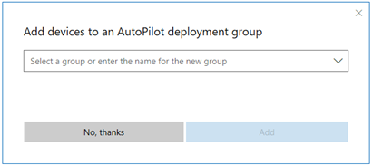

# Add Windows AutoPilot deployment profile to devices

**Applies to**

-   Windows 10
-   Windows 10 Mobile

## What is Windows AutoPilot Deployment Program?
Windows AutoPilot Deployment Program simplifies device set up for IT Admins. You create and apply an AutoPilot deployment profile to your devices. When people in your organization run the out-of-box experience on the device, it installs and configures Windows based on the AutoPilot deployment profile you applied to the device. 

By default, these items are included in Windows AutoPilot deployment profiles:
- Skips setup for Cortana, OneDrive, and OEM registration
- Automatically sets up work or school accounts

You can decide whether or not to set these items in Windows AutoPilot deployment profiles:
- Skip privacy settings
- Disable local admin account creation on the device

### Windows AutoPilot Deployment Program requirements
Verify this list ... 
- Devices pre-installed with Windows 10 Pro Creators Update (version 1703 or later) 
- The devices must have access to the internet. When the device can’t connect, it shows the default Windows out-of-box experience (OOBE) screens.
- Enrolling the device into an MDM requires Azure Active Directory Premium.

For more information, see [Overview of Windows AutoPilot](https://review.docs.microsoft.com/en-us/windows/deployment/windows-10-auto-pilot?branch=dh-autopilot11975619).

## Windows AutoPilot deployment profiles in Microsoft Store for Business and Education
You can manage new devices in Microsoft Store for Business or Microsoft Store for Education. Devices need to meet these requirements:
- Windows 10 (versions ...)
- Specific hardware vendor???
- New devices that have not been through Windows out-of-box experience. 

You can create and apply AutoPilot deployment profiles to these devices. The overall process looks like this. 

Figure 1 - Windows AutoPilot Deployment Program process

## Add devices and apply AutoPilot deployment profile
To manage devices through Microsoft Store for Business and Education, you'll need a .csv file that contains specific information about the devices. You should be able to get this from your Microsoft account contact, or the store where you purchased the devices. Upload the .csv file to Microsoft Store to add the devices. 

The device information file needs to be in this format:

| Column    | Data |
| --------- | ---- |
| Serial Number | data type 1|
| Product Id | data type 2|
| Hardware Hash | data type 3|

When you add devices, you need to add them to a *device group*. Device groups allow you to apply an AutoPilot deployment profile to mutliple devices. The first time you add devices to a group, you'll need to create a device group. 

**Add and group devices**
1. Sign in to [Microsoft Store for Business](http://businessstore.microsoft.com) or [Microsoft Store for Education](https://educationstore.microsoft.com). 
2. Click **Manage**, and then click **Devices**.
3. Click **Add devices**, navigate to the *.csv file and select it. 
4. Type a name for a new device group, or choose one from the list, and then click **Add**.  
If you don't add devices to a group, you can select the individual devices to apply a profile to.    
 
 
5. Click the devices or device group that you want to manage. You need to select devices before you can apply an AutoPilot deployment profile. 

**Apply AutoPilot deployment profile**
1. When you have devices selected, click **AutoPilot deployment**. 
2. Choose the AutoPilot deployment profile to apply to the selected devices. 
> [!NOTE]
> The first time you use AutoPilot deployment profiles, you'll need to create one. See Create AutoPilot profile. 
3. Microsoft Store for Business applies the profile to your selected devices, and shows the profile name on **Devices**. 

## Manage AutoPilot deployment profiles
You can manage the AutoPiolot deployment profiles that you created in Microsoft Store for Business. You can create a new profile, editing or delete a profile. 

AutoPilot deployment profiles have two main parts: default settings that can't be changed, and optional settings that you can include. 

### AutoPilot deployment profiles - default settings
These settings are configured with all AutoPilot deployment profiles:
- Skip Cortana, OneDrive, and OEM registration setup pages
- Automatically setup for work or school
- Sign in experience with company or school brand 

### AutoPilot deployment profiles - optional settings
These settings are off by default. You can turn them on for your AutoPilot deployment profiles:
- Skip privacy settings
- Disable local admin account creation on the device

**Create AutoPilot profile**
1. Sign in to [Microsoft Store for Business](http://businessstore.microsoft.com) or [Microsoft Store for Education](https://educationstore.microsoft.com). 
2. Click **Manage**, and then click **Devices**.
3. Click **AutoPilot deployment**, and then click **Create new profile**
**Edit AutoPilot profile**

**Delete AutoPilot profile**

## Apply a different AutoPilot deployment profile to devices
After you've applied an AutoPilot deployment profile to a device, you can remove the profile and apply a new profile. 

