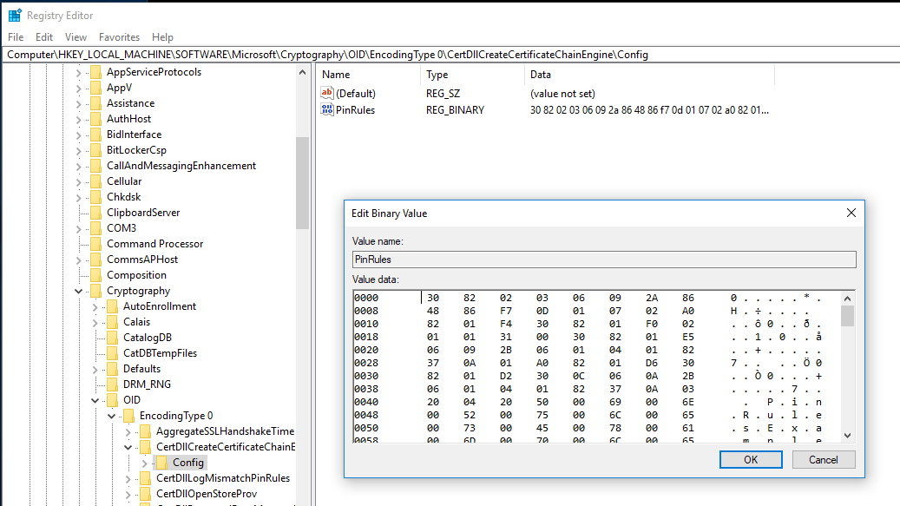
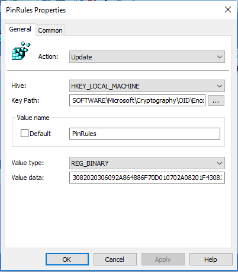
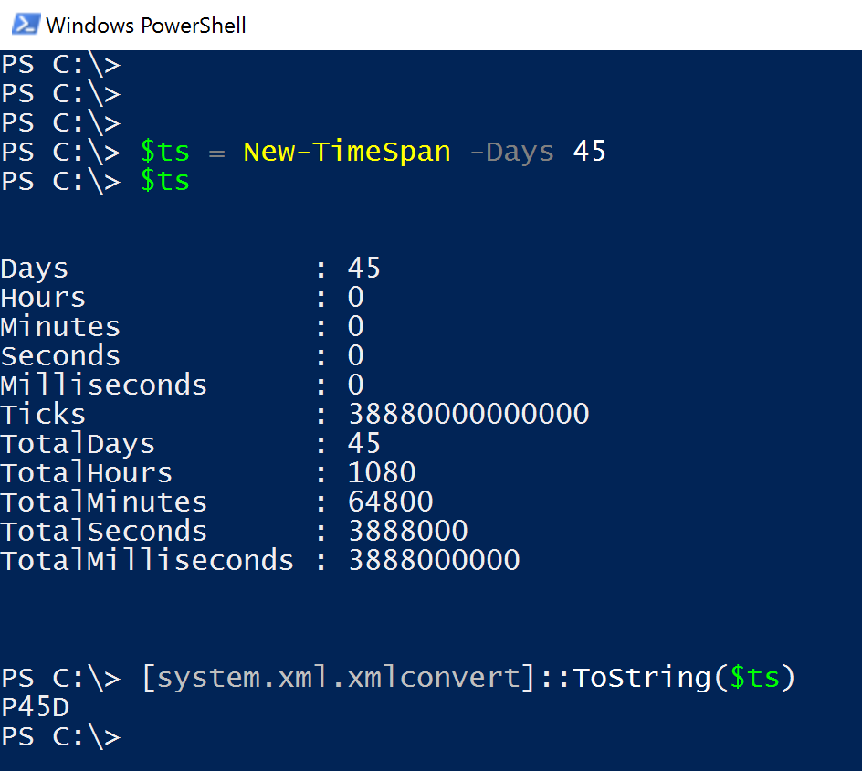
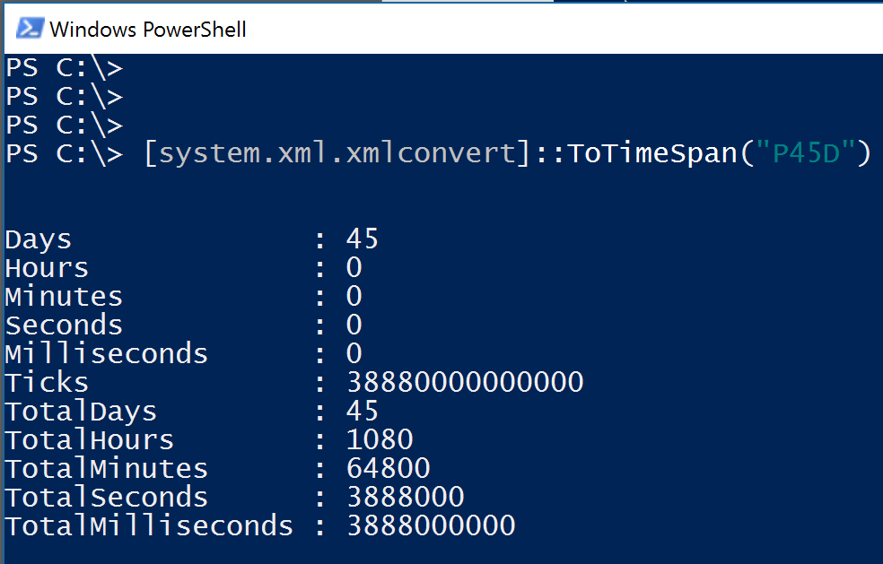

# Enterprise Certificate Pinning

**Applies to**
-   Windows 10

Enterprise certificate pinning is a Windows feature for remembering, or “pinning,” a root issuing certificate authority or end entity certificate to a given domain name. 
Enterprise certificate pinning helps reduce man-in-the-middle attacks by enabling you to protect your internal domain names from chaining to unwanted certificates or to fraudulently issued certificates.

>[!NOTE] 
> External domain names, where the certificate issued to these domains is issued by a public certificate authority, are not ideal for enterprise certificate pinning.

Windows Certificate APIs (CertVerifyCertificateChainPolicy and WinVerifyTrust) are updated to check if the site’s server authentication certificate chain matches a restricted set of certificates. 
These restrictions are encapsulated in a Pin Rules Certificate Trust List (CTL) that is configured and deployed to Windows 10 computers. 
Any site certificate triggering a name mismatch causes Windows to write an event to the CAPI2 event log and prevents the user from navigating to the web site using Microsoft Edge or Internet Explorer.

## Deployment

To deploy enterprise certificate pinning, you need to:

- Create a well-formatted certificate pinning rule XML file
- Create a pin rules certificate trust list file from the XML file
- Apply the pin rules certificate trust list file to a reference administrative computer
- Deploy the registry configuration on the reference computer using Group Policy Management Console (GPMC), which is included in the [Remote Server Administration Tools (RSAT)](https://www.microsoft.com/download/details.aspx?id=45520).

### Create a Pin Rules XML file  

The XML-based pin rules file consists of a sequence of PinRule elements. 
Each PinRule element contains a sequence of one or more Site elements and a sequence of zero or more Certificate elements.

```code
<PinRules ListIdentifier="PinRulesExample" Duration="P28D">

  <PinRule Name="AllCertificateAttributes" Error="None" Log="true">
    <Certificate File="Single.cer"/>
    <Certificate File="Multiple.p7b"/>
    <Certificate File="Multiple.sst"/>
    <Certificate Directory="Multiple"/>
    <Certificate Base64="MIIBy … QFzuM"/>
    <Certificate File="WillExpire.cer" EndDate="2015-05-12T00:00:00Z"/>
    <Site Domain="xyz.com"/>
  </PinRule>

  <PinRule Name="MultipleSites" Log="false">
    <Certificate File="Root.cer"/>
    <Site Domain="xyz.com"/>
    <Site Domain=".xyz.com"/>
    <Site Domain="*.abc.xyz.com" AllSubdomains="true"/>
    <Site Domain="WillNormalize.com"/>
  </PinRule>

</PinRules>

```

#### PinRules Element

The PinRules element can have the following attributes. 
For help with formatting Pin Rules, see [Representing a Date in XML](#representing-a-date-in-xml) or [Representing a Duration in XML](#representing-a-duration-in-xml). 

| Attribute | Description | Required |
|-----------|-------------|----------|
|  **Duration** or **NextUpdate** | Specifies when the Pin Rules will expire. Either is required. **NextUpdate** takes precedence if both are specified. <br>  **Duration**, represented as an XML TimeSpan data type, does not allow years and months. You represent the **NextUpdate** attribute as a XML DateTime data type in UTC.  | **Required?** Yes. At least one is required. |
| **LogDuration** or **LogEndDate** | Configures auditing only to extend beyond the expiration of enforcing the Pin Rules. <br>  **LogEndDate**, represented as an XML DateTime data type in UTC, takes precedence if both are specified. <br>  You represent **LogDuration** as an XML TimeSpan data type, which does not allow years and months. <br>  If neither attribute is specified, auditing expiration uses **Duration** or **NextUpdate** attributes. | No. | 
| **ListIdentifier** | Provides a friendly name for the list of pin rules. Windows does not use this attribute for certificate pinning enforcement, however it is included when the pin rules are converted to a certificate trust list (CTL). | No. |

#### PinRule Element    

The **PinRule** element can have the following attributes. 

| Attribute | Description | Required |
|-----------|-------------|----------|
| **Name**  | Uniquely identifies the **PinRule**. Windows uses this attribute to identify the element for a parsing error or for verbose output. The attribute is not included in the generated certificate trust list (CTL). | Yes.|
| **Error** | Describes the action Windows performs when it encounters a PIN mismatch. You can choose from the following string values: <br>- **Revoked** - Windows reports the certificate protecting the site as if it was revoked. This typically prevents the user from accessing the site. <br>- **InvalidName** - Windows reports the certificate protecting the site as if the name on the certificate does not match the name of the site. This typically results in prompting the user before accessing the site. <br>- **None** - The default value.  No error is returned. You can use this setting to audit the pin rules without introducing any user friction. | No. |
| **Log** | A Boolean value represent as string that equals **true** or **false**. By default, logging is enabled (**true**). | No. |

#### Certificate element 

The **Certificate** element can have the following attributes.

| Attribute | Description | Required |
|-----------|-------------|----------|
| **File**  | Path to a file containing one or more certificates.  Where the certificate(s) can be encoded as: <br>- single certificate <br>- p7b <br>- sst <br> These files can also be Base64 formatted.  All **Site** elements included in the same **PinRule** element can match any of these certificates. | Yes (File, Directory or Base64 must be present). |
| **Directory** | Path to a directory containing one or more of the above certificate files. Skips any files not containing any certificates. | Yes (File, Directory or Base64 must be present). | 
| **Base64** | Base64 encoded certificate(s). Where the certificate(s) can be encoded as: <br>- single certificate <br>- p7b <br> - sst <br> This allows the certificates to be included in the XML file without a file directory dependency. <br> Note: <br> You can use **certutil -encode** to convert a .cer file into base64. You can then use Notepad to copy and paste the base64 encoded certificate into the pin rule.  | Yes (File, Directory or Base64 must be present). |
| **EndDate** | Enables you to configure an expiration date for when the certificate is no longer valid in the pin rule. <br>If you are in the process of switching to a new root or CA, you can set the **EndDate** to allow matching of this element’s certificates.<br> If the current time is past the **EndDate**, then, when creating the certificate trust list (CTL), the parser outputs a warning message and exclude the certificate(s) from the Pin Rule in the generated CTL.<br> For help with formatting Pin Rules, see [Representing a Date in XML](#representing-a-date-in-xml).| No.|

#### Site element

The **Site** element can have the following attributes.

| Attribute | Description | Required |
|-----------|-------------|----------|
| **Domain** | Contains the DNS name to be matched for this pin rule. When creating the certificate trust list, the parser normalizes the input name string value as follows: <br>- If the DNS name has a leading "*" it is removed. <br>- Non-ASCII DNS name are converted to ASCII Puny Code. <br>- Upper case ASCII characters are converted to lower case. <br>If the normalized name has a leading ".", then, wildcard left hand label matching is enabled. For example, ".xyz.com" would match "abc.xyz.com". | Yes.|
| **AllSubdomains** | By default, wildcard left hand label matching is restricted to a single left hand label. This attribute can be set to "true" to enable wildcard matching of all of the left-hand labels.<br>For example, setting this attribute would also match "123.abc.xyz.com" for the ".xyz.com" domain value.| No.|
    
### Create a Pin Rules Certificate Trust List

The command line utility, **Certutil.exe**, includes the **generatePinRulesCTL** argument to parse the XML file and generate the encoded certificate trust list (CTL) that you add to your reference Windows 10 version 1703 computer and subsequently deploy. 
The usage syntax is:

```code
CertUtil [Options] -generatePinRulesCTL XMLFile CTLFile [SSTFile]
  Generate Pin Rules CTL
    XMLFile -- input XML file to be parsed.
    CTLFile -- output CTL file to be generated.
    SSTFile -- optional .sst file to be created.
         The .sst file contains all of the certificates
         used for pinning.

Options:
  -f                -- Force overwrite
  -v                -- Verbose operation
```

The same certificate(s) can occur in multiple **PinRule** elements. 
The same domain can occur in multiple **PinRule** elements. 
Certutil coalesces these in the resultant pin rules certificate trust list. 

Certutil.exe does not strictly enforce the XML schema definition. 
It does perform the following to enable other tools to add/consume their own specific elements and attributes:

- Skips elements before and after the **PinRules** element.
- Skips any element not matching **Certificate** or **Site** within the **PinRules** element.
- Skips any attributes not matching the above names for each element type.

Use the **certutil** command with the **generatePinRulesCTL** argument along with your XML file that contains your certificate pinning rules. 
Lastly, provide the name of an output file that will include your certificate pinning rules in the form of a certificate trust list.

```code
certutil -generatePinRulesCTL certPinRules.xml pinrules.stl
```

### Applying Certificate Pinning Rules to a Reference Computer

Now that your certificate pinning rules are in the certificate trust list format, you need to apply the settings to a reference computer as a prerequisite to deploying the setting to your enterprise. 
To simplify the deployment configuration, it is best to apply your certificate pinning rules to a computer that has the Group Policy Management Console (GPMC) that is include in the Remote Server Administration Tools (RSAT). 

Use **certutil.exe** to apply your certificate pinning rules to your reference computer using the **setreg** argument. 
The **setreg** argument takes a secondary argument that determines the location of where certutil writes the certificate pining rules. 
This secondary argument is **chain\PinRules**. 
The last argument you provide is the name of file that contains your certificate pinning rules in certificate trust list format (.stl). 
You’ll pass the name of the file as the last argument; however, you need to prefix the file name with the '@' symbol as shown in the following example. 
You need to perform this command from an elevated command prompt.

```code
Certutil -setreg chain\PinRules @pinrules.stl 
```

Certutil writes the binary information to the following registration location:

| Name | Value |
|------|-------|
| Key | HKLM\SOFTWARE\Microsoft\Cryptography\OID\EncodingType0\CertDllCreateCertificateChainEngine\Config |
| Name | PinRules |
| Value | Binary contents from the certificate pin rules certificate trust list file |
| Data type | REG_BINARY |



### Deploying Enterprise Pin Rule Settings using Group Policy

You’ve successfully created a certificate pinning rules XML file. 
From the XML file you have created a certificate pinning trust list file, and you have applied the contents of that file to your reference computer from which you can run the Group Policy Management Console. 
Now you need to configure a Group Policy object to include the applied certificate pin rule settings and deploy it to your environment.

Sign-in to the reference computer using domain administrator equivalent credentials.

1.	Start the **Group Policy Management Console** (gpmc.msc)
2.	In the navigation pane, expand the forest node and then expand the domain node.
3.	Expand the node that has contains your Active Directory’s domain name
4.	Select the **Group Policy objects** node.  Right-click the **Group Policy objects** node and click **New**.
5.	In the **New GPO** dialog box, type _Enterprise Certificate Pinning Rules_ in the **Name** text box and click **OK**.
6.	In the content pane, right-click the **Enterprise Certificate Pinning Rules** Group Policy object and click **Edit**.
7.	In the **Group Policy Management Editor**, in the navigation pane, expand the **Preferences** node under **Computer Configuration**. Expand **Windows Settings**.
8.	Right-click the **Registry** node and click **New**.
9.	In the **New Registry Properties** dialog box, select **Update** from the **Action** list.  Select **HKEY_LOCAL_MACHINE** from the **Hive** list.
10.	For the **Key Path**, click **…** to launch the **Registry Item Browser**.  Navigate to the following registry key and select the **PinRules** registry value name:

    HKLM\SOFTWARE\Microsoft\Cryptography\OID\EncodingType0\CertDllCreateCertificateChainEngine\Config  

    Click **Select** to close the **Registry Item Browser**.
    
11.	The **Key Path** should contain the selected registry key. The **Value name** configuration should contain the registry value name **_PinRules_**. **Value type** should read **_REG\_BINARY_** and **Value data** should contain a long series of numbers from 0-9 and letters ranging from A-F (hexadecimal).  Click **OK** to save your settings and close the dialog box.

    
    
12. Close the **Group Policy Management Editor** to save your settings.
13.	Link the **Enterprise Certificate Pinning Rules** Group Policy object to apply to computers that run Windows 10, version 1703 in your enterprise. When these domain-joined computers apply Group Policy, the registry information configured in the Group Policy object is applied to the computer.

## Additional Pin Rules Logging

To assist in constructing certificate pinning rules, you can configure the **PinRulesLogDir** setting under the certificate chain configuration registry key to include a parent directory to log pin rules.

| Name | Value |
|------|-------|
| Key | HKLM\SOFTWARE\Microsoft\Cryptography\OID\EncodingType0\CertDllCreateCertificateChainEngine\Config |
| Name | PinRulesLogDir |
| Value | The Parent directory where Windows should write the additional pin rule logs |
| Data type | REG_SZ |

### Permission for the Pin Rule Log Folder

The folder in which Windows writes the additional pin rule logs must have permissions so that all users and applications have full access. 
You can run the following commands from an elevated command prompt to achieved the proper permissions. 

```code
set PinRulesLogDir=c:\PinRulesLog
mkdir %PinRulesLogDir%
icacls %PinRulesLogDir% /grant *S-1-15-2-1:(OI)(CI)(F)
icacls %PinRulesLogDir% /grant *S-1-1-0:(OI)(CI)(F)  
icacls %PinRulesLogDir% /grant *S-1-5-12:(OI)(CI)(F)
icacls %PinRulesLogDir% /inheritance:e /setintegritylevel (OI)(CI)L
```

Whenever an application verifies a TLS/SSL certificate chain that contains a server name matching a DNS name in the server certificate, Windows writes a .p7b file consisting of all the certificates in the server’s chain to one of three child folders:

- AdminPinRules
    Matched a site in the enterprise certificate pinning rules.
- AutoUpdatePinRules
    Matched a site in the certificate pinning rules managed by Microsoft.
- NoPinRules
    Didn’t match any site in the certificate pin rules.

The output file name consists of the leading 8 ASCII hex digits of the root’s SHA1 thumbprint followed by the server name. 
For example:

- D4DE20D0_xsi.outlook.com.p7b
- DE28F4A4_www.yammer.com.p7b

If there is either an enterprise certificate pin rule or Microsoft certificate pin rule mismatch, then Windows writes the .p7b file to the **MismatchPinRules** child folder. 
If the pin rules have expired, then Windows writes the .p7b to the **ExpiredPinRules** child folder. 

## Representing a Date in XML

Many attributes within the pin rules xml file are dates.  
These dates must be properly formatted and represented in UTC.  
You can use Windows PowerShell to format these dates.  
You can then copy and paste the output of the cmdlet into the XML file. 


For simplicity, you can truncate decimal point (.) and the numbers after it. 
However, be certain to append the uppercase “Z” to the end of the XML date string.

```code
2015-05-11T07:00:00.2655691Z
2015-05-11T07:00:00Z
```

## Converting an XML Date

You can also use Windows PowerShell to validate convert an XML date into a human readable date to validate it’s the correct date.


## Representing a Duration in XML

Some elements may be configured to use a duration rather than a date. 
You must represent the duration as an XML timespan data type. 
You can use Windows PowerShell to properly format and validate durations (timespans) and copy and paste them into your XML file.



## Converting an XML Duration

You can convert a XML formatted timespan into a timespan variable that you can read. 



## Certificate Trust List XML Schema Definition (XSD)

```code
<xs:schema attributeFormDefault="unqualified" elementFormDefault="qualified" xmlns:xs="http://www.w3.org/2001/XMLSchema">
  <xs:element name="PinRules">
    <xs:complexType>
      <xs:sequence>
        <xs:element name="PinRule" maxOccurs="unbounded" minOccurs="1">
          <xs:complexType>
            <xs:sequence>
              <xs:element name="Certificate" maxOccurs="unbounded" minOccurs="0">
                <xs:complexType>
                  <xs:simpleContent>
                    <xs:extension base="xs:string">
                      <xs:attribute type="xs:dateTime" name="EndDate" use="optional"/>
                      <xs:attribute type="xs:string" name="File" use="optional"/>
                      <xs:attribute type="xs:string" name="Directory" use="optional"/>
                      <xs:attribute type="xs:base64Binary" name="Base64" use="optional"/>
                    </xs:extension>
                  </xs:simpleContent>
                </xs:complexType>
              </xs:element>
              <xs:element name="Site" maxOccurs="unbounded" minOccurs="1">
                <xs:complexType>
                  <xs:simpleContent>
                    <xs:extension base="xs:string">
                      <xs:attribute type="xs:string" name="Domain"/>
                      <xs:attribute type="xs:boolean" name="AllSubdomains" use="optional" default="false"/>
                    </xs:extension>
                  </xs:simpleContent>
                </xs:complexType>
              </xs:element>
            </xs:sequence>
            <xs:attribute type="xs:string" name="Name"/>
            <xs:attribute name="Error" use="optional" default="None">
              <xs:simpleType>
                <xs:restriction base="xs:string">
                  <xs:enumeration value ="Revoked"/>
                  <xs:enumeration value ="InvalidName"/>
                  <xs:enumeration value ="None"/>
                </xs:restriction>
              </xs:simpleType>
            </xs:attribute>
            <xs:attribute type="xs:boolean" name="Log" use="optional" default="true"/>
          </xs:complexType>
        </xs:element>
      </xs:sequence>
      <xs:attribute type="xs:duration" name="Duration" use="optional"/>
      <xs:attribute type="xs:duration" name="LogDuration" use="optional"/>
      <xs:attribute type="xs:dateTime" name="NextUpdate" use="optional"/>
      <xs:attribute type="xs:dateTime" name="LogEndDate" use="optional"/>
      <xs:attribute type="xs:string" name="ListIdentifier" use="optional"/>
    </xs:complexType>
  </xs:element>
</xs:schema>
```


