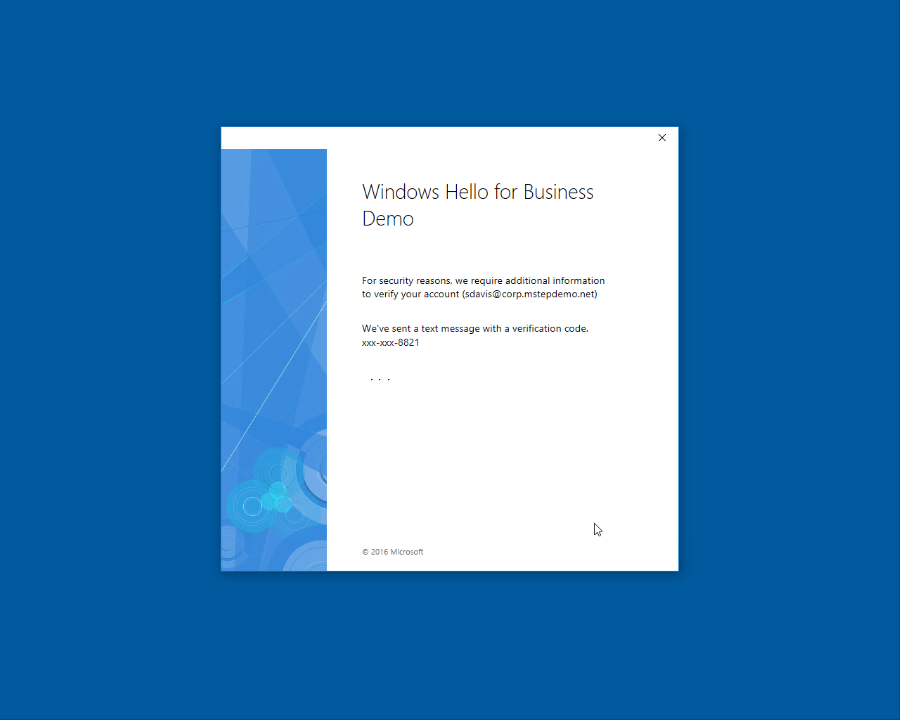
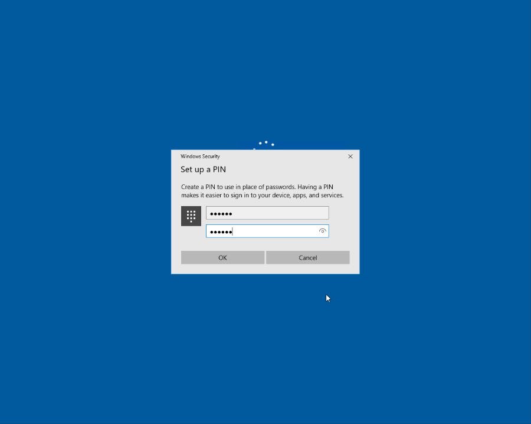

---
title: Hybrid Windows Hello for Business Provisioning (Windows Hello for Business)
description: Provisioning for Hybrid Windows Hello for Business Deployments
keywords: identity, PIN, biometric, Hello, passport, WHFB, hybrid, certificate-trust
ms.prod: w10
ms.mktglfcycl: deploy
ms.sitesec: library
ms.pagetype: security, mobile
author: mikestephens-MS
ms.author: mstephen
localizationpriority: high
ms.date: 10/23/2017
---
# Hybrid Windows Hello for Business Provisioning

**Applies to**
-   Windows 10

>This guide only applies to Hybrid deployments for Windows 10, version 1703 or higher.

## Provisioning
The Windows Hello for Business provisioning begins immediately after the user has signed in, after the user profile is loaded, but before the user receives their desktop.  Windows only launches the provisioning experience if all the prerequisite checks pass. You can determine the status of the prerequisite checks by viewing the **User Device Registration** in the **Event Viewer** under **Applications and Services Logs\Microsoft\Windows**.

The first thing to validate is the computer has processed device registration. You can view this from the User device registration logs where the check **Device is AAD joined (AADJ or DJ++): Yes** appears.  Additionally, you can validate this using the **dsregcmd /status** command from a console prompt where the value for **AzureADJoined** reads **Yes**.

Windows Hello for Business provisioning begins with a full screen page with the title **Setup a PIN** and button with the same name.  The user clicks **Setup a PIN**.

The provisioning flow proceeds to the Multi-Factor authentication portion of the enrollment.  Provisioning informs the user that it is actively attempting to contact the user through their configured form of MFA.  The provisioning process does not proceed until authentication succeeds, fails or times out. A failed or timeout MFA results in an error and asks the user to retry.
  

After a successful MFA, the provisioning flow asks the user to create and validate a PIN.  This PIN must observe any PIN complexity requirements that you deployed to the environment.

The provisioning flow has all the information it needs to complete the Windows Hello for Business enrollment.
* A successful single factor authentication (username and password at sign-in)
* A device that has successfully completed device registration
* A fresh, successful multi-factor authentication
* A validated PIN that meets the PIN complexity requirements

The remainder of the provisioning includes Windows Hello for Business requesting an asymmetric key pair for the user, preferably from the TPM (or required if explicitly set through policy). Once the key pair is acquired, Windows communicates with Azure Active Directory to register the public key.  AAD Connect syncrhonizes the user's key to the on-prem Active Directory.

> [!IMPORTANT]
> The minimum time needed to syncrhonize the user's public key from Azure Active Directory to the on-premises Active Directory is 30 minutes. The Azure AD Connect scheduler controls the synchronization interval. 
> **This synchronization latency delays the the user's ability to authenticate and use on-premises resouces until the user's public key has synchronized to Active Directory.** Once synchronized, the user can authenticate and use on-premises resources.
> Read [Azure AD Connect sync: Scheduler](https://docs.microsoft.com/en-us/azure/active-directory/connect/active-directory-aadconnectsync-feature-scheduler) to view and adjust the **synchronization cycle** for your organization.

> [!NOTE]
> Microsoft is actively investigating ways to reduce the syncrhonization latency and delays in certificate enrollment with the goal to make certificate enrollment occur real-time.  
  
After a successful key registration, Windows creates a certificate request using the same key pair to request a certificate.  Windows send the certificate request to the AD FS server for certificate enrollment.
  
The AD FS registration authority verifies the key used in the certificate request matches the key that was previously registered. On a successful match, the AD FS registration authority signs the certificate request using its enrollment agent certificate and sends it to the certificate authority.

The certificate authority validates the certificate was signed by the registration authority. On successful validation of the signature, it issues a certificate based on the request and returns the certificate to the AD FS registration authority.  The registration authority returns the certificate to Windows where it then installs the certificate in the current user’s certificate store.  Once this process completes, the Windows Hello for Business provisioning workflow informs the user  they can use their PIN to sign-in through the Windows Action Center.

  

## Follow the Windows Hello for Business hybrid certificate trust deployment guide
1. [Overview](hello-hybrid-cert-trust.md)
2. [Prerequistes](hello-hybrid-cert-trust-prereqs.md)
3. [New Installation Baseline](hello-hybrid-cert-new-install.md)
4. [Configure Azure Device Registration](hello-hybrid-cert-trust-devreg.md)
5. [Configure Windows Hello for Business policy settings](hello-hybrid-cert-whfb-settings-policy.md)
6. Sign-in and Provision(*You are here*) 

