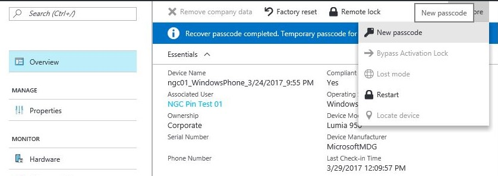
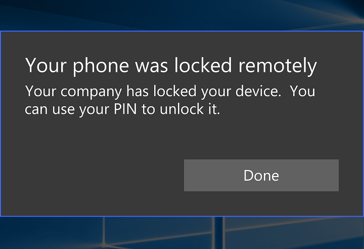
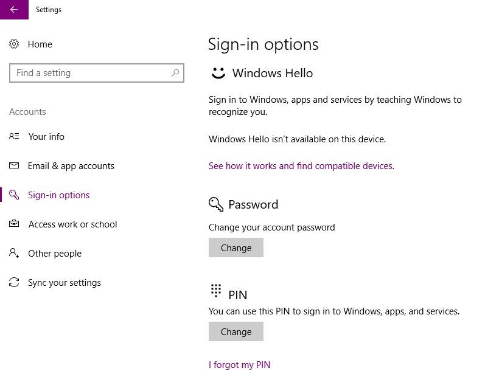
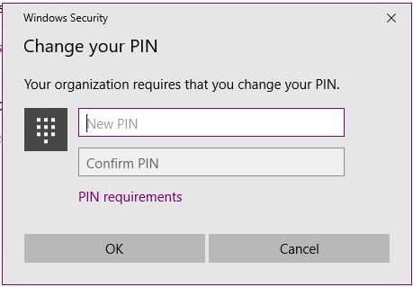

# Why a PIN is better than a password

**Applies to**
-   Windows 10
-   Windows 10 Mobile

Windows Hello in Windows 10 enables users to sign in to their device using a PIN. How is a PIN different from (and better than) a password?
On the surface, a PIN looks much like a password. A PIN can be a set of numbers, but enterprise policy might allow complex PINs that include special characters and letters, both upper-case and lower-case. Something like **t758A!** could be an account password or a complex Hello PIN. It isn't the structure of a PIN (length, complexity) that makes it better than a password, it's how it works.

## PIN is tied to the device
One important difference between a password and a Hello PIN is that the PIN is tied to the specific device on which it was set up. That PIN is useless to anyone without that specific hardware. Someone who steals your password can sign in to your account from anywhere, but if they steal your PIN, they'd have to steal your physical device too!

Even you can't use that PIN anywhere except on that specific device. If you want to sign in on multiple devices, you have to set up Hello on each device.

## PIN is local to the device

A password is transmitted to the server -- it can be intercepted in transmission or stolen from a server. A PIN is local to the device -- it isn't transmitted anywhere and it isn't stored on the server.
When the PIN is created, it establishes a trusted relationship with the identity provider and creates an asymmetric key pair that is used for authentication. When you enter your PIN, it unlocks the authentication key and uses the key to sign the request that is sent to the authenticating server.

>[!NOTE]
>For details on how Hello uses asymetric key pairs for authentication, see [Windows Hello for Business](hello-identity-verification.md#benefits-of-windows-hello).
 
## PIN is backed by hardware

The Hello PIN is backed by a Trusted Platform Module (TPM) chip, which is a secure crypto-processor that is designed to carry out cryptographic operations. The chip includes multiple physical security mechanisms to make it tamper resistant, and malicious software is unable to tamper with the security functions of the TPM. All Windows 10 Mobile phones and many modern laptops have TPM.

User key material is generated and available within the Trusted Platform Module (TPM) of the user device, which protects it from attackers who want to capture the key material and reuse it. Because Hello uses asymmetrical key pairs, users credentials can’t be stolen in cases where the identity provider or websites the user accesses have been compromised.

The TPM protects against a variety of known and potential attacks, including PIN brute-force attacks. After too many incorrect guesses, the device is locked.

## PIN can be complex

The Windows Hello for Business PIN is subject to the same set of IT management policies as a password, such as complexity, length, expiration, and history. Although we generally think of a PIN as a simple four-digit code, administrators can set [policies](hello-manage-in-organization.md) for managed devices to require a PIN complexity similar to a password. You can require or block: special characters, uppercase characters, lowercase characters, and digits.

## What if someone steals the laptop or phone?

To compromise a Windows Hello credential that TPM protects, an attacker must have access to the physical device, and then must find a way to spoof the user’s biometrics or guess his or her PIN—and all of this must be done before TPM anti-hammer capabilities lock the device.
You can provide additional protection for laptops that don't have TPM by enablng BitLocker and setting a policy to limit failed sign-ins.

**Configure BitLocker without TPM**
1.  Use the Local Group Policy Editor (gpedit.msc) to enable the following policy:

    **Computer Configuration > Administrative Templates > Windows Components > BitLocker Drive Encryption > Operating System Drives > Require additional authentication at startup**
    
2.  In the policy option, select **Allow BitLocker without a compatible TPM**, and then click **OK.**
3.  Go to Control Panel > **System and Security > BitLocker Drive Encryption** and select the operating system drive to protect.
**Set account lockout threshold**
1.  Use the Local Group Policy Editor (gpedit.msc) to enable the following policy:

    **Computer Configuration > Windows Settings > Security Settings > Account Policies > Account Lockout Policy > Account lockout threshold**
    
2.  Set the number of invalid logon attempts to allow, and then click OK.

## What if I forget my PIN?

Starting with Windows 10, version 1703, devices managed by [Microsoft Intune](https://www.microsoft.com/cloud-platform/microsoft-intune), are be able to reset a forgotten PIN without deleting company managed data or apps.

### Reset forgotten PIN on Windows Phone

To reset a forgotten pin on a Windows Phone, you will need to locate the device in the Intune portal. Once you've selected the device, click on **More > New passcode** to generate a new PIN. 

Once you've done that, the device will receive a notification to unlock the device and you will have to provide them with the generated PIN in order to unlock the device. With the device unlocked, they user can now reset the PIN.

### Reset forgotten PIN on desktop

Users can reset a forgotten PIN from any Intune managed desktop device. They will need to unlock the device by other means (Password \ Smart Card \ Biometric).

Once the device is unlocked, go to **Settings > Accounts > Sign-in options** and under **PIN** select **I forgot my PIN**.

After signing-in, you will be prompted to change your PIN.

## Why do you need a PIN to use biometrics?
Windows Hello enables biometric sign-in for Windows 10: fingerprint, iris, or facial recognition. When you set up Windows Hello, you're asked to create a PIN first. This PIN enables you to sign in using the PIN when you can’t use your preferred biometric because of an injury or because the sensor is unavailable or not working properly.

If you only had a biometric sign-in configured and, for any reason, were unable to use that method to sign in, you would have to sign in using your account and password, which doesn't provide you the same level of protection as Hello.

## Related topics

- [Windows Hello for Business](hello-identity-verification.md)
- [How Windows Hello for Business works](hello-how-it-works.md)
- [Manage Windows Hello for Business in your organization](hello-manage-in-organization.md)
- [Prepare people to use Windows Hello](hello-prepare-people-to-use.md)
- [Windows Hello and password changes](hello-and-password-changes.md)
- [Windows Hello errors during PIN creation](hello-errors-during-pin-creation.md)
- [Event ID 300 - Windows Hello successfully created](hello-event-300.md)
- [Windows Hello biometrics in the enterprise](hello-biometrics-in-enterprise.md)