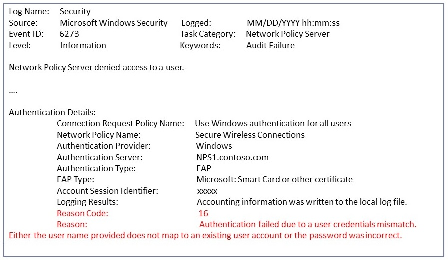
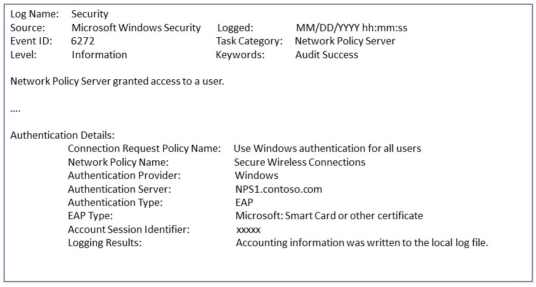
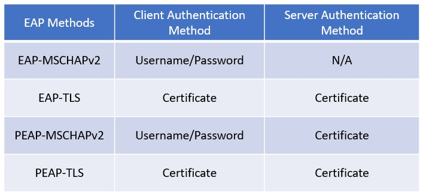
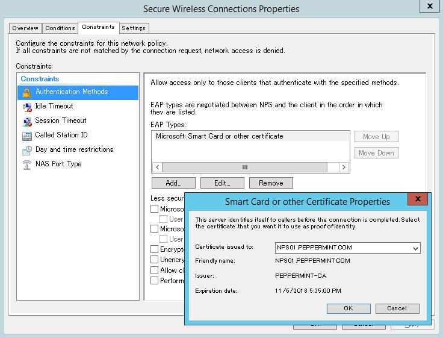
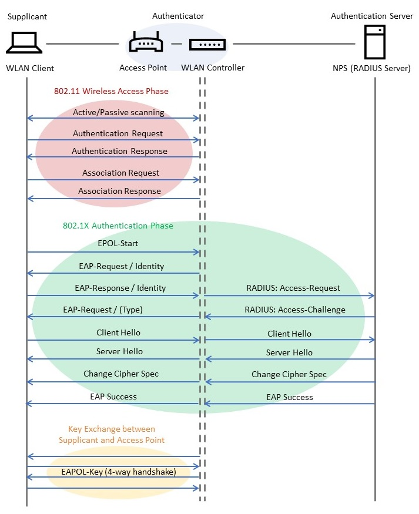
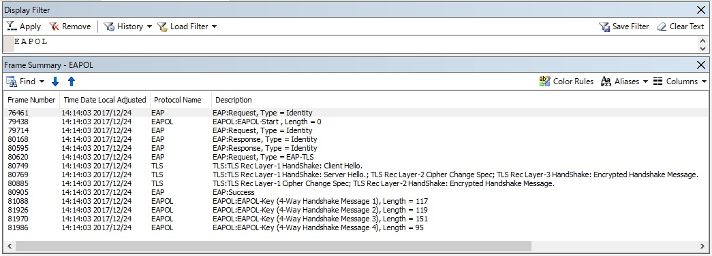

 
# Advanced Troubleshooting 802.1x Authentication
 
## Overview
This is a general troubleshooting of 802.1x wireless and wired clients. With 
802.1x and Wireless troubleshooting, it's important to know how the flow of authentication works, and then figuring out where it's breaking. It involves a lot of third party devices and software. Most of the time, we have to identify where the problem is, and another vendor has to fix it. Since we don't make Access Points or Switches, it won't be an end-to-end Microsoft solution.
 
### Scenarios
This troubleshooting technique applies to any scenario in which wireless or wired connections with 802.1X authentication is attempted and then fails to establish. The workflow covers Windows 7 - 10 for clients, and Windows Server 2008 R2 - 2012 R2 for NPS.
 
### Known Issues
N/A
 
### Data Collection
Markdown - Advanced Troubleshooting 802.1x Authentication Data Collection
 
### Troubleshooting
Viewing the NPS events in the Windows Security Event log is one of the most useful troubleshooting methods to obtain information about failed authentications.

NPS event log entries contain information on the connection attempt, including the name of the connection request policy that matched the connection attempt and the network policy that accepted or rejected the connection attempt. NPS event logging for rejected or accepted connection is enabled by default.
Check Windows Security Event log on the NPS Server for NPS events corresponding to rejected (event ID 6273) or accepted (event ID 6272) connection attempts.
 
In the event message, scroll to the very bottom, and check the **Reason Code** field and the text associated with it.
 

*Example: event ID 6273 (Audit Failure)*
‎

*Example: event ID 6272 (Audit Success)*

‎ 
The WLAN AutoConfig operational log lists information and error events based on conditions detected by or reported to the WLAN AutoConfig service. The operational log contains information about the wireless network adapter, the properties of the wireless connection profile, the specified network authentication, and, in the event of connectivity problems, the reason for the failure. For wired network access, Wired AutoConfig operational log is equivalent one.

On client side, navigate to the Event Viewer (Local)\Applications and Services Logs\Microsoft\Windows\WLAN-AutoConfig/Operational for wireless issue (for wired network access, ..\Wired-AutoConfig/Operational).

 
Most 802.1X authentication issues is due to problems with the certificate which is used for client or server authentication (e.g. invalid certificate, expiration, chain verification failure, revocation check failure, etc.). 
First, make sure which type of EAP method is being used.
 

 
If a certificate is used for its authentication method, check if the certificate is valid. For server (NPS) side, you can confirm what certificate is being used from EAP property menu. See figure below.

 
The CAPI2 event log will be useful for troubleshooting certificate-related issues.
This log is not enabled by default. You can enable this log by navigating to the Event Viewer (Local)\Applications and Services Logs\Microsoft\Windows\CAPI2 directory and expand it, then right-click on the Operational view and click the Enable Log menu.

 
You can refer to this article about how to analyze CAPI2 event logs.
[Troubleshooting PKI Problems on Windows Vista](https://docs.microsoft.com/en-us/previous-versions/windows/it-pro/windows-vista/cc749296%28v=ws.10%29)
For detailed troubleshooting 802.1X authentication issues, it&#39;s important to understand 802.1X authentication process. The figure below is an example of wireless connection process with 802.1X authentication.

 
If you collect network packet capture on both a client and a NPS side, you can see the flow like below. Type **EAPOL** in Display Filter menu in Network Monitor for a client side and **EAP** for a NPS side.
 
> [!NOTE]
> info not critical to a task If you also enable wireless scenario trace with network packet capture, you can see more detailed information on Network Monitor with **ONEX\_MicrosoftWindowsOneX** and **WLAN\_MicrosoftWindowsWLANAutoConfig** Network Monitor filtering applied.
 

_Client-side packet capture data_

 
_NPS-side packet capture data_
‎ 
## Additional references
[Troubleshooting Windows Vista 802.11 Wireless Connections](https://technet.microsoft.com/ja-jp/library/cc766215%28v=ws.10%29.aspx)

[Troubleshooting Windows Vista Secure 802.3 Wired Connections](https://technet.microsoft.com/de-de/library/cc749352%28v=ws.10%29.aspx)

