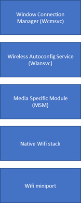
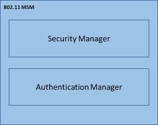

# Advanced Troubleshooting Wireless Network Connectivity

> [!NOTE]
> Home users: This article is intended for use by support agents and IT professionals. If you're looking for more general information about Wi-Fi problems in Windows 10, check out this [Windows 10 Wi-Fi fix article](https://support.microsoft.com/en-in/help/4000432/windows-10-fix-wi-fi-problems).

## Overview
This is a general troubleshooting of establishing Wi-Fi connections from Windows Clients.
Troubleshooting Wi-Fi connections requires understanding the basic flow of the Wi-Fi autoconnect state machine. From comparison of a known good flow it is easier to determine the starting point in a repro scenario in which a different behavior is found.
This workflow involves knowledge and use of TextAnalysisTool, an extensive text filtering tool that is useful with complex traces with numerous ETW providers such as wireless_dbg trace scenario.

## Scenarios

Any scenario in which Wi-Fi connections are attempted and fail to establish. The troubleshooter is developed with Windows 10 clients in focus, but also may be useful with traces as far back as Windows 7.

> [!NOTE]
> This troubleshooter uses examples that demonstrate a general strategy for navigating and interpreting wireless component ETW. It is not meant to be representative of every wireless problem scenario.

Wireless ETW is incredibly verbose and calls out lots of innocuous errors (i.e. Not really errors so much as behaviors that are flagged and have nothing to do with the problem scenario). Simply searching for or filtering on "err", "error", and "fail" will seldom lead you to the root cause of a problematic Wi-Fi scenario. Instead it will flood the screen with meaningless logs that will obfuscate the context of the actual problem.

It is important to understand the different Wi-Fi components involved, their expected behaviors, and how the problem scenario deviates from those expected behaviors.
The intention of this troubleshooter is to show how to find a starting point in the verbosity of wireless_dbg ETW and home in on the responsible component(s) causing the connection problem.

### Known Issues and fixes
** **
| **OS version** | **Fixed in** |
| --- | --- |
| **Windows 10, version 1803** | [KB4284848](https://support.microsoft.com/help/4284848) |
| **Windows 10, version 1709** | [KB4284822](https://support.microsoft.com/help/4284822) |
| **Windows 10, version 1703** | [KB4338827](https://support.microsoft.com/help/4338827) |

Make sure that you install the latest Windows updates, cumulative updates, and rollup updates. To verify the update status, refer to the appropriate update-history webpage for your system:
- [Windows 10 version 1803](https://support.microsoft.com/help/4099479)
- [Windows 10 version 1709](https://support.microsoft.com/en-us/help/4043454)
- [Windows 10 version 1703](https://support.microsoft.com/help/4018124)
- [Windows 10 version 1607 and Windows Server 2016](https://support.microsoft.com/help/4000825)
- [Windows 10 version 1511](https://support.microsoft.com/help/4000824)
- [Windows 8.1 and Windows Server 2012 R2](https://support.microsoft.com/help/4009470)
- [Windows Server 2012](https://support.microsoft.com/help/4009471)
- [Windows 7 SP1 and Windows Server 2008 R2 SP1](https://support.microsoft.com/help/40009469)
 
### Data Collection
1. Network Capture with ETW. Use the following command:

    **netsh trace start wireless\_dbg capture=yes overwrite=yes maxsize=4096 tracefile=c:\tmp\wireless.etl**

2. Reproduce the issue if:
    - There is a failure to establish connection, try to manually connect
    - It is intermittent but easily reproducible, try to manually connect until it fails. Include timestamps of each connection attempt (successes and failures)
    - Tue issue is intermittent but rare, netsh trace stop command needs to be triggered automatically (or at least alerted to admin quickly) to ensure trace doesn’t overwrite the repro data.
    - Intermittent connection drops trigger stop command on a script (ping or test network constantly until fail, then netsh trace stop).

Run this command to stop the trace: **netsh trace stop**

To convert the output file to text format: **netsh trace convert c:\tmp\wireless.etl**
 
### Troubleshooting
The following is a high-level view of the main wifi components in Windows.
 


The Windows Connection Manager (Wcmsvc) is closely associated with the UI controls (see taskbar icon) to connect to various networks including wireless. It accepts and processes input from the user and feeds it to the core wireless service (Wlansvc). The Wireless Autoconfig Service (Wlansvc) handles the core functions of wireless networks in windows:

- Scanning for wireless networks in range
- Managing connectivity of wireless networks

The Media Specific Module (MSM) handles security aspects of connection being established.

The Native Wifi stack consists of drivers and wireless APIs to interact with wireless miniports and the supporting user-mode Wlansvc.

Third-party wireless miniport drivers interface with the upper wireless stack to provide notifications to and receive commands from Windows.
The wifi connection state machine has the following states:
- Reset
- Ihv_Configuring
- Configuring
- Associating
- Authenticating
- Roaming
- Wait_For_Disconnected
- Disconnected

Standard wifi connections tend to transition between states such as:

**Connecting**

Reset --> Ihv_Configuring --> Configuring --> Associating --> Authenticating --> Connected

**Disconnecting**

Connected --> Roaming --> Wait_For_Disconnected --> Disconnected --> Reset

Filtering the ETW trace with the provided TextAnalyisTool (TAT) filter is an easy first step to determine where a failed connection setup is breaking down:
Use the **FSM transition** trace filter to see the connection state machine.
Example of a good connection setup:

```
44676 [2]0F24.1020::‎2018‎-‎09‎-‎17 10:22:14.658 [Microsoft-Windows-WLAN-AutoConfig]FSM Transition from State: Disconnected to State: Reset
45473 [1]0F24.1020::‎2018‎-‎09‎-‎17 10:22:14.667 [Microsoft-Windows-WLAN-AutoConfig]FSM Transition from State: Reset to State: Ihv\_Configuring
45597 [3]0F24.1020::‎2018‎-‎09‎-‎17 10:22:14.708 [Microsoft-Windows-WLAN-AutoConfig]FSM Transition from State: Ihv\_Configuring to State: Configuring
46085 [2]0F24.17E0::‎2018‎-‎09‎-‎17 10:22:14.710 [Microsoft-Windows-WLAN-AutoConfig]FSM Transition from State: Configuring to State: Associating
47393 [1]0F24.1020::‎2018‎-‎09‎-‎17 10:22:14.879 [Microsoft-Windows-WLAN-AutoConfig]FSM Transition from State: Associating to State: Authenticating
49465 [2]0F24.17E0::‎2018‎-‎09‎-‎17 10:22:14.990 [Microsoft-Windows-WLAN-AutoConfig]FSM Transition from State: Authenticating to State: Connected
```
Example of a failed connection setup:
```
44676 [2]0F24.1020::‎2018‎-‎09‎-‎17 10:22:14.658 [Microsoft-Windows-WLAN-AutoConfig]FSM Transition from State: Disconnected to State: Reset
45473 [1]0F24.1020::‎2018‎-‎09‎-‎17 10:22:14.667 [Microsoft-Windows-WLAN-AutoConfig]FSM Transition from State: Reset to State: Ihv\_Configuring
45597 [3]0F24.1020::‎2018‎-‎09‎-‎17 10:22:14.708 [Microsoft-Windows-WLAN-AutoConfig]FSM Transition from State: Ihv\_Configuring to State: Configuring
46085 [2]0F24.17E0::‎2018‎-‎09‎-‎17 10:22:14.710 [Microsoft-Windows-WLAN-AutoConfig]FSM Transition from State: Configuring to State: Associating
47393 [1]0F24.1020::‎2018‎-‎09‎-‎17 10:22:14.879 [Microsoft-Windows-WLAN-AutoConfig]FSM Transition from State: Associating to State: Authenticating
49465 [2]0F24.17E0::‎2018‎-‎09‎-‎17 10:22:14.990 [Microsoft-Windows-WLAN-AutoConfig]FSM Transition from State: Authenticating to State: Roaming
```
By identifying the state at which the connection fails, one can focus more specifically in the trace on logs just prior to the last known good state. Examining **[Microsoft-Windows-WLAN-AutoConfig]** logs just prior to the bad state change should show evidence of error. Often, however, the error is propagated up through other wireless components.
In many cases the next component of interest will be the MSM, which lies just below Wlansvc.
 


The important components of the MSM include:
- Security Manager (SecMgr) - handles all pre and post-connection security operations.
- Authentication Engine (AuthMgr) – Manages 802.1x auth requests
Each of these components has their own individual state machines which follow specific transitions.
Enable the **FSM transition, SecMgr Transition,** and **AuthMgr Transition** filters in TextAnalysisTool for more detail.
Continuing with the example above, the combined filters look like this:

```
[2] 0C34.2FF0::08/28/17-13:24:28.693 [Microsoft-Windows-WLAN-AutoConfig]FSM Transition from State:
Reset to State: Ihv\_Configuring
[2] 0C34.2FF0::08/28/17-13:24:28.693 [Microsoft-Windows-WLAN-AutoConfig]FSM Transition from State:
Ihv_Configuring to State: Configuring
[1] 0C34.2FE8::08/28/17-13:24:28.711 [Microsoft-Windows-WLAN-AutoConfig]FSM Transition from State:
Configuring to State: Associating
[0] 0C34.275C::08/28/17-13:24:28.902 [Microsoft-Windows-WLAN-AutoConfig]Port\&lt;13\> Peer 8A:15:14:B6:25:10 SecMgr Transition INACTIVE (1) --\&gt; ACTIVE (2)
[0] 0C34.275C::08/28/17-13:24:28.902 [Microsoft-Windows-WLAN-AutoConfig]Port\&lt;13\> Peer 8A:15:14:B6:25:10 SecMgr Transition ACTIVE (2) --\&gt; START AUTH (3)
[4] 0EF8.0708::08/28/17-13:24:28.928[Microsoft-Windows-WLAN-AutoConfig]Port (14) Peer 0x186472F64FD2 AuthMgr Transition ENABLED --\&gt; START\_AUTH
[3] 0C34.2FE8::08/28/17-13:24:28.902 [Microsoft-Windows-WLAN-AutoConfig]FSM Transition from State:
Associating to State: Authenticating
[1] 0C34.275C::08/28/17-13:24:28.960 [Microsoft-Windows-WLAN-AutoConfig]Port\&lt;13\> Peer 8A:15:14:B6:25:10 SecMgr Transition START AUTH (3) --\&gt; WAIT FOR AUTH SUCCESS (4)
[4] 0EF8.0708::08/28/17-13:24:28.962 [Microsoft-Windows-WLAN-AutoConfig]Port (14) Peer 0x186472F64FD2 AuthMgr Transition START\_AUTH --\&gt; AUTHENTICATING
[2] 0C34.2FF0::08/28/17-13:24:29.751 [Microsoft-Windows-WLAN-AutoConfig]Port\&lt;13\> Peer 8A:15:14:B6:25:10 SecMgr Transition WAIT FOR AUTH SUCCESS (7) --\&gt; DEACTIVATE (11)
[2] 0C34.2FF0::08/28/17-13:24:29.7512788 [Microsoft-Windows-WLAN-AutoConfig]Port\&lt;13\> Peer 8A:15:14:B6:25:10 SecMgr Transition DEACTIVATE (11) --\&gt; INACTIVE (1)
[2] 0C34.2FF0::08/28/17-13:24:29.7513404 [Microsoft-Windows-WLAN-AutoConfig]FSM Transition from State:
Authenticating to State: Roaming
```
> [!NOTE]
> In this line the SecMgr transition is suddenly deactivating. This transition is what eventually propagates to the main connection state machine and causes the Authenticating phase to devolve to Roaming state. As before, it makes sense to focus on tracing just prior to this SecMgr behavior to determine the reason for the deactivation.

Enabling the **Microsoft-Windows-WLAN-AutoConfig** filter will show more detail leading to the DEACTIVATE transition:

```
[3] 0C34.2FE8::08/28/17-13:24:28.902 [Microsoft-Windows-WLAN-AutoConfig]FSM Transition from State:
Associating to State: Authenticating
[1] 0C34.275C::08/28/17-13:24:28.960 [Microsoft-Windows-WLAN-AutoConfig]Port\&lt;13\> Peer 8A:15:14:B6:25:10 SecMgr Transition START AUTH (3) --\&gt; WAIT FOR AUTH SUCCESS (4)
[4] 0EF8.0708::08/28/17-13:24:28.962 [Microsoft-Windows-WLAN-AutoConfig]Port (14) Peer 0x186472F64FD2 AuthMgr Transition START\_AUTH --\&gt; AUTHENTICATING
[0]0EF8.2EF4::‎08/28/17-13:24:29.549 [Microsoft-Windows-WLAN-AutoConfig]Received Security Packet: PHY\_STATE\_CHANGE
[0]0EF8.2EF4::08/28/17-13:24:29.549 [Microsoft-Windows-WLAN-AutoConfig]Change radio state for interface = Intel(R) Centrino(R) Ultimate-N 6300 AGN : PHY = 3, software state = on , hardware state = off )
[0] 0EF8.1174::‎08/28/17-13:24:29.705 [Microsoft-Windows-WLAN-AutoConfig]Received Security Packet: PORT\_DOWN
[0] 0EF8.1174::‎08/28/17-13:24:29.705 [Microsoft-Windows-WLAN-AutoConfig]FSM Current state Authenticating , event Upcall\_Port\_Down
[0] 0EF8.1174:: 08/28/17-13:24:29.705 [Microsoft-Windows-WLAN-AutoConfig]Received IHV PORT DOWN, peer 0x186472F64FD2
[2] 0C34.2FF0::08/28/17-13:24:29.751 [Microsoft-Windows-WLAN-AutoConfig]Port\&lt;13\> Peer 8A:15:14:B6:25:10 SecMgr Transition WAIT FOR AUTH SUCCESS (7) --\&gt; DEACTIVATE (11)
[2] 0C34.2FF0::08/28/17-13:24:29.7512788 [Microsoft-Windows-WLAN-AutoConfig]Port\&lt;13\> Peer 8A:15:14:B6:25:10 SecMgr Transition DEACTIVATE (11) --\&gt; INACTIVE (1)
[2] 0C34.2FF0::08/28/17-13:24:29.7513404 [Microsoft-Windows-WLAN-AutoConfig]FSM Transition from State:
Authenticating to State: Roaming
```
The trail backwards reveals a Port Down notification. Port events indicate changes closer to the wireless hardware. The trail can be followed by continuing to see the origin of this indication.
Below, the MSM is the native wifi stack (as seen in Figure 1). These are Windows native wifi drivers which talk to the wifi miniport driver(s). It is responsible for converting Wi-Fi (802.11) packets to 802.3 (Ethernet) so that TCPIP and other protocols and can use it.
Enable trace filter for **[Microsoft-Windows-NWifi]:**
```
[3] 0C34.2FE8::08/28/17-13:24:28.902 [Microsoft-Windows-WLAN-AutoConfig]FSM Transition from State:
Associating to State: Authenticating
[1] 0C34.275C::08/28/17-13:24:28.960 [Microsoft-Windows-WLAN-AutoConfig]Port\&lt;13\> Peer 8A:15:14:B6:25:10 SecMgr Transition START AUTH (3) --\&gt; WAIT FOR AUTH SUCCESS (4)
[4] 0EF8.0708::08/28/17-13:24:28.962 [Microsoft-Windows-WLAN-AutoConfig]Port (14) Peer 0x8A1514B62510 AuthMgr Transition START\_AUTH --\&gt; AUTHENTICATING
[0]0000.0000::‎08/28/17-13:24:29.127 [Microsoft-Windows-NWiFi]DisAssoc: 0x8A1514B62510 Reason: 0x4
[0]0EF8.2EF4::‎08/28/17-13:24:29.549 [Microsoft-Windows-WLAN-AutoConfig]Received Security Packet: PHY\_STATE\_CHANGE
[0]0EF8.2EF4::08/28/17-13:24:29.549 [Microsoft-Windows-WLAN-AutoConfig]Change radio state for interface = Intel(R) Centrino(R) Ultimate-N 6300 AGN : PHY = 3, software state = on , hardware state = off )
[0] 0EF8.1174::‎08/28/17-13:24:29.705 [Microsoft-Windows-WLAN-AutoConfig]Received Security Packet: PORT\_DOWN
[0] 0EF8.1174::‎08/28/17-13:24:29.705 [Microsoft-Windows-WLAN-AutoConfig]FSM Current state Authenticating , event Upcall\_Port\_Down
[0] 0EF8.1174:: 08/28/17-13:24:29.705 [Microsoft-Windows-WLAN-AutoConfig]Received IHV PORT DOWN, peer 0x186472F64FD2
[2] 0C34.2FF0::08/28/17-13:24:29.751 [Microsoft-Windows-WLAN-AutoConfig]Port\&lt;13\> Peer 8A:15:14:B6:25:10 SecMgr Transition WAIT FOR AUTH SUCCESS (7) --\&gt; DEACTIVATE (11)
[2] 0C34.2FF0::08/28/17-13:24:29.7512788 [Microsoft-Windows-WLAN-AutoConfig]Port\&lt;13\> Peer 8A:15:14:B6:25:10 SecMgr Transition DEACTIVATE (11) --\&gt; INACTIVE (1)
[2] 0C34.2FF0::08/28/17-13:24:29.7513404 [Microsoft-Windows-WLAN-AutoConfig]FSM Transition from State:
Authenticating to State: Roaming
```
The port down event is occurring due to a Disassociate coming Access Point as an indication to deny the connection. This could be due to invalid credentials, connection parameters, loss of signal/roaming, and various other reasons for aborting a connection. The action here would be to examine the reason for the disassociate sent from the indicated AP MAC (8A:15:14:B6:25:10). This would be done by examining internal logging/tracing from MAC device.

### **Resources**
### [802.11 Wireless Tools and Settings](https://docs.microsoft.com/en-us/previous-versions/windows/it-pro/windows-server-2003/cc755892(v%3dws.10))
### [Understanding 802.1X authentication for wireless networks](https://docs.microsoft.com/en-us/previous-versions/windows/it-pro/windows-server-2003/cc759077%28v%3dws.10%29)

