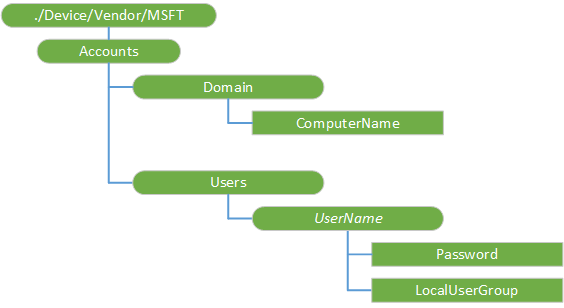

# Accounts CSP 

> [!WARNING]
> Some information relates to prereleased product which may be substantially modified before it's commercially released. Microsoft makes no warranties, express or implied, with respect to the information provided here.

The Accounts configuration service provider (CSP) is used by the enterprise (1) to rename a device, (2) to create a new local Windows account and joint it to a local user group. This CSP was added in Windows 10, version 1803.

The following diagram shows the Accounts configuration service provider in tree format.

 

**./Device/Vendor/MSFT/Accounts**  
Root node.

**Domain**  
Interior node for the account domain information.

**Domain/ComputerName**  
This node specifies the name for a device.  This setting can be managed remotely. A couple of macros can be embedded within the value for dynamic substitution:  %RAND:<# of digits>% and %SERIAL%.  

Examples: (a) "Test%RAND:6%" will generate a name "Test" followed by 6 random digits (e.g., "Test123456").  (b) "Foo%SERIAL%", will generate a name "Foo" followed by the serial number derived from device's ID. The server must explicitly reboot the device for this value to take effect.

Supported operation is Add.

**Users**  
Interior node for the user account information.

**Users/_UserName_**  
This node specifies the username for a new local user account.  This setting can be managed remotely.

**Users/_UserName_/Password**  
This node specifies the password for a new local user account.  This setting can be managed remotely. 

Supported operation is Add.

**Users/_UserName_/LocalUserGroup**  
This optional node specifies the local user group that a local user account should be joined to.  If the node is not set, the new local user account is joined just to the Standard Users group.  Set the value to 2 for Administrators group. This setting can be managed remotely.

Supported operation is Add.