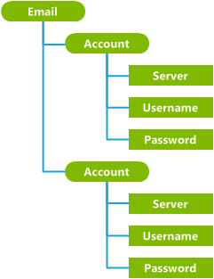
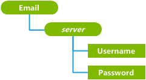

# Design a custom configuration service provider

To design a custom configuration service provider, the OEM must perform the following steps:

1.  Establish node semantics
2.  Shape the configuration service provider's subtree
3.  Choose a transactioning scheme for each node
4.  Determine node operations

For more information about the larger process of writing a new configuration service provider, see [Create a custom configuration service provider](create-a-custom-configuration-service-provider.md).

## Establish node semantics

First, determine the nodes you need based on the kind of data to be stored in the registry.

Nodes can represent anything from abstract concepts or collections (such as email accounts or connection settings) to more concrete objects (such as registry keys and values, directories, and files).

### Example

For example, a hypothetical Email configuration service provider might have these nodes:

- Account: The name of the email account (such as "Hotmail")

- Username: The user name or email address ("exampleAccount@hotmail.com")

- Password: The user's password

- Server: The DNS address of the server ("mail-serv1-example.mail.hotmail.com")

The `Account`, `Username`, and `Server` nodes would hold text-based information about the email account, the user's email address, and the server address associated with that account. The `Password` node, however, might hold a binary hash of the user's password.

## Shape the configuration service provider's subtree

After determining what the nodes represent, decide where each node fits in the settings hierarchy.

The root node of a configuration service provider's subtree must be the name of the configuration service provider. In this example, the root node is `Email`.

All of the nodes defined in the previous step must reside under the configuration service provider's root node. Leaf nodes should be used to store data, and interior nodes should be used to group the data into logical collections. Node URIs must be unique. In other words, no two nodes can have both the same parent and the same name.

There are three typical scenarios for grouping and structuring the nodes:

-   If all of the data belongs to the same component and no further categorizing or grouping is required, you can build a flat tree in which all values are stored directly under the root node. For examples of this design, see [DevInfo configuration service provider](devinfo-csp.md), [HotSpot configuration service provider](hotspot-csp.md), and [w4 APPLICATION configuration service provider](w4-application-csp.md).

-   If the configuration service provider's nodes represent a preexisting set of entities whose structure is well-defined (such as directories and files), the configuration service provider's nodes can simply mirror the existing structure.

-   If the data must be grouped by type or component, a more complex structure is required. This is especially true when there can be multiple instances of the dataset on the device, and each set is indexed by an ID, account name, or account type. In this case, you must build a more complex tree structure. For examples, see [ActiveSync configuration service provider](activesync-csp.md), [CertificateStore configuration service provider](certificatestore-csp.md), and [CMPolicy configuration service provider](cmpolicy-csp.md).

### Example

The following image shows an incorrect way to structure the hypothetical `Email` configuration service provider. The interior `Account` nodes group the account data (server name, user name, and user password).

However, the account nodes in this design are not unique. Even though the nodes are grouped sensibly, the path for each of the leaf nodes is ambiguous. There is no way to disambiguate the two `Username` nodes, for example, or to reliably access the same node by using the same path. This structure will not work. The easiest solution to this problem is usually to replace an interior node (the grouping node) by:

1.  Promoting a child node.

2.  Using the node value as the name of the new interior node.

The following design conveys the same amount of information as the first design, but all nodes have a unique path, and therefore it will work.

In this case, the `Server` nodes have been promoted up one level to replace the `Account` nodes, and their values are now used as the node names. For example, you could have two different email accounts on the phone, with server names "www.hotmail.com" and "exchange.microsoft.com", each of which stores a user name and a password.

Note that the process of shaping the configuration service provider’s subtree influences the choice of transactioning schemes for each node. If possible, peer nodes should not have dependencies on each other. Internode dependencies other than parent/child relationships create mandatory groups of settings, which makes configuration service provider development more difficult.

## Choose a transactioning scheme for each node

For each node, decide whether to use *external transactioning* or *internal transactioning* to manage the transaction phases (rollback persistence, rollback, and commitment) for the node.

External transactioning is the simplest option because it allows ConfigManager2 to automatically handle the node's transactioning.

However, you must use internal transactioning for the following types of nodes:

-   A node that supports the **Execute** method.

-   A node that contains sensitive information (such as a password) that must not be saved in plain text in the ConfigManager2 rollback document.

-   A node that has a dependency on another node that is not a parent. For example, if a parent node has two children that are both required, the configuration service provider could use internal transactioning to defer provisioning the account until both values are set.

You can choose to mix transactioning modes in your configuration service provider, using internal transactioning for some operations but external transactioning for others. For more information about writing an internally transactioned node, see the [ICSPNodeTransactioning](icspnodetransactioning.md) interface.

## Determine node operations

The operations available for each node can vary depending on the purpose of the configuration service provider. The configuration service provider will be easier to use if the operations are consistent. For more information about the supported operations, see the [ICSPNode](icspnode.md) interface.

For externally transactioned nodes, an operation implementation must include the contrary operations shown in the following table to allow rollback of the operation.

For internally transactioned nodes, the practice of implementing the contrary commands for each command is recommended, but not required.

<table>
<colgroup>
<col width="50%" />
<col width="50%" />
</colgroup>
<thead>
<tr class="header">
<th>Node operation</th>
<th>Contrary node operation</th>
</tr>
</thead>
<tbody>
<tr class="odd">
<td>
<strong>Add</strong>
</td>
<td>
<strong>Clear</strong> and <strong>DeleteChild</strong>
</td>
</tr>
<tr class="even">
<td>
<strong>Copy</strong>
</td>
<td>
To copy to a new node: <strong>Clear</strong> and <strong>DeleteChild</strong>

To copy to an existing node: <strong>Add</strong> and <strong>SetValue</strong>
</td>
</tr>
<tr class="odd">
<td>
<strong>Clear</strong>
</td>
<td>
To restore the state of the deleted node: <strong>SetValue</strong> and <strong>SetProperty</strong>
</td>
</tr>
<tr class="even">
<td>
<strong>DeleteChild</strong>
</td>
<td>
To restore the old node: <strong>Add</strong>
</td>
</tr>
<tr class="odd">
<td>
<strong>DeleteProperty</strong>
</td>
<td>
To restore the deleted property: <strong>SetProperty</strong>
</td>
</tr>
<tr class="even">
<td>
<strong>Execute</strong>
</td>
<td>
Externally transactioned nodes do not support the <strong>Execute</strong> command.
</td>
</tr>
<tr class="odd">
<td>
<strong>GetValue</strong>
</td>
<td>
None
</td>
</tr>
<tr class="even">
<td>
<strong>Move</strong>
</td>
<td>
To restore a source node: <strong>Move</strong>

To restore an overwritten target node: <strong>Add</strong> and <strong>SetValue</strong>
</td>
</tr>
<tr class="odd">
<td>
<strong>SetValue</strong>
</td>
<td>
To restore the previous value: <strong>SetValue</strong>
</td>
</tr>
</tbody>
</table>

 

 

