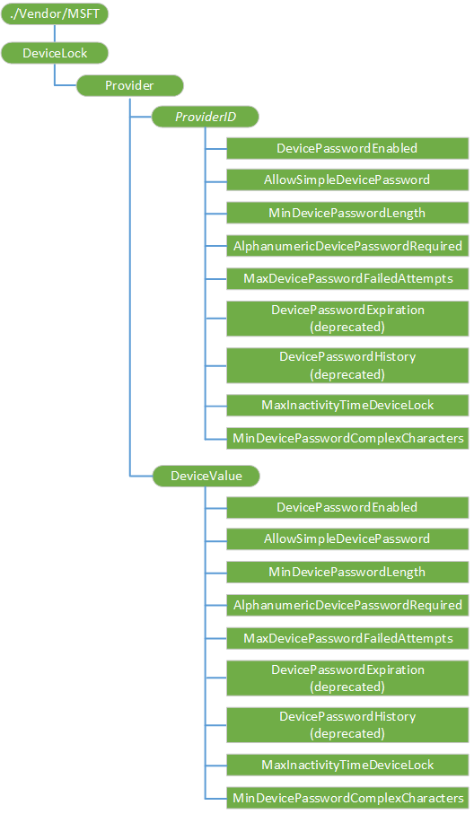

# DeviceLock CSP


The DeviceLock configuration service provider is used by the enterprise management server to configure device lock related policies. This configuration service provider is supported by an enterprise management server.

> **Note**   The DeviceLock CSP is supported in Windows 10 Mobile for backward compatibility. For Windows 10 devices you should use [Policy CSP](policy-configuration-service-provider.md) for various device lock settings. You can continue to use DeviceLock CSP for Windows Phone 8.1 and Windows Phone 8.1 GDR devices. The DeviceLock CSP will be deprecated some time in the future.

 

The DevicePasswordEnabled setting must be set to 0 (device password is enabled) for the following settings to take effect:

-   AllowSimpleDevicePassword
-   MinDevicePasswordLength
-   AlphanumericDevicePasswordRequired
-   MaxDevicePasswordFailedAttempts
-   MaxInactivityTimeDeviceLock
-   MinDevicePasswordComplexCharacters

The following image shows the DeviceLock configuration service provider in tree format.



<a href="" id="provider"></a>**Provider**  
Required. An interior node to group all policy providers. Scope is permanent. Supported operation is Get.

<a href="" id="---
title: DeviceLock CSP
description: DeviceLock CSP
ms.assetid: 9a547efb-738e-4677-95d3-5506d350d8ab
ms.author: maricia
ms.date: 05/02/2017
ms.topic: article
ms.prod: w10
ms.technology: windows
author: nickbrower
---
---
title: DeviceLock CSP
description: DeviceLock CSP
ms.assetid: 9a547efb-738e-4677-95d3-5506d350d8ab
ms.author: maricia
ms.date: 05/02/2017
ms.topic: article
ms.prod: w10
ms.technology: windows
author: nickbrower
---
---
title: DeviceLock CSP
description: DeviceLock CSP
ms.assetid: 9a547efb-738e-4677-95d3-5506d350d8ab
ms.author: maricia
ms.date: 05/02/2017
ms.topic: article
ms.prod: w10
ms.technology: windows
author: nickbrower
---
--mindevicepasswordcomplexcharacters"></a>**DeviceValue/DevicePasswordEnable, …, MinDevicePasswordComplexCharacters**  
Required. This node has the same set of policy nodes as the **ProviderID** node. All nodes under **DeviceValue** are read-only permanent nodes. Each node represents the current device lock policy. For detailed descriptions of each policy, see the ***ProviderID*** subnode descriptions.

## OMA DM examples


Set device lock policies:

``` syntax
<Atomic>
   <CmdID>13</CmdID>
   <Add>
      <CmdID>2</CmdID>
      <Item>
         <Target>
            <LocURI>
               ./Vendor/MSFT/DeviceLock/Provider/TestMDMServer/MaxDevicePasswordFailedAttempts
            </LocURI>
         </Target>
         <Meta>
            <Format xmlns="syncml:metinf">int</Format>
         </Meta>
         <Data>4</Data>
      </Item>
   </Add>
   <Add>
      <CmdID>3</CmdID>
      <Item>
         <Target>
            <LocURI>
               ./Vendor/MSFT/DeviceLock/Provider/TestMDMServer/DevicePasswordEnabled</LocURI>
         </Target>
         <Meta>
            <Format xmlns="syncml:metinf">int</Format>
         </Meta>
         <Data>0</Data>
      </Item>
   </Add>
   <Add>
      <CmdID>4</CmdID>
      <Item>
         <Target>
            <LocURI>
               ./Vendor/MSFT/DeviceLock/Provider/TestMDMServer/AllowSimpleDevicePassword
            </LocURI>
         </Target>
         <Meta>
            <Format xmlns="syncml:metinf">int</Format>
         </Meta>
         <Data>1</Data>
      </Item>
   </Add>
   <Add>
      <CmdID>5</CmdID>
      <Item>
         <Target>
            <LocURI>
               ./Vendor/MSFT/DeviceLock/Provider/TestMDMServer/MinDevicePasswordLength
            </LocURI>
         </Target>
         <Meta>
            <Format xmlns="syncml:metinf">int</Format>
         </Meta>
         <Data>5</Data>
      </Item>
   </Add>
   <Add>
      <CmdID>6</CmdID>
      <Item>
         <Target>
            <LocURI>
            ./Vendor/MSFT/DeviceLock/Provider/TestMDMServer/AlphanumericDevicePasswordRequired
            </LocURI>
         </Target>
         <Meta>
            <Format xmlns="syncml:metinf">int</Format>
         </Meta>
         <Data>1</Data>
      </Item>
   </Add>
   <Add>
      <CmdID>7</CmdID>
      <Item>
         <Target>
            <LocURI>
               ./Vendor/MSFT/DeviceLock/Provider/TestMDMServer/DevicePasswordExpiration
            </LocURI>
         </Target>
         <Meta>
            <Format xmlns="syncml:metinf">int</Format>
         </Meta>
         <Data>2</Data>
      </Item>
   </Add>
   <Add>
      <CmdID>8</CmdID>
      <Item>
         <Target>
            <LocURI>
               ./Vendor/MSFT/DeviceLock/Provider/TestMDMServer/DevicePasswordHistory
            </LocURI>
         </Target>
         <Meta>
            <Format xmlns="syncml:metinf">int</Format>
         </Meta>
         <Data>50</Data>
      </Item>
   </Add>
   <Add>
      <CmdID>9</CmdID>
      <Item>
         <Target>
            <LocURI>
               ./Vendor/MSFT/DeviceLock/Provider/TestMDMServer/MaxInactivityTimeDeviceLock
            </LocURI>
         </Target>
         <Meta>
            <Format xmlns="syncml:metinf">int</Format>
         </Meta>
         <Data>2</Data>
      </Item>
   </Add>
   <Add>
      <CmdID>10</CmdID>
      <Item>
         <Target>
            <LocURI>
            ./Vendor/MSFT/DeviceLock/Provider/TestMDMServer/MinDevicePasswordComplexCharacters
            </LocURI>
         </Target>
         <Meta>
            <Format xmlns="syncml:metinf">int</Format>
         </Meta>
         <Data>2</Data>
      </Item>
   </Add>
</Atomic>
```

## Remarks


All node values under the **ProviderID** interior node represent the policy values set by the management server.

-   An **Add** or **Replace** command on those nodes returns success in the following cases:

    -   The value is actually applied to the device.

    -   The value isn't applied to the device because the device has a more secure value set already.

        From a security perspective, the device complies with the policy request that is at least as secure as the one requested.

-   A **Get** command on those nodes returns the value the server pushes down to the device.

-   If a **Replace** command fails, the node value is set back to the value that was to be replaced.

-   If an **Add** command fails, the node is not created.

The value applied to the device can be queried via the nodes under the **DeviceValue** interior node.

## Related topics


[Configuration service provider reference](configuration-service-provider-reference.md)

 

 


