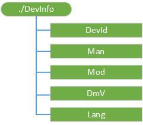

# DevInfo CSP

The DevInfo configuration service provider handles the managed object which provides device information to the OMA DM server. This device information is automatically sent to the OMA DM server at the beginning of each OMA DM session.

> **Note**  This configuration service provider requires the ID\_CAP\_CSP\_FOUNDATION and ID\_CAP\_DEVICE\_MANAGEMENT\_ADMIN capabilities to be accessed from a network configuration application.

 

For the DevInfo CSP, you cannot use the Replace command unless the node already exists.

The following diagram shows the DevInfo configuration service provider management object in tree format as used by OMA Device Management. The OMA Client provisioning protocol is not supported by this configuration service provider.

**DevId**  
Required. Returns an application-specific global unique device identifier by default.

Supported operation is Get.

The **UseHWDevID** parm of the [DMAcc configuration service provider](dmacc-csp.md) or DMS configuration service provider can be used to modify the return value to instead return a hardware device ID as follows:

-   For GSM phones, the IMEI is returned.

-   For CDMA phones, the MEID is returned.

-   For dual SIM phones, this value is retrieved from the UICC of the primary data line.

-   For Windows 10 for desktop editions (Home, Pro, Enterprise, and Education), it returns an application specific global unique identifier (GUID) irrespective of the value of UseHWDevID.

**Man**  
Required. Returns the name of the OEM. For Windows 10 for desktop editions, it returns the SystemManufacturer as defined in HKEY\_LOCAL\_MACHINE\\HARDWARE\\DESCRIPTION\\System\\BIOS\\SystemManufacturer.

If no name is found, this returns "Unknown".

Supported operation is Get.

**Mod**  
Required. Returns the name of the hardware device model as specified by the mobile operator. For Windows 10 for desktop editions, it returns the SystemProductName as defined in HKEY\_LOCAL\_MACHINE\\HARDWARE\\DESCRIPTION\\System\\BIOS\\SystemProductName.

If no name is found, this returns "Unknown".

Supported operation is Get.

**DmV**  
Required. Returns the current management client revision of the device.

Supported operation is Get.

**Lang**  
Required. Returns the current user interface (UI) language setting of the device as defined by RFC1766.

Supported operation is Get.

## Related topics

[Configuration service provider reference](configuration-service-provider-reference.md)

 

 

