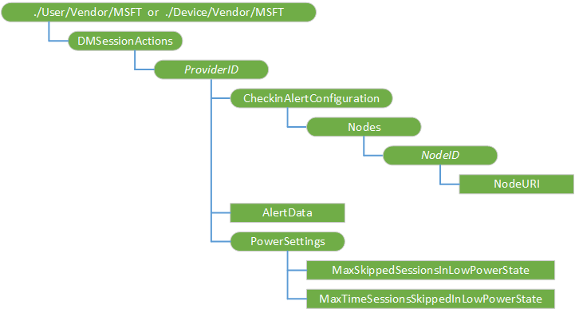

# DMSessionActions CSP

The DMSessionActions configuration service provider (CSP) is used to manage:  

- the number of sessions the client skips if the device is in a low power state
- which CSP nodes should send an alert back to the server if there were any changes.

This CSP was added in Windows 10, version 1703.

The following diagram shows the DMSessionActions configuration service provider in tree format.

**./Device/Vendor/MSFT/DMSessionActions or ./User/Vendor/MSFT/DMSessionActions**  

Defines the root node for the DMSessionActions configuration service provider.

**_ProviderID_**  

Group settings per device management (DM) server. Each group of settings is distinguished by the Provider ID of the server. It must be the same DM server Provider ID value that was supplied through the w7 APPLICATION configuration service provider XML during the enrollment process. Only one enterprise management server is supported, which means that there should be only one ProviderID node under NodeCache. 

Scope is dynamic. Supported operations are Get, Add, and Delete.

**_ProviderID_/CheckinAlertConfiguration**  

Node for the custom configuration of alerts to be sent during MDM sync session.

**_ProviderID_/CheckinAlertConfiguration/Nodes**  

Required. Root node for URIs to be queried. Scope is dynamic.

Supported operation is Get.

**_ProviderID_/CheckinAlertConfiguration/Nodes/_NodeID_**  

Required. Information about each node is stored under NodeID as specified by the server. This value must not contain a comma. Scope is dynamic.

Supported operations are Get, Add, and Delete.

**_ProviderID_/CheckinAlertConfiguration/Nodes/_NodeID_/NodeURI**  

Required. The value is a complete OMA DM node URI. It can specify either an interior node or a leaf node in the device management tree. Scope is dynamic.

Value type is string. Supported operations are Add, Get, Replace, and Delete.

**AlertData**  

Node to query the custom alert per server configuration

Value type is string. Supported operation is Get.

**PowerSettings**  

Node for power related configrations

**PowerSettings/MaxSkippedSessionsInLowPowerState**  

Maximum number of continuous skipped sync sessions when the device is in low power state.

Value type is integer. Supported operations are Add, Get, Replace, and Delete.

**PowerSettings/MaxTimeSessionsSkippedInLowPowerState**  

Maximum time in minutes when the device can skip the check-in with the server if the device is in low power state. 

Value type is integer. Supported operations are Add, Get, Replace, and Delete.
