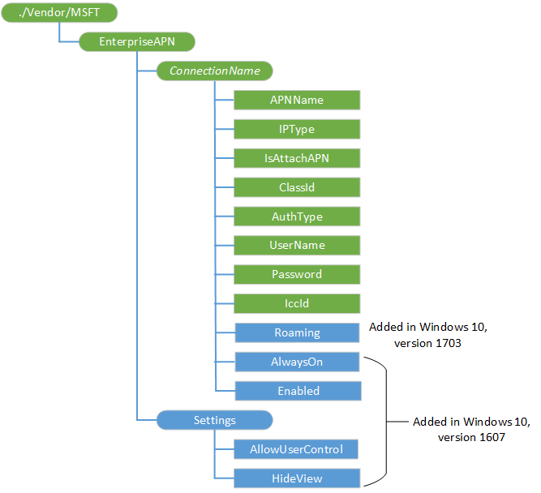

# EnterpriseAPN CSP

The EnterpriseAPN configuration service provider (CSP) is used by the enterprise to provision an APN for the Internet.

> [!Note]
Starting in Windows 10, version 1703 the EnterpriseAPN CSP is supported in Windows 10 Home, Pro, Enterprise, and Education editions.

The following image shows the EnterpriseAPN configuration service provider in tree format.



<a href="" id="enterpriseapn"></a>**EnterpriseAPN**  
<p style="margin-left: 20px">The root node for the EnterpriseAPN configuration service provider.</p>

<a href="" id="enterpriseapn-connectionname"></a>**EnterpriseAPN/****_ConnectionName_**  
<p style="margin-left: 20px">Name of the connection as seen by Windows Connection Manager.</p>

<p style="margin-left: 20px">Supported operations are Add, Get, Delete, and Replace.</p>

<a href="" id="enterpriseapn-connectionname-apnname"></a>**EnterpriseAPN/*ConnectionName*/APNName**  
<p style="margin-left: 20px">Enterprise APN name.</p>

<p style="margin-left: 20px">Supported operations are Add, Get, Delete, and Replace.</p>

<a href="" id="enterpriseapn-connectionname-iptype"></a>**EnterpriseAPN/*ConnectionName*/IPType**  
<p style="margin-left: 20px">This value can be one of the following:</p>

-   IPv4 - only IPV4 connection type
-   IPv6 - only IPv6 connection type
-   IPv4v6 (default)- IPv4 and IPv6 concurrently.
-   IPv4v6xlat - IPv6 with IPv4 provided by 46xlat

<p style="margin-left: 20px">Supported operations are Add, Get, Delete, and Replace.</p>

<a href="" id="enterpriseapn-connectionname-isattachapn"></a>**EnterpriseAPN/*ConnectionName*/IsAttachAPN**  
<p style="margin-left: 20px">Boolean value that indicates whether this APN should be requested as part of an LTE Attach. Default value is false.</p>

<p style="margin-left: 20px">Supported operations are Add, Get, Delete, and Replace.</p>

<a href="" id="enterpriseapn-connectionname-classid"></a>**EnterpriseAPN/*ConnectionName*/ClassId**  
<p style="margin-left: 20px">GUID that defines the APN class to the modem. This is the same as the OEMConnectionId in CM\_CellularEntries CSP. Normally this setting is not present. It is only required when IsAttachAPN is true and the attach APN is not only used as the Internet APN.</p>

<p style="margin-left: 20px">Supported operations are Add, Get, Delete, and Replace.</p>

<a href="" id="enterpriseapn-connectionname-authtype"></a>**EnterpriseAPN/*ConnectionName*/AuthType**  
<p style="margin-left: 20px">Authentication type. This value can be one of the following:</p>

-   None (default)
-   Auto
-   PAP
-   CHAP
-   MSCHAPv2

<p style="margin-left: 20px">Supported operations are Add, Get, Delete, and Replace.</p>

<a href="" id="enterpriseapn-connectionname-username"></a>**EnterpriseAPN/*ConnectionName*/UserName**  
<p style="margin-left: 20px">User name for use with PAP, CHAP, or MSCHAPv2 authentication.</p>

<p style="margin-left: 20px">Supported operations are Add, Get, Delete, and Replace.</p>

<a href="" id="enterpriseapn-connectionname-password"></a>**EnterpriseAPN/*ConnectionName*/Password**  
<p style="margin-left: 20px">Password corresponding to the username.</p>

<p style="margin-left: 20px">Supported operations are Add, Get, Delete, and Replace.</p>

<a href="" id="enterpriseapn-connectionname-iccid"></a>**EnterpriseAPN/*ConnectionName*/IccId**  
<p style="margin-left: 20px">Integrated Circuit Card ID (ICCID) associated with the cellular connection profile. If this node is not present, the connection is created on a single-slot device using the ICCID of the UICC and on a dual-slot device using the ICCID of the UICC that is active for data.</p>

<p style="margin-left: 20px">Supported operations are Add, Get, Delete, and Replace.</p>

<a href="" id="enterpriseapn-connectionname-alwayson"></a>**EnterpriseAPN/*ConnectionName*/AlwaysOn**  
<p style="margin-left: 20px">Added in Windows 10, version 1607. Boolean value that specifies whether the CM will automatically attempt to connect to the APN when a connection is available.</p>

<p style="margin-left: 20px">The default value is true.</p>

<p style="margin-left: 20px">Supported operations are Add, Get, Delete, and Replace.</p>

<a href="" id="enterpriseapn-connectionname-enabled"></a>**EnterpriseAPN/*ConnectionName*/Enabled**  
<p style="margin-left: 20px">Added in Windows 10, version 1607. Boolean that specifies whether the connection is enabled.</p>

<p style="margin-left: 20px">The default value is true.</p>

<p style="margin-left: 20px">Supported operations are Add, Get, Delete, and Replace.</p>

<a href="" id="enterpriseapn-connectionname-roaming"></a>**EnterpriseAPN/*ConnectionName*/Roaming**  
<p style="margin-left: 20px">Added in Windows 10, version 1703. Specifies whether the connection should be activated when the device is roaming. Valid values:</p>

<ul>
<li>0 - Disallowed</li>
<li>1 - Allowed</li>
<li>2 - DomesticRoaming</li>
<li>3 - UseOnlyForDomesticRoaming</li>
<li>4 - UseOnlyForNonDomesticRoaming</li>
<li>5 - UseOnlyForRoaming</li>
</ul>

<p style="margin-left: 20px">Default is 1 (all roaming allowed).</p>

<p style="margin-left: 20px">Value type is string. Supported operations are Add, Get, Delete, and Replace.</p>


<a href="" id="enterpriseapn-settings"></a>**EnterpriseAPN/Settings**  
<p style="margin-left: 20px">Added in Windows 10, version 1607. Node that contains global settings.</p>

<a href="" id="enterpriseapn-settings-allowusercontrol"></a>**EnterpriseAPN/Settings/AllowUserControl**  
<p style="margin-left: 20px">Added in Windows 10, version 1607. Boolean value that specifies whether the cellular UX will allow users to connect with other APNs other than the Enterprise APN.</p>

<p style="margin-left: 20px">The default value is false.</p>

<p style="margin-left: 20px">Supported operations are Get and Replace.</p>

<a href="" id="enterpriseapn-settings-hideview"></a>**EnterpriseAPN/Settings/HideView**  
<p style="margin-left: 20px">Added in Windows 10, version 1607. Boolean that specifies whether the cellular UX will allow the user to view enterprise APNs. Only applicable if AllowUserControl is true.</p>

<p style="margin-left: 20px">The default value is false.</p>

<p style="margin-left: 20px">Supported operations are Get and Replace.</p>

## Examples

``` syntax
<!--
Copyright (c) Microsoft Corporation.  All rights reserved.
-->
<!--
Use of this source code is subject to the terms of the Microsoft
premium shared source license agreement under which you licensed
this source code. If you did not accept the terms of the license
agreement, you are not authorized to use this source code.
For the terms of the license, please see the license agreement
signed by you and Microsoft.
THE SOURCE CODE IS PROVIDED "AS IS", WITH NO WARRANTIES OR INDEMNITIES.

-->

<SyncML>
  <SyncBody>
    <Atomic>
      <CmdID>8000</CmdID>
      <!-- Sub-tree 1 -->
      <add>
        <CmdID>8001</CmdID>
        <Item>
          <Target>
            <LocURI>./Vendor/MSFT/EnterpriseAPN/E_APN1/APNName</LocURI>
          </Target>
          <Meta>
            <Format xmlns="syncml:metinf">chr</Format>
          </Meta>
          <Data>enterprise_apn1</Data>
        </Item>
      </add>
      <add>
        <CmdID>8002</CmdID>
        <Item>
          <Target>
            <LocURI>./Vendor/MSFT/EnterpriseAPN/E_APN1/IPType</LocURI>
          </Target>
          <Meta>
            <Format xmlns="syncml:metinf">chr</Format>
          </Meta>
          <Data>IPv4</Data>
        </Item>
      </add>
      <add>
        <CmdID>8003</CmdID>
        <Item>
          <Target>
            <LocURI>./Vendor/MSFT/EnterpriseAPN/E_APN1/IsAttachAPN</LocURI>
          </Target>
          <Meta>
            <Format xmlns="syncml:metinf">bool</Format>
          </Meta>
          <Data>false</Data>
        </Item>
      </add>
      <add>
        <CmdID>8004</CmdID>
        <Item>
          <Target>
            <LocURI>./Vendor/MSFT/EnterpriseAPN/E_APN1/ClassId</LocURI>
          </Target>
          <Meta>
            <Format xmlns="syncml:metinf">chr</Format>
          </Meta>
          <Data>AAAAAAAA-AAAA-AAAA-AAAA-AAAAAAAAAAAA</Data>
        </Item>
      </add>
      <add>
        <CmdID>8005</CmdID>
        <Item>
          <Target>
            <LocURI>./Vendor/MSFT/EnterpriseAPN/E_APN1/AuthType</LocURI>
          </Target>
          <Meta>
            <Format xmlns="syncml:metinf">chr</Format>
          </Meta>
          <Data>CHAP</Data>
        </Item>
      </add>
      <add>
        <CmdID>8006</CmdID>
        <Item>
          <Target>
            <LocURI>./Vendor/MSFT/EnterpriseAPN/E_APN1/UserName</LocURI>
          </Target>
          <Meta>
            <Format xmlns="syncml:metinf">chr</Format>
          </Meta>
          <Data>myusername</Data>
        </Item>
      </add>
      <add>
        <CmdID>8007</CmdID>
        <Item>
          <Target>
            <LocURI>./Vendor/MSFT/EnterpriseAPN/E_APN1/Password</LocURI>
          </Target>
          <Meta>
            <Format xmlns="syncml:metinf">chr</Format>
          </Meta>
          <Data>mypassword</Data>
        </Item>
      </add>
      <add>
        <CmdID>8008</CmdID>
        <Item>
          <Target>
            <LocURI>./Vendor/MSFT/EnterpriseAPN/E_APN1/IccId</LocURI>
          </Target>
          <Meta>
            <Format xmlns="syncml:metinf">chr</Format>
          </Meta>
          <Data>FFFFFFFFFFFFFFFFFFFF</Data>
        </Item>
      </add>
    </Atomic>
    <Final/>
  </SyncBody>

<!--
===============================================================================
atomicA

add chr  EnterpriseAPN/E_APN1/APNName                     enterprise_apn1
add chr  EnterpriseAPN/E_APN1/IPType                      IPv4
add bool EnterpriseAPN/E_APN1/IsAttachAPN                 false
add chr  EnterpriseAPN/E_APN1/ClassId                     AAAAAAAA-AAAA-AAAA-AAAA-AAAAAAAAAAAA
add chr  EnterpriseAPN/E_APN1/AuthType                    CHAP
add chr  EnterpriseAPN/E_APN1/UserName                    myusername
add chr  EnterpriseAPN/E_APN1/Password                    mypassword
add chr  EnterpriseAPN/E_APN1/IccId                       FFFFFFFFFFFFFFFFFFFF

atomicZ
===============================================================================
-->

</SyncML>

```

## Related topics


[Configuration service provider reference](configuration-service-provider-reference.md)

 

 


