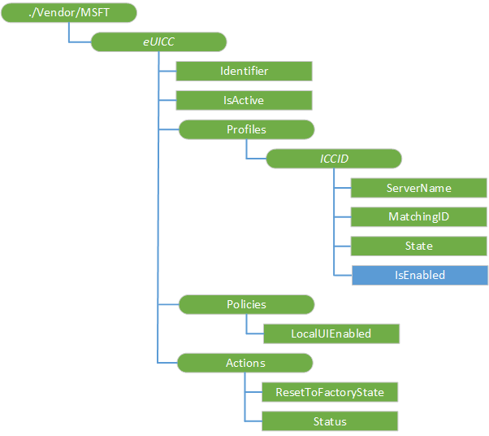

# eUICCs CSP

The eUICCs configuration service provider... This CSP was added in windows 10, version 1709.

The following diagram shows the eUICCs configuration service provider in tree format.

**./Vendor/MSFT/eUICCs**  
Root node. 

**_eUICC_**  
Interior node. Represents information associated with an eUICC. There is one subtree for each known eUICC, created by the Local Profile Assistant (LPA) when the eUICC is first seen. The node name is meaningful only to the LPA (which associates it with an eUICC ID (EID) in an implementation-specific manner, e.g., this could be a SHA-256 hash of the EID). The node name "Default" represents the currently active eUICC.

Supported operation is Get.

**_eUICC_/Identifier**  
Required. Identifies an eUICC in an implementation-specific manner, e.g., this could be a SHA-256 hash of the EID.

Supported operation is Get. Value type is string.

**_eUICC_/IsActive**  
Required. Indicates whether this eUICC is physically present and active. Updated only by the LPA.

Supported operation is Get. Value type is boolean.

**_eUICC_/Profiles**  
Interior node. Required. Represents all enterprise-owned profiles.

Supported operation is Get.

**_eUICC_/Profiles/_ICCID_**  
Interior node. Optional. Node representing an enterprise-owned eUICC profile. The node name is the ICCID of the profile (which is a unique identifier). Creation of this subtree triggers an AddProfile request by the LPA (which installs the profile on the eUICC). Removal of this subtree triggers the LPA to delete the profile (if resident on the eUICC).

Supported operations are Add, Get, and Delete.

**_eUICC_/Profiles/_ICCID_/ServerName**  
Required. Fully qualified domain name of the SM-DP+ that can download this profile. Must be set by the MDM when the ICCID subtree is created.

Supported operations are Add and Get. Value type is string.

**_eUICC_/Profiles/_ICCID_/MatchingID**  
Required. Matching ID (activation code token) for profile download. Must be set by the MDM when the ICCID subtree is created.

Supported operations are Add and Get. Value type is string.

**_eUICC_/Profiles/_ICCID_/State**  
Required. Current state of the profile (Installing = 1, Installed = 2, Deleting = 3, Error = 4). Queried by the CSP and only updated by the LPA.

Supported operation is Get. Value type is integer. Default value is 1.

**_eUICC_/Policies**  
Interior node. Required. Device policies associated with the eUICC as a whole (not per-profile).

Supported operation is Get. 

**_eUICC_/Policies/LocalUIEnabled**  
Required. Determines whether the local user interface of the LUI is available (true if available, false otherwise). Initially populated by the LPA when the eUICC tree is created, can be queried and changed by the MDM server.

Supported operations are Get and Replace. Value type is boolean. Default value is true.

**_eUICC_/Actions**  
Interior node. Required. Actions that can be performed on the eUICC as a whole (when it is active).

Supported operation is Get.

**_eUICC_/Actions/ResetToFactoryState**  
Required. An EXECUTE on this node triggers the  LPA to perform an eUICC Memory Reset.

Supported operation is Execute. Value type is string.

**_eUICC_/Actions/Status**  
Required. Status of most recent operation, as an HRESULT. S_OK indicates success, S_FALSE indicates operation is in progress, other values represent specific errors.

Supported value is Get. Value type is integer. Default is 0.