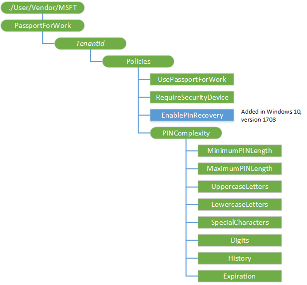
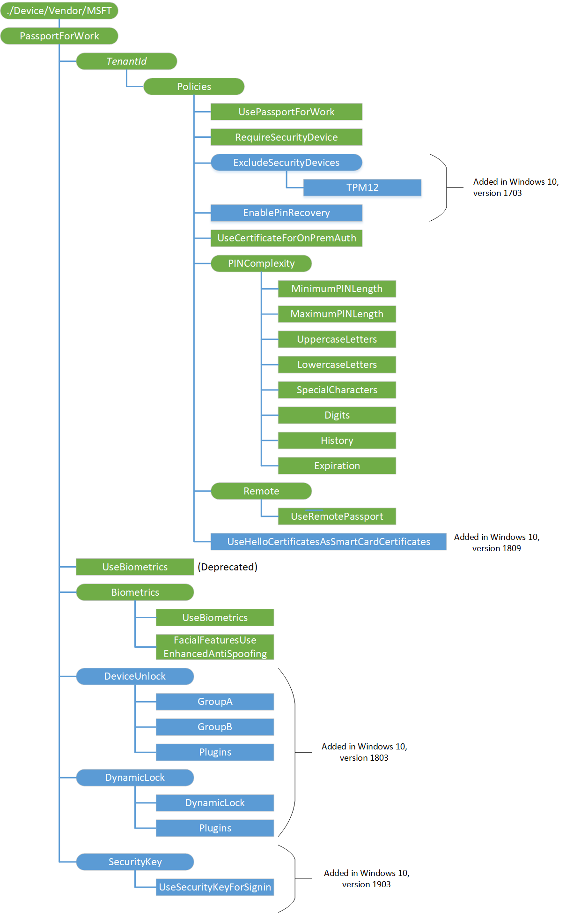

# PassportForWork CSP

The PassportForWork configuration service provider is used to provision Windows Hello for Business (formerly Microsoft Passport for Work). It allows you to login to Windows using your Active Directory or Azure Active Directory account and replace passwords, smartcards, and virtual smart cards.

> [!IMPORTANT]
> Starting with Windows 10, version 1607 all devices only have one PIN associated with Windows Hello for Business. This means that any PIN on a device will be subject to the policies specified in the PassportForWork CSP. The values specified take precedence over any complexity rules set via Exchange ActiveSync (EAS) or the DeviceLock CSP.
 
### User configuration diagram

The following diagram shows the PassportForWork configuration service provider in tree format.



### Device configuration diagram

The following diagram shows the PassportForWork configuration service provider in tree format.



<a href="" id="passportforwork"></a>**PassportForWork**  
<p style="margin-left: 20px">Root node for PassportForWork configuration service provider.

<a href="" id="tenantid"></a>***TenantId***  
<p style="margin-left: 20px">A globally unique identifier (GUID), without curly braces ( { , } ), that is used as part of Windows Hello for Business provisioning and management.

<a href="" id="tenantid-policies"></a>***TenantId*/Policies**  
<p style="margin-left: 20px">Node for defining the Windows Hello for Business policy settings.

<a href="" id="tenantid-policies-usepassportforwork"></a>***TenantId*/Policies/UsePassportForWork**  
<p style="margin-left: 20px">Boolean value that sets Windows Hello for Business as a method for signing into Windows.

<p style="margin-left: 20px">Default value is true. If you set this policy to false, the user cannot provision Windows Hello for Business except on Azure Active Directory joined mobile phones where provisioning is required.

<p style="margin-left: 20px">Supported operations are Add, Get, Delete, and Replace.

<a href="" id="tenantid-policies-requiresecuritydevice"></a>***TenantId*/Policies/RequireSecurityDevice**  
<p style="margin-left: 20px">Boolean value that requires a Trusted Platform Module (TPM) for Windows Hello for Business. TPM provides an additional security benefit over software so that data stored in it cannot be used on other devices.

<p style="margin-left: 20px">Default value is false. If you set this policy to true, only devices with a usable TPM can provision Windows Hello for Business. If you set this policy to false, all devices can provision Windows Hello for Business using software even if there is not a usable TPM. If you do not configure this setting, all devices can provision Windows Hello for Business using software if the TPM is non-functional or unavailable.

<p style="margin-left: 20px">Supported operations are Add, Get, Delete, and Replace.

<a href="" id="tenantid-policies-excludesecuritydevices--only-for---
title: PassportForWork CSP
description: The PassportForWork configuration service provider is used to provision Windows Hello for Business (formerly Microsoft Passport for Work).
ms.assetid: 3BAE4827-5497-41EE-B47F-5C071ADB2C51
ms.author: maricia
ms.date: 05/02/2017
ms.topic: article
ms.prod: w10
ms.technology: windows
author: "Nick Brower"
---
device-vendor-msft-"></a>***TenantId*/Policies/ExcludeSecurityDevices/TPM12** (only for ./Device/Vendor/MSFT)  
<p style="margin-left: 20px">Added in Windows 10, version 1703. Some Trusted Platform Modules (TPMs) are compliant only with the older 1.2 revision of the TPM specification defined by the Trusted Computing Group (TCG).

<p style="margin-left: 20px">Default value is false. If you enable this policy setting, TPM revision 1.2 modules will be disallowed from being used with Windows Hello for Business.

<p style="margin-left: 20px">If you disable or do not configure this policy setting, TPM revision 1.2 modules will be allowed to be used with Windows Hello for Business.

<p style="margin-left: 20px">Supported operations are Add, Get, Delete, and Replace.

<a href="" id="tenantid-policies-enablepinrecovery"></a>***TenantId*/Policies/EnablePinRecovery**  
<p style="margin-left: 20px">Added in Windows 10, version 1703. Boolean value that enables a user to change their PIN by using the Windows Hello for Business PIN recovery service. 
This cloud service encrypts a recovery secret, which is stored locally on the client, and can be decrypted only by the cloud service.

<p style="margin-left: 20px">Default value is false. If you enable this policy setting, the PIN recovery secret will be stored on the device and the user can change their PIN if needed.

<p style="margin-left: 20px">If you disable or do not configure this policy setting, the PIN recovery secret will not be created or stored. If the user's PIN is forgotten, the only way to get a new PIN is by deleting the existing PIN and creating a new one, which will require the user to re-register with any services the old PIN provided access to.

<p style="margin-left: 20px">Supported operations are Add, Get, Delete, and Replace.

<a href="" id="tenantid-policies-usecertificateforonpremauth--only-for---
title: PassportForWork CSP
description: The PassportForWork configuration service provider is used to provision Windows Hello for Business (formerly Microsoft Passport for Work).
ms.assetid: 3BAE4827-5497-41EE-B47F-5C071ADB2C51
ms.author: maricia
ms.date: 05/02/2017
ms.topic: article
ms.prod: w10
ms.technology: windows
author: "Nick Brower"
---
device-vendor-msft-"></a>***TenantId*/Policies/Remote** (only for ./Device/Vendor/MSFT)  
<p style="margin-left: 20px">Interior node for defining remote Windows Hello for Business policies. This node was added in Windows 10, version 1511.

<a href="" id="tenantid-policies-remote-useremotepassport--only-for---
title: PassportForWork CSP
description: The PassportForWork configuration service provider is used to provision Windows Hello for Business (formerly Microsoft Passport for Work).
ms.assetid: 3BAE4827-5497-41EE-B47F-5C071ADB2C51
ms.author: maricia
ms.date: 05/02/2017
ms.topic: article
ms.prod: w10
ms.technology: windows
author: "Nick Brower"
---
device-vendor-msft-"></a>**Biometrics** (only for ./Device/Vendor/MSFT)  
<p style="margin-left: 20px">Node for defining biometric settings. This node was added in Windows 10, version 1511.

<a href="" id="biometrics-usebiometrics--only-for---
title: PassportForWork CSP
description: The PassportForWork configuration service provider is used to provision Windows Hello for Business (formerly Microsoft Passport for Work).
ms.assetid: 3BAE4827-5497-41EE-B47F-5C071ADB2C51
ms.author: maricia
ms.date: 05/02/2017
ms.topic: article
ms.prod: w10
ms.technology: windows
author: "Nick Brower"
---
device-vendor-msft-"></a>**Biometrics/FacialFeaturesUseEnhancedAntiSpoofing** (only for ./Device/Vendor/MSFT)  
<p style="margin-left: 20px">Boolean value used to enable or disable enhanced anti-spoofing for facial feature recognition on Windows Hello face authentication. This node was added in Windows 10, version 1511.

<p style="margin-left: 20px">Default value is false. If you set this policy to true or don't configure this setting, Windows requires all users on managed devices to use enhanced anti-spoofing for Windows Hello face authentication. Windows Hello face authentication is disabled on devices that do not support enhanced anti-spoofing.

<p style="margin-left: 20px">If you set this policy to false, Windows doesn't require enhanced anti-spoofing for Windows Hello face authentication.

<p style="margin-left: 20px">Note that enhanced anti-spoofing for Windows Hello face authentication is not required on unmanaged devices.

<p style="margin-left: 20px">Supported operations are Add, Get, Delete, and Replace.

## Examples

<p style="margin-left: 20px">Here's an example for setting Windows Hello for Business and setting the PIN policies. It also turns on the use of biometrics and TPM.

``` syntax
<SyncML xmlns="SYNCML:SYNCML1.2">
          <SyncBody>
            <Add>
              <CmdID>2</CmdID>
              <Item>
                <Target>
                  <LocURI>
                    ./Vendor/MSFT/PassportForWork/5NEMDU42-45CC-8CBL-8BPF-D7092646325F
                  </LocURI>
                </Target>
              </Item>
            </Add>
            <Add>
              <CmdID>3</CmdID>
              <Item>
                <Target>
                  <LocURI>
                    ./Vendor/MSFT/PassportForWork/5NEMDU42-45CC-8CBL-8BPF-D7092646325F/Policies/UsePassportForWork
                  </LocURI>
                </Target>
                <Meta>
                  <Format xmlns="syncml:metinf">bool</Format>
                  <Type>text/plain</Type>
                </Meta>
                <Data>true</Data>
              </Item>
            </Add>
            <Add>
              <CmdID>4</CmdID>
              <Item>
                <Target>
                  <LocURI>
                    ./Vendor/MSFT/PassportForWork/5NEMDU42-45CC-8CBL-8BPF-D7092646325F/Policies/RequireSecurityDevice
                  </LocURI>
                </Target>
                <Meta>
                  <Format xmlns="syncml:metinf">bool</Format>
                  <Type>text/plain</Type>
                </Meta>
                <Data>true</Data>
              </Item>
            </Add>
            <Add>
              <CmdID>5</CmdID>
              <Item>
                <Target>
                  <LocURI>
                    ./Vendor/MSFT/PassportForWork/5NEMDU42-45CC-8CBL-8BPF-D7092646325F/Policies/PINComplexity/MinimumPINLength
                  </LocURI>
                </Target>
                <Meta>
                  <Format xmlns="syncml:metinf">int</Format>
                  <Type>text/plain</Type>
                </Meta>
                <Data>8</Data>
              </Item>
            </Add>
            <Add>
              <CmdID>6</CmdID>
              <Item>
                <Target>
                  <LocURI>
                    ./Vendor/MSFT/PassportForWork/5NEMDU42-45CC-8CBL-8BPF-D7092646325F/Policies/PINComplexity/MaximumPINLength
                  </LocURI>
                </Target>
                <Meta>
                  <Format xmlns="syncml:metinf">int</Format>
                  <Type>text/plain</Type>
                </Meta>
                <Data>16</Data>
              </Item>
            </Add>
            <Add>
              <CmdID>7</CmdID>
              <Item>
                <Target>
                  <LocURI>
                    ./Vendor/MSFT/PassportForWork/5NEMDU42-45CC-8CBL-8BPF-D7092646325F/Policies/PINComplexity/UppercaseLetters
                  </LocURI>
                </Target>
                <Meta>
                  <Format xmlns="syncml:metinf">int</Format>
                  <Type>text/plain</Type>
                </Meta>
                <Data>0</Data>
              </Item>
            </Add>
            <Add>
              <CmdID>8</CmdID>
              <Item>
                <Target>
                  <LocURI>
                    ./Vendor/MSFT/PassportForWork/5NEMDU42-45CC-8CBL-8BPF-D7092646325F/Policies/PINComplexity/LowercaseLetters
                  </LocURI>
                </Target>
                <Meta>
                  <Format xmlns="syncml:metinf">int</Format>
                  <Type>text/plain</Type>
                </Meta>
                <Data>1</Data>
              </Item>
            </Add>
            <Add>
              <CmdID>9</CmdID>
              <Item>
                <Target>
                  <LocURI>
                    ./Vendor/MSFT/PassportForWork/5NEMDU42-45CC-8CBL-8BPF-D7092646325F/Policies/PINComplexity/SpecialCharacters
                  </LocURI>
                </Target>
                <Meta>
                  <Format xmlns="syncml:metinf">int</Format>
                  <Type>text/plain</Type>
                </Meta>
                <Data>2</Data>
              </Item>
            </Add>
            <Add>
              <CmdID>10</CmdID>
              <Item>
                <Target>
                  <LocURI>
                    ./Vendor/MSFT/PassportForWork/5NEMDU42-45CC-8CBL-8BPF-D7092646325F/Policies/PINComplexity/Digits
                  </LocURI>
                </Target>
                <Meta>
                  <Format xmlns="syncml:metinf">int</Format>
                  <Type>text/plain</Type>
                </Meta>
                <Data>1</Data>
              </Item>
            </Add>
            <Add>
              <CmdID>11</CmdID>
              <Item>
                <Target>
                  <LocURI>
                    ./Vendor/MSFT/PassportForWork/5NEMDU42-45CC-8CBL-8BPF-D7092646325F/Policies/PINComplexity/History
                  </LocURI>
                </Target>
                <Meta>
                  <Format xmlns="syncml:metinf">int</Format>
                  <Type>text/plain</Type>
                </Meta>
                <Data>20</Data>
              </Item>
            </Add>
            <Add>
              <CmdID>12</CmdID>
              <Item>
                <Target>
                  <LocURI>
                    ./Vendor/MSFT/PassportForWork/5NEMDU42-45CC-8CBL-8BPF-D7092646325F/Policies/PINComplexity/Expiration
                  </LocURI>
                </Target>
                <Meta>
                  <Format xmlns="syncml:metinf">int</Format>
                  <Type>text/plain</Type>
                </Meta>
                <Data>70</Data>
              </Item>
            </Add>
            <Add>
              <CmdID>13</CmdID>
              <Item>
                <Target>
                  <LocURI>
                    ./Vendor/MSFT/PassportForWork/5NEMDU42-45CC-8CBL-8BPF-D7092646325F/Policies/Remote/UseRemotePassport
                  </LocURI>
                </Target>
                <Meta>
                  <Format xmlns="syncml:metinf">bool</Format>
                  <Type>text/plain</Type>
                </Meta>
                <Data>true</Data>
              </Item>
            </Add>
            <Add>
              <CmdID>14</CmdID>
              <Item>
                <Target>
                  <LocURI>
                    ./Vendor/MSFT/PassportForWork/Biometrics/UseBiometrics
                  </LocURI>
                </Target>
                <Meta>
                  <Format xmlns="syncml:metinf">bool</Format>
                  <Type>text/plain</Type>
                </Meta>
                <Data>true</Data>
              </Item>
            </Add>
    <Add>
              <CmdID>15</CmdID>
              <Item>
                <Target>
                  <LocURI>
                    ./Vendor/MSFT/PassportForWork/Biometrics/FacialFeatureUseEnhancedAntiSpoofing
                  </LocURI>
                </Target>
                <Meta>
                  <Format xmlns="syncml:metinf">bool</Format>
                  <Type>text/plain</Type>
                </Meta>
                <Data>true</Data>
              </Item>
            </Add>
            <Final/> 
          </SyncBody>
        </SyncML>
```

 

 


