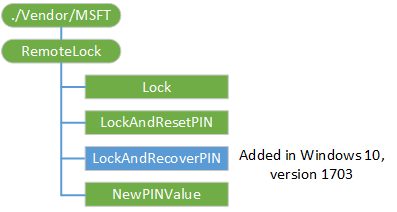

# RemoteLock CSP


The RemoteLock CSP supports the ability to lock a device that has a PIN set on the device or reset the PIN on a device that may or may not have a PIN set.

> [!Note]  
> The RemoteLock CSP is only supported in Windows 10 Mobile.

 
The following diagram shows the RemoteLock configuration service provider in a tree format.



<a href="" id="--vendor-msft-remotelock"></a>**./Vendor/MSFT/RemoteLock**  
<p style="margin-left: 20px">Defines the root node for the RemoteLock configuration service provider.</p>

<a href="" id="lock"></a>**Lock**  
Required. The setting accepts requests to lock the device screen. The device screen will lock immediately if a PIN has been set. If no PIN is set, the lock request is ignored and the OMA DM (405) Forbidden error is returned over the management channel. All OMA DM errors are listed [here](http://go.microsoft.com/fwlink/p/?LinkId=522607) in the protocol specification. The supported operations are Get and Exec.

<table>
<colgroup>
<col width="20%" />
<col width="40%" />
<col width="40%" />
</colgroup>
<thead>
<tr class="header">
<th>Status</th>
<th>Description</th>
<th>Meaning [Standard]</th>
</tr>
</thead>
<tbody>
<tr class="odd">
<td><p>(200) OK</p></td>
<td><p>The device was successfully locked.</p></td>
<td><p>The command and the associated Alert action are completed successfully.</p></td>
</tr>
<tr class="even">
<td><p>(405)</p></td>
<td><p>The device could not be locked because there is no PIN currently set on the device.</p></td>
<td><p>The requested command is not allowed on the target.</p></td>
</tr>
<tr class="odd">
<td><p>(500) Command failed</p></td>
<td><p>The device was not locked for some unknown reason.</p></td>
<td><p>Non-specific errors were created by the recipient while attempting to complete the command.</p></td>
</tr>
</tbody>
</table>

 

<a href="" id="lockandresetpin"></a>**LockAndResetPIN**  
This setting can be used to lock and reset the PIN on the device. It is used in conjunction with the NewPINValue node. After the **Exec** operation is called successfully on this node, the previous PIN will no longer work and cannot be recovered. The supported operation is Exec.

This node will return the following status. All OMA DM errors are listed [here](http://go.microsoft.com/fwlink/p/?LinkId=522607) in the protocol specification.

<table>
<colgroup>
<col width="20%" />
<col width="40%" />
<col width="<40></40>%" />
</colgroup>
<thead>
<tr class="header">
<th>Status</th>
<th>Description</th>
<th>Meaning</th>
</tr>
</thead>
<tbody>
<tr class="odd">
<td><p>(200) OK</p></td>
<td><p>The device has been locked with a new password which has been reset.</p></td>
<td><p>The command and the associated Alert action are completed successfully.</p></td>
</tr>
<tr class="even">
<td><p>(500) Command failed</p></td>
<td><p>N/A</p></td>
<td><p>Non-specific errors were created by the recipient while attempting to complete the command.</p></td>
</tr>
</tbody>
</table>

<a href="" id="lockandrecoverpin"></a>**LockAndRecoverPIN**  
Added in Windows 10, version 1703. This setting performs a similar function to the LockAndResetPIN node. With LockAndResetPIN any Windows Hello keys associated with the PIN gets deleted, but with LockAndRecoverPIN those keys are saved. After the Exec operation is called successfully on this setting, the new PIN can be retrieved from the NewPINValue setting. The previous PIN will no longer work.

Executing this node requires a ticket from the Microsoft credential reset service. Additionally, the execution of this setting is only supported when the [EnablePinRecovery](https://msdn.microsoft.com/en-us/windows/hardware/commercialize/customize/mdm/passportforwork-csp#tenantid-policies-enablepinrecovery) policy is set on the client.


<a href="" id="newpinvalue"></a>**NewPINValue**  
This setting contains the PIN after Exec has been called on /RemoteLock/LockAndResetPIN or /RemoteLock/LockAndRecoverPin. If LockAndResetPIN or LockAndResetPIN has never been called, the value will be null. If Get is called on this node after a successful Exec call on /RemoteLock/LockAndResetPIN or /RemoteLock/LockAndRecoverPin, then the new PIN will be provided. If another Get command is called on this node, the value will be null. If you need to reset the PIN again, then another LockAndResetPIN Exec can be communicated to the device to generate a new PIN. The PIN value will conform to the minimum PIN complexity requirements of the merged policies that are set on the device. If no PIN policy has been set on the device, the generated PIN will conform to the default policy of the device.

The data type returned is a string.

The supported operation is Get.

A Get operation on this node must follow an Exec operation on the /RemoteLock/LockAndResetPIN or /RemoteLock/LockAndRecoverPin node in the proper order and in the same SyncML message. The Sequence tag can be used to guarantee the order in which commands are processed.

## Examples


Initiate a remote lock of the device.

``` syntax
<Exec>
   <CmdID>1</CmdID> 
   <Item> 
      <Target> 
         <LocURI>./Vendor/MSFT/RemoteLock/Lock </LocURI> 
      </Target> 
   </Item> 
</Exec>
```

Initiate a remote lock and PIN reset of the device. To successfully retrieve the new device-generated PIN, the commands must be executed together and in the proper sequence as shown below.

``` syntax
<Sequence>
    <CmdID>1</CmdID> 
    <Exec>
        <CmdID>2</CmdID> 
        <Item> 
            <Target> 
                <LocURI>./Vendor/MSFT/RemoteLock/LockAndResetPIN </LocURI> 
            </Target> 
        </Item> 
    </Exec>
    <Get>
       <CmdID>3</CmdID> 
       <Item> 
            <Target> 
                <LocURI>./Vendor/MSFT/RemoteLock/NewPINValue </LocURI> 
            </Target> 
        </Item> 
    </Get>
</Sequence>
```


## Related topics


[Configuration service provider reference](configuration-service-provider-reference.md)

 

 


