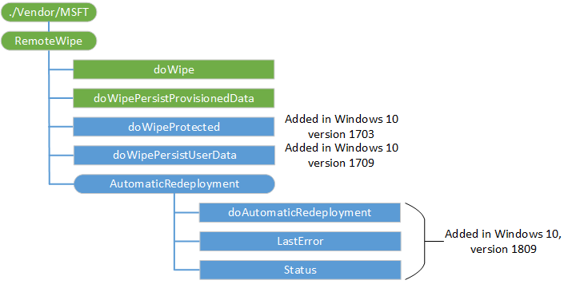

# RemoteWipe CSP

The RemoteWipe configuration service provider can be used by mobile operators DM server or enterprise management server to remotely wipe a device. The RemoteWipe configuration service provider can make the data stored in memory and hard disks difficult to recover if the device is remotely wiped after being lost or stolen.

The following diagram shows the RemoteWipe configuration service provider management object in tree format as used by both OMA DM and OMA Client Provisioning. Enterprise IT Professionals can update these settings by using the Exchange Server.

**doWipe**  
Specifies that a remote wipe of the device should be performed. The return status code indicates whether the device accepted the Exec command.

When used with OMA Client Provisioning, a dummy value of "1" should be included for this element.

Supported operation is Exec.

**doWipePersistProvisionedData**  
Specifies that provisioning data should be backed up to a persistent location, and then a remote wipe of the device should be performed.

Supported operation is Exec.

When used with OMA Client Provisioning, a dummy value of "1" should be included for this element.

The information that was backed up will be restored and applied to the device when it resumes. The return status code shows whether the device accepted the Exec command.

**doWipeProtected**  
Added in Windows 10, version 1703. Exec on this node performs a remote wipe on the device and fully clean the internal drive. In some device configurations, this command may leave the device unable to boot. The return status code indicates whether the device accepted the Exec command.

The doWipeProtected is functionally similar to doWipe. But unlike doWipe, which can be easily circumvented by simply power cycling the device, doWipeProtected will keep trying to reset the device until it’s done.

Supported operation is Exec.

## The Remote Wipe Process

The remote wipe command is sent as an XML provisioning file to the device. Since the RemoteWipe Configuration Service Provider uses OMA DM and WAP, authentication between client and server and delivery of the XML provisioning file is handled by provisioning.

In Windows 10 Mobile, the remote wipe command is implemented on the device by using the **ResetPhone** function. On the desktop, the remote wipe triggers the **Reset this PC** functionality with the **Remove everything** option.

> **Note**  On the desktop, the remote wipe effectively performs a factory reset and the PC does not retain any information about the command once the wipe completes. Any response from the device about the actual status or result of the command may be inconsistent and unreliable because the MDM information has been removed.

 

## Related topics

[Configuration service provider reference](configuration-service-provider-reference.md)

 

 

