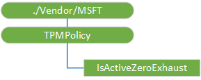

# TPMPolicy CSP

> [!WARNING]
> Some information relates to prereleased product which may be substantially modified before it's commercially released. Microsoft makes no warranties, express or implied, with respect to the information provided here.

The TPMPolicy configuration service provider (CSP) . The TPMPolicy CSP was added in Windows 10, version 1703.

The following diagram shows the TPMPolicy configuration service provider in tree format.



<a href="" id="--device-vendor-msft-tpmpolicy"></a>**./Device/Vendor/MSFT/TPMPolicy**  
<p style="margin-left: 20px">Defines the root node.</p>

<a href="" id="isactivezeroexhaust"></a>**IsActiveZeroExhaust**  
<p style="margin-left: 20px">Boolean value</p>

Here is an example:

``` syntax
                <Replace>
                    <CmdID>101</CmdID>
                    <Item>
                        <Target>
                            <LocURI>
                                ./Vendor/MSFT/TpmPolicy/IsActiveZeroExhaust
                            </LocURI>
                        </Target>
                        <Meta>
                            <Format>bool</Format>
                                <Type>text/plain</Type>
                        </Meta>
                        <Data>true</Data>
                    </Item>
                </Replace>
```