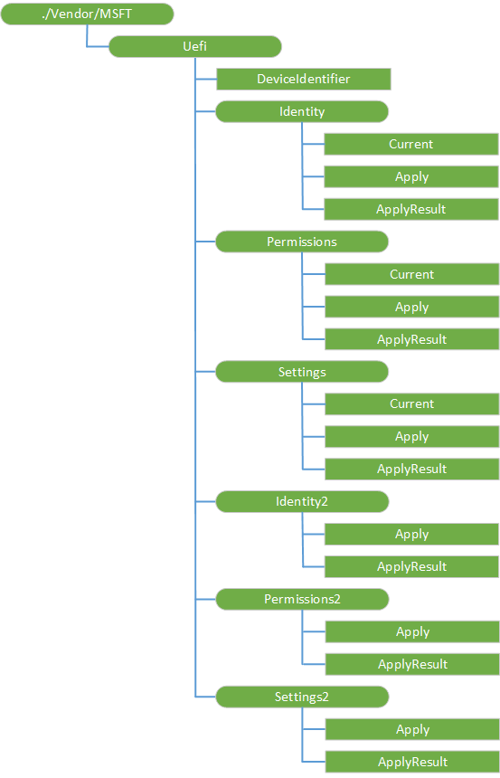

# UEFI CSP

The UEFI configuration service provider (CSP) interfaces to UEFI's Device Firmware Configuration Interface (DFCI) to make BIOS configuration changes. This CSP was added in Windows 10, version 1809.

> [!Note]  
> The UEFI CSP version published in Windows 10, version 1803 is replaced with this one (version 1809).

The following diagram shows the UEFI CSP in tree format.

The following list describes the characteristics and parameters.

**./Vendor/MSFT/Uefi**  
Root node.

**DeviceIdentifier**  
Retrieves XML from UEFI that describes the device identifier.

Supported operation is Get.

**Identity**  
Node for identity certificate operations.

Supported operation is Get.

**Identity/Current**  
Retrieves XML from UEFI that describes the current UEFI identity certificate information.

Supported operation is Get.

**Identity/Apply**  
Applies an identity information package to UEFI. Input is the signed package in base64 encoded format.

Value type is Base64. Supported operation is Replace.

**Identity/Result**  
Retrieves the binary result package of the previous Identity/Apply operation.

Supported operation is Get.

**Permissions**  
Node for settings permission operations..

**Permissions/Current**  
Retrieves XML from UEFI that describes the current UEFI settings permissions.

Supported operation is Get.

**Permissions/Apply**  
Apply a permissions information package to UEFI. Input is the signed package in base64 encoded format.

Value type is Base64. Supported operation is Replace.

**Permissions/Result**  
Retrieves the binary result package of the previous Permissions/Apply operation.  This binary package contains XML describing the action taken for each individual permission.

Supported operation is Get.

**Settings**  
Node for device settings operations.

**Settings/Current**  
Retrieves XML from UEFI that describes the current UEFI settings.

Supported operation is Get.

**Settings/Apply**  
Apply a settings information package to UEFI. Input is the signed package in base64 encoded format.

Value type is Base64. Supported operation is Replace.

**Settings/Result**  
Retrieves the binary result package of the previous Settings/Apply operation. This binary package contains XML describing the action taken for each individual setting.

Supported operation is Get.

**Identity2**  
Node for identity certificate operations. Alternate endpoint for sending a second identity package without an OS restart.

**Identity2/Apply**  
Apply an identity information package to UEFI. Input is the signed package in base64 encoded format. Alternate location for sending two identity packages in the same session.

Value type is Base64. Supported operation is Replace.

**Identity2/Result**  
Retrieves the binary result package of the previous Identity2/Apply operation.

Supported operation is Get.

**Permissions2**  
Node for settings permission operations. Alternate endpoint for sending a second permission package without an OS restart.

**Permissions2/Apply**  
Apply a permissions information package to UEFI. Input is the signed package in base64 encoded format.  Alternate location for sending two permissions information packages in the same session.

Value type is Base64. Supported operation is Replace.

**Permissions2/Result**  
Retrieves the binary result package from the previous Permissions2/Apply operation.  This binary package contains XML describing the action taken for each individual permission.

Supported operation is Get.

**Settings2**  
Nodefor device settings operations. Alternate endpoint for sending a second settings package without an OS restart.

**Settings2/Apply**  
Apply a settings information package to UEFI. Input is the signed package in base64 encoded format. Alternate location for sending two settings information packages in the same session.

Value type is Base64. Supported operation is Replace.

**Settings2/Result**  
Retrieves the binary result package of previous Settings2/Apply operation. This binary package contains XML describing the action taken for each individual setting.

Supported operation is Get.