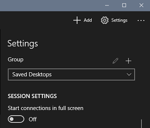

# Guidelines for choosing an app for assigned access (kiosk mode)

**Applies to**

-   Windows 10

You can use assigned access to restrict customers at your business to using only one Windows app so your device acts like a kiosk.  Administrators can use assigned access to restrict a selected user account to access a single Windows app. You can choose almost any Windows app for assigned access; however, some apps may not provide a good user experience.

The following guidelines may help you choose an appropriate Windows app for your assigned access experience.

## General guidelines

- Windows apps must be provisioned or installed for the assigned access account before they can be selected as the assigned access app. [Learn how to provision and install apps](https://msdn.microsoft.com/library/windows/hardware/mt228170.aspx#install_your_apps). 

- Updating a Windows app can sometimes change the Application User Model ID (AUMID) of the app. If this happens, you must update the assigned access settings to launch the updated app, because assigned access uses the AUMID to determine which app to launch. 

- Apps that are generated using the [Desktop App Converter (Desktop Bridge)](https://docs.microsoft.com/windows/uwp/porting/desktop-to-uwp-run-desktop-app-converter) cannot be used as kiosk apps.

## Guidelines for using Remote Desktop app 

Kiosk apps open in full screen. When you assign [Remote Desktop](https://www.microsoft.com/store/apps/9wzdncrfj3ps) as the kiosk app, make sure the **Start connections in full screen** setting in the Remote Desktop app is set to **Off**.

## Guidelines for Windows apps that launch other apps

Some Windows apps can launch other apps. Assigned access prevents Windows apps from launching other apps. 

Avoid selecting Windows apps that are designed to launch other apps as part of their core functionality.  

## Guidelines for web browsers

Microsoft Edge and any third-party web browsers that can be set as a default browser have special permissions beyond that of most Windows apps. Microsoft Edge is not supported for assigned access.

If you use a web browser as your assigned access app, consider the following tips: 

- You can download browsers that are optimized to be used as a kiosk from the Microsoft Store.
- You can create your own web browser Windows app by using the WebView class. Learn more about developing your own web browser app:
   - [Creating your own browser with HTML and JavaScript](https://blogs.windows.com/msedgedev/2015/08/27/creating-your-own-browser-with-html-and-javascript/) 
   - [WebView class](https://msdn.microsoft.com/library/windows/apps/windows.ui.xaml.controls.webview.aspx)
   - [A web browser built with JavaScript as a Windows app](https://github.com/MicrosoftEdge/JSBrowser/tree/v1.0)
 
**To block access to the file system from Internet Explorer's web address bar**
1.	On the Start screen, type the following:
    `gpedit.msc`
2.	Press **Enter** or click the gpedit icon to launch the group policy editor.
3.	In the group policy editor, navigate to **User Configuration** > **Administrative Templates** > **Start Menu and Taskbar**.
4.	Select **Remove Run menu from Start Menu**, select **Disabled**, and click **Apply**. Disabling this policy prevents users from entering the following into the Internet Explorer Address Bar:
   - A UNC path (\\\\*server*\\\\*share*)
   - A local drive (C:\\)
   - A local folder (\temp)

## Secure your information

Avoid selecting Windows apps that may expose the information you don’t want to show in your kiosk, since kiosk usually means anonymous access and locates in a public setting like a shopping mall. For example, an app that has a file picker allows the user to gain access to files and folders on the user's system, avoid selecting this type of apps if they provide unnecessary data access.

## App configuration

Some apps may require additional configurations before they can be used appropriately in assigned access . For example, Microsoft OneNote requires you to set up a Microsoft account for the assigned access user account before OneNote will open in assigned access. 
Check the guidelines published by your selected app and do the setup accordingly. 

## Develop your kiosk app

Assigned access in Windows 10 leverages the new lock framework. When an assigned access user signs in, the selected kiosk app is launched above lock  . The kiosk app is actually running as an above lock screen app. 

Follow the [best practices guidance for developing a kiosk app for assigned access](https://msdn.microsoft.com/library/windows/hardware/mt633799%28v=vs.85%29.aspx). 

## Test your assigned access experience

The above guidelines may help you select or develop an appropriate Windows app for your assigned access experience. Once you have selected your app, we recommend that you thoroughly test the assigned access experience to ensure that your device provides a good customer experience.

 ## Learn more

[Customizing Your Device Experience with Assigned Access](https://channel9.msdn.com/Events/Build/2016/P508)

 

