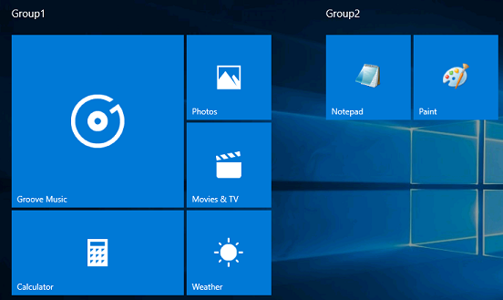
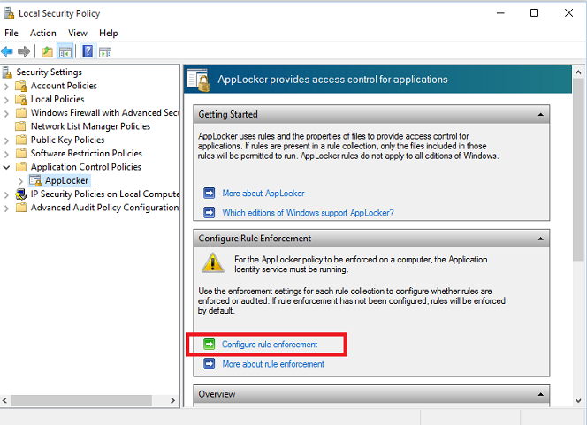
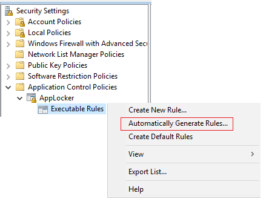
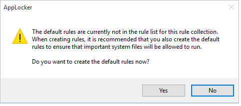

# Create a Windows 10 kiosk that runs multiple apps


**Applies to**

-   Windows 10

A [kiosk device](set-up-a-kiosk-for-windows-10-for-desktop-editions.md) typically runs a single app, and users are prevented from accessing any features or functions on the device outside of the kiosk app. In Windows 10, version 1709, the [AssignedAccess configuration service provider (CSP)](https://docs.microsoft.com/windows/client-management/mdm/assignedaccess-csp) has been expanded to make it easy for administrators to create kiosks that run more than one app. You can configure multi-app kiosks using a provisioning package, rather than creating rules in **AppLocker**.

>[!NOTE]
>For devices running versions of Windows 10 earlier than version 1709, you can [create AppLocker rules](#1703) to configure a multi-app kiosk.

The benefit of a multi-app kiosk, or fixed-purpose device, is to provide an easy-to-understand experience for individuals by putting in front of them only the things they need to use, and removing from their view the things they don’t need to access. 

>[!WARNING]
>The assigned access feature is intended for corporate-owned fixed-purpose devices, like kiosks. When the multi-app assigned access configuration is applied on the device, certain policies are enforced system-wide, and will impact other users on the device. Deleting the multi-app configuration will remove the assigned access lockdown profiles associated with the users, but it cannot revert all the enforced policies (such as Start layout). A factory reset is needed to clear all the assigned access enforced policies.

## new method (1709)

Process:
1. [Create XML file](#create-xml-file)
2. [Add XML file to provisioning package](#add-xml)
3. [Apply provisioning package to device](#apply-ppkg)

### Prerequisites

- (latest version of WCD -- is Store version okay at GA?)
- kiosk device on 1709


### Create XML file

Let's start by looking at the basic structure of the XML file. 

- A configuration xml can define multiple *profiles*. Each profile has a unique **Id** and defines a set of applications that are allowed to run. 

- A configuration xml can have multiple *config* section. Each config section associates a non-admin user account to a default profile **Id**. 

- Multiple config sections can be associated to the same profile.

- A profile has no effect if it’s not associated to a config section. 

    
    
You can start your file by pasting the following XML (or any other examples in this topic) into a XML editor, and saving the file as *filename*.xml. 

```
<?xml version="1.0" encoding="utf-8" ?>
<AssignedAccessConfiguration xmlns="http://schemas.microsoft.com/AssignedAccess/2017/config">
    <Profiles>
        <Profile Id="">
            <AllAppsList>
                <AllowedApps/>
            </AllAppsList>         
            <StartLayout/>
            <Taskbar/>
        </Profile>
    </Profiles>
    <Configs>
        <Config>
            <Account/>
            <DefaultProfile Id=""/>
        </Config>
    </Configs>
</AssignedAccessConfiguration>
```

#### Profile

A profile section in the XML has the following entries: 

- [**Id**](#id) 

- [**AllowedApps**](#allowedapps)  

- [**StartLayout**](#startlayout)

- [**Taskbar**](#taskbar)


##### Id

The profile Id is a GUID attribute to uniquely identify the profile. You can create a GUID using a GUID generator. The GUID just needs to be unique within this XML file. 

##### AllowedApps

AllowedApps is a list of applications that are allowed to run. Apps can be Universal Windows Platform (UWP) apps or Classic Windows desktop apps. 

Based on the purpose of the kiosk device, define the list of applications that are allowed to run. This list can contain both UWP apps and desktop apps. When the mult-app kiosk configuration is applied to a device, AppLocker rules will be generated to allow the apps that are listed in the configuration.

>[!NOTE]
>You cannot manage AppLocker rules that are generated by the multi-app kiosk configuration in [MMC snap-ins](https://technet.microsoft.com/library/hh994629.aspx#BKMK_Using_Snapins).

- For UWP apps, you need to provide the App User Model ID (AUMID). [Learn how to get the AUMID](https://go.microsoft.com/fwlink/p/?LinkId=614867), or [get the AUMID from the Start Layout XML](#startlayout). 
- For desktop apps, you need to specify the full path of the executable, which can contain one or more system environment variables in the form of %variableName% (i.e. %systemroot%, %windir%).

Here are the predefined assigned access AppLocker rules for **UWP apps**:   
1.	Default rule is to allow all users to launch the signed package apps. 
2.	The package app deny list is generated at runtime when the assigned access user signs in. Based on the installed/provisioned package apps available for the user account, assigned access generates the deny list. This list will exclude the default allowed inbox package apps which are critical for the system to function, and then exclude the allowed packages that enterprises defined in the assigned access configuration. If there are multiple apps within the same package, all these apps will be excluded. This deny list will be used to prevent the user from accessing the apps which are currently available for the user but not in the allowed list. 

>[!NOTE]
>Assigned access multi-app mode doesn’t block the enterprises or the users from installing UWP apps. When a new UWP app is installed during the current assigned access user session, this app will not be in the deny list. When the user signs out and signs in back next time, it will be included in the deny list. If this is an enterprise-deployed line-of-business app and you want to allow it to run, update the assigned access configuration to include it in the allowed app list. 

Here are the predefined assigned access AppLocker rules for **desktop apps**:
1.	Default rule is to allow all users to launch the desktop programs signed with Microsoft Certificate in order for the system to boot and function. The rule also allows the admin user group to launch all desktop programs. 
2.	There is a predefined inbox desktop app deny list for the assigned access user account, and this deny list is adjusted based on the desktop app allow list that you defined in the multi-app configuration. 
3.	Enterprise-defined allowed desktop apps are added in the AppLocker allow list. 

The following example allows Groove Music, Movies & TV, Photos, Weather, Calculator, Paint, and Notepad apps to run on the device.

```
<AllAppsList>
        <AllowedApps>
          <App AppUserModelId="Microsoft.ZuneMusic_8wekyb3d8bbwe!Microsoft.ZuneMusic" />
          <App AppUserModelId="Microsoft.ZuneVideo_8wekyb3d8bbwe!Microsoft.ZuneVideo" />
          <App AppUserModelId="Microsoft.Windows.Photos_8wekyb3d8bbwe!App" />
          <App AppUserModelId="Microsoft.BingWeather_8wekyb3d8bbwe!App" />
          <App AppUserModelId="Microsoft.WindowsCalculator_8wekyb3d8bbwe!App" />
          <App DesktopAppPath="%windir%\system32\mspaint.exe" />
          <App DesktopAppPath="C:\Windows\System32\notepad.exe" />
        </AllowedApps>
      </AllAppsList>
```

##### StartLayout

After you define the list of allowed applications, you can customize the Start layout for your kiosk experience. You can choose to pin all the allowed apps on the Start screen or just a subset, depending on whether you want the end user to directly access them on the Start screen. 

The easiest way to create a customized Start layout to apply to other Windows 10 devices is to set up the Start screen on a test device and then export the layout. For detailed steps, see [Customize and export Start layout](customize-and-export-start-layout.md).

A few things to note here:

- The test device on which you customize the Start layout should have the same OS version that is installed on the device where you plan to deploy the multi-app assigned access configuration. 
- Since the multi-app assigned access experience is intended for fixed-purpose devices, to ensure the device experiences are consistent and predictable, use the *full* Start layout option instead of the *partial* Start layout. 
- There are no apps pinned on the taskbar in the multi-app mode, and it is not supported to configure Taskbar layout using the `<CustomTaskbarLayoutCollection>` tag in a layout modification XML as part of the assigned access configuration.
- The following example uses DesktopApplicationLinkPath to pin the desktop app to start. When the desktop app doesn’t have a shortcut link on the target device, [learn how to provision .lnk files using Windows Configuration Designer](#lnk-files). 

This example pins Groove Music, Movies & TV, Photos, Weather, Calculator, Paint, and Notepad apps on Start.

```
<StartLayout>
        <![CDATA[<LayoutModificationTemplate xmlns:defaultlayout="http://schemas.microsoft.com/Start/2014/FullDefaultLayout" xmlns:start="http://schemas.microsoft.com/Start/2014/StartLayout" Version="1" xmlns="http://schemas.microsoft.com/Start/2014/LayoutModification">
                      <LayoutOptions StartTileGroupCellWidth="6" />
                      <DefaultLayoutOverride>
                        <StartLayoutCollection>
                          <defaultlayout:StartLayout GroupCellWidth="6">
                            <start:Group Name="Group1">
                              <start:Tile Size="4x4" Column="0" Row="0" AppUserModelID="Microsoft.ZuneMusic_8wekyb3d8bbwe!Microsoft.ZuneMusic" />
                              <start:Tile Size="2x2" Column="4" Row="2" AppUserModelID="Microsoft.ZuneVideo_8wekyb3d8bbwe!Microsoft.ZuneVideo" />
                              <start:Tile Size="2x2" Column="4" Row="0" AppUserModelID="Microsoft.Windows.Photos_8wekyb3d8bbwe!App" />
                              <start:Tile Size="2x2" Column="4" Row="4" AppUserModelID="Microsoft.BingWeather_8wekyb3d8bbwe!App" />
                              <start:Tile Size="4x2" Column="0" Row="4" AppUserModelID="Microsoft.WindowsCalculator_8wekyb3d8bbwe!App" />
                            </start:Group>
                            <start:Group Name="Group2">
                              <start:DesktopApplicationTile Size="2x2" Column="2" Row="0" DesktopApplicationLinkPath="%ALLUSERSPROFILE%\Microsoft\Windows\Start Menu\Programs\Accessories\Paint.lnk" />
                              <start:DesktopApplicationTile Size="2x2" Column="0" Row="0" DesktopApplicationLinkPath="%APPDATA%\Microsoft\Windows\Start Menu\Programs\Accessories\Notepad.lnk" />
                            </start:Group>
                          </defaultlayout:StartLayout>
                        </StartLayoutCollection>
                      </DefaultLayoutOverride>
                    </LayoutModificationTemplate>
                ]]>
      </StartLayout>
```



##### Taskbar

Define whether you want to have the taskbar present in the kiosk device. For tablet-based or touch-enabled all-in-one kiosks, when you don’t attach a keyboard and mouse, you can hide the taskbar as part of the multi-app experience if you want. 

The following example exposes the taskbar to the end user:

      `<Taskbar ShowTaskbar="true"/>`
      
The following example hides the taskbar:

      `<Taskbar ShowTaskbar="false"/>`
      
>[!NOTE]
>This is different from the **Automatically hide the taskbar** option in tablet mode, which shows the taskbar when swiping up from or moving the mouse pointer down to the bottom of the screen. Setting **ShowTaskbar** as **false** will always keep the taskbar hidden. 


<span id="add-xml" />
### Add XML file to provisioning package

<span id="apply-ppkg" />
### Apply provisioning package to device

### mixed-reality

*There are some Mixed Reality specific bits we wanted to include. For example, the IT Admin needs to include the Mixed Reality Portal as an allowed app if they want to include Mixed Reality apps in kiosk mode.*

<span id="lnk-files" />
##### placeholder for lnk


<span id="1703" />
## old method (pre-1709)

Learn how to configure a device running Windows 10 Enterprise or Windows 10 Education so that users can only run a few specific apps. The result is similar to [a kiosk device](set-up-a-device-for-anyone-to-use.md), but with multiple apps available. For example, you might set up a library computer so that users can search the catalog and browse the Internet, but can't run any other apps or change computer settings.

You can restrict users to a specific set of apps on a device running Windows 10 Enterprise or Windows 10 Education by using [AppLocker](/windows/device-security/applocker/applocker-overview). AppLocker rules specify which apps are allowed to run on the device.

AppLocker rules are organized into collections based on file format. If no AppLocker rules for a specific rule collection exist, all files with that file format are allowed to run. However, when an AppLocker rule for a specific rule collection is created, only the files explicitly allowed in a rule are permitted to run. For more information, see [How AppLocker works](/windows/device-security/applocker/how-applocker-works-techref).

This topic describes how to lock down apps on a local device. You can also use AppLocker to set rules for applications in a domain by using Group Policy.


## Install apps


First, install the desired apps on the device for the target user account(s). This works for both Store and Win32. For Store apps, you must log on as that user for the app to install. For Win32 you can install an app for all users without logging on to the particular account.

## Use AppLocker to set rules for apps


After you install the desired apps, set up AppLocker rules to only allow specific apps, and block everything else.

1.  Run Local Security Policy (secpol.msc) as an administrator.

2.  Go to **Security Settings** &gt; **Application Control Policies** &gt; **AppLocker**, and select **Configure rule enforcement**.

    

3.  Check **Configured** under **Executable rules**, and then click **OK**.

4.  Right-click **Executable Rules** and then click **Automatically generate rules**.

    

5.  Select the folder that contains the apps that you want to permit, or select C:\\ to analyze all apps.

6.  Type a name to identify this set of rules, and then click **Next**.

7.  On the **Rule Preferences** page, click **Next**. Be patient, it might take awhile to generate the rules.

8.  On the **Review Rules** page, click **Create**. The wizard will now create a set of rules allowing the installed set of apps.

9.  Read the message and click **Yes**.

    

10. (optional) If you want a rule to apply to a specific set of users, right-click on the rule and select **Properties**. Then use the dialog to choose a different user or group of users.

11. (optional) If rules were generated for apps that should not be run, you can delete them by right-clicking on the rule and selecting **Delete**.

12. Before AppLocker will enforce rules, the **Application Identity** service must be turned on. To force the Application Identity service to automatically start on reset, open a command prompt and run:

    ``` syntax
    sc config appidsvc start=auto
    ```

13. Restart the device.

## Other settings to lock down


In addition to specifying the apps that users can run, you should also restrict some settings and functions on the device. For a more secure experience, we recommend that you make the following configuration changes to the device:

-   Remove **All apps**.

    Go to **Group Policy Editor** &gt; **User Configuration** &gt; **Administrative Templates\\Start Menu and Taskbar\\Remove All Programs list from the Start menu**.

-   Hide **Ease of access** feature on the logon screen.

    Go to **Control Panel** &gt; **Ease of Access** &gt; **Ease of Access Center**, and turn off all accessibility tools.

-   Disable the hardware power button.

    Go to **Power Options** &gt; **Choose what the power button does**, change the setting to **Do nothing**, and then **Save changes**.

-   Disable the camera.

    Go to **Settings** &gt; **Privacy** &gt; **Camera**, and turn off **Let apps use my camera**.

-   Turn off app notifications on the lock screen.

    Go to **Group Policy Editor** &gt; **Computer Configuration** &gt; **Administrative Templates\\System\\Logon\\Turn off app notifications on the lock screen**.

-   Disable removable media.

    Go to **Group Policy Editor** &gt; **Computer Configuration** &gt; **Administrative Templates\\System\\Device Installation\\Device Installation Restrictions**. Review the policy settings available in **Device Installation Restrictions** for the settings applicable to your situation.

    **Note**  
    To prevent this policy from affecting a member of the Administrators group, in **Device Installation Restrictions**, enable **Allow administrators to override Device Installation Restriction policies**.

     

To learn more about locking down features, see [Customizations for Windows 10 Enterprise](https://go.microsoft.com/fwlink/p/?LinkId=691442).

## Customize Start screen layout for the device (recommended)


Configure the Start menu on the device to only show tiles for the permitted apps. You will make the changes manually, export the layout to an .xml file, and then apply that file to devices to prevent users from making changes. For instructions, see [Manage Windows 10 Start layout options](windows-10-start-layout-options-and-policies.md).


 

 


