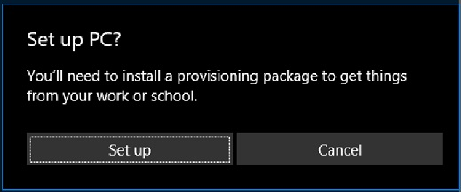

# Apply a provisioning package

**Applies to**

-   Windows 10
-   Windows 10 Mobile

Provisioning packages can be applied to a device during the first-run experience (out-of-box experience or "OOBE") and after ("runtime").

>[!NOTE]
>Applying a provisioning package to a desktop device requires administrator privileges on the device.

## Desktop editions

>[!NOTE]
>In Windows 10, version 1709, you can interrupt a long-running provisioning process by pressing ESC.

### During initial setup, from a USB drive

1. Start with a computer on the first-run setup screen. If the PC has gone past this screen, reset the PC to start over. To reset the PC, go to **Settings** > **Update & security** > **Recovery** > **Reset this PC**.

    

2. Insert the USB drive. Windows Setup will recognize the drive and ask if you want to set up the device. Select **Set up**.

    

3. The next screen asks you to select a provisioning source. Select **Removable Media** and tap **Next**.

    
    
4. Select the provisioning package (\*.ppkg) that you want to apply, and tap **Next**.

    

5. Select **Yes, add it**.

    
    

    
### After setup, from a USB drive, network folder, or SharePoint site

Insert the USB drive to a desktop computer, navigate to **Settings** > **Accounts** > **Access work or school** > **Add or remove a provisioning package** > **Add a package**, and select the package to install. For a provisioning package stored on a network folder or on a SharePoint site, navigate to the provisioning package and double-click it to begin installation.

    
## Mobile editions

### Using removable media

1. Insert an SD card containing the provisioning package into the device.
2. Navigate to **Settings** > **Accounts** > **Access work or school** > **Add or remove a provisioning package** > **Add a package**, and select the package to install. 

    

3. Click **Add**.

4. On the device, the **Is this package from a source you trust?** message will appear. Tap **Yes, add it**.

    
    
### Copying the provisioning package to the device

1. Connect the device to your PC through USB.

2. On the PC, select the provisioning package that you want to use to provision the device and then drag and drop the file to your device.

3. On the device, the **Is this package from a source you trust?** message will appear. Tap **Yes, add it**.

    

## Related topics

- [Provisioning packages for Windows 10](provisioning-packages.md)
- [How provisioning works in Windows 10](provisioning-how-it-works.md)
- [Install Windows Configuration Designer](provisioning-install-icd.md)
- [Create a provisioning package](provisioning-create-package.md)
- [Settings changed when you uninstall a provisioning package](provisioning-uninstall-package.md)
- [Provision PCs with common settings for initial deployment (simple provisioning)](provision-pcs-for-initial-deployment.md)
- [Use a script to install a desktop app in provisioning packages](provisioning-script-to-install-app.md)
- [PowerShell cmdlets for provisioning Windows 10 (reference)](provisioning-powershell.md)
- [Windows Configuration Designer command-line interface (reference)](provisioning-command-line.md)
- [Create a provisioning package with multivariant settings](provisioning-multivariant.md)
