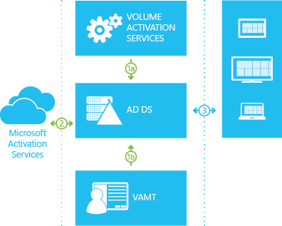
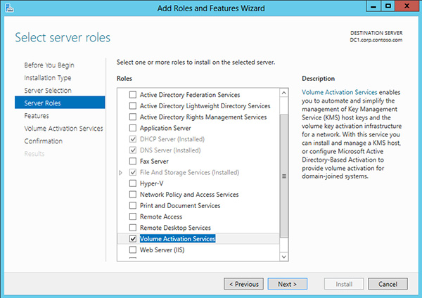
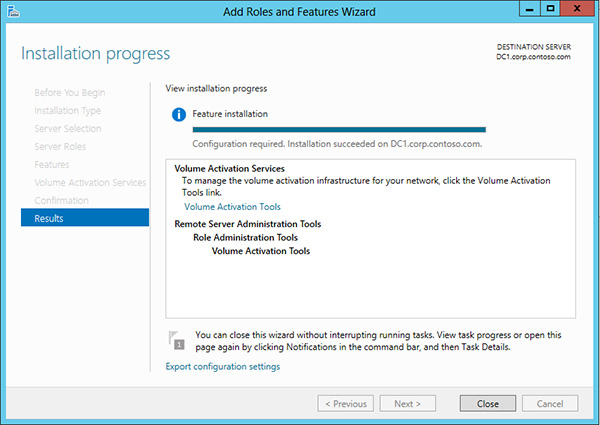
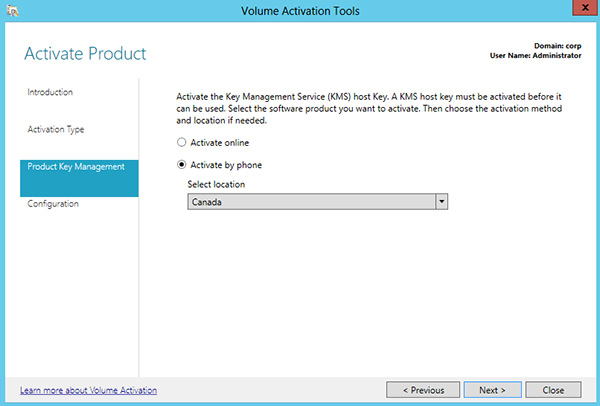
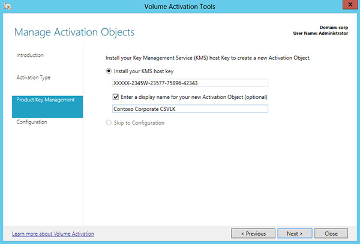

# Activate using Active Directory-based activation

**Applies to**

-   Windows 10
-   Windows 8.1
-   Windows 8
-   Windows 7
-   Windows Server 2012 R2
-   Windows Server 2012
-   Windows Server 2008 R2

**Looking for retail activation?**

-   [Get Help Activating Microsoft Windows](http://go.microsoft.com/fwlink/p/?LinkId=618644)

Active Directory-based activation is implemented as a role service that relies on AD DS to store activation objects. Active Directory-based activation requires that the forest schema be updated by adprep.exe on a computer running Windows Server 2012 R2 or Windows Server 2012, but after the schema is updated, older domain controllers can still activate clients.

Any domain-joined computers running Windows 10, Windows 8.1, Windows 8, Windows Server 2012 R2, or Windows Server 2012 with a GVLK will be activated automatically and transparently. They will stay activated as long as they remain members of the domain and maintain periodic contact with a domain controller. Activation takes place after the Licensing service starts. When this service starts, the computer contacts AD DS automatically, receives the activation object, and is activated without user intervention.

To allow computers with GVLKs to activate themselves, use the Volume Activation Tools console in Windows Server 2012 R2 or the VAMT in earlier versions of Windows Server to create an object in the AD DS forest. You create this activation object by submitting a KMS host key to Microsoft, as shown in Figure 10.

The process proceeds as follows:

1.  Perform one of the following tasks:

    -   Install the Volume Activation Services server role on a domain controller running Windows Server 2012 R2, and add a KMS host key by using the Volume Activation Tools Wizard.

    -   Extend the domain to the Windows Server 2012 R2 schema level, and add a KMS host key by using the VAMT.

2.  Microsoft verifies the KMS host key, and an activation object is created.

3.  Client computers are activated by receiving the activation object from a domain controller during startup.

**Figure 10**. The Active Directory-based activation flow

For environments in which all computers are running Windows 10, Windows 8.1, Windows 8, Windows Server 2012 R2, or Windows Server 2012 R2, and they are joined to a domain, Active Directory-based activation is the best option for activating all client computers and servers, and you may be able to remove any KMS hosts from your environment.

If an environment will continue to contain earlier volume licensing operating systems and applications or if you have workgroup computers outside the domain, you need to maintain a KMS host to maintain activation status for earlier volume licensing editions of Windows and Office.

Clients that are activated with Active Directory-based activation will maintain their activated state for up to 180 days since the last contact with the domain, but they will periodically attempt to reactivate before then and at the end of the 180day period. By default, this reactivation event occurs every seven days.

When a reactivation event occurs, the client queries AD DS for the activation object. Client computers examine the activation object and compare it to the local edition as defined by the GVLK. If the object and GVLK match, reactivation occurs. If the AD DS object cannot be retrieved, client computers use KMS activation. If the computer is removed from the domain, when the computer or the Software Protection service is restarted, the operating system will change the status from activated to not activated, and the computer will try to activate with KMS.

## Step-by-step configuration: Active Directory-based activation

**Note**  
You must be a member of the local Administrators group on all computers mentioned in these steps. You also need to be a member of the Enterprise Administrators group, because setting up Active Directory-based activation changes forest-wide settings.

 

To configure Active Directory-based activation on Windows Server 2012 R2, complete the following steps:

1.  Use an account with Domain Administrator and Enterprise Administrator credentials to sign in to a domain controller.

2.  Launch Server Manager.

3.  Add the Volume Activation Services role, as shown in Figure 11.

    

    **Figure 11**. Adding the Volume Activation Services role

4.  Click the link to launch the Volume Activation Tools (Figure 12).

    

    **Figure 12**. Launching the Volume Activation Tools

5.  Select the **Active Directory-Based Activation** option (Figure 13).

    

    **Figure 13**. Selecting Active Directory-Based Activation

6.  Enter your KMS host key and (optionally) a display name (Figure 14).

    

    **Figure 14**. Entering your KMS host key

7.  Activate your KMS host key by phone or online (Figure 15).

    

    **Figure 15**. Choosing how to activate your product

8.  After activating the key, click **Commit**, and then click **Close**.

## Verifying the configuration of Active Directory-based activation

To verify your Active Directory-based activation configuration, complete the following steps:

1.  After you configure Active Directory-based activation, start a computer that is running an edition of Windows that is configured by volume licensing.

2.  If the computer has been previously configured with a MAK key, replace the MAK key with the GVLK by running the **slmgr.vbs /ipk** command and specifying the GLVK as the new product key.

3.  If the computer is not joined to your domain, join it to the domain.

4.  Sign in to the computer.

5.  Open Windows Explorer, right-click **Computer**, and then click **Properties**.

6.  Scroll down to the **Windows activation** section, and verify that this client has been activated.

**Note**  
If you are using both KMS and Active Directory-based activation, it may be difficult to see whether a client has been activated by KMS or by Active Directory-based activation. Consider disabling KMS during the test, or make sure that you are using a client computer that has not already been activated by KMS. The **slmrg.vbs /dlv** command also indicates whether KMS has been used.

 

## See also

-   [Volume Activation for Windows 10](volume-activation-for-windows-81-client.md)

 

 

