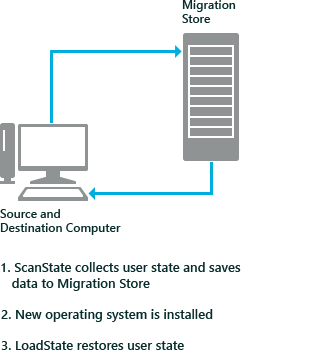
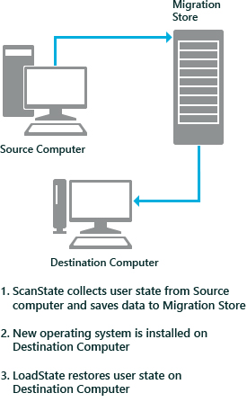

# Common Migration Scenarios

You use the User State Migration Tool (USMT) 10.0 when hardware and/or operating system upgrades are planned for a large number of computers. USMT manages the migration of an end-user's digital identity by capturing the user's operating-system settings, application settings, and personal files from a source computer and reinstalling them on a destination computer after the upgrade has occurred.

One common scenario when only the operating system, and not the hardware, is being upgraded is referred to as *PC refresh*. A second common scenario is known as *PC replacement*, where one piece of hardware is being replaced, typically by newer hardware and a newer operating system.

## In This Topic

[PC Refresh](#bkmk-pcrefresh)

[Scenario One: PC-refresh offline using Windows PE and a hard-link migration store](#bkmk-onepcrefresh)

[Scenario Two: PC-refresh using a compressed migration store](#bkmk-twopcrefresh)

[Scenario Three: PC-refresh using a hard-link migration store](#bkmk-threepcrefresh)

[Scenario Four: PC-refresh using Windows.old folder and a hard-link migration store](#bkmk-fourpcrefresh)

[PC Replacement](#bkmk-pcreplace)

[Scenario One: Offline migration using Windows PE and an external migration store](#bkmk-onepcreplace)

[Scenario Two: Manual network migration](#bkmk-twopcreplace)

[Scenario Three: Managed network migration](#bkmk-threepcreplace)

## PC-Refresh

The following diagram shows a PC-refresh migration, also known as a computer refresh migration. First, the administrator migrates the user state from a source computer to an intermediate store. After installing the operating system, the administrator migrates the user state back to the source computer.

 

 

### Scenario One: PC-refresh offline using Windows PE and a hard-link migration store

A company has just received funds to update the operating system on all of its computers in the accounting department to Windows 10. Each employee will keep the same computer, but the operating system on each computer will be updated. In this scenario, the update is being handled completely offline, without a network connection. An administrator uses Windows Preinstallation Environment (WinPE) and a hard-link migration store to save each user state to their respective computer.

1.  On each computer, the administrator boots the machine into WinPE and runs the ScanState command-line tool, specifying the **/hardlink /nocompress** command-line options. ScanState saves the user state to a hard-link migration store on each computer, improving performance by minimizing network traffic as well as minimizing migration failures on computers with very limited space available on the hard drive.

2.  On each computer, the administrator installs the company’s standard operating environment (SOE) which includes Windows 10 and other company applications.

3.  The administrator runs the LoadState command-line tool on each computer. LoadState restores each user state back to each computer.

### Scenario Two: PC-refresh using a compressed migration store

A company has just received funds to update the operating system on all of its computers to Windows 10. Each employee will keep the same computer, but the operating system on each computer will be updated. In this scenario, an administrator uses a compressed migration store to save the user states to a server.

1.  The administrator runs the ScanState command-line tool on each computer. ScanState saves each user state to a server.

2.  On each computer, the administrator installs the company's standard SOE which includes Windows 10 and other company applications.

3.  The administrator runs the LoadState command-line tool on each source computer, and LoadState restores each user state back to the computer.

### Scenario Three: PC-refresh using a hard-link migration store

A company has just received funds to update the operating system on all of its computers to Windows 10. Each employee will keep the same computer, but the operating system on each computer will be updated. In this scenario, an administrator uses a hard-link migration store to save each user state to their respective computer.

1.  The administrator runs the ScanState command-line tool on each computer, specifying the **/hardlink /nocompress** command-line options. ScanState saves the user state to a hard-link migration store on each computer, improving performance by minimizing network traffic as well as minimizing migration failures on computers with very limited space available on the hard drive.

2.  On each computer, the administrator installs the company's SOE which includes Windows 10 and other company applications.

3.  The administrator runs the LoadState command-line tool on each computer. LoadState restores each user state back on each computer.

### Scenario Four: PC-refresh using Windows.old folder and a hard-link migration store

A company has decided to update the operating system on all of its computers to Windows 10. Each employee will keep the same computer, but the operating system on each computer will be updated. In this scenario, an administrator uses Windows.old and a hard-link migration store to save each user state to their respective computer.

1.  The administrator clean installs Windows 10 on each computer, making sure that the Windows.old directory is created by installing Windows 10 without formatting or repartitioning and by selecting a partition that contains the previous version of Windows.

2.  On each computer, the administrator installs the company’s SOE which includes company applications.

3.  The administrator runs the ScanState and LoadState command-line tools successively on each computer while specifying the **/hardlink /nocompress** command-line options.

## PC-Replacement

The following diagram shows a PC-replacement migration. First, the administrator migrates the user state from the source computer to an intermediate store. After installing the operating system on the destination computer, the administrator migrates the user state from the store to the destination computer.

 

 

### Scenario One: Offline migration using WinPE and an external migration store

A company is allocating 20 new computers to users in the accounting department. The users each have a source computer with their files and settings. In this scenario, migration is being handled completely offline, without a network connection.

1.  On each source computer, an administrator boots the machine into WinPE and runs ScanState to collect the user state to either a server or an external hard disk.

2.  On each new computer, the administrator installs the company's SOE which includes Windows 10 and other company applications.

3.  On each of the new computers, the administrator runs the LoadState tool, restoring each user state from the migration store to one of the new computers.

### Scenario Two: Manual network migration

A company receives 50 new laptops for their managers and needs to reallocate 50 older laptops to new employees. In this scenario, an administrator runs the ScanState tool from the cmd prompt on each computer to collect the user states and save them to a server in a compressed migration store.

1.  The administrator runs the ScanState tool on each of the manager’s old laptops, and saves each user state to a server.

2.  On the new laptops, the administrator installs the company's SOE, which includes Windows 10 and other company applications.

3.  The administrator runs the LoadState tool on the new laptops to migrate the managers’ user states to the appropriate computer. The new laptops are now ready for the managers to use.

4.  On the old computers, the administrator installs the company’s SOE, which includes Windows 10, Microsoft Office, and other company applications. The old computers are now ready for the new employees to use.

### Scenario Three: Managed network migration

A company is allocating 20 new computers to users in the accounting department. The users each have a source computer that contains their files and settings. An administrator uses a management technology such as a logon script or a batch file to run ScanState on each source computer to collect the user states and save them to a server in a compressed migration store.

1.  On each source computer, the administrator runs the ScanState tool using Microsoft System Center Configuration Manager (SCCM), Microsoft Deployment Toolkit (MDT), a logon script, a batch file, or a non-Microsoft management technology. ScanState collects the user state from each source computer and then saves it to a server.

2.  On each new computer, the administrator installs the company's SOE, which includes Windows 10 and other company applications.

3.  On each of the new computers, the administrator runs the LoadState tool using System Center Configuration Manager, a logon script, a batch file, or a non-Microsoft management technology. LoadState migrates each user state from the migration store to one of the new computers.

## Related topics

[Plan Your Migration](plan-your-migration-usmt-win7-usmt-win8.md)

[Choose a Migration Store Type](choose-a-migration-store-type-usmt-win7-usmt-win8.md)

[Offline Migration Reference](offline-migration-reference.md)

 

 

