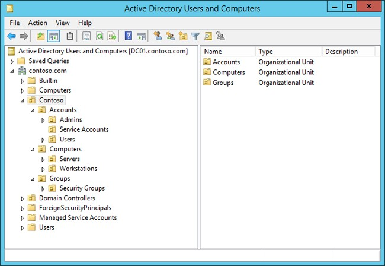

# Deploy Windows 10 with the Microsoft Deployment Toolkit

**Applies to**

-   Windows 10

This guide will walk you through the process of deploying Windows 10 in an enterprise environment using the Microsoft Deployment Toolkit (MDT), and MDT 2013 Update 1 specifically.

The Microsoft Deployment Toolkit is a unified collection of tools, processes, and guidance for automating desktop and server deployment. In addition to reducing deployment time and standardizing desktop and server images, MDT enables you to more easily manage security and ongoing configurations. MDT builds on top of the core deployment tools in the Windows Assessment and Deployment Kit (Windows ADK) with additional guidance and features designed to reduce the complexity and time required for deployment in an enterprise environment.

MDT 2013 Update 1 supports the deployment of Windows 10, as well as Windows 7, Windows 8, Windows 8.1, and Windows Server 2012 R2. It also includes support for zero-touch installation (ZTI) with Microsoft System Center 2012 R2 Configuration Manager.

To download the latest version of MDT, visit the [MDT resource page](http://go.microsoft.com/fwlink/p/?LinkId=618117).

## In this section

-   [Get started with the Microsoft Deployment Toolkit (MDT)](get-started-with-the-microsoft-deployment-toolkit--mdt-.md)

-   [Create a Windows 10 reference image](create-a-windows-81-reference-image.md)

-   [Deploy a Windows 10 image using MDT 2013 Update 1](deploy-a-windows-81-image-using-mdt-2013.md)

-   [Build a distributed environment for Windows 10 deployment](build-a-distributed-environment-for-windows-81-deployment.md)

-   [Refresh a Windows 7 computer with Windows 10](refresh-a-windows-7-computer-with-windows-81.md)

-   [Replace a Windows 7 computer with a Windows 10 computer](replace-a-windows-7-computer-with-a-windows-81-computer.md)

-   [Configure MDT settings](configure-mdt-2013-settings.md)

## Proof-of-concept environment

For the purposes of this guide, and the topics discussed herein, we will use the following servers and client machines: DC01, MDT01, CM01, PC0001, and PC0002.

Figure 1. The servers and machines used for examples in this guide.

DC01 is a domain controller; the other servers and client machines are members of the domain contoso.com for the fictitious Contoso Corporation.

Figure 2. The organizational unit (OU) structure used in this guide.

### Server details

-   **DC01.** A Windows Server 2012 R2 Standard machine, fully patched with the latest security updates, and configured as Active Directory Domain Controller, DNS Server, and DHCP Server in the contoso.com domain.

    -   Server name: DC01

    -   IP Address: 192.168.1.200

    -   Roles: DNS, DHCP, and Domain Controller

-   **MDT01.** A Windows Server 2012 R2 Standard machine, fully patched with the latest security updates, and configured as a member server in the contoso.com domain.

    -   Server name: MDT01

    -   IP Address: 192.168.1.210

-   **CM01.** A Windows Server 2012 R2 Standard machine, fully patched with the latest security updates, and configured as a member server in the contoso.com domain.

    -   Server name: CM01

    -   IP Address: 192.168.1.214

### Client machine details

-   **PC0001.** A Windows 10 Enterprise x64 machine, fully patched with the latest security updates, and configured as a member in the contoso.com domain. This machine is referenced as the admin workstation.

    -   Client name: PC0001

    -   IP Address: DHCP

-   **PC0002.** A Windows 7 SP1 Enterprise x64 machine, fully patched with the latest security updates, and configured as a member in the contoso.com domain. This machine is referenced during the migration scenarios.

    -   Client name: PC0002

    -   IP Address: DHCP

## Sample files

The information in this guide is designed to help you deploy Windows 10. In order to help you put the information you learn into practice more quickly, we recommend that you download a small set of sample files for the fictitious Contoso Corporation:

-   [Gather.ps1](http://go.microsoft.com/fwlink/p/?LinkId=619361). This sample Windows PowerShell script performs the MDT Gather process in a simulated MDT environment. This allows you to test the MDT gather process and check to see if it is working correctly without performing a full Windows deployment.

-   [Set-OUPermissions.ps1](http://go.microsoft.com/fwlink/p/?LinkId=619362). This sample Windows PowerShell script creates a domain account and then configures OU permissions to allow the account to join machines to the domain in the specified OU.

-   [MDTSample.zip](http://go.microsoft.com/fwlink/p/?LinkId=619363). This sample web service shows you how to configure a computer name dynamically using MDT.

## Related topics

[Microsoft Deployment Toolkit downloads and resources](http://go.microsoft.com/fwlink/p/?LinkId=618117)

[Windows 10 deployment scenarios](windows-10-deployment-scenarios.md)

[Windows 10 deployment tools](windows-deployment-scenarios-and-tools.md)

[Deploy Windows 10 with System Center 2012 R2 Configuration Manager](deploy-windows-81-with-system-center-2012-r2-configuration-manager.md)

[Deploy Windows To Go in your organization](deploy-windows-to-go-in-your-organization-small-scenario.md)

[Sideload apps in Windows 10](sideload-apps-in-windows-10.md)

[Volume Activation for Windows 10](volume-activation-windows-10.md)

 

 

